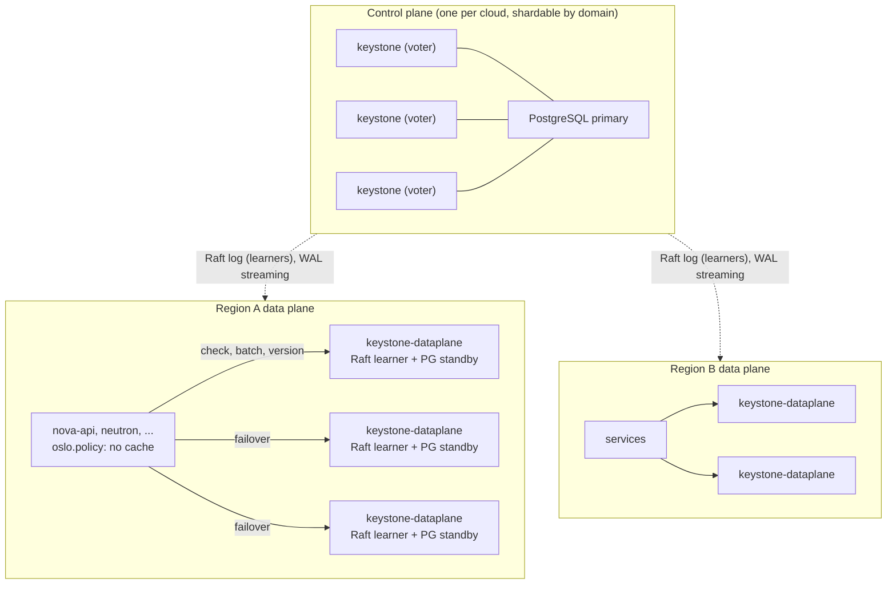

# IAM control plane and data plane: a review of the vision and a proposal

**Status:** Review complete; findings and decisions applied to
`doc/src/vision.md` (§2.2, §4.4, §6.3, §8, §9, §10)

**Date:** 2026-09-18

This document reviews `doc/src/vision.md` on one question: does it make
Keystone resistant as a single point of failure, and does it do so without
relying on caches? It then proposes a concrete shape for splitting IAM into a
control plane and a data plane in `keystone-rs`, grounded in what the crates do
today.

It is a companion to the vision, not a replacement. Section numbers written as
§N refer to the vision. **§§1-4 below review the vision as it stood before
2026-09-18 and are written in the past tense for that reason: every finding
they raise has since been applied to `doc/src/vision.md`, so quoted sentences
will not be found in the current text.** §§5-11 are the proposal, and they are
current. ADRs are referenced by number. Three decisions taken
after the review narrowed the proposal, and the text below reflects them:

- the data plane never authenticates: no token issuance, refresh, login,
  grant redemption or attestation is served from a replica, because
  authentication includes writes and a signing key is not something a replica
  should hold;
- the data plane is optional: the Keystone nodes serve the same read-path
  endpoints, and a small cloud or one that tolerates the availability of those
  nodes deploys nothing more;
- a Raft assignment driver is a real option to be compared with SQL, not a
  hypothetical.

## 1. Summary

The vision's structural answer is right: authentication is verified offline
from a signed JWT, and authorization is served by a replicated evaluator that
is not the component accepting writes. That is the shape every large platform
converged on, and the vision says so with the right precedents.

Three things are wrong or missing, and they are the substance of this review.

1. **The cache is load-bearing, and it is the Python cache.** §4.4 said "the
   cache is part of the architecture, not an optimization", and §9.1 said the
   per-request call "is only affordable because most such calls are answered
   from cache". That cache was an `oslo.cache` entry per
   `(subject, chain, target)` in memcached at every enforcement point, kept
   fresh by a TTL, with a cloud-wide generation number as the invalidation
   option — the mechanism whose invalidation bugs the project set out to leave
   behind, keyed on a more subtle key. §6.3's own analysis, which shows that
   precise invalidation is intractable, is an argument for having no
   cross-request cache at the enforcement point, not for a cruder one.

2. **The decision tier is named, not designed.** The vision leans on "an
   embedded Raft learner, a read replica, or a client of the relation store"
   for static stability. In the code today the grant graph lives in SQL or
   OpenFGA and not in Raft; the Raft read path forwards every read to the
   leader, so a learner serves nothing locally; tiered local reads are
   documented in ADR 0016-v2 §3 but not implemented; and snapshot install is
   leader-driven, so a replica cannot cold-boot with the write path down.
   "Raft learner" is currently a phrase.

3. **Token issuance stays on the data path, and the vision claimed
   otherwise.**
   With fifteen-minute access tokens and refresh rotation that writes a session
   row, a control-plane outage stops every client whose token expires during
   it. §8's claim that "existing workloads keep authenticating and keep
   authorizing throughout" was not true as written. The fix is honesty, not
   relocation: authentication stays on the control plane, the outage list says
   so, and the token lifetime is documented as an availability parameter.

The proposal: a second, optional binary, `keystone-dataplane`, built from the
same library, that serves the read-only endpoints on the request path —
authorization decisions, credential validation, JWKS, catalog — from
**replicas** of the stores rather than from caches, and never authenticates. A replica
is a copy whose freshness is maintained by the replication protocol observing
every write; a cache is a copy whose freshness is maintained by the writer
remembering to invalidate. Python Keystone's bugs came from the second kind.
Raft learners and PostgreSQL hot standbys are the first kind, and they report
how far behind they are, which a TTL never can.

With that in place the enforcement-point decision cache, the per-result TTLs,
the chain digest in the cache key, the grace posture, the mint stamps, the
generation number and the re-check herd all go away. Revocation latency becomes
replication lag, measured in milliseconds and alertable, instead of a
sixty-second window assumed by configuration.

## 2. What the vision says about the single point of failure

The mechanism, condensed:

| Path                          | Vision's answer                                                                   | Where the state comes from                          |
| ----------------------------- | --------------------------------------------------------------------------------- | --------------------------------------------------- |
| Authentication per request    | Offline JWT verification (Mode C), JWKS cached for minutes                        | Nothing live                                        |
| Authorization per request     | `/v4/authz/check` on a decision tier, behind a `(subject, chain, target)` cache   | Learner, read replica or relation store (§4.4, §8)  |
| Token issuance and refresh    | Keystone write nodes                                                              | Primary store                                       |
| Grant writes, lifecycle       | Keystone write nodes                                                              | Primary store                                       |
| Outage of the write path      | Cached decisions until TTL, then fail closed; grace for some callers (§8)         | Enforcement-point cache                             |
| Outage of a regional tier     | That region degrades alone (§4.4, §8)                                             | Federated tiers                                     |

Static stability, one failure domain per tier, and two published lags are
stated as requirements (§8). The refusals are also clear: no grant graph at the
enforcement points, no entitlements in the token, no per-subject invalidation.

## 3. Review

### 3.1 The cache is the Python cache

Python Keystone's caching went wrong in one recurring way. A cached value
(a role list, a project's enabled flag, a token's validity, a catalog) was
keyed by whatever the reader used, and the writer had to know every such key to
invalidate it. Every new write path had to remember; region-wide flushes were
added when they did not; process-local caches diverged between workers; and the
TTL became the real safety net. Operators ended up disabling caching to make
bugs go away.

The vision reproduced the pattern at cloud scale:

- an entry per `(subject, chain, target)` in `oslo.cache`, at every service;
- freshness by lifetime, sixty seconds by default, "clamped" per result;
- Option D, a cloud-wide generation number that empties every cache on any
  write, which is Python's region flush with a transport;
- a monotonic mint stamp so slow responses do not clobber newer entries;
- jittered recovery and per-key coalescing so a restored tier survives the
  re-check herd;
- a grace posture, declared per caller, so some callers are served stale
  allows past the TTL;
- a chain digest in the key so a delegated call is never answered from an
  entry minted for full authority.

Each of these is correct engineering for a cache that has to exist. The
question is whether it has to exist. Two observations say it does not.

**The round trip is not saved.** Today's `keystonemiddleware` token cache is
memcached over the network. Replacing a memcached lookup with a check RPC to a
replica in the same failure domain costs the same hop. What the cache saves is
tier CPU, and evaluating a grant against an in-memory graph is microseconds.
For a Python service the difference between "memcached get" and "HTTP POST to
localhost or the same rack" is not what decides its latency.

**The vision already proves the alternative is intractable.** §6.3 rejects
per-subject counters, source-versioned freshness tokens and targeted push, in
each case because computing which cached entries a write affects is the
fan-out that Python Keystone never got right. That is precisely the argument
for not holding decisions anywhere the write path cannot see them.

The distinction to make explicit in the vision is between a **cache** and a
**replica**:

| Property                    | Cache (memcached entry)                         | Replica (Raft learner, hot standby)                  |
| --------------------------- | ----------------------------------------------- | ---------------------------------------------------- |
| How it becomes fresh        | Writer invalidates, or TTL expires              | Replication protocol applies every write             |
| Who must remember           | Every write path, forever                       | Nobody; the log is the invalidation                  |
| Staleness bound             | Assumed (the TTL)                               | Measured (applied index or replay LSN versus leader) |
| Read-your-writes            | Impossible                                      | `min_version` wait, forward, or refuse               |
| Behaviour when writer dies  | Serves until TTL, then nothing                  | Serves the last applied state, indefinitely          |
| Cold start                  | Empty; thundering herd                          | Full state from snapshot or base backup              |
| Complexity lives in         | Every enforcement point and its client library  | One component owned by Keystone                      |

The vision's refusal of grant-graph replication to enforcement points stands.
What this review adds is that replication to a **small number of Keystone-owned
replicas per failure domain** is the mechanism that makes the cache
unnecessary, and the vision already names those replicas; it just does not
build them.

### 3.2 The decision tier is named, not designed

§4.4 and §8 placed these requirements on the tier: it reads assignment data as
a learner, replica or store client; it serves from local state for the length
of an outage; it cold-boots a replacement replica with the write path down.
Against the code:

- **The grant graph is not in Raft.** Raft-backed drivers today are
  `api-key`, `auth-plugin-identity`, `k8s-auth`, `mapping`, `oauth2-client`,
  `oauth2-key`, `oauth2-session` and `scim`. Assignments, roles, implied roles,
  the project and domain hierarchy and group membership are SQL
  (`assignment-driver-sql`, `role-driver-sql`, `resource-driver-sql`,
  `identity-driver-sql`), or OpenFGA for assignments. A Raft learner today
  holds mapping rules and signing keys, not grants.
- **A learner serves nothing locally.** `Storage::get_by_key` and
  `Storage::prefix` in `crates/storage/src/app.rs` call
  `ensure_linearizable(ReadIndex)` on every read. On any non-leader that
  returns `ForwardToLeader` and the read is forwarded over gRPC. A local read
  happens only as a best-effort fallback after the forward fails or retries
  are exhausted. `local_reads_mode` is documented in ADR 0016-v2 §3 and in
  `doc/src/admin/storage/distributed.md` but does not exist in the crates.
- **The tiering rule points the other way.** ADR 0016-v2 §3 classifies group
  membership as Tier 2, "linearizable only", because it is a direct input to
  authorization decisions. That rule is correct for a voter answering a live
  administrative read. It is the exact opposite of what a statically stable
  decision tier does, and the vision did not reconcile the two. The current
  §8.3 names the amendment to ADR 0016-v2 §3 that reconciling them requires,
  and leaves the decision to that ADR.
- **Cold boot needs the leader.** Snapshot install is leader-driven
  (`crates/storage/src/network.rs`). A replacement replica with the write path
  down can only be seeded from a backup (`keystone-manage storage restore`).
- **Every learner holds every secret.** Applying an encrypted log entry
  requires the DEK, so a learner decrypts everything in the log, including
  OAuth2 private signing keys (`oauth2-key-driver-raft` stores
  `private_key_der`) and refresh-token families. More replicas in more places
  means more copies of that material.

None of these is a flaw in the vision's intent. They are the list of what has
to be built before "the tier serves from state it holds locally" is true, and
§5 below is that list.

### 3.3 Token issuance is on the data path

§4.3 sets the access-token lifetime at about fifteen minutes with refresh
rotation and family breach detection (ADR 0026 §9). Rotation writes a session
row in `oauth2-session-driver-raft`, which needs the Raft leader. Human login
(authorization code, device flow, passkeys) writes challenges and codes.
JWT-SVID exchange for workloads and service-grant redemption (ADR 0036) are
reads plus a signature.

So during a control-plane outage: clients holding a fifteen-minute token keep
working for fifteen minutes and then stop, one by one. That is a cloud outage
with a short fuse, and it was not in §8's list of what an outage costs.

The review first considered moving stateless issuance (JWT-SVID exchange,
service-grant redemption, on-behalf-of exchange) to the data plane. That was
rejected: every issuance path is either a write (refresh rotation, family
breach detection, session and challenge rows) or needs a private signing key,
and a replica that signs is a signing oracle in every failure domain. The
decision is that **the data plane never authenticates.** What changes in the
vision is the honesty of §8: the outage list names every form of
authentication as unavailable, existing credentials keep validating and being
authorized from the replicas until they expire, and the access-token and
refresh-token lifetimes are documented as availability parameters an operator
tunes with the security cost §5.4 states. AWS survives the same outage with
regional STS and hours-long credentials; OpenStack chooses short tokens and
pays for it in outage tolerance, knowingly.

### 3.4 Smaller points

- **Unbounded staleness during a partition is a choice, not a law.** §4.4
  says a cut-off region "keeps serving decisions from its local state and stops
  receiving revocations", and §8 calls the second lag term unbounded. A
  replica knows how far behind it is. An operator-set `max_staleness`, after
  which the replica fails closed (or serves only read-class operations), turns
  the unbounded window into a bounded, measured one. That is the freshness
  dial the vision wanted the TTL to be, and unlike the TTL it is a fact.
- **Audit becomes complete.** §5.4 and §6.3 have to put the authoritative
  decision record at the enforcement point because a cache hit never reaches
  the tier. With no cross-request cache every decision reaches a replica, and
  the replica's log is the record, in one format, with the state version it
  was decided against. The enforcement-point record is then a convenience for
  correlation rather than the only complete one.
- **The grace posture exists only because of the cache.** Everything in §8's
  "one fail posture does not fit every caller" is machinery for serving a
  stale allow safely. Without an enforcement-point cache there is no stale
  allow to serve; availability comes from replica count in the failure domain
  and a fail-closed breaker. If a deployment still wants stale-if-error for a
  class of read-only integrations, that is a client-library option with all of
  §8's constraints, not part of the architecture.
- **The disclosure argument against node-local evaluation is weaker than
  stated.** A compute host already holds every tenant's guest memory. The real
  objections to a replica per host are replication fan-out (a leader
  replicating to thousands of learners) and the blast radius of a compromised
  host gaining the whole grant graph as reconnaissance. Both point the same
  way: replicas per failure domain (region, availability zone, rack), not per
  host. §10 question 11 can be answered "no".
- **OpenFGA is a replica problem too.** OpenFGA is stateless over its own
  database. "The tier is a client" (§8) is only a weakness if the OpenFGA
  instance and its database are remote; an OpenFGA replica per failure domain
  over a standby of its database gives the same posture as the SQL path.
  OpenFGA's own check-query cache is TTL-based and must be disabled, or the
  tier must pass `HIGHER_CONSISTENCY`, or the store reintroduces the cache the
  architecture just removed.
- **Keystone's own authorization stays in-process, and that is fine.** The
  write node authorizes calls to itself against the primary store. The control
  plane may depend on itself; the rule is only that the data plane must not
  depend on the control plane.
- **The catalog belongs to the data plane.** `GET /v3/auth/catalog`, endpoint
  and service reads are on the request path for SDKs and for services that
  resolve peers at runtime. They are read-only and belong in the data-plane
  route set.

## 4. Alternatives compared

| Shape                                                   | Revocation latency          | Control plane down                       | Regional tier down                   | Where the complexity lives             | Grant-graph disclosure            |
| ------------------------------------------------------- | --------------------------- | ---------------------------------------- | ------------------------------------ | -------------------------------------- | --------------------------------- |
| Vision as written: tier plus enforcement-point cache    | TTL plus replication lag    | Served from cache until TTL, then denied | Cache until TTL, then grace or deny  | Every enforcement point and its client | Keystone replicas only            |
| **Proposed: replica-backed data plane, no cache**       | Replication lag             | Served indefinitely, staleness measured  | Denied (fail closed), other regions unaffected | One Keystone-owned binary     | Keystone replicas only            |
| Grant graph in every enforcement point (Kubernetes RBAC) | Watch lag                   | Served indefinitely                      | n/a                                  | Every service                          | Every service process             |
| Entitlements in the token                               | Token lifetime              | Served until token expiry                | n/a                                  | Token format                           | None                              |
| Node-local decision agent holding results               | TTL plus replication lag    | Served from cache until TTL              | Cache until TTL                      | A new per-host daemon                  | Results only                      |

The proposed shape gives up one thing the vision's shape has: a regional tier
outage is a regional outage, with nothing to fall back on. The answer is the
same one the storage layer already gives for the write path: three or more
replicas per failure domain, on separate hosts, and a client that tries all of
them. That is cheaper to operate than a correct cache and easier to reason
about than a grace window.

## 5. Proposal: `keystone-dataplane`

### 5.1 Principle

Everything on the request path is served by replicas of the stores, from the
replica's local state, and nothing on the request path holds a cross-request
copy of a decision. The only memo anywhere is request-scoped (ADR 0030 on the
server side, the `oslo.policy` request memo on the client side), because a
memo that dies with the request has no freshness problem.

Freshness is a number the replica reports with every answer, and a limit the
operator sets on how far behind a replica may serve. Both are measured, never
assumed.

### 5.2 What the data plane serves

| Endpoint class                                     | Examples                                                                                   | State needed                                                     | Writes |
| -------------------------------------------------- | ------------------------------------------------------------------------------------------ | ---------------------------------------------------------------- | ------ |
| Authorization decisions                            | `POST /v4/authz/check` (batch), Mode 1 role resolution                                    | Assignments, groups, hierarchy, implied roles, permissions, registry | none |
| Credential verification                            | JWKS, `.well-known`, JWT validation, revocation feed                                      | Signing **public** keys, revocation events, users, projects       | none |
| Catalog                                            | `GET /v3/auth/catalog`, services, endpoints, regions                                       | Catalog tables                                                   | none   |

Everything else stays on `keystone`: every form of authentication (login,
token issuance, refresh, JWT-SVID exchange, service-grant redemption,
on-behalf-of exchange, attestation), grant writes, lifecycle, key rotation,
configuration, SCIM, `keystone-manage`. The data plane is also optional: the
IAM control plane serves the same three endpoint classes itself, and a
deployment that tolerates its availability points its services at it.

Legacy Fernet validation (`GET /v3/auth/tokens`, Mode B) is deliberately
**not** in that table, though an earlier draft of this plan had it there.
Fernet keys are a symmetric repository read from disk
(`crates/config/src/fernet_token.rs`), so a replica able to validate a Fernet
token is a replica able to mint one, and distributing that repository to every
failure domain would undo §5.5 before it starts. The legacy path keeps the
legacy availability; a deployment that wants Mode B tokens covered finishes
the move to JWT first.

Mode 1 role resolution is `list_role_assignments` with `effective = true`,
which `crates/core/src/auth.rs` already runs at every token issuance. The data
plane's first check API is that call over a replica, with the delegation
boundary and restrictions applied the way `calculate_effective_roles` applies
them today.

### 5.3 Where the state comes from

The binary is driver-agnostic. What makes it a data plane is that every driver
it loads is pointed at a replica and refuses to write.

| Store                        | Replica mechanism                                     | Version reported     | Lag metric                                 | Cold boot with the primary down                  | Driver code change |
| ---------------------------- | ----------------------------------------------------- | -------------------- | ------------------------------------------ | ------------------------------------------------ | ------------------ |
| Raft keyspaces               | Permanent Raft learner (`add_learner`, never promoted) | Applied log index    | Leader commit index minus applied index    | Seed from backup, or learner-to-learner snapshot | Storage crate only |
| SQL (assignments, roles, hierarchy, identity, catalog, revocation) | PostgreSQL hot standby per replica or per failure domain, connection read-only | Replay LSN | `pg_last_wal_replay_lsn` versus primary | `pg_basebackup` from another standby (cascading) | None: `database.connection` points at the standby |
| OpenFGA                      | OpenFGA instance per failure domain over a standby of its database | OpenFGA store changelog position | Its database's replay lag         | Standby base backup                              | Pass consistency preference through |
| LDAP identity                | The directory's own replica                            | None                 | None                                       | The directory's                                  | None               |

Two consequences of this table are worth stating.

- The SQL path needs no driver work at all. A PostgreSQL standby is a replica in
  the sense of §3.1, it is operationally familiar, and it keeps serving with
  the primary down. This is what makes Phase 1 small.
- The rule the vision already has, "no Python-owned table changes; new state
  lives in Raft-backed drivers" (§9), means permissions, permission sets, the
  operation registry and service grants arrive in Raft, where a learner gets
  them for free. Assignments follow when a deployment adopts an
  `assignment-driver-raft` for greenfield domains under ADR 0034, and never
  have to for a deployment that keeps Python Keystone beside it.

### 5.4 The freshness contract

This fills the `version` member the vision reserves in §6.3, at no cost:

- Every check response carries `version`: for a Raft-backed domain the applied
  log index; for a SQL-backed domain the replay LSN; for OpenFGA the store's
  changelog position. Enforcement points log it with the decision, which gives
  the audit trail "allowed against grant state N".
- A request may carry `min_version`. A replica behind it waits up to a bounded
  time for apply, then forwards to a replica that is caught up, then refuses
  (not denies). The control plane returns the commit version of every grant
  write, so a client that just created a grant can ask for a decision that
  sees it. This is the Zanzibar zookie, and Raft provides it natively.
- The operator sets `max_staleness` per data-plane deployment. A replica whose
  lag exceeds it stops answering with allows: it refuses, and the client's
  breaker moves on. A deployment that prefers availability over that bound sets
  a longer value; a compliance posture sets a short one. Either way the number
  is measured against the leader, not assumed from a configuration file.
- There is no TTL, no per-result lifetime, no mint stamp and no generation
  number in the contract. The response is a fact about state version N; the
  caller uses it once.

### 5.5 Keeping secrets away from replicas

A learner applies every log entry, and applying an encrypted entry needs the
data encryption key, so a learner today decrypts everything the log holds:
every domain's private signing key (`oauth2-key-driver-raft` stores
`private_key_der`), refresh-token families, API-key hashes. The data plane
never uses a private key — it validates, it does not sign — but it still holds
them, and more replicas in more places means more copies. Two designs close
that, in order of adoption:

1. **Tier-keyed encryption.** ADR 0016-v2 already binds a sensitivity tier
   into every record's authenticated data and derives purpose-specific
   sub-keys from the master key. The extension is a second key hierarchy for
   Tier 2 and Tier 3 payloads: the writer encrypts the payload with a tier key
   before proposing it, under the existing log and state encryption, and only
   voters are provisioned with that key. A learner applies the entry, stores
   the inner ciphertext, and answers a read of such a key with "not readable
   in this role". The change is confined to the storage crate's encrypt and
   decrypt paths and to KEK provisioning. Learners still carry the ciphertext
   volume, and a tier-key rotation is a voter-side re-encryption sweep.
2. **A second Raft group.** Secret material moves to a group the data plane is
   not a member of; authorization state stays in the group it follows. The
   storage crate is already generic over keyspaces, so two storage instances
   with separate membership and paths are configuration plus a keyspace-to-
   group routing table. Two clusters to operate, and no write may span groups.
   The cleaner boundary, and the one that stops learners carrying secret
   ciphertext at all.

Tier-keyed encryption is enough for replicas inside the control-plane trust
zone; a replica in a remote region or on a shared host is the case for the
second group. Which keyspaces are which tier is the storage ADR's decision.

### 5.6 The binary

A second `[[bin]]` in `crates/keystone`, built from the same library. Cargo
features are additive by contract and unify across a workspace build, so the
feature cannot subtract the write path: the binary declares
`required-features = ["dataplane"]`, the feature *adds* the restricted router
and the read-only execution context, and the two binaries are built in
separate invocations. The data-plane build never names the write-side router
module, so the absence of a write path is a compile-time property a reviewer
can check rather than a runtime flag they have to trust:

```text
crates/keystone/
  src/bin/keystone.rs            # control plane, as today
  src/bin/keystone-dataplane.rs  # data plane: router restricted to §5.2, no write handlers linked
                                 # [[bin]] required-features = ["dataplane"]
  src/server/startup/            # shared; raft.rs gains a `learner_only` mode
```

Runtime guards on top, each independent of the others:

- **Database role.** The SQL connection is to a standby, which PostgreSQL makes
  read-only; the configured database user additionally has `SELECT` only, so a
  misconfiguration pointing at the primary still cannot write.
- **Storage role.** The data plane's SVID carries a distinct role segment
  (`spiffe://<td>/keystone/storage/learner`). The leader's gRPC interceptor
  (`crates/storage/src/grpc/cluster_admin_service.rs` already parses the role
  and gates operator calls with `require_operator`) rejects `client_write`,
  `change_membership` and every operator RPC from that role. A learner never
  promotes itself and cannot be promoted by an operator mistake either: the
  role, not the membership, decides.
- **Provider layer.** Mutating provider methods are not compiled into the
  data-plane binary. Where a shared code path can reach one (a hook, an audit
  side effect), `ExecutionContext` carries a `read_only` marker that makes the
  call fail loudly.

Configuration is the existing `Config` with a small `[dataplane]` section:

```toml
[dataplane]
max_staleness = "30s"          # refuse allows when the replica is further behind
min_version_wait = "2s"        # how long to wait for apply on min_version
seed_peers = ["dp-2:9443"]     # replicas to take a snapshot from when the leader is down

[distributed_storage]
role = "learner"               # never proposes, never votes, serves local reads
```

### 5.7 Storage changes the data plane needs

These are the concrete items behind "static stability", in the order they
unblock things:

1. **Local reads on learners, with the version.** A `role = "learner"` node
   serves `get_by_key` and `prefix` from its state machine without ReadIndex
   and returns the applied index with every result. This deliberately
   supersedes ADR 0016-v2 §3 for the learner role: the tier rule stays for
   voters, where a read is a live administrative fact; a learner is a replica
   by definition and reports its lag instead. This is an **amendment to ADR
   0016-v2 §3, to be taken there**, not a decision this plan or the vision can
   take: §3.2 above is the argument for it. The `local_reads_mode` option that
   the documentation already describes is the natural place to express the
   behaviour.
2. **Lag as a first-class metric.** Leader commit index, learner applied index
   and their difference, exported by both sides (ADR 0031), with the
   `max_staleness` refusal counted separately from denies.
3. **Seeding without the leader.** Either learner-to-learner snapshot transfer
   over SVID mTLS (the `full_snapshot` path in `network.rs` generalized to any
   peer that holds a newer snapshot), or a documented procedure using
   `keystone-manage storage backup` and `restore` followed by catch-up. The
   second exists today and is enough for Phase 1; the first is what makes a
   replacement replica routine rather than a runbook.
4. **A learner SPIFFE role.** As in §5.6; a one-line addition to the role
   parsing and the interceptor.
5. **Later: secrets away from learners.** Tier-keyed encryption first, then a
   second Raft group where replicas leave the control-plane trust zone (§5.5).
   Neither is needed while replicas run beside the voters.

### 5.8 The grant index inside the replica

Phase 1 answers a check by running the same queries the control plane runs,
against the local standby, with the request-scoped cache of ADR 0030 removing
repeats within one batch. That is a few milliseconds per distinct
`(subject, target)` and is enough to ship.

Phase 3 materializes the grant graph in memory inside the replica: group
membership, the hierarchy closure, implied roles and the role-to-permission
map, so a check is a lookup. This is the vision's "materialized closure index"
(§8). What makes it a replica and not a cache is where its invalidation comes
from: the Raft apply hook, or PostgreSQL logical decoding for SQL-backed
domains, both of which observe every write. The index carries the version it
was built to, and the per-request memo is still the only memo. A deployment can
also disable it and fall back to Phase 1 queries at any time, which keeps the
correctness argument simple: the index is an optimization over the replica,
never a second source of truth.

### 5.9 Client side

What `keystonemiddleware` and the `oslo.policy` check type need is smaller
than §9's table:

- no decision cache; a request-scoped memo only;
- batch checks for the per-item re-check of I8;
- a list of data-plane endpoints in the local failure domain, tried in order,
  with a fail-closed breaker per endpoint;
- `version` logged with each decision, `min_version` passed through when a
  caller sets it;
- the existing JWKS cache for offline verification, unchanged.

The Python `http` check in `oslo.policy` gets most of the way there today; the
memo and the endpoint list are the new pieces. The Rust CLI and SDK need only
the endpoint list.

### 5.10 Deployment topology



Learners do not vote, so a WAN between the control plane and a regional data
plane never affects commit latency. Replication fan-out from the leader is
bounded by the number of replicas, tens rather than thousands, which is why
replicas are per failure domain and not per host.

## 6. Security analysis of the split

The data plane is a second trust boundary over assignment data, as §4.4 says.
Concretely:

| Threat                                              | Exposure created by the split                                   | Control                                                                                                       |
| --------------------------------------------------- | --------------------------------------------------------------- | ------------------------------------------------------------------------------------------------------------- |
| Replica host compromise                             | Full read of the grant graph, the DEK, and whatever the log holds | Second Raft group for secrets (§5.7); TPM-sealed KEK per replica (ADR 0016-v2 §2.5); replicas only in Keystone-controlled zones |
| Replica used to forge tokens                        | None by design: the data plane never signs; it holds keys only as long as the log carries them | Tier-keyed encryption or a second Raft group (§5.5) so the replica cannot open them either |
| Rogue learner joins the cluster                     | Read of everything                                               | `allowed_peer_svids` exact list for learners; `add_learner` remains an operator-role RPC                        |
| Replica tricked into a write                        | Escalation to the write path                                    | No write handlers compiled in; leader rejects the learner role; `SELECT`-only database user                    |
| Stale allow after revocation                        | Replication lag                                                  | `max_staleness` refusal; lag alerting; `min_version` for callers that need read-your-writes                    |
| Stale allow during a partition                      | Bounded by `max_staleness`, not unbounded as in §4.4             | Same                                                                                                            |
| Enforcement point asserts chain facts               | Unchanged from the vision                                        | The replica verifies the presented credential itself (§6.3 of the vision); the parsed fields stay advisory      |
| Grant-graph enumeration through the check API       | Unchanged                                                        | Callers ask only about credentials they hold; per-SVID-class rate and denial metrics                             |
| Snapshot or base backup theft                       | Same material as a replica                                       | Backups already encrypted (ADR 0016-v2 §7); standby traffic over TLS with certificate pinning                   |
| Replica serves decisions for a domain it should not | A replica holds every domain                                     | Same as today's tier; the per-domain shard of the write path (ADR 0034) can be mirrored with per-domain replicas later |

The security invariants of `doc/src/contributor/security-model.md` are tested
in the data plane binary against the same suites as the control plane: I1
through I4 on the delegation boundary, I7 on secret stripping, I8 on per-item
checks through the batch API.

What the split removes from the threat surface is also worth listing: no
memcached holding authorization decisions for every service in the cloud; no
grace path that can be extended by a registration change; no cache key whose
omission of one chain fact answers a delegated call with full authority.

## 7. What it costs

- **A network round trip on every decision**, batched per request. Same-zone
  gRPC or HTTP is well under a millisecond for Rust callers and a few
  milliseconds for Python. The vision's cache-hit path was a memcached round
  trip, so the difference is tier CPU, not latency class.
- **Stateful replicas to run**: a learner state directory and a PostgreSQL
  standby (or a shared standby pair) per failure domain, each provisioned with
  a KEK. This is the operational cost the storage layer already asks of voters,
  applied to more nodes.
- **A regional tier outage is a regional outage** until a replica is back;
  the mitigation is replica count, not a cache.
- **A second binary to release and version**, with the control plane and data
  plane allowed to differ by one release.
- **Storage work** (§5.7 items 1 through 4) before the learner is useful, and
  a decision on signing keys (§5.5) before issuance moves.

## 8. Phasing

Each phase ships on its own and leaves the previous behaviour reachable by
configuration.

- **Phase 0, make learners real.** `role = "learner"` with local reads and
  version reporting; lag metrics; the learner SPIFFE role; restore-based
  seeding documented. No new binary yet; a `keystone` node in learner role
  already answers JWKS and token validation from local state.
- **Phase 1, the binary.** `keystone-dataplane` with the §5.2 route set minus
  issuance, over a PostgreSQL standby and a learner. `/v4/authz/check` in Mode
  1 with `version`, `min_version` and `max_staleness`. `oslo.policy` check
  type with the request memo and endpoint list, no cache. This is the vision's
  Phase 2a delivered as a component.
- **Phase 2, credential validation on the data plane.** JWT validation with
  revocation events read from the replica, and Fernet validation for Mode B
  callers, so that a control-plane outage leaves existing credentials usable
  until they expire.
- **Phase 3, the in-memory grant index** fed by the apply hook and logical
  decoding; batch checks at lookup cost; Mode 2 with permissions once the
  registry exists (vision Phase 3). The Raft assignment driver for
  Rust-only domains lands here or beside it (vision §6.3).
- **Phase 4, secrets away from learners.** Tier-keyed encryption, then a
  second Raft group; replicas outside the control-plane zone become
  supportable.
- **Phase 5, per-domain replicas** mirroring ADR 0034's per-domain write
  sharding, for deployments that want a domain's decisions served only from
  replicas that hold that domain.

## 9. What changed in `vision.md`

The findings above were applied directly to the vision rather than left as
suggestions:

- **§1, §2.2.** Python Keystone is named as the existing single point of
  failure; the goal is stated as resistance, not removal; the
  cache-versus-replica distinction replaces the cache framing, and a new
  principle 10 states it.
- **§4.4.** The "decision tier" is the Keystone data plane: a second binary
  from the same crates, optional, read-only, never authenticating, with the
  Keystone nodes serving the same endpoints where it is not deployed.
  Responses carry `version` and lag instead of a TTL and a mint stamp.
- **§6.3.** The freshness options are replaced by the replica model: the
  per-driver replica table, a Raft assignment driver designed and compared
  with SQL, the `version` / `min_version` / `max_staleness` contract, the
  in-memory grant index as a replica, and the client-side cache demoted to an
  opt-in with its constraints.
- **§8.** The optional split is described concretely: the binary, its routes,
  drivers, storage role and configuration; the four storage-layer items a
  learner needs before it can serve; tier-keyed encryption and a second Raft
  group for keeping secrets away from replicas; an honest outage list that
  names every form of authentication as unavailable and the token lifetime as
  an availability parameter; grace removed; the node-local agent refused.
- **§9, §10.** Phase 2a names the binary and the storage prerequisite; the
  `oslo.policy` row drops the cache; questions 7, 9 and 11 are reworded and
  questions 12 (when a domain moves to the Raft driver) and 13 (which secrets
  isolation mechanism, and which secrets) are added.

## 10. Open questions

1. **Which secrets-isolation mechanism ships first (§5.5)**, and which
   keyspaces belong to which tier? Tier-keyed encryption is the smaller
   change; the second Raft group is the cleaner boundary.
2. **When does a domain move its assignments to the Raft driver?** The
   comparison is in vision §6.3; the trigger — greenfield, Python Keystone
   retirement, or an ADR 0034 migration — and whether group membership and
   hierarchy are mirrored into the driver are the driver ADR's to settle.
3. **`max_staleness` default.** Thirty seconds mirrors the vision's revocation
   expectations; a longer default favours availability. It should be a
   documented number with a stated reason either way.
4. **Does a refused check (replica too stale, `min_version` unmet) map to 503
   or to a distinct status** so that clients and dashboards can tell "stale"
   from "down"?
5. **Multi-tenant OpenFGA replicas.** Whether an OpenFGA replica per failure
   domain is a Keystone deployment artifact or an operator's own concern.

## 11. References

- `doc/src/vision.md`, sections 2.2, 4.4, 6.3, 8, 9, 10
- ADR 0016-v2, Distributed Encrypted Storage: §3 read tiers, §2.5 KEK
  providers, §7 backup and restore
- ADR 0026, OAuth2 / OIDC provider: §9 refresh rotation
- ADR 0030, per-request cache
- ADR 0033 and 0034, OpenFGA and per-domain assignment drivers
- ADR 0035, relation sync provider
- ADR 0036, service delegation
- `doc/src/contributor/security-model.md`, invariants I1 to I8
- `doc/plans/spire-integration.md`, token validation modes A, B and C
- `crates/storage/src/app.rs`, the `get_by_key` and `prefix` read paths
- `crates/storage/src/grpc/cluster_admin_service.rs`, SPIFFE role parsing
- `crates/core/src/auth.rs`, effective role resolution at issuance
