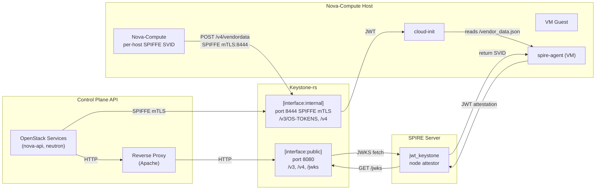

# SPIRE Integration Plan: Keystone-rs + OpenStack Workload Identity

**Status:** Draft

This document outlines the implementation plan for integrating SPIRE workload
identity into an OpenStack control plane running keystone-rs. The plan is broken
into independently-mergeable phases, each building on preceding work.

The core idea: Nova injects a keystone-rs signed JWT into a VM's vendor_data.
The VM uses a custom SPIRE node attestor plugin to auto-attest (no
pre-registered entries), receiving a project-scoped SPIFFE SVID. OpenStack API
services use SPIFFE mTLS for the keystonemiddleware back-channel to keystone-rs,
and eventually transition to offline JWT validation.

## External Dependencies

This plan spans three repositories:

| Repo                                                                     | What It Contributes                                                                 |
| ------------------------------------------------------------------------ | ----------------------------------------------------------------------------------- |
| `openstack-experimental/keystone` (keystone-rs)                          | Vendor data JWT API, internal SPIFFE interface, mapping rules                       |
| `openstack/python-keystonemiddleware` (Gerrit, **two separate changes**) | Change #1: `auth_token` filter SPIFFE mTLS transport. Change #2: JWT offline filter |
| New Go repo: `spire-jwt-keystone-plugins`                                | Custom SPIRE node attestor plugins (agent + server)                                 |

Two supporting DevStack plugins are also needed:

| Plugin                             | Purpose                                                           |
| ---------------------------------- | ----------------------------------------------------------------- |
| `devstack-plugin-spire`            | Install and configure SPIRE server + agents                       |
| keystone-rs `devstack/` (existing) | Already handles keystone-rs + OPA; extended for SPIRE integration |

## Architecture Overview

Services connect to keystone-rs via two interfaces:

- **`[interface:public]`** (port 8080) — plaintext HTTP, behind reverse proxy
  (Apache). Serves /v3, /v4, and JWKS to unauthenticated clients — two
  separate JWKS documents as of Phase 2: `/v4/oauth2/{domain}/jwks` (OAuth2
  access-token signing key) and `/v4/spiffe/{domain}/jwks` (VM attestation
  signing key), independently keyed and rotated (see Phase 2 "Attestation key
  isolation").
- **`[interface:internal]`** (port 8444) — SPIFFE mTLS. Used by OpenStack
  services (nova-api, neutron) for the keystonemiddleware back-channel.

```mermaid
c4Diagram
    Person(devops, "DevOps Operator", "Manages infrastructure")
    System(openstack, "OpenStack Services", "nova-api, neutron API")
    System(apache, "Reverse Proxy", "Apache / nginx")
    System(keystone, "Keystone-rs", "Authentication and authorization")
    System(nova_compute, "Nova-Compute", "Runs VMs on compute nodes")
    System(spire_srv, "SPIRE Server", "Workload identity management")
    System_VM(vm, "VM Guest", "Linux VM running spire-agent")
    Boundary(ks_boundary, "Keystone-rs") {
        System_Pub(pub, "[interface:public]", "Port 8080\n/v3, /v4, /jwks")
        System_Int(int, "[interface:internal]", "Port 8444 SPIFFE mTLS\n/v3/OS-TOKENS, /v4")
    }
    Boundary(sp_boundary, "SPIRE Server") {
        Component(jp, "jwt_keystone node attestor", "Serves JWT attestation")
    }
    Rel(openstack, pub, "HTTP")
    Rel(apache, pub, "HTTP")
    Rel(openstack, int, "SPIFFE mTLS")
    Rel(pub, jp, "JWKS fetch (HTTP)")
    Rel(nova_compute, int, "POST /v4/vendordata\nSPIFFE mTLS")
    Rel(vm, jp, "JWT attestation")
    Rel(jp, pub, "GET /v4/spiffe/domain/jwks")
```

**VM attestation flow:**

```mermaid
sequenceDiagram
    participant N as Nova-Compute
    participant NA as Nova API
    participant K as Keystone-rs
    participant VM as cloud-init (VM)
    participant SA as spire-agent (VM)
    participant P as SPIRE Server
    Note over N,P: VM provisioning with SPIFFE identity
    N->>K: POST /v4/vendordata (project_id, instance_id)
    Note over N,K: Nova-Compute presents per-host SPIFFE SVID
    K->>NA: verify server.tenant_id + hypervisor_hostname (verify_placement)
    NA-->>K: ownership confirmed (else 403)
    K-->>N: signed JWT in vendor_data response
    N->>VM: inject JWT into /vendor_data.json
    VM->>SA: read JWT from vendor_data.json
    SA->>P: JWT attestation stream
    P->>K: GET /v4/spiffe/domain/jwks (dedicated attestation JWKS)
    K-->>P: attestation JWKS public keys
    P->>P: verify JWT signature + aud + exp
    P->>P: check consumed-jti cache; supersede stale entry if fresh re-attestation
    P-->>SA: X.509 SVID
    Note over SA: SVID: spiffe://domain/project/{p}/instance/{i}
```

**Control plane data flow:**



## Phases

### Phase 1: SPIRE DevStack Plugin

**Goal:** SPIRE server and agents running in devstack, with trust domain, CA
bundle distribution, and pre-registered service entries.

**Prerequisites:** None.

**New files:**

| File                                                    | Purpose                                |
| ------------------------------------------------------- | -------------------------------------- |
| `tools/devstack-plugin-spire/plugin.sh`                 | DevStack plugin hooks                  |
| `tools/devstack-plugin-spire/lib/spire`                 | Install/configure/start/stop functions |
| `tools/devstack-plugin-spire/settings`                  | `enable_service spire` declaration     |
| `tools/devstack-plugin-spire/etc/spire-server.conf.tpl` | Server config template                 |
| `tools/devstack-plugin-spire/etc/spire-agent.conf.tpl`  | Agent config template                  |

**Details:**

The plugin follows the same pattern as the existing `devstack/plugin.sh` —
`setup_start_spire` (install binaries from SPIRE releases, generate config),
`stop_spire`, `do_cleanup`.

Server config uses `join_token` node attestor for single-node devstack
(development only; production would use `x509pop`, `k8s_sat`, etc.). The agent
uses join token for insecure bootstrap, same as `tools/start-spire.sh`.

The plugin pre-registers service entries for keystone-rs, nova-api, and
neutron, mapping each to a well-known, per-service SPIFFE ID. Nova-compute is
**not** registered as a single shared identity — see "Per-host nova-compute
registration" below.

| Service      | SPIFFE ID                                            |
| ------------ | ----------------------------------------------------- |
| Keystone-rs  | `spiffe://{trust_domain}/service/keystone`             |
| Nova API     | `spiffe://{trust_domain}/service/nova-api`             |
| Neutron      | `spiffe://{trust_domain}/service/neutron`              |

**Per-host nova-compute registration (ownership binding):** Because
`/v4/vendordata` (Phase 2) signs an attestation JWT scoped to a specific
`project_id`/`instance_id`, keystone-rs needs to know *which compute host* is
asking — a flat, shared nova-compute identity gives every compute host the
same SPIFFE ID and no way to bind a request to the host that actually owns
the instance. A compromised or malicious compute host could otherwise request
(and receive) a signed attestation for any project/instance pair, not just
instances it runs.

Instead, each compute host gets its own per-host SPIFFE ID:

```
spiffe://{trust_domain}/service/nova-compute/host/{hostname}
```

Registration is per-host rather than a single pre-registered entry:

- **Production-style option:** `x509pop` node attestation, with each compute
  host provisioned an individual x509 identity certificate (e.g. from an
  existing PKI or per-host bootstrap secret) whose registration entry's
  SPIFFE ID is templated with the host's `hostname` selector.
- **DevStack option:** the plugin's join-token bootstrap flow is extended to
  register the entry dynamically at agent-join time, keyed to the joining
  agent's `hostname` (rather than pre-registering one shared entry for
  "nova-compute" up front). **This does not give the same host-identity
  guarantee as `x509pop`, and should be labeled as such** (same caveat this
  plan already applies to `join_token` elsewhere: development/test only). A
  join token, by itself, only proves possession of the token — not which
  host is joining. If the join token is shared across all compute hosts (the
  typical devstack single-node-or-shared-token setup), any host holding it
  can register itself under *any* hostname it claims, which defeats the
  purpose of Fix 1's ownership check in that deployment mode: the whole
  point of per-host identity is that a compute host can't claim to be
  another one. Treat the devstack path as sufficient for exercising the
  Phase 2/5 code paths in CI, not as a security-equivalent stand-in for
  `x509pop` in any assessment of whether Fix 1 actually holds.

Phase 2 uses this per-host identity to cross-check ownership before signing
(see "Ownership verification" in Phase 2 below).

**Per-host entry cleanup:** this table addresses issuing per-host identities,
not retiring them. A compute host that's decommissioned leaves its
`.../nova-compute/host/{hostname}` registration entry in place indefinitely —
the same class of orphaned-entry problem Phase 6a solves for VM instances,
just on the host side. Not addressed by this plan; operators should extend
whatever host-decommissioning process they already run (e.g. `nova service
delete`) to also remove the corresponding SPIRE entry.

The SPIRE server CA bundle is copied to `$KEYSTONE_CONF_DIR/spiffe/ca.crt` so
keystone-rs and Python services can reference it.

**Configuration added to `local.conf`:**

```ini
[[local|localrc]]
enable_plugin spire https://github.com/openstack-experimental/keystone \
                 --branch <branch> \
                 --subdirectory tools/devstack-plugin-spire
enable_service spire
SPIRE_TRUST_DOMAIN=cloud.trust.domain
```

**Verification:**

```bash
# After stack.sh completes:
spire-server entry show -socketPath /tmp/spire-ci-test-harness/server.sock
# Should show pre-registered entries for nova-api, neutron, plus one
# per-host entry for each joined nova-compute host (host/{hostname})

# Verify agent health:
spire-agent healthcheck -socketPath /tmp/spire-ci-test-harness/agent.sock
```

---

### Phase 2: Vendor Data JWT API (keystone-rs)

**Goal:** keystone-rs exposes a new endpoint that signs a JWT per VM instance.
The JWT is signed with a dedicated attestation signing key, wholly separate
from the domain OAuth2 signing key and served from its own JWKS endpoint (see
"Attestation key isolation" below), and contains instance-scoped claims
suitable for SPIFFE SVID construction.

**Prerequisites:** Phase 1 (SPIRE available for integration testing), and
Phase 3 — this endpoint lives on the internal SPIFFE interface (Phase 3's
REST-routing work) and its ownership check relies on Phase 3's extended SVID
claim flattening (`spiffe.host`, see Phase 3). The original phase ordering in
this plan listed Phase 3 after Phase 2; in practice Phase 3's REST-wiring and
claim-derivation work needs to land first, or at minimum land together with
Phase 2 rather than strictly after it.

**New external dependency:** this phase introduces a new keystone-rs →
nova-api back-channel call (see "Ownership verification" under "Key design
decisions" below) — keystone-rs did not previously call any OpenStack service
API, and has no existing outbound-client or self-credential machinery to
build this on (the closest precedents, `k8s_auth_client.rs` and
`auth_plugin_http_client.rs`, are both reqwest-based HTTP clients but neither
talks to an OpenStack service or holds a keystone-rs-as-caller credential —
both the client and the credential are new). The call happens once per VM
boot (on the `/v4/vendordata` request), so the added load is negligible, but
it is a new runtime dependency with two consequences:

- `/v4/vendordata` cannot verify placement if nova-api is unreachable from
  keystone-rs (mitigated by `vendordata.verify_placement`, see below, which
  lets operators disable the check and accept a weaker trust posture
  instead). On a Nova-side error or timeout (as opposed to an explicit
  ownership mismatch), the handler **fails closed** — it returns `503
  Service Unavailable`, not a signed JWT — so a Nova outage degrades to "no
  new SPIFFE identities issued," never to "identities issued without the
  ownership check." Failing open here would silently reopen the exact gap
  this fix closes.
- **Auth deadlock prevention:** keystone-rs calls nova-api, which may itself
  be calling back to keystone-rs via keystonemiddleware (Mode B) to validate
  tokens. Under burst concurrent boot requests, this creates a circular
  dependency risk: keystone workers blocked waiting on Nova while Nova workers
  blocked waiting on keystone. The `nova_client` must use a **dedicated
  tokio worker pool** with a **tight timeout** (default 2s, configurable),
  and **connection pool limits** (max 10 concurrent, idle timeout 30s) to
  prevent unbounded growth. The credential used should be a system-scoped
  service token cached at startup to minimize Nova-side auth latency.
- `server.hypervisor_hostname` is not visible to ordinary Nova API callers
  (it's gated behind `os-extended-server-attributes`, normally admin-only),
  so the credential keystone-rs authenticates to Nova with needs
  admin/system-scoped Nova access. That credential can read cross-project
  placement data for every instance in the cloud and should be treated with
  the same operational rigor as the signing keys below — see the Security
  Considerations table.

**Changes to keystone-rs:**

| File                                              | Purpose                                                                                                                                    |
| -------------------------------------------------- | ------------------------------------------------------------------------------------------------------------------------------------------- |
| `crates/keystone/src/api/v4/vendordata.rs`        | Handler: `POST /v4/vendordata`                                                                                                             |
| `crates/keystone/src/api/v4/spiffe_jwks.rs`       | Handler: `GET /v4/spiffe/{domain_id}/jwks` — dedicated attestation-key JWKS endpoint (new, see "Attestation key isolation")                |
| `crates/keystone/src/api/v4/mod.rs`               | Module wiring into `/v4` router                                                                                                            |
| `crates/core-types/src/vendordata.rs`             | Request/response types                                                                                                                     |
| `crates/core/src/api/auth.rs`                     | JWT signing method using the dedicated attestation key                                                                                    |
| `crates/core/src/oauth2_key.rs`                   | Existing OAuth2 signing-key rotation logic (Primary/Previous/Pending) — unchanged                                                          |
| `crates/key-repository/src/asymmetric/*.rs`       | New, independent `KeyRole`/`ActiveKeys` instance for the attestation-key purpose — a **second key of the same generic shape**, not a new field on the existing one (see "Attestation key isolation") |
| `crates/core/src/nova_client.rs`                  | New Nova API client + new keystone-rs-as-caller credential for ownership verification (Fix 1) — no prior OpenStack-service-client infrastructure exists to build on |
| `policy/vendordata/create.rego`                   | OPA policy rule                                                                                                                             |
| `doc/src/adr/0033-vendor-data-jwt.md`             | ADR for the endpoint design                                                                                                                 |

**Endpoint contract:**

**`POST /v4/vendordata`**

Auth: Nova-compute presents its SPIFFE SVID. Keystone-rs authenticates and
authorizes the request. Nova's `vendor_data_url` makes a POST request with
instance metadata in the body (`project_id`, `instance_id`).

Request body (sent by Nova, per `vendor_data_url` spec). Nova includes
project_id and instance_id in the POST body:

```json
{
  "project_id": "a1b2c3d4",
  "instance_id": "550e8400-e29b-41d4-a716-446655440000"
}
```

Response body (`201 Created`):

```json
{
  "spiffe_jwt": {
    "algorithm": "ES256",
    "jti": "7f9c9e0a-3b1d-4c2e-9a5f-1e2d3c4b5a6f",
    "token": "<JWT string>",
    "expires_at": "2026-08-12T10:30:00Z"
  }
}
```

The JWT payload (after base64url decoding):

```json
{
  "iss": "https://keystone:8444/v4/spiffe/default",
  "aud": "spiffe-attestation",
  "exp": 1723456800,
  "iat": 1723456500,
  "jti": "7f9c9e0a-3b1d-4c2e-9a5f-1e2d3c4b5a6f",
  "sub": "vm:550e8400-e29b-41d4-a716-446655440000",
  "openstack": {
    "project_id": "a1b2c3d4",
    "instance_id": "550e8400-e29b-41d4-a716-446655440000",
    "spiffe_role": "compute-vm"
  }
}
```

**Key design decisions:**

- **Attestation key isolation:** the signing key used here is *not* the same
  key used for OAuth2 access tokens, and is not merely tagged differently
  within the same JWKS document. keystone-rs's existing OAuth2 key management
  (`crates/core/src/oauth2_key.rs`, ADR 0026) models exactly one signing
  purpose with two rotation slots (current + previous, for overlap during
  rotation) — it has no notion of two *concurrently active* keys for two
  *different* purposes. An earlier draft of this fix proposed publishing a
  second key in the same JWKS set tagged with a custom `"use": "spiffe-attest"`
  value; that was dropped for two reasons: (1) it still requires generalizing
  the key-repository's rotation model to a second purpose — it is not the
  drop-in reuse it sounds like — and (2) it would make a JWK metadata field
  (`use`, which per RFC 7517 is meant to distinguish signature vs. encryption
  keys, not application-level purpose) the actual security boundary
  separating "can forge API tokens" from "can mint VM identities," which is a
  fragile place to put that boundary — a validator that ignores or
  mis-handles `use` would silently accept the wrong key.

  Instead, the attestation key is a **second, independent per-domain key**
  (its own generation/rotation lifecycle, reusing the same generic
  Primary/Previous/Pending rotation shape as the OAuth2 key, just as a
  separate instance) served from its **own dedicated endpoint**,
  `GET /v4/spiffe/{domain_id}/jwks`, wholly distinct from
  `/v4/oauth2/{domain_id}/jwks`. Trust separation then comes from endpoint
  separation, not from a metadata flag: the SPIRE server plugin (Phase 5)
  only ever fetches the attestation JWKS URL and never sees, and therefore
  can never be tricked into trusting, the OAuth2 signing key. A single key
  compromise no longer grants both API-token forgery and the ability to mint
  arbitrary VM node identities — see the Security Considerations table for
  further discussion of this blast-radius separation.
- Fixed `aud: "spiffe-attestation"` prevents JWT misuse for any other purpose.
- **Ownership verification (compute-host ↔ instance binding):** Nova-compute's
  SPIFFE SVID now carries a per-host identity
  (`spiffe://{trust_domain}/service/nova-compute/host/{hostname}`, Phase 1).
  Before signing, the handler reads the `spiffe.host` claim (derived from the
  `{hostname}` path segment by Phase 3's extended claim flattening — see
  Phase 3 for why this has to be a derived claim rather than something read
  live off the SVID: SPIRE selectors are a server-side attestation concept
  and are never present in the issued X.509 SVID itself, so there is no
  "selector" to read off the wire here, only the URI path string). Having
  the hostname, the OPA policy check (already required to authorize the
  request at all) runs first — cheap and local — and only if
  that passes does the handler call Nova, using keystone-rs's own service
  credentials (admin/system-scoped — `server.hypervisor_hostname` is gated
  behind `os-extended-server-attributes` and not visible to ordinary
  callers), to confirm `server.tenant_id == project_id` and
  `server.hypervisor_hostname == caller_host` for the requested `instance_id`.
  A mismatch is rejected with `403 Forbidden`; a Nova-side error or timeout is
  rejected with `503 Service Unavailable` (fail closed — see "New external
  dependency" above). Without this check, any compute host's shared SVID
  could request (and receive) a signed attestation for an instance it
  doesn't run, since Phase 1's SPIFFE ID alone doesn't bind the caller to a
  specific host/instance pairing. This is controlled by a new config flag,
  `vendordata.verify_placement` (default `true`). Operators can set this to
  `false` to skip the Nova call, but doing so accepts a materially weaker
  trust posture: compute-host claims about `project_id`/`instance_id` are
  then trusted unverified, and a compromised compute host can request
  attestation for arbitrary instances.
- Short TTL range (`ttl_seconds`, accepted range 60–600, default 300). 60
  seconds is too tight for cold VM boot (Nova calls API → metadata publishes →
  VM boots → cloud-init reads → spire-agent runs). The SPIRE server plugin
  enforces expiry during attestation regardless. Cap at
  `[oauth2] access_token_lifetime_minutes` (15 min default) as a safety bound.
- `jti` is a **freshly generated random identifier per issued JWT**, distinct
  from `instance_id` (previous drafts of this plan set `jti = instance_id`,
  but that collides with legitimate re-attestation — see Phase 5/Phase 6
  "Re-attestation" below: two vendordata calls for the same instance, e.g.
  original boot and a later rebuild, must produce *different* `jti` values so
  the SPIRE server plugin's replay check can tell a fresh, legitimate
  re-attestation apart from a true replay of the same token).
  `instance_id`/`project_id` remain in the `openstack` claims for identity
  construction; `jti` is purely an anti-replay token identifier.
- The `expires_at` field in the HTTP response is the human-readable ISO 8601
  equivalent of the JWT `exp` claim. The actual expiry validation uses the unix
  timestamp in the JWT payload itself.
- The endpoint lives on the **internal interface** (port 8444, SPIFFE mTLS)
  since Nova-compute authenticates with its SPIFFE SVID. Nova's
  `vendor_data_url` call path uses keystonemiddleware for the HTTP call, which
  attaches the SVID.
- `project_id` and `instance_id` come from Nova's POST body — no Nova API lookup
  needed. Keystone-rs simply uses these to construct the JWT claims.

**Unit tests (minimum 3 per handler convention from AGENTS.md):**

1. Valid Nova-compute SVID + positive policy → `201 Created`, JWT returned
2. Valid SVID + negative policy (wrong scope) → `403 Forbidden`
3. Invalid/missing SVID → `401 Unauthorized`
4. Valid SVID, correct signature, but hostname/project_id mismatch against
   the Nova record → `403 Forbidden` (ownership verification, Fix 1; only
   exercised when `vendordata.verify_placement` is enabled)

**Verification:**

```bash
# From a SPIRE-attested nova-compute workload:
curl -X POST --cert /tmp/spiffe/tls.crt \
     --key /tmp/spiffe/tls.key \
     --cacert /etc/spire/conf/server/ca.crt \
     https://localhost:8444/v4/vendordata \
     -H "Content-Type: application/json" \
     -d '{"project_id": "default", "instance_id": "test-123"}'
# The response `expires_at` is the human-readable ISO 8601 echo of the
# unix-timestamp `exp` claim inside the JWT. Verification uses the JWT payload `exp`.
```

---

### Phase 3: keystone-rs Internal SPIFFE Listener Configuration

**Goal:** OpenStack services connect to keystone-rs via the internal SPIFFE mTLS
interface, presenting SPIFFE x509 SVIDs. Services are mapped to Keystone
identities through the ADR 0020 `SpiffeTrustResource` mapping engine.

**Prerequisites:** Phase 1 (SPIRE trust domain available).

**Changes to keystone-rs:**

| File                                  | Purpose                                                                                        |
| ------------------------------------- | ---------------------------------------------------------------------------------------------- |
| `crates/keystone/src/bin/keystone.rs` | Wire internal SPIFFE listener to REST router (already exists for storage gRPC, extend to REST) |
| `crates/config/src/interface.rs`      | `interface_internal` with `listener.type = spiffe` is already supported; no changes needed     |
| `crates/core/src/api/auth.rs`         | SVID extraction → `SpiffeTrustResource` → mapping engine; extend claim flattening to derive path-segment claims (see below) |

**Current state:** The keystone-rs binary already supports
`ListenerConfig::Spiffe` on the `interface_internal`
(`crates/keystone/src/bin/keystone.rs:1420-1446`). SPIFFE TLS infrastructure for
REST is in `spiffe_tls.rs` (`start_axum_app`), trust domain validation is in
`spiffe_common.rs`. The `interface_internal` hard-restricts to SPIFFE-only. What
this phase adds is:

1. Making the internal SPIFFE interface serve the REST API router (currently the
   internal SPIFFE interface may not be wired to the REST router, only to
   storage gRPC — verify and wire if missing)
2. Documenting the `interface_internal` config section for service-to-service
   mTLS

**Listener configuration (`[interface:internal]` section):**

```ini
[interface:internal]
bind_host = 0.0.0.0
bind_port = 8444
listener.type = spiffe
listener.trust_domains = cloud.trust.domain
```

The keystone-rs process itself presents a SPIFFE SVID (fetched from the local
SPIRE agent during startup, via `spiffe-rustls`). Incoming connections present
their SVID. The server validates:

1. SVID was issued by a CA within the trust domain (via `spiffe-rustls`
   authorizer)
2. SVID is not expired
3. Authorization is decided by the mapping engine, not listener-level filtering

Authentication context is extracted from the SVID URI:

- `spiffe://cloud.trust.domain/service/nova-api` → control-plane service identity
- `spiffe://cloud.trust.domain/service/nova-compute/host/{hostname}` → per-host
  compute service identity (see Phase 1 "Per-host nova-compute registration")
- `spiffe://cloud.trust.domain/project/{pid}/instance/{iid}` → VM workload

These are fed through the ADR 0020 mapping engine with claim source `spiffe`.
Today that's just `spiffe.id` (full SPIFFE URI) and `spiffe.trust_domain`
(derived from the URI by the existing claim-flattening code). The mapping
engine itself only supports regex *matching*, not capturing a substring out
of a matched claim for use in a binding (`crates/core/src/mapping/engine.rs`'s
`extract_claim_values` only expands a whole `${claims.<key>}` token) — so any
value a binding needs out of the SPIFFE ID path (a VM's `project_id`, or
Fix 1's compute-host `hostname`) has to be a claim keystone-rs derives
*itself* at extraction time, the same way `spiffe.trust_domain` already is,
not something a mapping rule can pull out of `spiffe.id` on the fly. Phase 2
and Phase 6 both rely on this: extending `auth.rs`'s claim flattening to also
emit `spiffe.project_id`, `spiffe.instance_id` (from the
`.../project/{pid}/instance/{iid}` VM-workload path), and `spiffe.host` (from
the `.../nova-compute/host/{hostname}` path) is in scope for this phase, not
something Phase 2/6 can assume already exists. The path extractor must use
**strict path-segment matching**, not simple string splitting or unanchored
regexes: it should validate the URI scheme and trust domain prefix, handle
URL-encoded path segments correctly, and **reject malformed URIs** (trailing
slashes, unexpected extra segments, mismatched prefixes). A malformed
`spiffe.id` that doesn't match any known pattern should result in
authentication failure (401), not an empty claim value — this prevents OPA/Rego
rules from silently matching on absent claims.

**Verification:**

```bash
# Verify the keystone-rs internal SPIFFE listener serves REST API:
curl --cert /tmp/spiffe/tls.crt \
     --key /tmp/spiffe/tls.key \
     --cacert /etc/spire/conf/server/ca.crt \
     https://localhost:8444/v3/users
# keystone-rs logs should show:
# "SpiffeTlsAccepted(spiffe://cloud.trust.domain/...)"
```

---

### Phase 4: Patched keystonemiddleware (Gerrit, External)

**Goal:** OpenStack Python services use SPIFFE mTLS for the keystonemiddleware
back-channel to keystone-rs. JWT access tokens can be validated offline without
a back-channel call.

**Prerequisites:** Phase 1 (SPIRE), Phase 3 (keystone-rs mTLS interface).

**Target repo:** `openstack/python-keystonemiddleware` on Gerrit.

**Two separate Gerrit changes.** These are orthogonal and landed independently:

#### Change 4.1: SPIFFE mTLS transport (auth_token)

| File                                      | Purpose                                 |
| ----------------------------------------- | --------------------------------------- |
| `keystonemiddleware/_spiffe_transport.py` | SPIFFE SVID fetcher + HTTP transport    |
| `keystonemiddleware/auth_token.py`        | New `spiffe_agent_socket` config option |

**Behavior:**

1. On startup, keystonemiddleware connects to the SPIRE agent socket
2. Fetches a workload X.509 SVID (short-lived, SPIRE-managed rotation)
3. Wraps `requests.Session` with `urllib3` TLS config using SVID as client cert
4. All back-channel calls (`/v3/OS-TOKENS`, user info, project info) go over
   mTLS

#### Change 4.2: JWT offline validation filter (independent Paste filter)

| File                                           | Purpose                                   |
| ---------------------------------------------- | ----------------------------------------- |
| `keystonemiddleware/jwt_offline.py`            | ADR 0026 §6 `KeystoneNativeJwtMiddleware` |
| `setup.cfg`                                    | Paste filter entry point                  |
| `doc/source/conf/configuration/auth_token.rst` | Documentation                             |

**Behavior:**

The `KeystoneNativeJwtMiddleware` is a separate Paste filter that sits **in
front of** `keystonemiddleware.auth_token`. It intercepts
`Authorization: Bearer {JWT}` requests:

1. Fetches JWKS from `keystone_jwks_url` (cached with 300s TTL)
2. Verifies JWT signature (ES256/RS256)
3. Checks `aud` matches `expected_audience`
4. Checks `iss` against `expected_issuers` allowlist
5. Checks `exp` and `nbf`
6. If valid: injects `openstack_context` into WSGI environment, short-circuits
   past `auth_token`
7. If not a JWT: falls through to the standard `auth_token` filter (Fernet
   validation)

Note what this filter does **not** do: it does not check `jti` against any
revocation list. Mode C (see "Token Validation Migration Path" below) is
explicitly a fully offline validation path — the filter never calls back to
keystone-rs except to refresh its cached JWKS — so there is no live source to
check a `jti` against without reintroducing a back-channel call and
contradicting that design goal. Compromised or misused access tokens are
instead handled by relying on **short TTL only**
(`access_token_lifetime_minutes`, 15 min default per ADR 0026): a
compromised token is only usable for the remainder of its (short) lifetime.
There is no real-time revocation in Mode C. For immediate revocation needs,
use Mode B (SPIFFE mTLS + Fernet, which does hit keystone-rs per request)
rather than Mode C.

**New keystonemiddleware configuration (`keystone_authtoken` section):**

```ini
[keystone_authtoken]
www_authenticate_uri = https://keystone:8444/v3
auth_url = https://keystone:8444/v3

# --- NEW: SPIFFE mTLS transport (Change 4.1) ---
spiffe_agent_socket = /tmp/spire-ci-test-harness/agent.sock

# --- NEW: JWT offline validation (Change 4.2) ---
keystone_jwks_url = http://keystone:8080/v4/oauth2/default/jwks
keystone_signing_algorithm = ES256
keystone_expected_audience = openstack-apis:default
keystone_expected_issuers = https://keystone:8444/v4/oauth2/default
```

**Paste Deploy wiring (`api-paste.ini`):**

```ini
[pipeline:osapi_compute]
pipeline = keystonemiddleware_jwt_offline authtoken keystonecontext oscomputeapp

[filter:keystonemiddleware_jwt_offline]
paste.filter_factory = keystonemiddleware.jwt_offline:filter_factory
jwks_url = http://keystone:8080/v4/oauth2/default/jwks
signing_algorithm = ES256
expected_audience = openstack-apis:default
```

**Verification in devstack:**

Add to `local.conf`:

```ini
python_keystonemiddleware_git = https://github.com/<user>/python-keystonemiddleware
python_keystonemiddleware_branch = spiffe-mtls-transport
# For JWT offline filter:
python_keystonemiddleware_git = https://github.com/<user>/python-keystonemiddleware
python_keystonemiddleware_branch = jwt-offline-validation
```

After `stack.sh`:

```bash
# Check nova-api logs for SVID loading:
grep -i "SVID loaded from" /var/log/nova/nova-api.log
# Should show SVID fetch and mTLS connections

# Verify JWT offline validation works:
# Get a JWT from keystone-rs OAuth2 /token endpoint, then:
curl -H "Authorization: Bearer <JWT>" http://localhost:8774/v2.1/servers/detail
# Should succeed without keystone-rs receiving the validation request
```

---

### Phase 5: SPIRE JWT Node Attestor Plugins (External Go Repo)

**Goal:** VMs boot with a keystone-rs JWT in vendor_data, auto-attest to SPIRE
server, and receive a project-scoped SPIFFE SVID.

**Prerequisites:** Phase 1 (SPIRE), Phase 2 (vendor data JWT + JWKS).

**Target repo:** New Go repository `spire-jwt-keystone-plugins`.

**Plugin architecture:**

SPIRE's node attestor interface requires both a server plugin (verifies
attestation data, constructs identity) and an agent plugin (reads credential,
streams to server).

**Server plugin (`jwt_keystone_attestor`):**

| File                                | Purpose                                                    |
| ----------------------------------- | ---------------------------------------------------------- |
| `server/jwt_keystone/main.go`       | `NodeAttestor` interface implementation                    |
| `server/jwt_keystone/jwks_cache.go` | JWKS fetcher + validator (HTTP GET, 300s cache, ES256)     |
| `server/jwt_keystone/config.go`     | SPIFFE config for SPIRE plugin (`Config`, `New`, `Attest`) |
| `server/jwt_keystone/jti_cache.go`  | Short-lived consumed-`jti` cache (replay protection)       |

Config:

```json
{
  "jwks_url": "http://keystone:8080/v4/spiffe/default/jwks",
  "audience": "spiffe-attestation",
  "trust_domain": "cloud.trust.domain",
  "spiffe_path_prefix": "/project",
  "tls": {
    "ca_file": "/etc/spire/conf/server/ca.crt"
  }
}
```

`jwks_url` points at the **dedicated attestation JWKS endpoint**
(`/v4/spiffe/{domain}/jwks`, see Phase 2's "Attestation key isolation"), not
the general OAuth2 JWKS endpoint. The plugin never fetches or sees the OAuth2
signing key at all, so there is no metadata flag to check and nothing to get
wrong: a JWT signed with the OAuth2 key simply has no matching `kid` in the
JWKS document this plugin ever loads. This replaces an earlier `use`-tag-based
design (see Phase 2) that would have needed the plugin to actively check a
`use` field on a shared JWKS — endpoint separation removes that failure mode
entirely.

`Attest` flow:

1. Receive raw JWT bytes from attestation stream
2. Parse JWT, extract `kid`
3. Fetch the attestation JWKS from keystone-rs's dedicated endpoint (300s
   cache, same cache discipline as ADR 0026 §3's OAuth2 JWKS)
4. Verify signature (ES256, matching keystone-rs `signing_algorithm`) against
   the matching `kid` in that JWKS — reject if no match
5. Verify `aud == "spiffe-attestation"`, verify `exp`
6. **Replay/re-attestation handling** (see Phase 6a "Re-attestation and
   garbage collection" for the full rationale): check the JWT's `jti` against
   a short-lived consumed-`jti` cache, self-expiring at the JWT's own `exp`
   (bounded by the JWT's max 600s TTL, so the cache never needs entries older
   than that). **This cache must be backed by SPIRE's shared registration
   datastore (the same store backing the registration entries below), not
   per-process memory** — SPIRE servers are commonly run with multiple HA
   replicas behind one datastore, and an in-memory cache would let the same
   JWT be replayed against a different server node within its TTL window,
   silently defeating this check.
   - If `jti` is already present in the cache → **reject** (true replay: the
     exact same token was already used to attest).
   - Otherwise, record `jti` in the cache and continue. Note this cache is
     about token reuse, not SPIFFE-ID reuse — a *different*, freshly-minted
     JWT for the same instance (e.g. after a rebuild) has a different `jti`
     and is not blocked here.
    - Construct the target SPIFFE ID
      (`spiffe://cloud.trust.domain/project/{project_id}/instance/{instance_id}`)
      and query the registration DB for an existing entry.
      - No existing entry → create it (first attestation for this instance).
      - An existing entry, but this JWT's `jti` was unconsumed (fresh,
        valid token) → treat as **legitimate re-attestation**: delete the
        stale entry (revoking the old SVID for that identity) and create a
        new one — i.e. *supersede* rather than reject. This covers Nova
        lifecycle events that reuse the same `instance_id` (rebuild, evacuate,
        cold migration), each of which triggers a fresh `vendor_data_url` call
        and a new JWT with a new `jti`.
      - **Race condition mitigation:** the query-delete-create sequence above
        must be wrapped in a **single database transaction** (or distributed
        lock) scoped to the `spiffe_id` key. Without this, two simultaneous
        attestation requests for the same instance hitting different SPIRE
        Server replicas (e.g., network retry + original request) can both pass
        the initial existence check, attempt separate deletes, and diverge —
        producing duplicate entries, lost-writes, or a stale entry surviving
        the supersede. The transaction ensures the supersede is an atomic
        per-`spiffe_id` operation regardless of replica fan-out.
7. Construct SPIFFE ID:
   `spiffe://cloud.trust.domain/project/{project_id}/instance/{instance_id}`
8. Return selectors:
   - `jwt_ks:project:{project_id}`
   - `jwt_ks:instance:{instance_id}`
   - `jwt_ks:role:{spiffe_role}`

These selectors are stored on the SPIRE registration entry and are
SPIRE-internal metadata (available to SPIRE-side entry queries/policy, and
to the `x509pop`/registration tooling in this plan) — they do **not** flow
through to the issued SVID or become visible to keystone-rs's mapping engine
over mTLS. Phase 6's mapping rules derive `project_id` independently, by
parsing the SPIFFE ID path itself (see Phase 3 and Phase 6 below), not from
these selectors.

This design still depends on Fix 1 (compute-host ↔ instance ownership
verification in Phase 2) to prevent unauthorized minting in the first place —
the supersede logic here only governs what SPIRE does with a JWT it has
already decided is validly signed and correctly scoped. Without Fix 1, an
attacker with a compute-host SVID could get a JWT minted for an
instance/project it doesn't own and use the same supersede path to pre-empt
(overwrite) that instance's legitimate SPIFFE identity.

**Agent plugin (`jwt_keystone_attestor`):**

| File                           | Purpose                                 |
| ------------------------------ | --------------------------------------- |
| `agent/jwt_keystone/main.go`   | `NodeAttestor` interface implementation |
| `agent/jwt_keystone/config.go` | SPIFFE plugin config                    |

Config:

```json
{
  "jwt_path": "/var/run/nova/vendor_data.json",
  "jwt_key": "spiffe_jwt.token"
}
```

The `jwt_path` is the vendor_data.json file injected by nova-compute. On the
compute host, `/var/run/nova/vendor_data.json` is the standard location. The
`jwt_key` is a dotted path into nested JSON: the plugin reads
`response["spiffe_jwt"]["token"]`. The key name matches the
`vendor_data_key_name` config in Nova.

`Attest` flow:

1. Read `jwt_path` (vendor_data.json injected by nova-compute)
2. Extract JWT string from the JSON key `jwt_key`
3. Return raw JWT bytes as attestation data
4. SPIRE agent streams it to the server via the node attestor channel

**Build:**

```makefile
# Makefile
# SPIRE plugins are standalone gRPC executables using HashiCorp go-plugin,
# not CGO .so shared libraries. The .so approach requires identical Go
# compiler/toolchain versions between plugin and SPIRE server, causing
# hard-to-debug load panics on SPIRE upgrades.
server-plugin:
	go build -o dist/jwt_keystone_server nodeattestor \
		server/jwt_keystone/main.go

agent-plugin:
	go build -o dist/jwt_keystone_agent nodeattestor \
		agent/jwt_keystone/main.go
```

**Verification:**

```bash
# Boot a VM with vendor_data containing a JWT from Phase 2 endpoint
# SPIRE server should log:
# "NodeAttestor (jwt_keystone): Successfully attested node
#   spiffe://cloud.trust.domain/project/{pid}/instance/{iid}"

# Inside the VM, verify SVID:
curl --unix-socket /tmp/spire-ci-test-harness/agent.sock \
  -H 'Content-Type: application/json' \
  -d '{"spiffe_id": "spiffe://cloud.trust.domain/test"}' \
  http://localhost/WorkloadAPI/FetchX509Certificate
# SVID SAN should be: spiffe://cloud.trust.domain/project/.../instance/...
```

---

### Phase 6: Integration, Policy Mapping, and DevStack Full Stack

**Goal:** End-to-end working deployment in devstack. Nova-compute injects JWT
into vendor_data, VM attests to SPIRE, gets SVID, calls OpenStack APIs.

**Endpoint location:** The `/v4/vendordata` endpoint lives on the **internal
interface** (port 8444, SPIFFE mTLS) so Nova-compute authenticates with its
SPIFFE SVID. Nova's POST body includes `project_id` and `instance_id` — no Nova
API lookup needed.

**keystone-rs SPIFFE mapping rules (ADR 0020 configuration):**

A mapping ruleset that handles the two categories of incoming SPIFFE identities:

**Service accounts (static mapping):**

```json
POST /v4/rbac/mapping/rulesets
{
  "ruleset": {
    "name": "openstack-service-accounts",
    "priority": 100,
    "rules": [
      {
        "name": "nova-api",
        "matches": {
          "all": [
            {"claim": "spiffe.id", "match": "exact",
             "value": "spiffe://cloud.trust.domain/service/nova-api"}
          ]
        },
        "binding": {
          "identity_mode": "local",
          "user_id": "svc-nova-api",
          "user_name": "nova-api",
          "roles": ["service"]
        }
      },
      {
        "name": "neutron",
        "matches": {
          "all": [
            {"claim": "spiffe.id", "match": "exact",
             "value": "spiffe://cloud.trust.domain/service/neutron"}
          ]
        },
        "binding": {
          "identity_mode": "local",
          "user_id": "svc-neutron",
          "user_name": "neutron",
          "roles": ["service"]
        }
      }
    ]
  }
}
```

**VM instance accounts (dynamic/ephemeral mapping):**

The `compute-vm` role is assigned to ephemeral VM identities. It grants VMs
limited API access scoped to their project. The SPIFFE ID contains the project
and instance scope, so the mapping engine can extract these from the URI.

```json
{
  "ruleset": {
    "name": "nova-vm-instances",
    "priority": 200,
    "rules": [
      {
        "name": "vm-instance",
        "matches": {
          "all": [
            {
              "claim": "spiffe.id",
              "match": "prefix",
              "value": "spiffe://cloud.trust.domain/project/"
            }
          ]
        },
        "binding": {
          "identity_mode": "ephemeral",
          "user_name": "${claims.spiffe.id}",
          "project_id": "${claims.spiffe.project_id}",
          "roles": ["compute-vm"]
        }
      }
    ]
  }
}
```

The `roles`: `[\"compute-vm\"]` assignment grants VMs a default
limited-privilege role scoped to their project. The `spiffe.id` claim in the
binding resolves to the full SPIFFE URI, which is extracted into user_name.
`spiffe.project_id` is **not** a SPIRE selector reaching the mapping engine —
selectors live only in SPIRE's registration entries and are never present on
the issued SVID. It's a claim keystone-rs derives itself by parsing the
`{project_id}` path segment out of the `spiffe.id` URI at extraction time
(see Phase 3's extended claim flattening), the same mechanism Fix 1 uses to
get `spiffe.host` for compute-host ownership verification.

**Full `local.conf` for end-to-end devstack deployment:**

```ini
[[local|localrc]]
ADMIN_PASSWORD=password
DATABASE_PASSWORD=password
RABBIT_PASSWORD=password
SERVICE_PASSWORD=$ADMIN_PASSWORD

# Core OpenStack services
enable_service mysql,rabbit,key,n-api,n-crt,n-sch,c-sch,c-api,neutron-server
disable_service q-svc
disable_service horizon

# Keystone-rs (replaces python keystone)
enable_plugin key-rs https://github.com/openstack-experimental/keystone
enable_service key-rs

# SPIRE
enable_plugin spire https://github.com/openstack-experimental/keystone \
                 --branch main \
                 --subdirectory tools/devstack-plugin-spire
enable_service spire
SPIRE_TRUST_DOMAIN=cloud.trust.domain

# Nova: fetch vendor_data JWT from keystone-rs per-instance
nova_conductor_config += [[nova_conductor]]
nova_conductor_config += vendor_data_url = https://keystone:8444/v4/vendordata
nova_conductor_config += vendor_data_key_name = spiffe_jwt
keystone_rss_internal_config += [keystone]

# Patched keystonemiddleware (two separate Gerrit changes)
python_keystonemiddleware_git=https://github.com/<user>/python-keystonemiddleware
python_keystonemiddleware_branch=spiffe-mtls-transport
# After landing the JWT offline filter, update to that branch:
# python_keystonemiddleware_branch=jwt-offline-validation
```

The `vendor_data_url` option causes Nova-compute to POST the instance metadata
(`project_id`, `instance_id`) to the configured URL. The response body becomes
the content of `/vendor_data.json` in the VM guest. The response JSON must match
the key expected by Nova's `vendor_data_key_name` (default `spiffe_jwt`). No
Nova code changes required.

**Integration test scenarios:**

| #   | Scenario                               | Expected Outcome                                                      |
| --- | -------------------------------------- | --------------------------------------------------------------------- |
| T1  | Boot VM, check vendor_data has JWT     | JWT present, decodes, claims match                                    |
| T2  | VM spire-agent attests using JWT       | SVID issued: `spiffe://domain/project/{pid}/instance/{iid}`           |
| T3  | VM workload calls nova-api with SVID   | 200, SVID mapped to ephemeral identity                                |
| T4  | Nova-api talks to keystone-rs via mTLS | Back-channel encrypted + mTLS authenticated                           |
| T5  | JWT-bearing request to nova-api        | Validated offline by keystonemiddleware_jwt_offline, no keystone call |
| T6  | Fernet token request to nova-api       | Falls through to standard auth_token, back-channel over mTLS          |
| T7  | Re-attest same instance_uuid           | Re-attesting with the *same* JWT (same `jti`) is rejected as replay by the consumed-`jti` cache. Re-attesting with a *newly minted* JWT (new `jti`, e.g. after rebuild) succeeds and supersedes the prior registration entry. |

---

### Phase 6a: Registration Entry Garbage Collection

**Goal:** prevent orphaned SPIRE registration entries from accumulating for
instances that are deleted and never re-attest. Phase 5's supersede logic
(step 6 of the `Attest` flow) cleans up an entry when the *same* instance
re-attests, but a deleted instance never calls back in, so nothing removes
its stale entry on its own — left unaddressed, the SPIRE registration DB
grows unboundedly over the life of a cloud.

**Prerequisites:** Phase 5 (SPIRE server plugin, registration entries keyed
by SPIFFE ID).

**Approach:** a lightweight Nova notification listener, using
`oslo.messaging`, subscribed to `instance.delete.end` notifications on the
Nova notification bus. On each notification, it extracts `instance_id` (and
`project_id`) from the payload, constructs the corresponding SPIFFE ID
(`spiffe://{trust_domain}/project/{project_id}/instance/{instance_id}`), and
calls the SPIRE server admin API to delete that registration entry (if one
exists — a VM that never attested has none, which is a no-op).

This can be lightweight tooling shipped alongside the devstack plugin (e.g.
`tools/devstack-plugin-spire/lib/gc-listener` or a small standalone daemon
started by the plugin) rather than a new repository — it has no dependency on
the SPIRE plugin internals beyond the admin API, and no dependency on
keystone-rs internals beyond the SPIFFE ID construction convention already
documented in this plan.

**Two gaps the event-only design above doesn't cover, and how to close them:**

- **Delivery isn't guaranteed.** `oslo.messaging` notifications are
  best-effort — a message-bus outage or listener downtime at the wrong
  moment drops the notification silently, and nothing re-delivers it. An
  event-driven-only listener will leak orphaned entries over time with no
  visible failure. Pair the listener with a **periodic reconciliation
  sweep** (e.g. hourly): list live instances from Nova, list VM-scoped
  entries from the SPIRE registration DB, and delete any entry whose
  instance no longer exists in Nova. The event listener keeps steady-state
  cleanup prompt; the sweep is the backstop that makes "eventually
  consistent" actually true instead of "consistent unless a message got
  dropped."
- **The listener is a new, unguarded trust boundary into the identity
  system.** It acts on the SPIRE server admin API — the same privilege
  level used to create/delete any registration entry — based purely on the
  content of a bus message. If the message bus isn't tightly scoped (RBAC on
  who can publish notifications), anyone who can put a forged
  `instance.delete.end` message on the bus can get a *running, legitimate*
  VM's SPIFFE identity revoked out from under it — a new identity-disruption
  / DoS vector this plan introduces that has no equivalent before Phase 6a.
  Mitigate by having the listener **re-verify against Nova's live state
  before deleting** (confirm the instance is actually gone, don't act on the
  notification payload alone) rather than treating notification receipt as
  sufficient evidence, and by scoping message-bus ACLs the same way any
  other identity-affecting control channel would be scoped. See the Security
  Considerations table.

**Verification:**

```bash
# Delete an attested instance, then confirm the entry is gone:
openstack server delete <instance_id>
# after the instance.delete.end notification is processed:
spire-server entry show -socketPath /tmp/spire-ci-test-harness/server.sock \
  -spiffeID spiffe://cloud.trust.domain/project/<project_id>/instance/<instance_id>
# Should return no matching entry
```

---

## Token Validation Migration Path

The architecture supports three coexisting token validation modes. Services can
migrate independently:

### Mode A — Legacy (current devstack default)

```
Service ──plaintext HTTP──▶ keystone-rs /v3/OS-TOKENS
keystone-rs validates Fernet token
```

No SPIRE. No mTLS. Standard keystonemiddleware behavior.

### Mode B — SPIFFE mTLS + Fernet (interim phase, after Phase 3-4)

```
Service ──SPIFFE mTLS──▶ keystone-rs [interface:internal] /v3/OS-TOKENS
(transport encrypted, caller authenticated via SVID)
keystone-rs validates Fernet token, returns metadata
```

keystonemiddleware still calls keystone-rs on every request, but the channel is
mTLS through the internal SPIFFE interface. Phase 4.1 landed on Gerrit, services
gradually enable `spiffe_agent_socket`.

### Mode C — JWT offline validation (final state, after Phase 4.2)

```
┌────────────────────────────────────────────┐
│ Service                                    │
│ keystonemiddleware_jwt_offline:            │
│  1. Verify JWT signature from cached JWKS  │
│  2. Check aud, iss, exp, nbf              │
│  3. Inject context, serve request          │
│                                            │
│ No call to keystone-rs needed.             │
└────────────────────────────────────────────┘
```

keystone-rs issues stateless JWT access tokens (ADR 0026). Token validation is
done in-memory. keystone-rs is only contacted for JWKS cache refresh (300s TTL).
This is the **final state** for data-path token validation.

**Tradeoff:** Mode C trades instant revocation for zero back-channel calls,
consistent with standard offline-JWT validation patterns — a compromised or
misused token is bounded by its short expiry rather than caught by a live
revocation check. This is a deliberate design choice, not an oversight: if
instant revocation later becomes a requirement, a possible future
enhancement (not part of this plan) would be a compact signed revocation
delta feed published alongside JWKS at
`/v4/oauth2/{domain}/revocations`, polled on a shorter cache interval (e.g.
30-60s) than JWKS (300s) — still without a per-request callback to
keystone-rs. Until/unless that is built, services that need immediate
revocation should stay on Mode B.

**Transition timeline:**

| Step | Action                                                                   |
| ---- | ------------------------------------------------------------------------ |
| 1    | Deploy Phase 1-3: SPIRE + keystone-rs internal SPIFFE interface          |
| 2    | Land Phase 4.1: keystonemiddleware SPIFFE mTLS transport change          |
| 3    | Gradually enable `spiffe_agent_socket` per service → Mode B              |
| 4    | Land Phase 4.2: keystonemiddleware JWT offline filter change             |
| 5    | Enable ADR 0026 OAuth2 JWT tokens on keystone-rs                         |
| 6    | Enable `keystone_jwks_url` per service → Mode C for JWT-bearing requests |
| 7    | (Optional) Remove Fernet validation → Mode C only                        |

---

## Security Considerations

| Threat                                                     | Mitigation                                                                                                                                                                                                                                                                        |
| ----------------------------------------------------------- | ---------------------------------------------------------------------------------------------------------------------------------------------------------------------------------------------------------------------------------------------------------------------------------- |
| **JWT replay for VM attestation**                          | Short TTL (300s default, max 600s), fixed `aud: spiffe-attestation`, short-lived consumed-`jti` cache in the SPIRE server plugin rejects reuse of the exact same token (Fix 2). This is a token-replay check, not a SPIFFE-ID-reuse check — see "Duplicate/re-attestation" below. |
| **keystone-rs JWKS key compromise**                        | Domain-isolated keys (ADR 0026), multi-generational key publishing bridges rotation. No live revocation list is relied on (see Mode C tradeoff below) — compromised tokens are bounded by short TTL.                                                                            |
| **Attestation/OAuth2 key blast-radius coupling**           | Attestation JWTs are signed by a wholly separate key served from its own dedicated JWKS endpoint (`/v4/spiffe/{domain}/jwks`), not a shared JWKS distinguished by a metadata flag — the SPIRE server plugin never fetches or trusts the OAuth2 key at all (Fix 3). Compromise of one key no longer grants both API-token forgery and VM identity minting. Independent rotation cadence is possible, but note a forged attestation JWT is not inherently "lower value" than a forged access token — with `vendordata.verify_placement=false` it grants unverified VM identity minting outright, so the attestation key warrants the same operational care as the OAuth2 key, not less. |
| **Downstream service impersonation**                       | SPIFFE mTLS — only workloads that hold a valid SVID for their identity can authenticate as that service                                                                                                                                                                          |
| **Compute-host impersonation / unauthorized attestation minting** | Per-host nova-compute SPIFFE identity (`.../service/nova-compute/host/{hostname}`) plus `vendordata.verify_placement` cross-checks the caller's host and the request's `project_id`/`instance_id` against the Nova record before signing, default-on (Fix 1). Disabling it accepts unverified compute-host claims. Note this guarantee only holds for `x509pop`-attested hosts — the devstack join-token registration path does not itself prove host identity (see Phase 1 "Per-host nova-compute registration").  |
| **Plaintext token validation (pre-Phase 3)**               | Phase 3 enables SPIFFE mTLS internally; Phase 4.1 rolls out keystonemiddleware mTLS transport; Phase 4.2 eliminates back-channel calls for JWT tokens                                                                                                                            |
| **SPIRE CA exposure**                                      | SPIFFE CA is ephemeral, auto-rotates with SPIRE CA rotation, not persisted at rest                                                                                                                                                                                                |
| **Duplicate/re-attestation for the same instance**         | Legitimate re-attestation (rebuild, evacuate, cold migration — new `jti`) supersedes the prior registration entry rather than being permanently rejected; only same-`jti` replay is rejected (Fix 2). The consumed-`jti` cache must be backed by SPIRE's shared datastore, not per-node memory, or replay protection doesn't hold across HA replicas. This alone does not stop an attacker who can get a JWT minted in the first place from pre-empting a legitimate VM's identity — that depends on Fix 1's ownership verification. |
| **GC listener notification spoofing (Phase 6a)**           | The Nova-notification-driven registration cleanup acts on SPIRE's admin API based on bus message content. A forged `instance.delete.end` message could revoke a running VM's identity. Mitigation: the listener re-verifies against Nova's live instance state before deleting rather than trusting the notification payload alone, plus standard message-bus RBAC. A periodic reconciliation sweep is the backstop for notifications that are dropped rather than forged. |

---

## Risk Register

| Risk                                                     | Likelihood | Impact | Mitigation                                                                                                                                                                                                             |
| -------------------------------------------------------- | ---------- | ------ | ---------------------------------------------------------------------------------------------------------------------------------------------------------------------------------------------------------------------- |
| SPIRE agent plugin fails to load in VM                   | Medium     | High   | Fallback: standard SPIRE node attestor + manual entry creation. The custom plugin doesn't block other VMs.                                                                                                             |
| keystone-rs internal SPIFFE listener breaks API services | Low        | High   | SPIFFE listener runs on the internal interface (separate port from public). Legacy HTTP services continue using public interface (5000/8080). Internal interface can be enabled independently of the public interface. |
| keystonemiddleware Gerrit change rejected                | Medium     | High   | The JWT offline validation filter can work as a standalone pip-installable package outside keystonemiddleware, keeping the mTLS transport as a separate concern.                                                       |
| JWKS cache stale during key rotation                     | Low        | Medium | 300s cache max, matches JWKS Cache-Control. ADR 0026 multi-generational key publishing (active + previous) bridges the gap.                                                                                            |
| Nova vendordata injection fails                          | Low        | High   | VM falls back to non-SPIRE mode. The JWT API is called early in VM boot; if it fails, the VM can still function without SPIRE identity (graceful degradation).                                                         |
| keystone-rs → nova-api ownership check (Fix 1) unavailable | Low       | Medium | `/v4/vendordata` fails closed (`503`) rather than skipping the check, so it degrades to "no new SPIFFE identities issued" during a Nova outage, not to "identities issued unverified." `vendordata.verify_placement=false` is available as an explicit, documented opt-out for operators who'd rather accept weaker trust than an availability hit, but that is not the default. |
| GC listener (Phase 6a) acts on unverified notification content | Low   | Medium | Listener re-verifies against Nova's live state before deleting a SPIRE entry, rather than trusting the notification payload alone; periodic reconciliation sweep catches anything the event path misses either way.    |

---

## Deliverables

| #   | Deliverable                                     | Repo                                     | Files                                                                                                             |
| --- | ----------------------------------------------- | ---------------------------------------- | ----------------------------------------------------------------------------------------------------------------- |
| D1  | SPIRE DevStack plugin                           | keystone-rs                              | `tools/devstack-plugin-spire/`                                                                                    |
| D2  | Vendor data JWT API + dedicated attestation JWKS | keystone-rs                             | `crates/keystone/.../vendordata.rs`, `.../spiffe_jwks.rs`, `crates/key-repository/...` (new attestation key purpose), `crates/core/src/nova_client.rs`, `policy/`, ADR |
| D3  | keystone-rs internal SPIFFE interface           | keystone-rs                              | `crates/keystone/src/server/listener/spiffe_tls.rs`, `crates/keystone/src/bin/keystone.rs` (config documentation) |
| D4  | Patched keystonemiddleware — mTLS transport     | python-keystonemiddleware (Gerrit)       | `_spiffe_transport.py`, `auth_token.py`                                                                           |
| D4b | Patched keystonemiddleware — JWT offline filter | python-keystonemiddleware (Gerrit)       | `jwt_offline.py`, `setup.cfg`                                                                                     |
| D5  | SPIRE JWT node attestor plugins                 | spire-jwt-keystone-plugins (new Go repo) | `server/jwt_keystone/`, `agent/jwt_keystone/`                                                                     |
| D6  | SPIFFE identity mapping rules                   | keystone-rs doc                          | Configuration examples, ADR 0020 mapping rulesets                                                                 |
| D7  | Full devstack `local.conf` + install guide      | keystone-rs doc                          | `doc/src/install/index.md` update                                                                                 |
| D8  | Registration entry GC listener + reconciliation sweep (Phase 6a) | keystone-rs             | `tools/devstack-plugin-spire/lib/gc-listener` (or standalone daemon)                                              |
