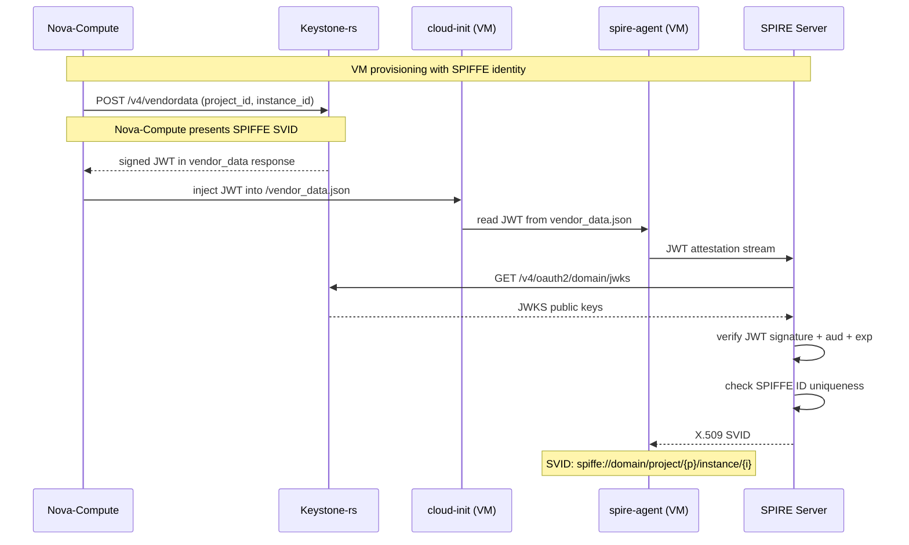
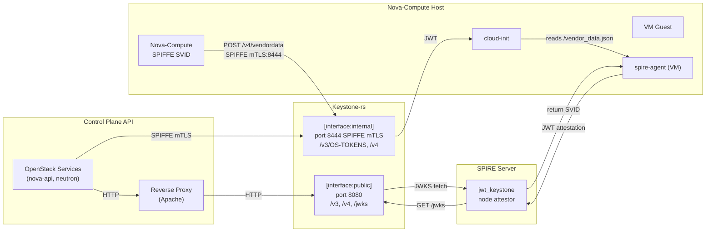

# SPIRE Integration Plan: Keystone-rs + OpenStack Workload Identity

**Status:** Draft

This document outlines the implementation plan for integrating SPIRE workload
identity into an OpenStack control plane running keystone-rs. The plan is broken
into independently-mergeable phases, each building on preceding work.

The core idea: Nova injects a keystone-rs signed JWT into a VM's vendor_data.
The VM uses a custom SPIRE node attestor plugin to auto-attest (no
pre-registered entries), receiving a project-scoped SPIFFE SVID. OpenStack API
services use SPIFFE mTLS for the keystonemiddleware back-channel to keystone-rs,
and eventually transition to offline JWT validation.

## External Dependencies

This plan spans three repositories:

| Repo                                                                     | What It Contributes                                                                 |
| ------------------------------------------------------------------------ | ----------------------------------------------------------------------------------- |
| `openstack-experimental/keystone` (keystone-rs)                          | Vendor data JWT API, internal SPIFFE interface, mapping rules                       |
| `openstack/python-keystonemiddleware` (Gerrit, **two separate changes**) | Change #1: `auth_token` filter SPIFFE mTLS transport. Change #2: JWT offline filter |
| New Go repo: `spire-jwt-keystone-plugins`                                | Custom SPIRE node attestor plugins (agent + server)                                 |

Two supporting DevStack plugins are also needed:

| Plugin                             | Purpose                                                           |
| ---------------------------------- | ----------------------------------------------------------------- |
| `devstack-plugin-spire`            | Install and configure SPIRE server + agents                       |
| keystone-rs `devstack/` (existing) | Already handles keystone-rs + OPA; extended for SPIRE integration |

## Architecture Overview

Services connect to keystone-rs via two interfaces:

- **`[interface:public]`** (port 8080) — plaintext HTTP, behind reverse proxy
  (Apache). Serves /v3, /v4, and JWKS to unauthenticated clients.
- **`[interface:internal]`** (port 8444) — SPIFFE mTLS. Used by OpenStack
  services (nova-api, neutron) for the keystonemiddleware back-channel.

```mermaid
c4Diagram
    Person(devops, "DevOps Operator", "Manages infrastructure")
    System(openstack, "OpenStack Services", "nova-api, neutron API")
    System(apache, "Reverse Proxy", "Apache / nginx")
    System(keystone, "Keystone-rs", "Authentication and authorization")
    System(nova_compute, "Nova-Compute", "Runs VMs on compute nodes")
    System(spire_srv, "SPIRE Server", "Workload identity management")
    System_VM(vm, "VM Guest", "Linux VM running spire-agent")
    Boundary(ks_boundary, "Keystone-rs") {
        System_Pub(pub, "[interface:public]", "Port 8080\n/v3, /v4, /jwks")
        System_Int(int, "[interface:internal]", "Port 8444 SPIFFE mTLS\n/v3/OS-TOKENS, /v4")
    }
    Boundary(sp_boundary, "SPIRE Server") {
        Component(jp, "jwt_keystone node attestor", "Serves JWT attestation")
    }
    Rel(openstack, pub, "HTTP")
    Rel(apache, pub, "HTTP")
    Rel(openstack, int, "SPIFFE mTLS")
    Rel(pub, jp, "JWKS fetch (HTTP)")
    Rel(nova_compute, int, "POST /v4/vendordata\nSPIFFE mTLS")
    Rel(vm, jp, "JWT attestation")
    Rel(jp, pub, "GET /v4/oauth2/domain/jwks")
```

**VM attestation flow:**



**Control plane data flow:**



## Phases

### Phase 1: SPIRE DevStack Plugin

**Goal:** SPIRE server and agents running in devstack, with trust domain, CA
bundle distribution, and pre-registered service entries.

**Prerequisites:** None.

**New files:**

| File                                                    | Purpose                                |
| ------------------------------------------------------- | -------------------------------------- |
| `tools/devstack-plugin-spire/plugin.sh`                 | DevStack plugin hooks                  |
| `tools/devstack-plugin-spire/lib/spire`                 | Install/configure/start/stop functions |
| `tools/devstack-plugin-spire/settings`                  | `enable_service spire` declaration     |
| `tools/devstack-plugin-spire/etc/spire-server.conf.tpl` | Server config template                 |
| `tools/devstack-plugin-spire/etc/spire-agent.conf.tpl`  | Agent config template                  |

**Details:**

The plugin follows the same pattern as the existing `devstack/plugin.sh` —
`setup_start_spire` (install binaries from SPIRE releases, generate config),
`stop_spire`, `do_cleanup`.

Server config uses `join_token` node attestor for single-node devstack
(development only; production would use `x509pop`, `k8s_sat`, etc.). The agent
uses join token for insecure bootstrap, same as `tools/start-spire.sh`.

The plugin pre-registers service entries for nova-api, nova-compute, and
neutron, mapping each to a well-known SPIFFE ID:

| Service      | SPIFFE ID                                              |
| ------------ | ------------------------------------------------------ |
| Keystone-rs  | `spiffe://{trust_domain}/ns/openstack/sa/keystone`     |
| Nova API     | `spiffe://{trust_domain}/ns/openstack/sa/nova-api`     |
| Nova Compute | `spiffe://{trust_domain}/ns/openstack/sa/nova-compute` |
| Neutron      | `spiffe://{trust_domain}/ns/openstack/sa/neutron`      |

The SPIRE server CA bundle is copied to `$KEYSTONE_CONF_DIR/spiffe/ca.crt` so
keystone-rs and Python services can reference it.

**Configuration added to `local.conf`:**

```ini
[[local|localrc]]
enable_plugin spire https://github.com/openstack-experimental/keystone \
                 --branch <branch> \
                 --subdirectory tools/devstack-plugin-spire
enable_service spire
SPIRE_TRUST_DOMAIN=cloud.trust.domain
```

**Verification:**

```bash
# After stack.sh completes:
spire-server entry show -socketPath /tmp/spire-ci-test-harness/server.sock
# Should show pre-registered service entries for nova-api, nova-compute, neutron

# Verify agent health:
spire-agent healthcheck -socketPath /tmp/spire-ci-test-harness/agent.sock
```

---

### Phase 2: Vendor Data JWT API (keystone-rs)

**Goal:** keystone-rs exposes a new endpoint that signs a JWT per VM instance.
The JWT is signed with the existing domain OAuth2 signing key and contains
instance-scoped claims suitable for SPIFFE SVID construction.

**Prerequisites:** Phase 1 (SPIRE available for integration testing).

**Changes to keystone-rs:**

| File                                       | Purpose                                      |
| ------------------------------------------ | -------------------------------------------- |
| `crates/keystone/src/api/v4/vendordata.rs` | Handler: `POST /v4/vendordata`               |
| `crates/keystone/src/api/v4/mod.rs`        | Module wiring into `/v4` router              |
| `crates/core-types/src/vendordata.rs`      | Request/response types                       |
| `crates/core/src/api/auth.rs`              | JWT signing method using ADR 0026 JWKS key   |
| `crates/core/src/oauth2_key.rs`            | Shared signing utility (extracted for reuse) |
| `policy/vendordata/create.rego`            | OPA policy rule                              |
| `doc/src/adr/0033-vendor-data-jwt.md`      | ADR for the endpoint design                  |

**Endpoint contract:**

**`POST /v4/vendordata`**

Auth: Nova-compute presents its SPIFFE SVID. Keystone-rs authenticates and
authorizes the request. Nova's `vendor_data_url` makes a POST request with
instance metadata in the body (`project_id`, `instance_id`).

Request body (sent by Nova, per `vendor_data_url` spec). Nova includes
project_id and instance_id in the POST body:

```json
{
  "project_id": "a1b2c3d4",
  "instance_id": "550e8400-e29b-41d4-a716-446655440000"
}
```

Response body (`201 Created`):

```json
{
  "spiffe_jwt": {
    "algorithm": "ES256",
    "jti": "550e8400-e29b-41d4-a716-446655440000",
    "token": "<JWT string>",
    "expires_at": "2026-08-12T10:30:00Z"
  }
}
```

The JWT payload (after base64url decoding):

```json
{
  "iss": "https://keystone:8444/v4/oauth2/default",
  "aud": "spiffe-attestation",
  "exp": 1723456800,
  "iat": 1723456500,
  "jti": "550e8400-e29b-41d4-a716-446655440000",
  "sub": "vm:550e8400-e29b-41d4-a716-446655440000",
  "openstack": {
    "project_id": "a1b2c3d4",
    "instance_id": "550e8400-e29b-41d4-a716-446655440000",
    "spiffe_role": "compute-vm"
  }
}
```

**Key design decisions:**

- Signs with the **same JWKS domain signing key** already used for OAuth2 tokens
  (ADR 0026). The `/v4/oauth2/{domain_id}/jwks` endpoint serves the public key.
  No separate cryptographic key needed.
- Fixed `aud: "spiffe-attestation"` prevents JWT misuse for any other purpose.
- Short TTL range (`ttl_seconds`, accepted range 60–600, default 300). 60
  seconds is too tight for cold VM boot (Nova calls API → metadata publishes →
  VM boots → cloud-init reads → spire-agent runs). The SPIRE server plugin
  enforces expiry during attestation regardless. Cap at
  `[oauth2] access_token_lifetime_minutes` (15 min default) as a safety bound.
- `jti = instance_id` — the `jti` claim is set to the `instance_id` from the
  request. The SPIRE server plugin checks the constructed SPIFFE ID
  (`spiffe://domain/project/{pid}/instance/{iid}`) against the registration
  entry store for duplicates, rejecting if an entry already exists for that
  SPIFFE URI. The check is keyed on the full SPIFFE ID, not the `jti` claim.
- The `expires_at` field in the HTTP response is the human-readable ISO 8601
  equivalent of the JWT `exp` claim. The actual expiry validation uses the unix
  timestamp in the JWT payload itself.
- The endpoint lives on the **internal interface** (port 8444, SPIFFE mTLS)
  since Nova-compute authenticates with its SPIFFE SVID. Nova's
  `vendor_data_url` call path uses keystonemiddleware for the HTTP call, which
  attaches the SVID.
- `project_id` and `instance_id` come from Nova's POST body — no Nova API lookup
  needed. Keystone-rs simply uses these to construct the JWT claims.

**Unit tests (minimum 3 per handler convention from AGENTS.md):**

1. Valid Nova-compute SVID + positive policy → `201 Created`, JWT returned
2. Valid SVID + negative policy (wrong scope) → `403 Forbidden`
3. Invalid/missing SVID → `401 Unauthorized`

**Verification:**

```bash
# From a SPIRE-attested nova-compute workload:
curl -X POST --cert /tmp/spiffe/tls.crt \
     --key /tmp/spiffe/tls.key \
     --cacert /etc/spire/conf/server/ca.crt \
     https://localhost:8444/v4/vendordata \
     -H "Content-Type: application/json" \
     -d '{"project_id": "default", "instance_id": "test-123"}'
# The response `expires_at` is the human-readable ISO 8601 echo of the
# unix-timestamp `exp` claim inside the JWT. Verification uses the JWT payload `exp`.
```

---

### Phase 3: keystone-rs Internal SPIFFE Listener Configuration

**Goal:** OpenStack services connect to keystone-rs via the internal SPIFFE mTLS
interface, presenting SPIFFE x509 SVIDs. Services are mapped to Keystone
identities through the ADR 0020 `SpiffeTrustResource` mapping engine.

**Prerequisites:** Phase 1 (SPIRE trust domain available).

**Changes to keystone-rs:**

| File                                  | Purpose                                                                                        |
| ------------------------------------- | ---------------------------------------------------------------------------------------------- |
| `crates/keystone/src/bin/keystone.rs` | Wire internal SPIFFE listener to REST router (already exists for storage gRPC, extend to REST) |
| `crates/config/src/interface.rs`      | `interface_internal` with `listener.type = spiffe` is already supported; no changes needed     |
| `crates/core/src/api/auth.rs`         | SVID extraction → `SpiffeTrustResource` → mapping engine                                       |

**Current state:** The keystone-rs binary already supports
`ListenerConfig::Spiffe` on the `interface_internal`
(`crates/keystone/src/bin/keystone.rs:1420-1446`). SPIFFE TLS infrastructure for
REST is in `spiffe_tls.rs` (`start_axum_app`), trust domain validation is in
`spiffe_common.rs`. The `interface_internal` hard-restricts to SPIFFE-only. What
this phase adds is:

1. Making the internal SPIFFE interface serve the REST API router (currently the
   internal SPIFFE interface may not be wired to the REST router, only to
   storage gRPC — verify and wire if missing)
2. Documenting the `interface_internal` config section for service-to-service
   mTLS

**Listener configuration (`[interface:internal]` section):**

```ini
[interface:internal]
bind_host = 0.0.0.0
bind_port = 8444
listener.type = spiffe
listener.trust_domains = cloud.trust.domain
```

The keystone-rs process itself presents a SPIFFE SVID (fetched from the local
SPIRE agent during startup, via `spiffe-rustls`). Incoming connections present
their SVID. The server validates:

1. SVID was issued by a CA within the trust domain (via `spiffe-rustls`
   authorizer)
2. SVID is not expired
3. Authorization is decided by the mapping engine, not listener-level filtering

Authentication context is extracted from the SVID URI:

- `spiffe://cloud.trust.domain/ns/openstack/sa/nova-api` → service identity
- `spiffe://cloud.trust.domain/project/{pid}/instance/{iid}` → VM workload

These are fed through the ADR 0020 mapping engine with claim source `spiffe`:
`spiffe.id` (full SPIFFE URI), `spiffe.trust_domain` (trust domain name).

**Verification:**

```bash
# Verify the keystone-rs internal SPIFFE listener serves REST API:
curl --cert /tmp/spiffe/tls.crt \
     --key /tmp/spiffe/tls.key \
     --cacert /etc/spire/conf/server/ca.crt \
     https://localhost:8444/v3/users
# keystone-rs logs should show:
# "SpiffeTlsAccepted(spiffe://cloud.trust.domain/...)"
```

---

### Phase 4: Patched keystonemiddleware (Gerrit, External)

**Goal:** OpenStack Python services use SPIFFE mTLS for the keystonemiddleware
back-channel to keystone-rs. JWT access tokens can be validated offline without
a back-channel call.

**Prerequisites:** Phase 1 (SPIRE), Phase 3 (keystone-rs mTLS interface).

**Target repo:** `openstack/python-keystonemiddleware` on Gerrit.

**Two separate Gerrit changes.** These are orthogonal and landed independently:

#### Change 4.1: SPIFFE mTLS transport (auth_token)

| File                                      | Purpose                                 |
| ----------------------------------------- | --------------------------------------- |
| `keystonemiddleware/_spiffe_transport.py` | SPIFFE SVID fetcher + HTTP transport    |
| `keystonemiddleware/auth_token.py`        | New `spiffe_agent_socket` config option |

**Behavior:**

1. On startup, keystonemiddleware connects to the SPIRE agent socket
2. Fetches a workload X.509 SVID (short-lived, SPIRE-managed rotation)
3. Wraps `requests.Session` with `urllib3` TLS config using SVID as client cert
4. All back-channel calls (`/v3/OS-TOKENS`, user info, project info) go over
   mTLS

#### Change 4.2: JWT offline validation filter (independent Paste filter)

| File                                           | Purpose                                   |
| ---------------------------------------------- | ----------------------------------------- |
| `keystonemiddleware/jwt_offline.py`            | ADR 0026 §6 `KeystoneNativeJwtMiddleware` |
| `setup.cfg`                                    | Paste filter entry point                  |
| `doc/source/conf/configuration/auth_token.rst` | Documentation                             |

**Behavior:**

The `KeystoneNativeJwtMiddleware` is a separate Paste filter that sits **in
front of** `keystonemiddleware.auth_token`. It intercepts
`Authorization: Bearer {JWT}` requests:

1. Fetches JWKS from `keystone_jwks_url` (cached with 300s TTL)
2. Verifies JWT signature (ES256/RS256)
3. Checks `aud` matches `expected_audience`
4. Checks `iss` against `expected_issuers` allowlist
5. Checks `exp`, `nbf`, and `jti` against revocation list
6. If valid: injects `openstack_context` into WSGI environment, short-circuits
   past `auth_token`
7. If not a JWT: falls through to the standard `auth_token` filter (Fernet
   validation)

**New keystonemiddleware configuration (`keystone_authtoken` section):**

```ini
[keystone_authtoken]
www_authenticate_uri = https://keystone:8444/v3
auth_url = https://keystone:8444/v3

# --- NEW: SPIFFE mTLS transport (Change 4.1) ---
spiffe_agent_socket = /tmp/spire-ci-test-harness/agent.sock

# --- NEW: JWT offline validation (Change 4.2) ---
keystone_jwks_url = http://keystone:8080/v4/oauth2/default/jwks
keystone_signing_algorithm = ES256
keystone_expected_audience = openstack-apis:default
keystone_expected_issuers = https://keystone:8444/v4/oauth2/default
```

**Paste Deploy wiring (`api-paste.ini`):**

```ini
[pipeline:osapi_compute]
pipeline = keystonemiddleware_jwt_offline authtoken keystonecontext oscomputeapp

[filter:keystonemiddleware_jwt_offline]
paste.filter_factory = keystonemiddleware.jwt_offline:filter_factory
jwks_url = http://keystone:8080/v4/oauth2/default/jwks
signing_algorithm = ES256
expected_audience = openstack-apis:default
```

**Verification in devstack:**

Add to `local.conf`:

```ini
python_keystonemiddleware_git = https://github.com/<user>/python-keystonemiddleware
python_keystonemiddleware_branch = spiffe-mtls-transport
# For JWT offline filter:
python_keystonemiddleware_git = https://github.com/<user>/python-keystonemiddleware
python_keystonemiddleware_branch = jwt-offline-validation
```

After `stack.sh`:

```bash
# Check nova-api logs for SVID loading:
grep -i "SVID loaded from" /var/log/nova/nova-api.log
# Should show SVID fetch and mTLS connections

# Verify JWT offline validation works:
# Get a JWT from keystone-rs OAuth2 /token endpoint, then:
curl -H "Authorization: Bearer <JWT>" http://localhost:8774/v2.1/servers/detail
# Should succeed without keystone-rs receiving the validation request
```

---

### Phase 5: SPIRE JWT Node Attestor Plugins (External Go Repo)

**Goal:** VMs boot with a keystone-rs JWT in vendor_data, auto-attest to SPIRE
server, and receive a project-scoped SPIFFE SVID.

**Prerequisites:** Phase 1 (SPIRE), Phase 2 (vendor data JWT + JWKS).

**Target repo:** New Go repository `spire-jwt-keystone-plugins`.

**Plugin architecture:**

SPIRE's node attestor interface requires both a server plugin (verifies
attestation data, constructs identity) and an agent plugin (reads credential,
streams to server).

**Server plugin (`jwt_keystone_attestor`):**

| File                                | Purpose                                                    |
| ----------------------------------- | ---------------------------------------------------------- |
| `server/jwt_keystone/main.go`       | `NodeAttestor` interface implementation                    |
| `server/jwt_keystone/jwks_cache.go` | JWKS fetcher + validator (HTTP GET, 300s cache, ES256)     |
| `server/jwt_keystone/config.go`     | SPIFFE config for SPIRE plugin (`Config`, `New`, `Attest`) |

Config:

```json
{
  "jwks_url": "http://keystone:8080/v4/oauth2/default/jwks",
  "audience": "spiffe-attestation",
  "trust_domain": "cloud.trust.domain",
  "spiffe_path_prefix": "/project",
  "tls": {
    "ca_file": "/etc/spire/conf/server/ca.crt"
  }
}
```

`Attest` flow:

1. Receive raw JWT bytes from attestation stream
2. Parse JWT, extract `kid`
3. Fetch JWKS from keystone-rs (300s cache, per ADR 0026 §3)
4. Verify signature (ES256, matching keystone-rs `signing_algorithm`)
5. Verify `aud == "spiffe-attestation"`, verify `exp`
6. Construct target SPIFFE ID, then check for duplicates against SPIFFE
   registration DB — query entries matching
   `spiffe://domain/project/{pid}/instance/{iid}`. Reject if an entry for that
   SPIFFE URI already exists (prevents replay of the same JWT). The check is
   keyed on the SPIFFE ID, not the JWT `jti` claim.
7. Construct SPIFFE ID:
   `spiffe://cloud.trust.domain/project/{project_id}/instance/{instance_id}`
8. Return selectors:
   - `jwt_ks:project:{project_id}`
   - `jwt_ks:instance:{instance_id}`
   - `jwt_ks:role:{spiffe_role}`

**Agent plugin (`jwt_keystone_attestor`):**

| File                           | Purpose                                 |
| ------------------------------ | --------------------------------------- |
| `agent/jwt_keystone/main.go`   | `NodeAttestor` interface implementation |
| `agent/jwt_keystone/config.go` | SPIFFE plugin config                    |

Config:

```json
{
  "jwt_path": "/var/run/nova/vendor_data.json",
  "jwt_key": "spiffe_jwt.token"
}
```

The `jwt_path` is the vendor_data.json file injected by nova-compute. On the
compute host, `/var/run/nova/vendor_data.json` is the standard location. The
`jwt_key` is a dotted path into nested JSON: the plugin reads
`response["spiffe_jwt"]["token"]`. The key name matches the
`vendor_data_key_name` config in Nova.

`Attest` flow:

1. Read `jwt_path` (vendor_data.json injected by nova-compute)
2. Extract JWT string from the JSON key `jwt_key`
3. Return raw JWT bytes as attestation data
4. SPIRE agent streams it to the server via the node attestor channel

**Build:**

```makefile
# Makefile
server-plugin:
	go build -buildmode=plugin -o dist/jwt_keystone_server.nodeattestor.so \
		server/jwt_keystone/main.go

agent-plugin:
	go build -buildmode=plugin -o dist/jwt_keystone_agent.nodeattestor.so \
		agent/jwt_keystone/main.go
```

**Verification:**

```bash
# Boot a VM with vendor_data containing a JWT from Phase 2 endpoint
# SPIRE server should log:
# "NodeAttestor (jwt_keystone): Successfully attested node
#   spiffe://cloud.trust.domain/project/{pid}/instance/{iid}"

# Inside the VM, verify SVID:
curl --unix-socket /tmp/spire-ci-test-harness/agent.sock \
  -H 'Content-Type: application/json' \
  -d '{"spiffe_id": "spiffe://cloud.trust.domain/test"}' \
  http://localhost/WorkloadAPI/FetchX509Certificate
# SVID SAN should be: spiffe://cloud.trust.domain/project/.../instance/...
```

---

### Phase 6: Integration, Policy Mapping, and DevStack Full Stack

**Goal:** End-to-end working deployment in devstack. Nova-compute injects JWT
into vendor_data, VM attests to SPIRE, gets SVID, calls OpenStack APIs.

**Endpoint location:** The `/v4/vendordata` endpoint lives on the **internal
interface** (port 8444, SPIFFE mTLS) so Nova-compute authenticates with its
SPIFFE SVID. Nova's POST body includes `project_id` and `instance_id` — no Nova
API lookup needed.

**keystone-rs SPIFFE mapping rules (ADR 0020 configuration):**

A mapping ruleset that handles the two categories of incoming SPIFFE identities:

**Service accounts (static mapping):**

```json
POST /v4/rbac/mapping/rulesets
{
  "ruleset": {
    "name": "openstack-service-accounts",
    "priority": 100,
    "rules": [
      {
        "name": "nova-api",
        "matches": {
          "all": [
            {"claim": "spiffe.id", "match": "exact",
             "value": "spiffe://cloud.trust.domain/ns/openstack/sa/nova-api"}
          ]
        },
        "binding": {
          "identity_mode": "local",
          "user_id": "svc-nova-api",
          "user_name": "nova-api",
          "roles": ["service"]
        }
      },
      {
        "name": "neutron",
        "matches": {
          "all": [
            {"claim": "spiffe.id", "match": "exact",
             "value": "spiffe://cloud.trust.domain/ns/openstack/sa/neutron"}
          ]
        },
        "binding": {
          "identity_mode": "local",
          "user_id": "svc-neutron",
          "user_name": "neutron",
          "roles": ["service"]
        }
      }
    ]
  }
}
```

**VM instance accounts (dynamic/ephemeral mapping):**

The `compute-vm` role is assigned to ephemeral VM identities. It grants VMs
limited API access scoped to their project. The SPIFFE ID contains the project
and instance scope, so the mapping engine can extract these from the URI.

```json
{
  "ruleset": {
    "name": "nova-vm-instances",
    "priority": 200,
    "rules": [
      {
        "name": "vm-instance",
        "matches": {
          "all": [
            {
              "claim": "spiffe.id",
              "match": "prefix",
              "value": "spiffe://cloud.trust.domain/project/"
            }
          ]
        },
        "binding": {
          "identity_mode": "ephemeral",
          "user_name": "${claims.spiffe.id}",
          "project_id": "${claims.jwt_ks_project}",
          "roles": ["compute-vm"]
        }
      }
    ]
  }
}
```

The `roles`: `[\"compute-vm\"]` assignment grants VMs a default
limited-privilege role scoped to their project. The `spiffe.id` claim in the
binding resolves to the full SPIFFE URI, which is extracted into user_name. The
`jwt_ks_project` claim comes from the `jwt_ks:project:{project_id}` selector on
the SVID.

**Full `local.conf` for end-to-end devstack deployment:**

```ini
[[local|localrc]]
ADMIN_PASSWORD=password
DATABASE_PASSWORD=password
RABBIT_PASSWORD=password
SERVICE_PASSWORD=$ADMIN_PASSWORD

# Core OpenStack services
enable_service mysql,rabbit,key,n-api,n-crt,n-sch,c-sch,c-api,neutron-server
disable_service q-svc
disable_service horizon

# Keystone-rs (replaces python keystone)
enable_plugin key-rs https://github.com/openstack-experimental/keystone
enable_service key-rs

# SPIRE
enable_plugin spire https://github.com/openstack-experimental/keystone \
                 --branch main \
                 --subdirectory tools/devstack-plugin-spire
enable_service spire
SPIRE_TRUST_DOMAIN=cloud.trust.domain

# Nova: fetch vendor_data JWT from keystone-rs per-instance
nova_conductor_config += [[nova_conductor]]
nova_conductor_config += vendor_data_url = https://keystone:8444/v4/vendordata
nova_conductor_config += vendor_data_key_name = spiffe_jwt
keystone_rss_internal_config += [keystone]

# Patched keystonemiddleware (two separate Gerrit changes)
python_keystonemiddleware_git=https://github.com/<user>/python-keystonemiddleware
python_keystonemiddleware_branch=spiffe-mtls-transport
# After landing the JWT offline filter, update to that branch:
# python_keystonemiddleware_branch=jwt-offline-validation
```

The `vendor_data_url` option causes Nova-compute to POST the instance metadata
(`project_id`, `instance_id`) to the configured URL. The response body becomes
the content of `/vendor_data.json` in the VM guest. The response JSON must match
the key expected by Nova's `vendor_data_key_name` (default `spiffe_jwt`). No
Nova code changes required.

**Integration test scenarios:**

| #   | Scenario                               | Expected Outcome                                                      |
| --- | -------------------------------------- | --------------------------------------------------------------------- |
| T1  | Boot VM, check vendor_data has JWT     | JWT present, decodes, claims match                                    |
| T2  | VM spire-agent attests using JWT       | SVID issued: `spiffe://domain/project/{pid}/instance/{iid}`           |
| T3  | VM workload calls nova-api with SVID   | 200, SVID mapped to ephemeral identity                                |
| T4  | Nova-api talks to keystone-rs via mTLS | Back-channel encrypted + mTLS authenticated                           |
| T5  | JWT-bearing request to nova-api        | Validated offline by keystonemiddleware_jwt_offline, no keystone call |
| T6  | Fernet token request to nova-api       | Falls through to standard auth_token, back-channel over mTLS          |
| T7  | Re-attest same instance_uuid           | Rejected by SPIRE server plugin (duplicate check)                     |

---

## Token Validation Migration Path

The architecture supports three coexisting token validation modes. Services can
migrate independently:

### Mode A — Legacy (current devstack default)

```
Service ──plaintext HTTP──▶ keystone-rs /v3/OS-TOKENS
keystone-rs validates Fernet token
```

No SPIRE. No mTLS. Standard keystonemiddleware behavior.

### Mode B — SPIFFE mTLS + Fernet (interim phase, after Phase 3-4)

```
Service ──SPIFFE mTLS──▶ keystone-rs [interface:internal] /v3/OS-TOKENS
(transport encrypted, caller authenticated via SVID)
keystone-rs validates Fernet token, returns metadata
```

keystonemiddleware still calls keystone-rs on every request, but the channel is
mTLS through the internal SPIFFE interface. Phase 4.1 landed on Gerrit, services
gradually enable `spiffe_agent_socket`.

### Mode C — JWT offline validation (final state, after Phase 4.2)

```
┌────────────────────────────────────────────┐
│ Service                                    │
│ keystonemiddleware_jwt_offline:            │
│  1. Verify JWT signature from cached JWKS  │
│  2. Check aud, iss, exp, jti              │
│  3. Inject context, serve request          │
│                                            │
│ No call to keystone-rs needed.             │
└────────────────────────────────────────────┘
```

keystone-rs issues stateless JWT access tokens (ADR 0026). Token validation is
done in-memory. keystone-rs is only contacted for JWKS cache refresh (300s TTL).
This is the **final state** for data-path token validation.

**Transition timeline:**

| Step | Action                                                                   |
| ---- | ------------------------------------------------------------------------ |
| 1    | Deploy Phase 1-3: SPIRE + keystone-rs internal SPIFFE interface          |
| 2    | Land Phase 4.1: keystonemiddleware SPIFFE mTLS transport change          |
| 3    | Gradually enable `spiffe_agent_socket` per service → Mode B              |
| 4    | Land Phase 4.2: keystonemiddleware JWT offline filter change             |
| 5    | Enable ADR 0026 OAuth2 JWT tokens on keystone-rs                         |
| 6    | Enable `keystone_jwks_url` per service → Mode C for JWT-bearing requests |
| 7    | (Optional) Remove Fernet validation → Mode C only                        |

---

## Security Considerations

| Threat                                       | Mitigation                                                                                                                                            |
| -------------------------------------------- | ----------------------------------------------------------------------------------------------------------------------------------------------------- |
| **JWT replay for VM attestation**            | Short TTL (300s default, max 600s), SPIFFE ID uniqueness check in SPIRE plugin, fixed `aud: spiffe-attestation`                                       |
| **keystone-rs JWKS key compromise**          | Domain-isolated keys (ADR 0026), emergency rotation with jti revocation list, multi-generational key publishing                                       |
| **Downstream service impersonation**         | SPIFFE mTLS — only workloads that hold a valid SVID for their identity can authenticate as that service                                               |
| **Plaintext token validation (pre-Phase 3)** | Phase 3 enables SPIFFE mTLS internally; Phase 4.1 rolls out keystonemiddleware mTLS transport; Phase 4.2 eliminates back-channel calls for JWT tokens |
| **SPIRE CA exposure**                        | SPIFFE CA is ephemeral, auto-rotates with SPIRE CA rotation, not persisted at rest                                                                    |
| **Duplicate VM attestation**                 | SPIRE server plugin checks target SPIFFE ID against registration entries before attesting                                                             |

---

## Risk Register

| Risk                                                     | Likelihood | Impact | Mitigation                                                                                                                                                                                                             |
| -------------------------------------------------------- | ---------- | ------ | ---------------------------------------------------------------------------------------------------------------------------------------------------------------------------------------------------------------------- |
| SPIRE agent plugin fails to load in VM                   | Medium     | High   | Fallback: standard SPIRE node attestor + manual entry creation. The custom plugin doesn't block other VMs.                                                                                                             |
| keystone-rs internal SPIFFE listener breaks API services | Low        | High   | SPIFFE listener runs on the internal interface (separate port from public). Legacy HTTP services continue using public interface (5000/8080). Internal interface can be enabled independently of the public interface. |
| keystonemiddleware Gerrit change rejected                | Medium     | High   | The JWT offline validation filter can work as a standalone pip-installable package outside keystonemiddleware, keeping the mTLS transport as a separate concern.                                                       |
| JWKS cache stale during key rotation                     | Low        | Medium | 300s cache max, matches JWKS Cache-Control. ADR 0026 multi-generational key publishing (active + previous) bridges the gap.                                                                                            |
| Nova vendordata injection fails                          | Low        | High   | VM falls back to non-SPIRE mode. The JWT API is called early in VM boot; if it fails, the VM can still function without SPIRE identity (graceful degradation).                                                         |

---

## Deliverables

| #   | Deliverable                                     | Repo                                     | Files                                                                                                             |
| --- | ----------------------------------------------- | ---------------------------------------- | ----------------------------------------------------------------------------------------------------------------- |
| D1  | SPIRE DevStack plugin                           | keystone-rs                              | `tools/devstack-plugin-spire/`                                                                                    |
| D2  | Vendor data JWT API                             | keystone-rs                              | `crates/keystone/.../vendordata/`, `crates/core/...`, `policy/`, ADR                                              |
| D3  | keystone-rs internal SPIFFE interface           | keystone-rs                              | `crates/keystone/src/server/listener/spiffe_tls.rs`, `crates/keystone/src/bin/keystone.rs` (config documentation) |
| D4  | Patched keystonemiddleware — mTLS transport     | python-keystonemiddleware (Gerrit)       | `_spiffe_transport.py`, `auth_token.py`                                                                           |
| D4b | Patched keystonemiddleware — JWT offline filter | python-keystonemiddleware (Gerrit)       | `jwt_offline.py`, `setup.cfg`                                                                                     |
| D5  | SPIRE JWT node attestor plugins                 | spire-jwt-keystone-plugins (new Go repo) | `server/jwt_keystone/`, `agent/jwt_keystone/`                                                                     |
| D6  | SPIFFE identity mapping rules                   | keystone-rs doc                          | Configuration examples, ADR 0020 mapping rulesets                                                                 |
| D7  | Full devstack `local.conf` + install guide      | keystone-rs doc                          | `doc/src/install/index.md` update                                                                                 |
