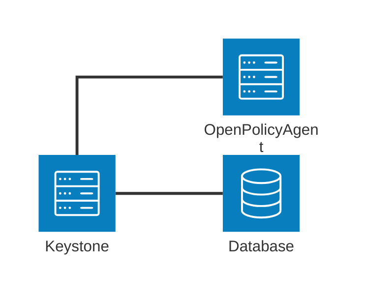

# Architecture

Keystone requires 2 additional components to run:

- database (the same as the py-keystone uses)

- OpenPolicyAgent, that implements API policy enforcement

## Database

Python keystone uses the sqlalchemy as ORM and the migration tool. It cannot be
used from Rust efficiently, therefore keystone-ng uses the `sea-orm` which
provides async support natively and also allows database type abstraction.
Current development focuses on the PostgreSQL database. The MySQL should be
supported, but is not currently tested against.

New API and resources are being added. This requires database changes. sea-orm
also comed with the migration tools. However there is a slight difference
between sqlalchemy and sea-orm. The later suggests doing database schema first.
In the next step object types are created out of the database. That means that
the database migration must be written first and cannot be automatically
generated from the code (easily, but there is a way). Current migrations do not
create database schema that is managed by the py-keystone. Therefore in order to
get a fully populated database schema it is necessary to apply
`keystone-manage db_sync` and `keystone-db up` independently.

Target of the keystone-ng is to be deployed in pair with the python keystone of
"any" version. Due to that it is not possible to assume the state of the
database, nor to apply any changes to the schema manaaged by the py-keystone. A
federation rework assumes model change. To keep it working with the
python-keystone artificial table entries may be created (in the example when a
new identity provider is being created automatically sanitized entries are being
added for the legacy identity provider and necessary protocols) A federation
rework assumes model change. To keep it working with the python-keystone
artificial table entries may be created (in the example when a new identity
provider is being created automatically sanitized entries are being added for
the legacy identity provider together with necessary idp protocols).

## Fernet

keystone-ng uses the same mechanism for tokens to provide compatibility. The
fernet-keys repository must be provided in the runtime (i.e. by mounting them as
a volume into the container). There is no tooling to create or rotate keys as
the py-keystone does.
