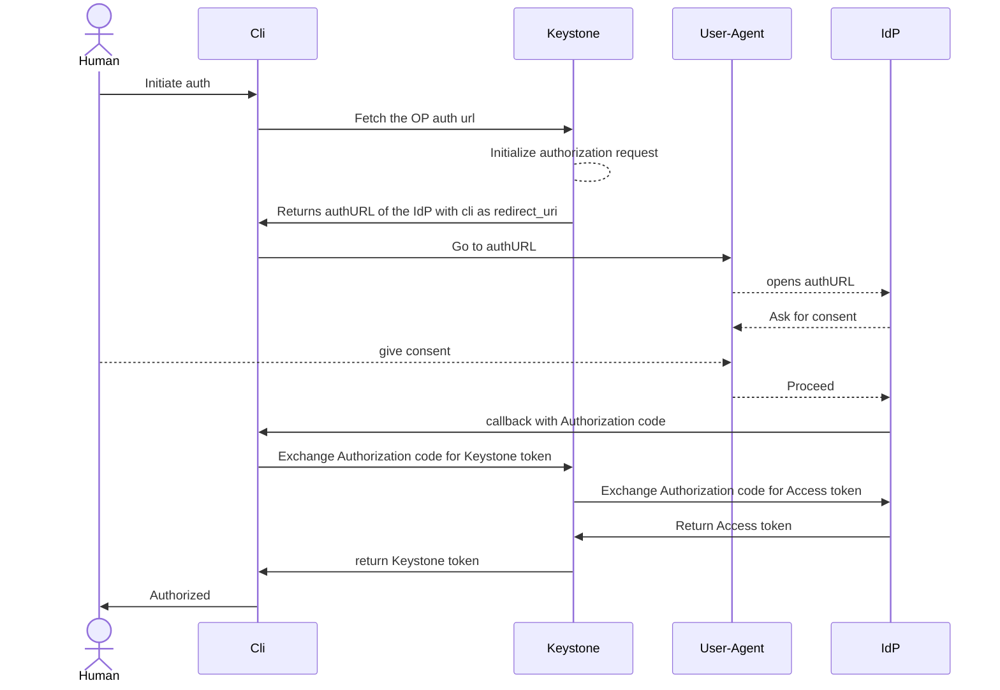

# Authentication using the Authorization Code flow and Keystone serving as RP

## TLDR

The user client (cli) sends authentication request to Keystone specifying the
identity provider, the preferred attribute mapping and optionally the scope (no
credentials in the request). In the response the user client receives the time
limited URL of the IDP that the user must open in the browser. When
authentication in the browser is completed the user is redirected to the
callback that the user also sent in the initial request (most likely on the
localhost). User client is catching this callback containing the OIDC
authorization code. Afterwards this code is being sent to the Keystone together
with the authentication state and the user receives regular scoped or unscoped
Keystone token.

## User domain mapping

Long years of working with multiple CSPs showed that there is no single way how
users are stored in external IdPs. Sometimes it is desired to have a single
"realm" with all users of the cloud differentiated by certain attributes or
group memberships. Or every OpenStack domain is mapped as a dedicated "realm" in
which case users are more isolated from each other. Or every customer is having
a physically different IdP.

A Keystone identity provider can be bound to a single domain by setting the
domain-id attribute on it. This means all users federated from such IDP would be
placed in the specified domain.

A Keystone attribute mapping can be dedicated for a certain domain by setting
the domain-id attribute. In such case all users authenticating using such
attribute mapping would be placed in the specified domain. This makes it
possible for the users to obtain memberhip in other domain and should therefore
be used with extra care and only when absolutely necessary.

The ultimate flexibility of having a single IdP for multiple domains is by
specifying the claim attribute that specifies domain the user should belong to.
This is implemented by using the `domain-id-claim` attribute of the mapping.
Authentication with the claim missing is going to be rejected.
