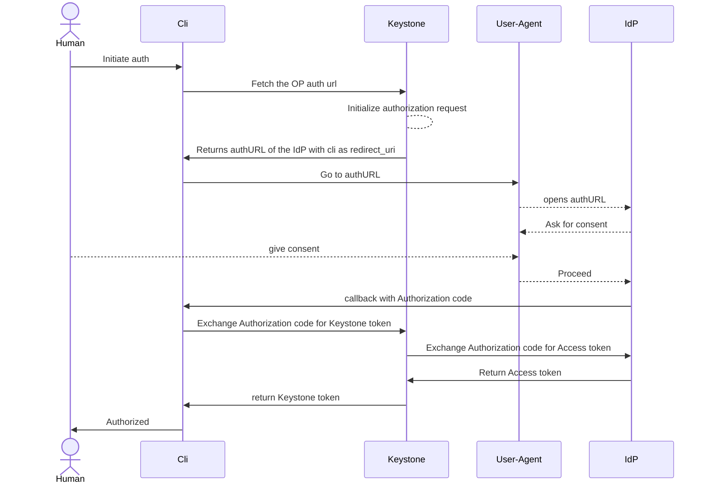

# Authentication using the Authorization Code flow and Keystone serving as RP

```mermaid
sequenceDiagram

    Actor Human
    Human ->> Cli: Initiate auth
    Cli ->> Keystone: Fetch the OP auth url
    Keystone --> Keystone: Initialize authorization request
    Keystone ->> Cli: Returns authURL of the IdP with cli as redirect_uri
    Cli ->> User-Agent: Go to authURL
    User-Agent -->> IdP: opens authURL
    IdP -->> User-Agent: Ask for consent
    Human -->> User-Agent: give consent
    User-Agent -->> IdP: Proceed
    IdP ->> Cli: callback with Authorization code
    Cli ->> Keystone: Exchange Authorization code for Keystone token
    Keystone ->> IdP: Exchange Authorization code for Access token
    IdP ->> Keystone: Return Access token
    Keystone ->> Cli: return Keystone token
    Cli ->> Human: Authorized

```

## TLDR

The user client (cli) sends authentication request to Keystone specifying the
identity provider and optionally the scope (no credentials in the request). In
the response the user client receives the time limited URL of the IDP that the
user must open in the browser. When authentication in the browser is completed
the user is redirected to the callback that the user also sent in the initial
request (most likely on the localhost). User client is catching this callback
containing the OIDC authorization code. Afterwards this code is being sent to
the Keystone together with the authentication state and the user receives
regular scoped or unscoped Keystone token.

## Identity provider and mapping configuration

The identity provider is bound to a domain via `--domain-id` and references a
mapping ruleset through `--default-mapping-name`. The mapping ruleset (managed
at `/v4/mappings/rulesets`) defines how JWT/OIDC claims are mapped to Keystone
identities. The IDP `--default-mapping-name` must match the `mapping_id` or
`rule_name` in the ruleset so that the engine can resolve the correct mapping at
callback time.

> **Note:** Legacy federation mappings (`/v4/federation/mappings`) have been
replaced by the unified mapping engine (`/v4/mappings/rulesets`).

## User domain mapping

A Keystone identity provider can be bound to a single domain by setting the
domain-id attribute on it. This means all users federated from such IDP would be
placed in the specified domain.

Domain resolution can also be controlled by the mapping ruleset through its
`domain_resolution_mode`:

- **Fixed**: locked to the IDP domain
- **ClaimsOrMapping**: rules may override domain via claims templates
- **ClaimsOnly**: neither IDP nor mapping is bound to a domain

The ultimate flexibility of having a single IdP for multiple domains is by
using the `user_domain_id` template in the mapping rule to specify domain the
user should belong to. Authentication with the claim missing is going to be
rejected.

## User group membership

When a user authenticates using OIDC, group memberships are synced on every
login via the mapping engine. The mapping ruleset defines which groups the user
should be assigned to based on JWT/OIDC claims. With `IdentityMode::Local` the
engine performs user create/find and group membership sync on every login.

The major consequence when using application credentials that rely on roles
assigned through group memberships is that the user needs to periodically login
using the OIDC, since only the mapping engine can refresh group memberships.
