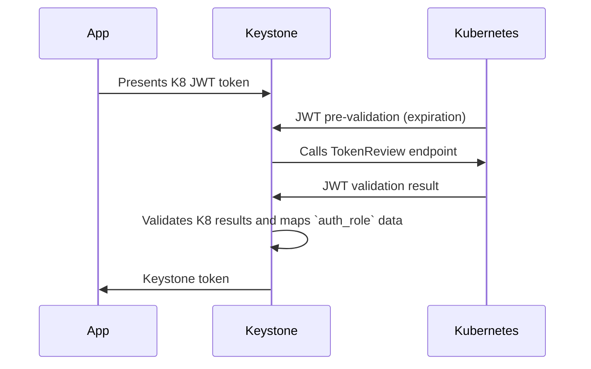

# Kubernetes TokenReview auth (`k8s_auth`)

The kubernetes auth method (`k8s_auth`) can be used to authenticate with
Keystone using a Kubernetes Service Account Token. This method of authentication
makes it easy to remove the necessity of keeping plain text OpenStack user
passwords or application credentials in the configuration files of applications
running in the Kubernetes. This method relies on the Kubernetes
[TokenReview endpoint](https://kubernetes.io/docs/reference/kubernetes-api/authentication-resources/token-review-v1/)
for verifying the JWT token.

The application presents running in the Kubernetes pod with a dedicated Service
Account presents the Kubernetes JWT to Keystone together with the id of the
`auth_instance` (represents a single K8 cluster) and an `auth_role` (similar to
how it is named on OpenBao/Vault) and receives the Keystone token in exchange.
This method goes hand in hand with token restriction and Keystone service
accounts that allow to map a JWT to a certain fixed Keystone user, scope and
roles using the `auth_role`.

There are 2 possibilities how the Keystone authenticates the TokenReview request
itself:

- Use local token as reviewer JWT

  In this method Keystone uses a JWT token that it reads itself from the file
  system together with the Kubernetes CA certificate. This is only possible when
  the Keystone itself and the client app are running in the same Kubernetes
  cluster.

- Client JWT as reviewer JWT

  In this method Keystone uses the JWT token that the user has passed as the
  authentication for the TokenReview endpoint. This makes it possible to verify
  tokens of the remote clusters (usually owned by OpenStack users). However this
  requires that the user application runs with a dedicated service account that
  has the `auth-delegator` role.

## Authenticate with the Kubernetes JWT

Kubernetes based application represents a typical machine based access instead
of a human one. It should be therefore mapped to the machine account on the
Keystone side. A Keystone Service Account should be used for that. The necessary
access authorization is controlled by the token restrictions specifying the
precise `user_id` (the one of the service account), the `project_id` that the
application should get access to and a list of hardcoded roles. This is similar
to how the application credentials work with the difference that application
credentials can be only created by the user itself, while token restrictions for
the service account can be created by regular users (typically with the
“manager” role). `k8s_auth` requires token restrictions to have `user_id` and
`project_id` specified whenever normally those are only optional.



## API

- **POST** `/v4/k8s_auth/`: Register a new Kubernetes cluster.
- **GET/PATCH/DELETE** `/v4/k8s_auth/instances/{auth_instance_id}`: Manage
  cluster config.
- **POST** `/v4/k8s_auth/instances/{auth_instance_id}/roles`: Create a mapping
  between a K8s SA/Namespace and a Keystone Project.
- **GET/PATCH/DELETE**
  `/v4/k8s_auth/instances/{auth_instance_id}/roles/{role_name}`: Manage role
  mappings.
- **POST** `/v4/k8s_auth/instances/{auth_instance_id}/auth`: Exchange K8s SA
  token for Keystone token.

### Authentication API (The "Login" Flow)

The new authentication endpoint is exposed under
`/v4/k8s_auth/instances/{auth_instance_id}/auth` and expects a json payload with
a **POST** method.

**Request Payload:**

```json
{
  "k8s_role": "web-servers-role",
  "jwt": "<jwt_from_k8s_service_account_token_volume_projection>"
}
```
