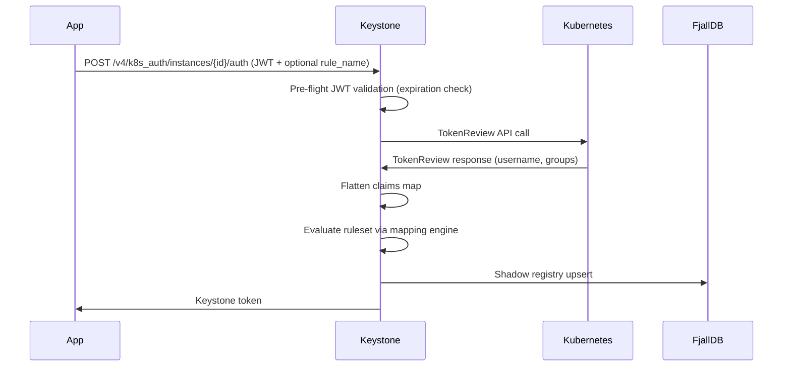

# Kubernetes TokenReview Authentication (`k8s_auth`)

The Kubernetes authentication method validates service account tokens and
resolves identities through the unified mapping engine. It eliminates the need
for plain-text OpenStack credentials in Kubernetes workloads by leveraging the
Kubernetes
[TokenReview endpoint](https://kubernetes.io/docs/reference/kubernetes-api/authentication-resources/token-review-v1/)
for JWT verification.

This method replaces the legacy `K8sAuthRole` + `TokenRestriction` pattern with
a rules-based approach that supports complex claim matching, template
interpolation, and multi-tenant authorization — all mediated by the mapping
engine. See [ADR-0020](adr/0020-mapping-engine.md) for the design rationale.

## Architecture

Keystone validates the presented Kubernetes JWT in one of two modes:

- **Local token as reviewer JWT:** Keystone uses a service account token read
  from its own filesystem alongside the cluster CA certificate. Requires that
  Keystone and the client application run in the same Kubernetes cluster.

- **Client JWT as reviewer JWT:** Keystone uses the client's JWT to call the
  TokenReview endpoint. Enables remote cluster verification but requires the
  client service account to hold the `auth-delegator` role.

### Ingress Flow

The ingestion adapter performs cryptographic validation and claim flattening
before handing off to the mapping engine:


```mermaid
sequenceDiagram
    App->>Keystone: POST /v4/k8s_auth/instances/{id}/auth (JWT + optional rule_name)
    Keystone->>Keystone: Pre-flight JWT validation (expiration check)
    Keystone->>Kubernetes: TokenReview API call
    Kubernetes->>Keystone: TokenReview response (username, groups)
    Keystone->>Keystone: Flatten claims map
    Keystone->>Keystone: Evaluate ruleset via mapping engine
    Keystone->>FjallDB: Shadow registry upsert
    Keystone->>App: Keystone token
```

### Claims Flattening

After `TokenReview` succeeds, the ingress adapter extracts the username
(`system:serviceaccount:<namespace>:<name>`) and flattens it into a claims map
for the mapping engine per ADR-0020 §11.2:

| Claim Key                      | Source                           |
| ------------------------------ | -------------------------------- |
| `k8s.serviceaccount.name`      | Parsed from TokenReview username |
| `k8s.serviceaccount.namespace` | Parsed from TokenReview username |
| `k8s.aud`                      | JWT `aud` claim (if present)     |

The unique workload ID invariant is
`<serviceaccount_name>:<serviceaccount_namespace>`, used for deterministic
virtual user ID derivation via
`HMAC-SHA256(cluster_salt, workload_id || provider_id)`.

## Authentication Paths

The `POST /v4/k8s_auth/instances/{instance_id}/auth` endpoint validates the
Kubernetes JWT via the TokenReview API and delegates identity resolution to the
unified mapping engine.

### Mapping-Engine Path

This path validates the JWT, flattens claims, and delegates identity resolution
to a `MappingRuleSet` with `IdentitySource::K8s`.

**Request:**

```json
{
  "jwt": "<jwt_from_service_account_token_volume>",
  "rule_name": "ci-pipeline-admin"
}
```

The optional `rule_name` field hints at a specific rule to evaluate first. If
the named rule matches, authentication succeeds immediately. If it does not
match, standard first-match-wins iteration proceeds.

**Example mapping ruleset:**

```json
{
  "mapping_id": "b2c3d4e5-6789-01bc-def0-23456789abcd",
  "domain_id": "domain_infra",
  "source": { "type": "k8s", "cluster_id": "eks-prod-cluster-01" },
  "domain_resolution_mode": { "type": "fixed" },
  "enabled": true,
  "rules": [
    {
      "name": "ci-pipeline-admin",
      "match": {
        "all_of": [
          {
            "type": "condition",
            "equals": {
              "claim": "k8s.serviceaccount.namespace",
              "value": "ci-pipeline"
            }
          },
          {
            "type": "condition",
            "any_of": {
              "claim": "k8s.serviceaccount.name",
              "values": ["build-runner", "deploy-agent"]
            }
          }
        ]
      },
      "identity": {
        "user_name": "svc-k8s-${claims.k8s.serviceaccount.name}"
      },
      "authorizations": [
        {
          "type": "project",
          "project_id": "550e8400-e29b-41d4-a716-446655440010",
          "project_domain_id": "domain_infra",
          "roles": [{ "id": "admin", "name": "admin" }]
        }
      ],
      "groups": []
    },
    {
      "name": "monitoring-reader",
      "match": {
        "all_of": [
          {
            "type": "condition",
            "equals": {
              "claim": "k8s.serviceaccount.namespace",
              "value": "monitoring"
            }
          },
          {
            "type": "condition",
            "matches_regex": {
              "claim": "k8s.serviceaccount.name",
              "regex": "^prometheus-.*$"
            }
          }
        ]
      },
      "identity": {
        "user_name": "svc-k8s-${claims.k8s.serviceaccount.name}"
      },
      "authorizations": [
        {
          "type": "project",
          "project_id": "550e8400-e29b-41d4-a716-446655440010",
          "project_domain_id": "domain_infra",
          "roles": [{ "id": "reader", "name": "reader" }]
        }
      ],
      "groups": [
        {
          "group_id": "550e8400-e29b-41d4-a716-446655440030",
          "group_name": "Monitoring-Agents",
          "group_domain_id": "domain_infra",
          "strategy": { "type": "get" }
        }
      ]
    }
  ]
}
```

**Token scope derivation.** When the mapping engine resolves a match, the first
authorization from the matched rule is used as the token scope. Project, Domain,
and System authorizations are all supported. The complete set of authorizations
is stored on the shadow virtual user record and re-evaluated during token
verification.

**Shadow virtual user.** The mapping engine creates a deterministic virtual user
in the shadow registry. The virtual user record captures identity bindings,
snapshotted authorizations, and the content-aware `ruleset_version` (SHA-256 of
the live ruleset). During subsequent token verification, the engine performs a
TOCTOU check: if the live ruleset version differs from the shadow record, the
token is rejected.

## API

### Cluster and Instance Management

| Action              | Endpoint                                                     | Description                           |
| ------------------- | ------------------------------------------------------------ | ------------------------------------- |
| **Create cluster**  | `POST /v4/k8s_auth/`                                         | Register a new Kubernetes cluster     |
| **Manage instance** | `GET/PATCH/DELETE /v4/k8s_auth/instances/{auth_instance_id}` | Get, update, or remove cluster config |

### Mapping Ruleset Management

For the mapping-engine path, rulesets are managed via the unified mapping API.
See [Identity Mapping Engine](mapping.md) for the full reference.

| Action             | Endpoint                                     | Description                                                        |
| ------------------ | -------------------------------------------- | ------------------------------------------------------------------ |
| **Create ruleset** | `POST /v4/mapping`                           | Create a ruleset with `source: { type: "k8s", cluster_id: "..." }` |
| **List rulesets**  | `GET /v4/mapping`                            | Filter by `domain_id`, `source`, `enabled`                         |
| **Show ruleset**   | `GET /v4/mapping/{mapping_id}`               | Full rule definitions                                              |
| **Update ruleset** | `PUT /v4/mapping/{mapping_id}`             | Toggle `enabled`, update `allowed_domains`, or replace `rules`     |
| **Delete ruleset** | `DELETE /v4/mapping/{mapping_id}`            | Remove ruleset                                                     |
| **Mutate rules**   | `POST /v4/mapping/{mapping_id}/rules/mutate` | Atomic insert/update/delete of individual rules                    |

### Authentication Endpoint

| Action           | Endpoint                                              | Description                              |
| ---------------- | ----------------------------------------------------- | ---------------------------------------- |
| **Authenticate** | `POST /v4/k8s_auth/instances/{auth_instance_id}/auth` | Exchange K8s SA token for Keystone token |

#### Authentication Request

```json
{
  "jwt": "<jwt_from_k8s_service_account_token_volume>",
  "rule_name": "ci-pipeline-admin"
}
```

| Field       | Type           | Required | Description                                           |
| ----------- | -------------- | -------- | ----------------------------------------------------- |
| `jwt`       | string         | yes      | Kubernetes service account JWT token                  |
| `rule_name` | string \| null | no       | Mapping-engine: optional named rule to evaluate first |
