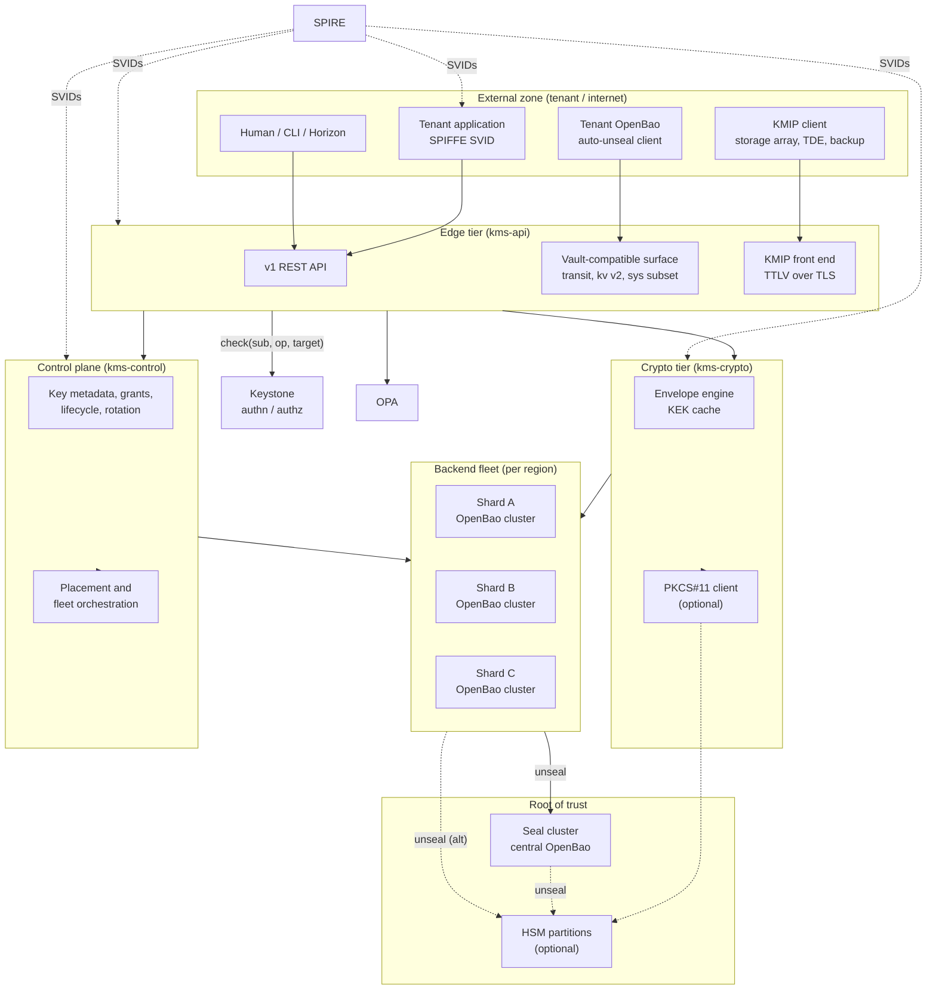
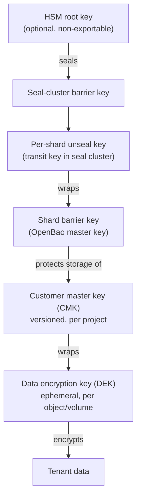
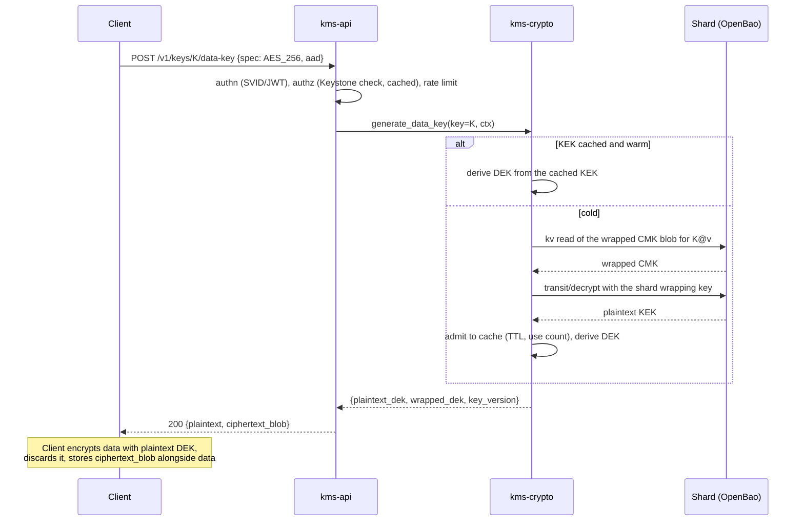
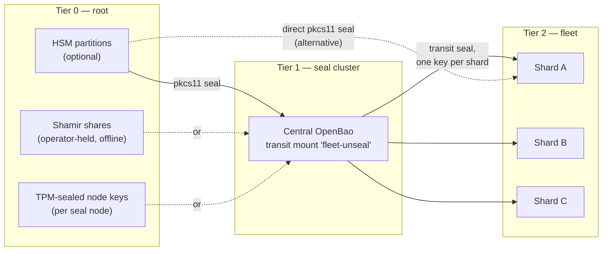
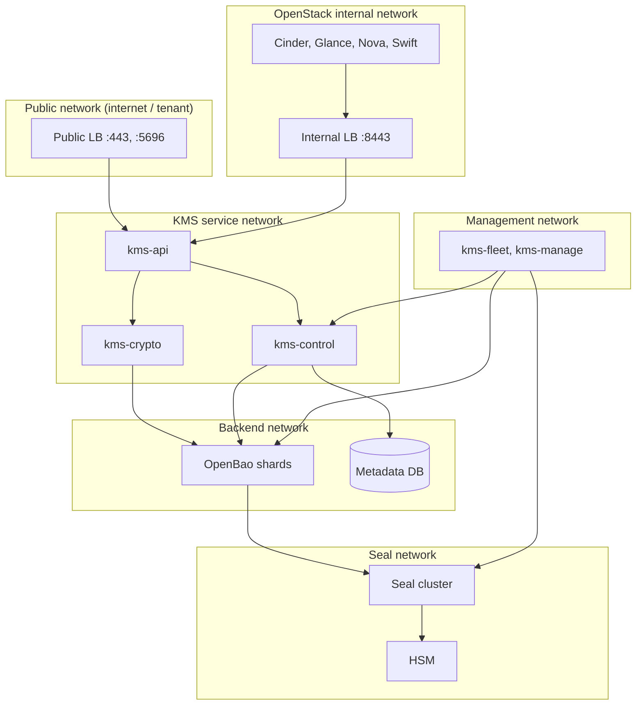

# A Public Key Management Service for OpenStack: Architecture

**Status:** Draft for community discussion

**Date:** 2026-09-13

This document specifies the architecture of a new project: a public Key
Management Service (KMS) for OpenStack-based clouds. It is a companion to the
[authentication and authorization vision](vision.md) and assumes that vision's
building blocks — SPIFFE/SPIRE workload identity, scope-less tokens with a
per-request target, a Keystone-backed authorization decision, OPA policy, CADF
audit, handler-level rate limiting — are available, because the KMS is built on
`keystone-rs` primitives and reuses its crates wherever the shape fits.

The service is deliberately _not_ a rewrite of Barbican. Barbican is a secret
store with a plugin backend; what operators of a public cloud need is a managed
key management service with the operational profile of AWS KMS or GCP Cloud KMS:
a hard multi-tenant blast-radius story, an envelope-encryption data path that
survives the loss of any single backend, standard interfaces (KMIP, the
OpenBao/Vault API) so that existing customer software works unmodified, and a
clear separation between what a tenant may reach from the internet and what only
the cloud's own services may reach.

Under the hood the service does not implement its own cryptographic storage
engine. It operates a **fleet of OpenBao clusters**, shards OpenStack tenants
across them for failure isolation and scalability, and puts a Rust control and
data plane in front of that fleet. The fleet is an implementation detail of the
service, never a contract with the tenant — not even on the surface that speaks
the OpenBao API, which the KMS implements itself rather than proxying (§5.6).

Every section states its own requirements and limits. Where more than one design
is defensible the options are presented with a recommendation, because this is a
document to argue about, not a finished decision record. Section 19 gives the
phased plan; the first useful deliverable is narrow on purpose.

---

## 1. The vision in one page

A public cloud cannot ask its customers to trust a key management service that
is a thin wrapper over a single database. It has to answer four questions
concretely:

1. **Where does my key material live, and who can reach it?** Answer: inside a
   region, inside one OpenBao cluster shard dedicated to a small set of tenants,
   behind a barrier key that is itself sealed by a central seal authority or an
   HSM. No operator path reads plaintext key material; no tenant network path
   reaches the storage layer at all.
2. **What happens when something breaks?** Answer: the blast radius of a shard
   failure is the tenants on that shard, not the region. Envelope-encryption
   operations — the hot path, and the one that users notice — are served by a
   stateless crypto tier that keeps working for the lifetime of its cached
   wrapped keys even when the shard behind it is unavailable.
3. **How do I integrate what I already run?** Answer: three interfaces. A native
   REST API, KMIP for storage arrays, databases and backup software, and an
   OpenBao/Vault-compatible surface (`transit`, `kv` v2, and the minimum of
   `sys`) so that software written against Vault works without change — most
   immediately, so that a customer's own OpenBao can auto-unseal against the
   cloud's KMS.
4. **How do my workloads authenticate?** Answer: with SPIFFE. Customer workloads
   are assumed to have SPIRE support — either the cloud's own SPIRE (VMs
   attested per [ADR 0032](adr/0032-vendor-data-jwt.md), cluster nodes via the
   same path) or a customer-run SPIRE federated with it. Long-lived secrets in
   guest images are a legacy path, not the design centre.

The shape that follows from those answers:

| Layer             | What it is                                                                     | Reachable from                     |
| ----------------- | ------------------------------------------------------------------------------ | ---------------------------------- |
| **Edge**          | `kms-api`: axum HTTP, native v1 REST, Vault-compatible surface, KMIP front end | Tenant networks, internet          |
| **Crypto tier**   | `kms-crypto`: stateless envelope encryption, KEK cache, optional PKCS#11       | Edge and internal services only    |
| **Control plane** | `kms-control`: key metadata, placement, lifecycle, rotation, fleet operations  | Internal control network only      |
| **Backend fleet** | Sharded OpenBao clusters (`transit`, `kv`), one barrier per shard              | Crypto tier and control plane only |
| **Root of trust** | Central seal OpenBao ("seal cluster") and/or HSM partitions                    | Fleet unseal path only             |

and one rule that runs through the whole design:

> **The tenant-facing plane never talks to the storage plane, and the storage
> plane never terminates a tenant connection.** Every crossing is mediated by a
> service that holds a SPIFFE identity, is authorized per request, and is
> audited.

---

## 2. Scope, non-goals, and the relationship to what exists

### 2.1 In scope

- Symmetric key management: create, rotate, enable/disable, schedule deletion,
  encrypt/decrypt of small payloads, envelope-encryption data-key generation.
- Asymmetric key management: sign/verify, wrap/unwrap, public-key retrieval.
- Secret storage (opaque blobs) for the Barbican and `kv` use cases.
- Customer-managed keys (CMK) for OpenStack services: Cinder volume encryption,
  Glance image encryption, Swift/S3 object encryption, Manila, database and
  backup encryption.
- Bring-your-own-key import and, where policy allows, export under wrap.
- KMIP server for third-party clients (storage arrays, Oracle/MSSQL TDE, backup
  software, vSphere).
- OpenBao/Vault API compatibility for `transit` and `kv` v2, sufficient for a
  customer OpenBao to auto-unseal and for Vault-aware software to work.
- Regional HA, multi-region key policy, and disaster recovery.

### 2.2 Out of scope (at least initially)

- Being a general-purpose secret manager with dynamic secrets engines
  (databases, PKI, cloud credentials). Those are what a customer's _own_ OpenBao
  is for; the cloud KMS exists partly to make running one safe.
- Certificate authority services. A CA is a distinct product with distinct
  compliance; the KMS may hold the CA's private key, and that is the boundary.
- Replacing SPIRE's own CA or Keystone's signing keys. Those have their own
  bootstrap chain and adopting the KMS for them is a later, separate decision
  (§9.6).
- Confidential computing attestation-bound release of keys. It is an
  authorization condition on top of this architecture rather than a change to
  it, and §2.6 states what the service would and would not own if it were
  added.

### 2.3 Relationship to Barbican

Barbican defines the OpenStack contract that Cinder, Glance, Nova, Octavia and
Manila already speak (`castellan`). The KMS therefore ships a **Barbican v1
compatibility surface** (§5.8) so existing services keep working from day one,
and offers the native API for everything Barbican cannot express (grants,
envelope operations, KMIP, key policies, multi-region behaviour). Barbican's own
plugin model is not reused: a plugin inside Barbican's process cannot give the
blast-radius or network-isolation properties of §1.

### 2.4 Relationship to `keystone-rs`

The KMS is a separate project with its own repository, release cadence and
database. It depends on Keystone for identity and authorization decisions, and
it borrows Keystone's engineering: axum handlers, SeaORM persistence, the OPA
integration ([ADR 0002](adr/0002-open-policy-agent.md)), the security context
([ADR 0017](adr/0017-security-context.md)), handler-level rate limiting
([ADR 0022](adr/0022-rate-limiting.md)), CADF audit
([ADR 0023](adr/0023-audit.md)), Prometheus metrics
([ADR 0031](adr/0031-prometheus-metrics.md)), pagination
([ADR 0029](adr/0029-pagination.md)) and the per-request cache
([ADR 0030](adr/0030-per-request-cache.md)). Shared code is extracted into
crates published from `keystone-rs` rather than vendored, so that a fix to the
audit pipeline or the rate limiter benefits both. Keystone's PKCS#11/TPM KEK
work (`doc/plans/0016-v2-pkcs11-tpm-kek.md`) is the direct ancestor of the HSM
integration in §10.

The dependency on Keystone is a runtime dependency with the same posture as the
one in [vision §8](vision.md): authentication is validated offline,
authorization is a cached live decision, and the KMS fails closed when no cached
decision applies. Because a KMS outage is a data-availability outage for
everything encrypted with it, §11.4 imposes tighter requirements on that cache
than a compute API would need.

### 2.5 Relationship to OpenBao

OpenBao is a premise of this design, and a premise deserves an argument. Three
answers to "under whose barrier does key material live" were considered:

| Option                                                                                                                                           | What it gives                                                                                                                                                   | What it costs                                                                                                                                                                                  |
| ------------------------------------------------------------------------------------------------------------------------------------------------ | --------------------------------------------------------------------------------------------------------------------------------------------------------------- | ---------------------------------------------------------------------------------------------------------------------------------------------------------------------------------------------- |
| **A fleet of OpenBao clusters (recommended)**                                                                                                    | Barrier, integrated Raft replication, namespaces, backup and restore, and a seal protocol with an operational history behind it                                 | Operating _N_ Raft clusters per region is the single largest line item in the service's cost, development and operational alike                                                                |
| **HSM partitions as the custody backend**                                                                                                        | The strongest custody story there is                                                                                                                            | Fails on arithmetic: a partition holds thousands of key objects, not the 10⁵–10⁶ that a four-digit tenant count implies, at a throughput §10.2 already calls "much lower than software crypto" |
| **No barrier product at all:** wrapped blobs in the control-plane database, wrapping keys held through PKCS#11, all cryptography in `kms-crypto` | One fewer distributed system; sharding becomes a database concern the `keystone-rs` patterns already handle; restore is an operation the operators already know | The project owns the barrier — wrapping format, rekey, crypto-shredding, the compliance narrative — and, decisively, the HSM stops being optional                                              |

The decisive argument is that third option's failure, and it is not the one that
first suggests itself. Writing a barrier is expensive, but the sharper reason is
this: §10 promises that an HSM "is never required for the service to function",
and §9's seal cluster — itself an OpenBao with a `fleet-unseal` transit mount —
is the _software_ root of trust that makes the promise keepable. Remove OpenBao
and a deployment must either make an HSM mandatory, pricing out every operator
who does not already have one, or grow its own software seal, which is
rebuilding the least forgiving part of OpenBao with none of its review history.
**OpenBao is what lets the HSM stay optional**, and that is a better
justification than not wanting to write a barrier.

The secondary argument is the compliance narrative of §20. "The key material is
inside an OpenBao barrier" is a sentence an auditor already accepts; "the key
material is inside our barrier" is one the project must prove from first
principles, every time, for every scheme.

What OpenBao is _not_ asked to be is the region's cryptographic engine. §7 makes
mode B the default, under which the hot path reaches a shard roughly once per
key per cache lifetime, and §6.3 is explicit that transit's non-exportability is
precisely why the offload cannot be built on transit alone. The dependency is
therefore deliberately narrow, and §8.6 writes down its exact surface so that it
stays narrow.

### 2.6 Relationship to confidential computing

Two different things travel under the name "key broker", and separating them is
most of the analysis: one is functionality the service would sell, the other is
a way the service could run.

**What the end user wants.** A tenant running a confidential VM or a
confidential container wants a key released only to a workload whose
measurement it recognises. The shape the ecosystem has settled on is two
components: a key broker that runs an attestation handshake with the workload
and hands back a resource, and an attestation service that appraises the
evidence against reference values and hardware endorsements. The KMS is the
right holder of the _release decision_ — it already holds the key, it already
evaluates a per-object policy in OPA (§13.3), and a broker able to release keys
the KMS custodies without the KMS deciding would split exactly the authority
§13 exists to consolidate. The KMS is the wrong owner of the _appraisal_:
maintaining reference values, vendor endorsement chains and TCB levels across
TEE generations is a distinct product with a distinct compliance lifecycle,
which is the same reason §2.2 excludes certificate authority services.

The split that follows:

| Concern                                                    | Where it belongs                                                          |
| ---------------------------------------------------------- | ------------------------------------------------------------------------- |
| Holding the key and deciding whether to release it         | The KMS, as a condition on a grant (§13.4)                                |
| Appraising TEE evidence and issuing a result               | A verifier the operator runs, or SPIRE at SVID issuance                   |
| Reference values and appraisal policy for a tenant's image | The tenant, as a resource the KMS stores and passes to policy             |
| Speaking the attestation handshake to a workload           | A thin edge surface on its own hostname (§5.3), for clients that need one |

**What the service itself needs: nothing.** Attestation is also a candidate
root of trust for the KMS's own processes — a seal cluster that releases a
shard's unseal key only to a node that has proved its measurement (§9.3), or a
`kms-crypto` running inside a TEE so that the plaintext KEK cache of §7.3 sits
in memory the host cannot read. Both are attractive and neither may become
required: principle 6 makes the HSM optional, and a service that could not
start without attested hardware would be that promise broken in the other
direction. On the service's own path, attestation is therefore an _additional_
Tier-0 option ranked alongside TPM and HSM sealing, never a prerequisite. The
distinction also decides when each may be considered: a tenant-facing broker is
a feature that can wait for demand, whereas anything the service needs in order
to start has to be settled before Phase 1.

Adding the broker is cheaper than it first looks, because each piece is already
present in some other guise:

- The release primitive exists. Fetching a brokered resource is a read of an
  opaque secret (§5.4); releasing a key is `unwrap` or `data-key`.
- Wrapping the released material to a public key the caller has proved it holds
  is the BYOK import-token machinery of §5.4 run backwards, with the ephemeral
  public key taken from the evidence instead of minted by the KMS.
- The AAD of §6.4 already carries `caller_scope_digest`; a digest of the
  appraised claims goes there with no format change. That buys a property worth
  having on its own — a DEK minted for an attested workload cannot be replayed
  into an unattested context, even by the same project.
- Appraisal policy and KMS policy are both Rego, evaluated by the engine the
  project already runs.

What is not cheap is precisely what the recommendation above declines to own.
Appraisal needs endorsement material fetched from a hardware vendor outside the
region, which principle 7 does not forbid but does not welcome. A firmware
update that moves a measurement is a fleet-wide availability event with a cause
the KMS cannot see coming. And reference values describe the tenant's image, so
the tenant owns them — a tenant who gets them wrong loses access to its own
data with nothing broken to repair, which is a support burden of a kind the
rest of this design works hard to avoid.

Three consequences are carried into the rest of the document: an identity track
that is not really a new one (§4.4), a condition on grants (§13.4), and a
freshness rule the caches must not quietly undo (§7.3). None of them is a
Phase 1–5 concern; §21, question 12 says what would make it one.

---

## 3. Principles

1. **Blast radius is a design parameter, not an outcome.** Every tenant is
   assigned to a shard; the shard is the unit of failure, upgrade, capacity and
   incident scope. A shard is sized so that its loss is an incident, not a
   catastrophe.
2. **Plaintext key material exists in exactly two places:** inside an OpenBao
   barrier (or HSM), and transiently in the memory of a crypto-tier process that
   is currently performing an operation. It is never written to the KMS's own
   database, never logged, never returned by an API except where the tenant
   explicitly asked for a data key or an authorized export.
3. **The hot path must not be the fragile path.** Envelope operations are orders
   of magnitude more frequent than key-management operations and are served by a
   tier that can be scaled and degraded independently of the backend fleet.
4. **Internal and external are different services that happen to share code.**
   They bind different addresses, on different networks, with different
   authentication, different policy, different rate limits and different audit
   streams. A handler is reachable from exactly one of them unless a deliberate
   decision says otherwise.
5. **Standards where customers already stand.** KMIP and the Vault API are not
   nice-to-haves; they are the reason an enterprise can adopt the service
   without rewriting software.
6. **The HSM is an option, never a prerequisite.** A deployment without an HSM
   must be fully functional and honestly documented as to what it does and does
   not guarantee. A deployment with an HSM must not have to re-architect.
7. **No dependency on any external public KMS.** The service is the root of
   trust for the cloud it serves. Everything it needs to bootstrap must be
   derivable from operator-held material, a local HSM, or its own seal cluster.
8. **Region is a hard boundary by default.** Key material does not leave its
   region unless the key was explicitly created as a multi-region key and the
   tenant asked for it.
9. **Crypto-agility from the first line.** Algorithms, key sizes and wrapping
   formats are versioned in the wire format and in storage, so that post-quantum
   wrapping (ML-KEM) and signing (ML-DSA) are additions, not migrations.
10. **Everything is recorded.** Every administrative action and every fleet
    operation emits its own CADF event. Every _key use_ is recorded too, but at
    data-plane volumes the unit of record is allowed to be an aggregate (§14):
    what may never be lost is the identity, the key version and the outcome of
    any failed, denied, key-material or management operation. A KMS that cannot
    prove what it did is not usable for compliance; a KMS that emits one event
    per object write is not affordable, and the design says which is which
    rather than pretending the tension does not exist.

---

## 4. Target architecture

### 4.1 Component overview



### 4.2 The five processes

| Process       | Role                                                                                                                            | Network         | Scaling                                     |
| ------------- | ------------------------------------------------------------------------------------------------------------------------------- | --------------- | ------------------------------------------- |
| `kms-api`     | Terminates tenant TLS, authn/authz, rate limits, translates every protocol into one internal call set                           | Edge + internal | Stateless, horizontal, per-region           |
| `kms-crypto`  | Performs envelope and transit operations, holds the KEK cache, drives PKCS#11                                                   | Internal only   | Stateless, horizontal, cache-warm affinity  |
| `kms-control` | Owns key metadata, lifecycle state machine, rotation schedules, grants, placement decisions, custody metering snapshots (§15.2) | Internal only   | Leader-elected for schedulers, HA for reads |
| `kms-fleet`   | Operates the OpenBao clusters: provisioning, unseal, upgrade, rekey, health, migration                                          | Management only | Singleton per region with standby           |
| `kms-manage`  | Operator CLI: bootstrap, shard operations, DR drills, key recovery ceremonies                                                   | Management only | Invoked, not served                         |

One piece of shared infrastructure is load-bearing enough to name here rather
than leave implied: the **invalidation bus**, the path by which `kms-control`
tells every `kms-crypto` replica that a key has been disabled, a grant revoked
or a deletion scheduled (§7.3). It is what makes those operations take effect in
seconds rather than at the end of a cache TTL, so it is on the critical path for
a security property, not for throughput. It is regional, it carries no key
material (only key identifiers and a monotonic epoch), and its failure mode is
explicit: a `kms-crypto` replica that loses the bus for longer than one TTL
stops admitting new cache entries and drains, rather than serving from a cache
it can no longer trust. Implementation options — a message broker, a Raft watch
on the control plane, or direct fan-out over the internal mTLS mesh with
`kms-control` holding the replica list — trade operational surface against
delivery guarantees; direct fan-out is the recommendation, because the replica
count is small, the fencing decision has to be synchronous anyway, and it adds
no new system to the trust boundary.

`kms-api` and `kms-crypto` are separate processes even in a small deployment.
That split is what makes the network isolation of §12 expressible, and it is
what lets the crypto tier be given a different hardening profile (no inbound
tenant traffic, memory locking, core dumps disabled, optional HSM session
ownership).

### 4.3 Deployment topology

Per **region**:

- ≥3 `kms-api` replicas behind the public and internal load balancers, in
  distinct availability zones.
- ≥3 `kms-crypto` replicas, AZ-distributed, no tenant-facing address.
- ≥2 `kms-control` replicas; schedulers use a lease.
- _N_ shards; each shard is an OpenBao cluster of 3 or 5 nodes spread across
  AZs, with integrated (Raft) storage.
- One **seal cluster**: a small, dedicated OpenBao cluster (3 or 5 nodes) used
  only as a transit auto-unseal authority for the shards (§9).
- Optional HSM partitions, at least two, in different failure domains.

Per **cloud** (across regions): the control plane's metadata is regional. There
is no global write path. Cross-region concerns — multi-region keys, global key
identifiers, replication policy — are handled by explicit, auditable
replication, never by a globally shared database (§11).

### 4.4 Identity tracks

| Caller                              | Authenticates with                                                                    | Seen by the KMS as                                           |
| ----------------------------------- | ------------------------------------------------------------------------------------- | ------------------------------------------------------------ |
| Tenant workload on the cloud        | X.509 SVID (mTLS) or JWT-SVID from cloud SPIRE                                        | Principal mapped from `spiffe.project_id`, per ADR 0008/0020 |
| Tenant workload off the cloud       | JWT-SVID from a **federated** SPIRE trust domain                                      | Principal mapped from the federated trust domain's rules     |
| Tenant OpenBao (auto-unseal)        | SVID (preferred) or a scoped, rotatable app credential                                | Principal bound to one transit key                           |
| Human / CLI / Horizon               | Keystone-issued JWT (passkey or OIDC behind it)                                       | User principal, `amr` available to policy                    |
| Confidential-computing workload     | SVID whose issuance appraised TEE evidence, or an attestation result token (§2.6)     | Principal as above, plus appraised claims in policy input    |
| KMIP client                         | Client certificate: SVID, or a KMS-registered tenant CA                               | Principal from SPIFFE ID or certificate mapping              |
| OpenStack service (Cinder, Glance…) | X.509 SVID at the internal interface, plus the user's JWT or an on-behalf-of exchange | Service principal **and** the user it acts for               |
| KMS's own tiers                     | X.509 SVID                                                                            | Peer identity; no bearer token anywhere internally           |

The last two rows are the important ones. When Cinder attaches an encrypted
volume it is acting for a user; per [ADR 0036](adr/0036-service-delegation.md)
the delegation is a fact of the authentication chain, and the KMS policy keys on
`input.credentials.delegated_project_id`, never on a scope the caller supplied.
A service that has an SVID but no delegation may not unwrap a tenant's key; this
is precisely the invariant the [security model](contributor/security-model.md)
already states, applied to the one service where violating it is catastrophic.
The confidential-computing row is deliberately not a new mechanism. The
appraisal happens before the KMS sees the caller — at SVID issuance, or in a
verifier whose signed result the caller presents — so what reaches policy is
the principal the KMS already understands, with claims attached (§2.6).

---

## 5. API surfaces and the external/internal split

### 5.1 Zones

Four zones, with distinct listeners, certificates, policy bundles and audit
streams. "Zone" here is an architectural term; §12 maps it onto networks.

| Zone            | Listener            | Peer authentication                       | Typical caller                       |
| --------------- | ------------------- | ----------------------------------------- | ------------------------------------ |
| **Public**      | `kms-api` :443      | Bearer JWT, or mTLS with a tenant SVID    | Tenant apps, tenant OpenBao, Horizon |
| **Tenant-KMIP** | `kms-api` :5696     | mTLS only (client certificate)            | Storage arrays, TDE, backup software |
| **Internal**    | `kms-api` :8443     | SPIFFE mTLS, plus delegated user identity | Cinder, Glance, Nova, Swift, Octavia |
| **Management**  | `kms-control` :9443 | SPIFFE mTLS, operator role required       | `kms-manage`, fleet automation, CI   |

The same handler is never mounted in more than one zone by accident: the router
is built per zone from an explicit list, and a test asserts that the public
router does not contain any handler tagged `internal` or `management`. That test
is the enforcement mechanism; a code review is not.

### 5.2 What is public and what is not

| Capability                                        | Public | Tenant-KMIP | Internal | Management |
| ------------------------------------------------- | :----: | :---------: | :------: | :--------: |
| Create / list / describe keys                     |   ✓    |      ✓      |    ✓     |     ✓      |
| Encrypt / decrypt / sign / verify                 |   ✓    |      ✓      |    ✓     |     –      |
| Generate data key (envelope)                      |   ✓    |      ✓      |    ✓     |     –      |
| Rotate, enable/disable, schedule deletion         |   ✓    |      –      |    ✓     |     ✓      |
| Import key material (BYOK)                        |   ✓    |      –      |    –     |     ✓      |
| Export key material under wrap                    |   ✓¹   |     ✓¹      |    –     |     ✓      |
| Grants on a key                                   |   ✓    |      –      |    –     |     ✓      |
| Vault `transit` compatibility                     |   ✓    |      –      |    ✓     |     –      |
| Vault `kv` v2 compatibility                       |   ✓    |      –      |    –     |     –      |
| Barbican v1 compatibility                         |   ✓    |      –      |    ✓     |     –      |
| Auto-unseal for a **tenant's** OpenBao            |   ✓    |      –      |    –     |     –      |
| Auto-unseal for a **fleet** shard                 |   –    |      –      |    –     |     –²     |
| Shard placement, migration, rekey, seal rotation  |   –    |      –      |    –     |     ✓      |
| Cross-tenant listing, fleet health, key inventory |   –    |      –      |    –     |     ✓      |
| Direct OpenBao access of any kind                 |   –    |      –      |    –     |     ✓³     |

¹ Only for keys created with `exportable = true`, only under an approved
wrapping key, and only when policy allows; the flag is immutable after creation
and is recorded in every audit event for that key.

² The fleet unseal path is not an API the KMS serves in any zone — it is a shard
node speaking to the seal cluster over the seal network (§9), and the row exists
to say so. What the management zone offers is its _configuration_ (which shard
has which unseal key, and rotating them), which is the "seal rotation" row
below.

³ Break-glass only, through `kms-manage`, with quorum approval and an audit
record, along the lines of
[ADR 0028](adr/0028-oauth2-quorum-bypass-emergency-rotation.md).

### 5.3 Three surfaces, three base paths

The native API, the Vault-compatible surface and the Barbican-compatible surface
each want to own `/v1/`, and two of them want `/v1/secret(s)`. That collision
has to be resolved in the routing layer before any of the three is written, and
the resolution is visible to clients, so it belongs here rather than in an
implementation note.

| Option                                     | Native              | Vault-compatible          | Barbican-compatible      | Cost                                                                                              |
| ------------------------------------------ | ------------------- | ------------------------- | ------------------------ | ------------------------------------------------------------------------------------------------- |
| **Distinct hostnames (recommended)**       | `kms.<region>…/v1/` | `vault.kms.<region>…/v1/` | `barbican.<region>…/v1/` | Three certificates and three service-catalog entries; every client works unmodified               |
| Distinct base paths on one host            | `/v1/`              | `/vault/v1/`              | `/barbican/v1/`          | Free, but relies on each client preserving a base path in its configured address                  |
| One namespace with disambiguating prefixes | `/v1/keys`          | `/v1/transit`             | —                        | Cheapest, and unworkable: Barbican's `/v1/secrets` and the native `/v1/secrets` cannot both exist |

Distinct hostnames are recommended. They keep every compatibility surface
byte-identical to the API it imitates, they let the KMIP and Vault surfaces be
withdrawn from a deployment without touching the native one, and they give the
network layer (§12) a natural place to apply different exposure per surface.
Distinct base paths are a workable fallback where certificate management is the
binding constraint — the Vault client preserves the path component of its
configured address, so `address = "https://kms.<region>.<cloud>/vault"` reaches
`/vault/v1/transit/…` — but it has to be verified per client rather than
assumed, and KMIP has no equivalent (it is a separate port regardless).

The catalog entries are distinct service types (`key-manager` for the Barbican
surface, so that `castellan` finds it unchanged), which also means an operator
can decline to register a surface they do not want to offer.

### 5.4 Native v1 REST API

Resource shapes, with the OpenStack conventions of the v4 Keystone API
([ADR 0004](adr/0004-v4-api.md)) — cursor pagination
([ADR 0029](adr/0029-pagination.md)), problem+json errors, `OpenStack-Target`
for scope where the target is not implied by the addressed resource.

```text
POST   /v1/keys                       create a key
GET    /v1/keys                       list keys in the target project
GET    /v1/keys/{key_id}              describe (metadata only, never material)
PATCH  /v1/keys/{key_id}              enable, disable, rename, retag
DELETE /v1/keys/{key_id}              schedule deletion (waiting period)
POST   /v1/keys/{key_id}/cancel-deletion
POST   /v1/keys/{key_id}/rotate       new version, old versions kept
GET    /v1/keys/{key_id}/versions
POST   /v1/keys/{key_id}/import       BYOK, material wrapped to an import token
GET    /v1/keys/{key_id}/import-token get wrapping key + nonce for BYOK
GET    /v1/keys/{key_id}/public       public key (asymmetric only)

POST   /v1/keys/{key_id}/encrypt      small payload, <= 8 KiB
POST   /v1/keys/{key_id}/decrypt
POST   /v1/keys/{key_id}/rewrap       re-encrypt ciphertext to latest version
POST   /v1/keys/{key_id}/sign
POST   /v1/keys/{key_id}/verify
POST   /v1/keys/{key_id}/data-key     envelope: plaintext + wrapped DEK
POST   /v1/keys/{key_id}/data-key/wrapped-only
POST   /v1/keys/{key_id}/unwrap       wrapped DEK -> plaintext DEK
POST   /v1/keys/{key_id}/hmac
POST   /v1/random                     randomness from the region's CSPRNG

POST   /v1/keys/{key_id}/grants       delegate specific operations
GET    /v1/keys/{key_id}/grants
DELETE /v1/keys/{key_id}/grants/{grant_id}

POST   /v1/secrets                    opaque secret store (Barbican-shaped)
GET    /v1/secrets/{secret_id}

GET    /v1/quotas                     per-project limits and usage
GET    /v1/usage                      current billing period, per key and class
GET    /v1/regions                    regions this deployment can replicate to
GET    /v1/keys/{key_id}/regions      where this key exists today
```

Batch variants of `encrypt`, `decrypt` and `data-key` exist from the start. A
storage service encrypting a thousand objects should make one request, and the
per-item results carry per-item errors. Batching is the single most effective
lever on backend load (§7).

### 5.5 KMIP

KMIP is how the enterprise storage world talks to a KMS, and shipping it is a
large part of why this service exists rather than a Barbican plugin.

- **Protocol versions:** KMIP 1.4 and 2.1, TTLV encoding over TLS. JSON and XML
  encodings are deferred; almost nothing in the field uses them.
- **Profiles:** target the KMIP 2.1 _Baseline Server_ profile plus _Symmetric
  Key Lifecycle_, _Basic Cryptographic_ and _Opaque Managed Object_ server
  conformance, and their 1.4-era equivalents where the profile names differ.
  Between them these cover the common clients (VMware, NetApp, Dell, Oracle TDE,
  Veeam, Commvault) — but "covers" is a claim to be proven by the
  interoperability matrix of Phase 5, not by reading the specification.
- **Operations:** `Create`, `CreateKeyPair`, `Register`, `Get`, `GetAttributes`,
  `GetAttributeList`, `AddAttribute`, `ModifyAttribute`, `DeleteAttribute`,
  `Activate`, `Revoke`, `Destroy`, `Locate`, `Check`, `Query`,
  `DiscoverVersions`, `Encrypt`, `Decrypt`, `Sign`, `SignatureVerify`, `MAC`,
  `RNG Retrieve`. `Get` with a `KeyWrappingSpecification` is how KMIP clients do
  envelope encryption, and the KMS maps it onto the same data-key path as §5.4.
- **Identity:** mTLS client certificate only. Two mappings are supported: a
  SPIFFE ID in the SAN (preferred; the client is a workload with an SVID), or a
  certificate issued by a **tenant-registered CA** with a subject pattern the
  tenant mapped to a principal. The second exists because a storage array cannot
  run a SPIRE agent. Certificate-to-principal mapping reuses the mapping engine
  ([ADR 0020](adr/0020-mapping-engine.md)) — the same rule language that maps an
  OIDC assertion maps a certificate's subject.
- **Tenancy:** a KMIP connection is bound to exactly one project, derived from
  the client identity at handshake time. `Locate` never crosses that boundary.
  There is no KMIP operation that can name another tenant's object, and object
  identifiers are opaque per-tenant handles, not global key IDs.

**Implementation options.**

| Option                                                        | Pros                                                                  | Cons                                                                      | Verdict                  |
| ------------------------------------------------------------- | --------------------------------------------------------------------- | ------------------------------------------------------------------------- | ------------------------ |
| A. Own TTLV codec crate (`kmip-ttlv`) + server in `kms-api`   | No unmaintained dependency; full control over conformance and fuzzing | Real work: TTLV, the attribute model, profile conformance testing         | **Recommended**          |
| B. Wrap an existing Rust KMIP crate                           | Faster start                                                          | Ecosystem is thin and the crates are partial; conformance is on us anyway | Evaluate, fall back to A |
| C. Front a third-party KMIP server (e.g. PyKMIP) as a sidecar | Fastest to a demo                                                     | Another runtime, another auth model, no path to the internal call set     | Prototype only           |

Option A with the codec in a separate crate, `no_std`-friendly and fuzzed (the
repository already runs `cargo-fuzz`), is the recommendation. TTLV parsing is a
hostile-input surface reached over the network and deserves that treatment.

### 5.6 The OpenBao/Vault-compatible surface

A deliberate, bounded subset — presented as an API the KMS implements, not as a
transparent pass-through to a backend cluster. Requests are parsed, authorized,
rate-limited, audited, and then executed against the shard. The tenant never
holds an OpenBao token for a fleet cluster.

| Vault path                                    | Supported | Notes                                                   |
| --------------------------------------------- | :-------: | ------------------------------------------------------- |
| `POST /v1/transit/encrypt/{name}`             |     ✓     | Maps to key encrypt; batch input supported              |
| `POST /v1/transit/decrypt/{name}`             |     ✓     | The auto-unseal path                                    |
| `POST /v1/transit/rewrap/{name}`              |     ✓     |                                                         |
| `POST /v1/transit/datakey/{type}/{name}`      |     ✓     | Maps to §5.4 data-key                                   |
| `GET /v1/transit/keys/{name}`                 |     ✓     | Metadata only                                           |
| `POST /v1/transit/keys/{name}/rotate`         |     ✓     |                                                         |
| `POST /v1/transit/sign\|verify\|hmac`         |     ✓     |                                                         |
| `GET\|POST\|DELETE /v1/secret/data/{p}`       |     ✓     | `kv` v2, versioned                                      |
| `GET /v1/sys/health`, `/sys/seal-status`      |     ✓     | Synthesized; describes the KMS, never a backend cluster |
| `POST /v1/auth/cert/login`, `/auth/jwt/login` |     ✓     | Issues a KMS-scoped token that looks like a Vault token |
| `sys/mounts`, `sys/policy`, dynamic engines   |     –     | Not a Vault; use the native API                         |

The **auto-unseal use case** needs only four of these (`transit/encrypt`,
`transit/decrypt`, `auth/*/login`, `sys/health`), which is why it is Phase 1
(§19). A customer configures their own OpenBao with:

```hcl
seal "transit" {
  address         = "https://kms.<region>.<cloud>/"
  mount_path      = "transit/"
  key_name        = "unseal-prod"
  tls_ca_cert     = "/etc/ssl/cloud-ca.pem"
  tls_client_cert = "/run/spire/certs/svid.pem"
  tls_client_key  = "/run/spire/certs/svid.key"
}
```

and never handles an unseal key again. Because customer workloads are assumed to
have SPIRE support, the client certificate is an SVID and the credential is
rotated by the SPIRE agent; no secret is written into the customer's config
management.

One detail decides whether that last sentence is true. The upstream `transit`
seal stanza carries a `token` field and treats it as required, because it was
written against a Vault that authenticates with tokens rather than with client
certificates. The KMS is not a Vault: it authenticates the **mTLS peer**, and
the token is advisory. Three ways to close the gap, in preference order:

1. **Accept the SVID and ignore the token.** The seal stanza carries a
   placeholder; authorization comes entirely from the client certificate. This
   is the recommended path and is why `tls_client_cert` is the load-bearing line
   in the configuration above.
2. **Issue a token to a certificate.** A short-lived, single-key token from
   `auth/cert/login`, renewed by a sidecar that writes it where the seal stanza
   reads it. Needed if the client refuses to start without a syntactically valid
   token.
3. **A Keystone application credential** scoped to exactly one transit key, for
   a customer whose OpenBao predates their SPIRE rollout.

The KMS records which of the three was used on every unseal, and an operator can
require (1) per project so that a fallback cannot be silently adopted.

**Design decision — synthesize, do not proxy.** A transparent reverse proxy to a
shard would be less code and is tempting. It is rejected: it leaks backend
identity and version, makes the tenant's blast radius the cluster's blast
radius, defeats per-request authorization against Keystone, and makes shard
migration a customer-visible event. The compatibility surface is an
implementation of the Vault wire contract, and that contract is version-pinned
and covered by contract tests against a real OpenBao client.

### 5.7 Internal service API

The internal zone carries what OpenStack services need and tenants must not
reach:

- Envelope operations at scale, batched, with service-level rate limits and a
  distinct quota pool, so that a Cinder mass-attach cannot starve tenant API
  traffic.
- The delegated-unwrap path: "unwrap this DEK for volume V of project P, on
  behalf of user U", authorized against the user's grant on the key, with the
  acting service recorded (`act`).
- Key-usage attestation: a service can ask "is key K usable right now for
  project P", which is what a scheduler needs before it places a workload that
  will require the key.
- Bulk re-wrap notification: when a tenant rotates a CMK, services that hold
  ciphertext under the old version subscribe to an event stream and re-wrap
  lazily.

### 5.8 Barbican compatibility

A Barbican-shaped surface (secrets, containers, orders, ACLs, consumers) on its
own hostname or base path per §5.3, sufficient for `castellan` and the existing
OpenStack integrations. It is a translation layer over the native model: a
Barbican "secret" is a KMS secret or a key, a Barbican ACL becomes a KMS grant,
an "order" for a symmetric key becomes a key creation. Not everything maps —
Barbican's certificate orders do not, and return `501`. Compatibility is scoped
by an explicit conformance test suite run against `castellan`'s own tests, not
by best effort.

---

## 6. Key hierarchy and cryptographic model

### 6.1 Hierarchy



Without an HSM the top edge changes and nothing below it does: the seal cluster
is sealed by operator-held Shamir shares, or by a TPM-backed key on each seal
node (the mechanism Keystone's PKCS#11/TPM KEK plan already describes). This is
the concrete meaning of "the HSM is optional".

### 6.2 Key states

A key moves through a state machine modelled on NIST SP 800-57 and on KMIP's
object lifecycle. The names below are the KMS's own; the KMIP surface maps them
onto the states its clients expect (`enabled` to _Active_, `disabled` and
`pending_deletion` to _Deactivated_, `deleted` to _Destroyed_, `compromised` to
_Compromised_), and that mapping is part of the KMIP conformance suite rather
than an assumption:

| State              | Encrypt | Decrypt | Sign | Verify | Notes                                                                     |
| ------------------ | :-----: | :-----: | :--: | :----: | ------------------------------------------------------------------------- |
| `pending_import`   |    –    |    –    |  –   |   –    | Created, awaiting BYOK material                                           |
| `enabled`          |    ✓    |    ✓    |  ✓   |   ✓    | Normal                                                                    |
| `disabled`         |    –    |    –    |  –   |   –    | Tenant-initiated pause; metadata intact                                   |
| `pending_deletion` |    –    |    –    |  –   |   –    | Waiting period, 7–30 days, tenant-chosen                                  |
| `deleted`          |    –    |    –    |  –   |   –    | Material destroyed; metadata tombstone kept                               |
| `unavailable`      |    –    |    –    |  –   |   –    | Shard down, HSM partition unreachable, or a representation missing (§6.3) |
| `compromised`      |    –    |   ✓¹    |  –   |   ✓¹   | Operator/tenant declared; decrypt for recovery only                       |

¹ Only under an explicit recovery grant, and every use is a high-severity audit
event.

Key _versions_ are independent of key _state_: rotation adds a version, the
previous versions stay decrypt-capable until the tenant explicitly retires them,
and `min_decryption_version` (the same concept OpenBao's transit engine uses)
lets a tenant close off old ciphertext deliberately.

The waiting period on deletion is non-negotiable and non-shortenable by any API.
Immediate destruction is a `kms-manage` operation with quorum approval, because
"delete the key" is the one KMS operation that destroys customer data
irreversibly and is therefore the prime target of a compromised tenant account.

### 6.3 How a CMK is stored, and how it is used

OpenBao's `transit` engine deliberately does not let a key leave the barrier —
that is its whole value, and it is also why the offload of §7 cannot be built on
`transit` alone. The design therefore stores a CMK **twice over**, and the
choice of which representation is authoritative is per key:

| Representation                              | Where                                                                                       | Used for                                                                                                                           |
| ------------------------------------------- | ------------------------------------------------------------------------------------------- | ---------------------------------------------------------------------------------------------------------------------------------- |
| A `transit` key in the tenant's mount       | Shard, inside the barrier, never exportable                                                 | Offload mode A: every operation executes in OpenBao                                                                                |
| A **wrapped CMK blob** in the tenant's `kv` | Shard, inside the barrier; the blob is encrypted under a per-shard `transit` _wrapping_ key | Offload modes B and C: `kms-crypto` fetches the blob and calls `transit/decrypt` **once per cache fill**, then serves DEKs locally |

A key created in mode A has only the first representation and can never be
promoted to mode B without a rotation, which is what makes "this key never
leaves the barrier" a statement the KMS can keep. A key in mode B has both: the
`transit` key remains the authority for rotation and for the audit trail, and
the wrapped blob is the artifact the crypto tier consumes. Mode D replaces both
with an HSM object handle (§10).

Which of the two is _authoritative_ has to be answered explicitly, because both
obvious answers are wrong. The `transit` key is not the authority: it cannot
produce the blob, since transit does not export, which is the premise this whole
subsection rests on. The blob is not the authority either: it knows nothing of
versions the tenant has retired. **The authority is the key's metadata row in
the control plane** (§16). The row records which versions exist and which
representations each version is supposed to have, and a version does not become
`enabled` until the row says every representation it needs has landed. Creating
or rotating a mode-B key is therefore one operation staged through that row, not
two independent writes to the shard.

Divergence is then repaired toward the row, and in one direction only:

- A representation the row does not know about is the debris of a failed
  rotation, and is destroyed.
- A representation the row expects but cannot find puts the version in
  `unavailable` (§6.2). That is an incident, not a self-healing condition: a
  missing blob cannot be regenerated from `transit`, so the only repair is a
  restore from the shard's backup.

The custody snapshot of §15.2 already walks this inventory every hour, which
makes it the right place to detect a discrepancy — rather than discovering it on
the next cache fill, in front of a tenant.

This is the mechanism the rest of the document assumes; it is spelled out here
because "cache the KEK" is otherwise an instruction that cannot be carried out
against `transit`.

### 6.4 Envelope encryption

The contract, identical in the native API, the Vault surface, and KMIP:



Three properties that matter:

- **The AAD is mandatory and structured.** Every wrap binds
  `(project_id, key_id, key_version, purpose, caller_scope_digest)` as
  additional authenticated data. A wrapped DEK for project A's volume cannot be
  unwrapped in project B's context even if the blob leaks, and a DEK minted for
  volume encryption cannot be replayed into an object-storage context.
- **The ciphertext blob is self-describing and versioned:** a header with format
  version, algorithm, key ID, key version, region, and the wrapping mode.
  Crypto-agility lives here.
- **Nothing about the shard appears in the blob.** Shard identity is metadata
  the control plane owns, so that migrating a tenant between shards does not
  invalidate a single stored ciphertext.

### 6.5 Algorithms

| Purpose           | Default                                | Also offered                                  |
| ----------------- | -------------------------------------- | --------------------------------------------- |
| Symmetric AEAD    | AES-256-GCM                            | ChaCha20-Poly1305, AES-256-GCM-SIV            |
| Key wrapping      | AES-256-GCM (KWP for KMIP/HSM interop) | RSA-OAEP-SHA256, ECDH-ES+A256KW               |
| Signing           | ECDSA P-256 / P-384                    | Ed25519, RSA-PSS 2048/3072/4096               |
| MAC               | HMAC-SHA-256                           | HMAC-SHA-384/512, KMAC                        |
| KDF               | HKDF-SHA-256                           | —                                             |
| Post-quantum wrap | — (reserved)                           | ML-KEM-768 hybrid, when the fleet supports it |
| Post-quantum sign | — (reserved)                           | ML-DSA-65                                     |

The KMS never invents cryptography. Symmetric and AEAD primitives come from
vetted crates (`aws-lc-rs` or `ring`, with a FIPS-validated module where the
deployment needs it); asymmetric operations are either delegated to OpenBao's
transit engine or to the HSM. Which of those three performs a given operation is
a deployment decision recorded per key, not a code path the tenant can select.

---

## 7. Offloading envelope encryption from the OpenBao fleet

This is the part of the design that decides whether the service scales.

### 7.1 The problem

A naive implementation forwards every `encrypt`/`decrypt`/`data-key` call to the
tenant's shard. Then:

- Every object write in an encrypted Swift container, every Cinder attach, every
  TDE page-key fetch, every customer application call is an OpenBao request.
  OpenBao's transit engine is fast, but it is also the thing that must stay up
  for key _management_, and it is backed by Raft — read-heavy load and leader
  elections do not mix well under stress.
- The shard becomes both the availability bottleneck and the latency floor for
  the entire region's data path.
- Scaling means more shards, which is the expensive axis.

### 7.2 The options

| Option                                                                                                                                                                                                          | Backend load                    | Security posture                                                  | Complexity  |
| --------------------------------------------------------------------------------------------------------------------------------------------------------------------------------------------------------------- | ------------------------------- | ----------------------------------------------------------------- | ----------- |
| **A. Pass-through.** Every operation hits the shard.                                                                                                                                                            | 1 backend call per operation    | Best: key material never leaves the barrier                       | Lowest      |
| **B. KEK cache.** `kms-crypto` fetches the wrapped CMK blob (§6.3), unwraps it with one `transit/decrypt`, and keeps the **plaintext** KEK in memory for a bounded TTL; DEK derivation happens in `kms-crypto`. | ~1 backend call per KEK per TTL | Plaintext KEK exists in `kms-crypto` memory for the TTL           | Medium      |
| **C. Derived-DEK mode.** The shard issues a per-`(project, purpose, epoch)` _derivation key_; `kms-crypto` derives DEKs with HKDF and never needs the CMK.                                                      | ~1 backend call per epoch       | Compromise of `kms-crypto` exposes one purpose/epoch, not the CMK | Medium-high |
| **D. HSM-side offload.** DEK generation happens in an HSM partition via PKCS#11.                                                                                                                                | 0 backend calls on the hot path | Strongest; bounded by HSM throughput and cost                     | High        |

**Recommendation: B as the default, C for high-volume service integrations, D
where an HSM is present and the tenant pays for it, A always available as a
per-key opt-out.** The choice is a property of the key (`offload_mode`), visible
in the key's metadata, chosen at creation, and changeable only through a
rotation. A tenant with a compliance requirement that key material never leave
the barrier selects A and accepts the latency.

### 7.3 How the cache is made safe

The cache holds **plaintext** key-encryption keys — calling it anything softer
would be dishonest, and it is the single most security-sensitive component in
the design. Its rules are therefore explicit:

1. **Bounded lifetime.** A cache entry has a hard TTL (default 300 s) and a hard
   use count. Both are per-key configurable downward, never upward.
2. **Memory hygiene.** Plaintext key material lives in a zeroizing, `mlock`-ed
   allocation. The process disables core dumps and `ptrace` attachment, and runs
   with swap disabled or encrypted.
3. **No persistence.** The cache is never written to disk, never included in a
   heap profile, and does not survive a restart. A `kms-crypto` restart is a
   cache flush and a self-healing action.
4. **Revocation is push, not poll.** Disabling a key, revoking a grant,
   scheduling deletion, or a tenant's "panic" call publishes an invalidation to
   every `kms-crypto` replica over the internal event bus, and the operation
   does not return success until every live replica has acknowledged or been
   fenced. This is what makes "disable my key" mean something within seconds
   rather than within a TTL.
5. **Per-key opt-out is honoured end to end.** A key in mode A is never admitted
   to the cache; the admission check happens in one function, and that function
   is unit-tested against every mode.
6. **Isolation by shard.** Cache partitions are keyed by shard, so that a
   compromised or misbehaving shard's entries can be evicted wholesale, and so
   that cache capacity planning follows the shard model.
7. **An attestation is never cached by proxy.** The cache holds key _material_,
   keyed by key and shard, and never an authorization decision. That separation
   is what lets attestation-bound release (§2.6) cost nothing on the hot path,
   and it is also what forbids the shortcut: a cached authorization decision may
   not outlive the attestation result it was based on, and an attestation-bound
   operation is re-decided when that result expires, whatever the KEK entry's
   TTL says.

The degraded-mode consequence is deliberate and is the answer to §1's second
question: if a shard becomes unavailable, `kms-crypto` keeps serving envelope
operations for keys whose entries are warm, for the remainder of their TTL,
while key _management_ fails. A storage system stays readable through a short
backend incident. This is a considered trade — a longer TTL buys availability
and costs revocation latency — and it is an operator-tunable number with a
documented meaning, not a hidden default.

### 7.4 Reducing load further

- **Batch everything.** One request, _N_ operations, one authorization decision,
  one audit event with _N_ sub-records.
- **Per-request cache** ([ADR 0030](adr/0030-per-request-cache.md)) for
  authorization decisions and key metadata within a batch.
- **Cache ciphertext-to-version mapping** so that `rewrap` storms after a
  rotation are spread over time rather than stampeding.
- **Admission control before the backend, not after.** Rate limiting
  ([ADR 0022](adr/0022-rate-limiting.md)) is evaluated in `kms-api` handlers; a
  rejected request never reaches the crypto tier, let alone the shard.

---

## 8. The OpenBao fleet: multitenancy, sharding, placement

### 8.1 Why a fleet

One cluster per region is simpler and unacceptable: it makes every tenant's
availability depend on every other tenant's load, makes upgrades a region-wide
risk, makes a data-corruption incident unbounded, and caps scalability at one
Raft group's write throughput.

### 8.2 The shard model

A **shard** is one OpenBao cluster (3 or 5 nodes, integrated Raft storage, one
barrier key, one seal configuration) plus its metadata in the control plane. A
shard hosts _M_ tenants, where _M_ is an operational parameter (initially in the
low hundreds) chosen so that:

- the shard's Raft state stays comfortably within memory and snapshot budgets;
- restoring the shard from backup is an operation measured in minutes;
- the customer-visible blast radius of losing it is acceptable to the cloud's
  own SLA and communication plan.

Each tenant gets its own OpenBao **namespace** (or, where namespaces are not
used, a strictly separated mount and policy set) inside its shard. Within the
namespace: one `transit` mount for keys, one `kv` v2 mount for secrets. Policy
inside the shard is generated by the control plane; no human writes it.

### 8.3 Placement

| Option                                    | Description                                                                              | Trade-off                                                                                            |
| ----------------------------------------- | ---------------------------------------------------------------------------------------- | ---------------------------------------------------------------------------------------------------- |
| **Hash placement**                        | `shard = H(project_id) mod N`                                                            | Trivial, but rebalancing on _N_ change moves everyone                                                |
| **Consistent hashing with virtual nodes** | Rendezvous or ring hashing                                                               | Rebalances a fraction; still ignores tenant weight                                                   |
| **Directory placement (recommended)**     | The control plane stores an explicit `project -> shard` mapping and chooses at first use | Any policy: weight, tier, locality, isolation requests; migration is a row change plus data movement |

Directory placement is recommended because the interesting requirements are not
expressible as a hash: "this tenant is regulated and gets a dedicated shard",
"this tenant is large and must not share with another large one", "this tenant
is in the free tier and goes on the dense shards", "drain shard C for
decommissioning". The directory is small, changes rarely, and is cached
aggressively — but it is on the path of every key operation that misses the
crypto tier's cache, alongside the key's metadata and the authorization
decision, so it is among the first things to be made highly available and the
first to be made cheap to read.

Placement classes, as an initial vocabulary: `standard` (dense, shared),
`dedicated` (one tenant per shard), `regulated` (dedicated + HSM-backed root +
restricted operator access), `internal` (the cloud's own services, never shared
with tenants).

Placement class also decides the **shard type**, and that is what makes the
custody backend pluggable without inventing a second mechanism. `standard`,
`dedicated` and `internal` place a tenant on an OpenBao shard; `regulated` may
place one on a shard whose custody is an HSM partition plus its control-plane
metadata (§10.1). The directory already resolves `project -> shard`, so routing
to a different _kind_ of shard is a property of the row rather than a new
abstraction, and migration (§8.4) is already the procedure for moving between
shards. Shard type constrains what may be created on it — an HSM shard holds key
counts in the thousands and supports only `hsm-resident` keys in modes A or D —
and `kms-control` rejects an impossible request at creation, in the same
validation that already enforces the `(protection_level, offload_mode)` pairing
of §10.3.

### 8.4 Migration between shards

Migration must exist from the start, or the fleet ossifies. The procedure:

1. Control plane marks the tenant `migrating`, freezes key-management operations
   (data-plane operations continue).
2. Existing key versions are moved by `kms-crypto`: for a mode-B key it reads
   the wrapped blob, unwraps it under the source shard's wrapping key and
   re-wraps it under the destination's, in memory, never writing plaintext
   anywhere in between. A mode-A key has no exportable representation by
   construction, so it is migrated by re-creating the `transit` key at the
   destination from the same wrapped blob held for this purpose, or — where the
   tenant chose mode A precisely to forbid that — it is **not** migrated, and
   draining its shard requires the tenant's participation. That asymmetry is the
   price of mode A and is documented to the tenant at key creation.
3. Verification pass: every key version is read from the destination and
   compared by digest of a deterministic test vector, not by comparing key
   material.
4. Directory flip, cache invalidation, source namespace sealed and later
   destroyed after a retention period.

Because no ciphertext blob names a shard (§6.4), no tenant data needs to be
re-encrypted. That property is bought in §6.4 and spent here, and it is the
reason for the constraint.

### 8.5 The fleet as a control loop

`kms-fleet` is a reconciler, not a script collection. Desired state — shard
count, version, seal configuration, tenant assignment — is declarative; the
reconciler creates clusters, initializes them, configures seals, applies policy,
runs upgrades one node at a time with quorum checks, takes and verifies backups,
and reports drift. Every action it takes is an audit event with the same schema
as an API call, because "what did the fleet do at 3 a.m." is an audit question.

### 8.6 The OpenBao contract, deliberately narrow

The service depends on a stated subset of OpenBao and nothing else. This table
is the contract; anything outside it is a feature the KMS may use but must be
able to lose:

| Depended on                                                             | Used for                                                  |
| ----------------------------------------------------------------------- | --------------------------------------------------------- |
| The barrier and its seal/unseal lifecycle                               | The custody guarantee of §3, principle 2                  |
| Integrated Raft storage, snapshots, restore                             | Shard durability, backup, the restore-time budget of §8.2 |
| Namespaces, or strict mount-and-policy separation where they are absent | Per-tenant isolation inside a shard (open question 3)     |
| `kv` v2                                                                 | Wrapped CMK blobs (§6.3) and, if kept, tenant secrets     |
| One `transit` **wrapping** key per shard                                | One `decrypt` per KEK per cache fill (§7.2, mode B)       |
| The transit seal protocol                                               | Shard auto-unseal against the seal cluster (§9.2)         |
| `sys/health`, `sys/seal-status`                                         | Fleet reconciliation (§8.5) and readiness (§9.4)          |

Everything richer in the `transit` engine — per-key rotation and versioning,
`rewrap`, `datakey`, signing, HMAC — is used by **mode-A keys only**. That is
deliberate containment rather than an accident of the default: mode A is the
tenant-visible opt-out that trades throughput for "key material never leaves the
barrier", and it is also the one place where the design takes a hard dependency
on transit as a cryptographic engine rather than as a barrier. Losing the
OpenBao dependency would therefore cost the service mode A and the `kv` surface
of open question 5; it would not cost the service.

Two rules keep the contract from eroding by accretion, which is how such
contracts normally die:

1. **The dependency lives in one crate.** No code outside `kms-bao` (§17)
   constructs an OpenBao path, parses an OpenBao response, or knows that
   namespaces exist. A leak of OpenBao vocabulary into `kms-api` or
   `kms-control` is a review failure, not a shortcut.
2. **Nothing OpenBao generates is durable state anywhere else.** Shard identity
   never appears in a ciphertext blob (§6.4), OpenBao token and lease lifetimes
   are never the basis of an authorization decision (§13), and every mapping
   that must survive a shard is a row in the control plane's own database (§16).

---

## 9. Sealing, unsealing and the root of trust

### 9.1 The requirement

Shards must come up unattended — after a node reboot, an AZ failure, a rolling
upgrade, or a full region cold start — without a human typing unseal keys, and
without depending on any KMS outside this cloud.

### 9.2 The seal hierarchy



Tier 1 exists to avoid _N_ HSM client configurations and to give one place where
"which shard may unseal" is authorized and audited. Each shard has its own
transit key in the seal cluster, and a shard may unseal only against its own
key.

The same authentication question as §5.6 arises here and has to be answered
differently, because here the seal _client_ is a stock OpenBao node, not
something the KMS wrote: a shard node's seal stanza needs a credential for the
seal cluster at boot, before anything else on that node is running. The options,
and why the last one wins:

| How the shard node authenticates to the seal cluster       | Problem                                                                                                                                                                               |
| ---------------------------------------------------------- | ------------------------------------------------------------------------------------------------------------------------------------------------------------------------------------- |
| A long-lived seal-cluster token in the node's config       | A durable secret on disk whose theft is a shard compromise; rotation is manual                                                                                                        |
| The node's X.509 SVID via `auth/cert`                      | The SPIRE agent must be up and attested before OpenBao starts, which inverts the cold-start order of §9.4                                                                             |
| A short-lived token written by a local agent (recommended) | The node runs a small credential helper that attests to SPIRE, logs into the seal cluster with the resulting SVID, writes a short-lived token, and renews it; OpenBao starts after it |

With the third, the material on a shard node's disk is a SPIRE agent
configuration rather than a seal credential, so a stolen backup of a shard's
storage is useless without an identity the seal cluster accepts — but the
property is bought by the credential helper, not by the seal stanza, and the
cold-start order in §9.4 has to place SPIRE before the shards for exactly this
reason.

### 9.3 Options for the root

| Option                                        | Unattended restart | Root protection               | Cost   | Notes                                                                                  |
| --------------------------------------------- | :----------------: | ----------------------------- | ------ | -------------------------------------------------------------------------------------- |
| Shamir shares, operators present              |         No         | Human custody                 | None   | Acceptable only for the seal cluster, and only with a documented ceremony              |
| TPM-sealed key per seal node                  |        Yes         | Hardware-bound per node       | Low    | Node replacement is a ceremony; quorum of nodes needed                                 |
| HSM partition (PKCS#11), two+ failure domains |        Yes         | FIPS 140-3 L3 possible        | High   | The compliance answer                                                                  |
| Attested TEE nodes, evidence appraised        |        Yes         | Hardware-bound, host excluded | Medium | An option and never a prerequisite: the service must start on ordinary hardware (§2.6) |
| Seal cluster sealed by another seal cluster   |        Yes         | Recursion                     | —      | Rejected: moves the problem, does not solve it                                         |

**Recommendation:** TPM-sealed seal-cluster nodes as the no-HSM baseline (it
reuses the mechanism Keystone's PKCS#11/TPM plan already builds), with an HSM
seal as a configuration change for deployments that need it. Shamir shares
remain as the offline recovery path, held under split custody, exercised in
drills. Attested nodes are listed because a deployment that already runs
confidential compute has the mechanism to hand and may prefer it to TPM
sealing; it competes on operational cost rather than on capability, and
principle 6 forbids it becoming the only way to start a region.

### 9.4 Bootstrap: the chicken and the egg

Cold start of an entire region has a strict order, and it must be written down
because it is the procedure nobody practises until they need it:

1. HSM partitions online, or a quorum of seal-cluster nodes with intact TPM
   state, or operators with Shamir shares.
2. Seal cluster unseals. It depends on no _running_ service — in particular
   **not** on Keystone, not on a live SPIRE server, and not on the KMS's own
   database. It does hold a static copy of the SPIRE trust bundle so that it can
   verify the shard credentials of step 4 once they appear; a static trust
   anchor on disk is not a runtime dependency, and keeping it to that is a hard
   constraint on the seal cluster's configuration.
3. SPIRE server comes up. Its own CA key may be KMS-held only if the KMS can
   serve it without SPIRE — which it cannot in the general case, so in Phase 1
   SPIRE keeps its own root and the dependency is left uninverted (§9.6).
4. Shards unseal against the seal cluster using node identities.
5. `kms-control` connects to its database and to the shards.
6. `kms-crypto` starts with a cold cache; `kms-api` starts last and only reports
   ready when a canary key round-trips end to end.

The readiness probe of `kms-api` performing a real cryptographic round trip
against a canary key in each reachable shard — rather than returning `200`
because the process is alive — is what keeps a half-initialized region out of
the load balancer.

### 9.5 Seal rotation and rekey

Rotating a shard's transit unseal key, rotating the seal cluster's root,
rekeying a shard's barrier (`rekey`), and rotating the HSM's root are four
distinct operations with four distinct runbooks, all driven by `kms-fleet`, all
quorum-approved, all rehearsed on a schedule. A KMS that cannot rotate its root
of trust has no answer to a compromise.

### 9.6 Reflexive dependencies

The KMS must be careful about becoming the keeper of the keys that it itself
needs. Three cases:

- **SPIRE's CA key.** Tempting, and circular: SPIRE issues the SVIDs that the
  KMS uses to authenticate its own tiers. Phase 1 keeps SPIRE's root separate
  (HSM or TPM). A later phase may invert this if the KMS's seal path is proven
  to work with certificate-less bootstrap for its own tiers.
- **Keystone's signing keys** ([ADR 0026](adr/0026-oauth2-oidc-provider.md)).
  Also circular, since the KMS authorizes against Keystone. Same resolution:
  keep separate initially; revisit once the KMS has a "break-glass, no external
  authorization" internal mode that is itself safe.
- **The KMS's own database encryption.** Solved without recursion: the metadata
  database holds no key material (§16), so it needs only transport and at-rest
  disk encryption, whose key comes from the same TPM/HSM tier as the seal
  cluster.

---

## 10. HSM integration

HSM support is a capability of a deployment, expressed per key and per shard,
and it is never required for the service to function.

### 10.1 Three integration points

| Integration point  | What the HSM does                                                | When to use                                 |
| ------------------ | ---------------------------------------------------------------- | ------------------------------------------- |
| **Seal**           | Protects the seal cluster's (or a shard's) barrier key           | Any deployment with a compliance story (§9) |
| **CMK custody**    | The customer master key is generated in and never leaves the HSM | `regulated` placement class; premium tier   |
| **Crypto offload** | DEK generation, wrapping, signing performed in the HSM           | Very high assurance; the §7 option D        |

### 10.2 Mechanism

PKCS#11 via a vetted Rust binding, loaded as a dynamic module configured per
deployment; no HSM vendor SDK is linked into the binary. The same abstraction
carries a TPM (`tpm2-pkcs11`) and a software HSM (`SoftHSM`) so that CI and
development exercise the same code path as production. This is exactly the
approach Keystone's PKCS#11/TPM KEK plan takes, and the crate is shared.

Sessions are owned by `kms-crypto` (never by `kms-api`), pooled, health-checked
and re-established on partition failover. HSM throughput is finite and much
lower than software crypto, so an HSM-backed key is rate-limited on its own
budget and the limit is a property of the key, visible to the tenant, rather
than an opaque cause of tail latency.

### 10.3 The honest documentation requirement

Whatever the deployment does, the key's metadata states its protection level and
the API returns it:

| `protection_level` | Meaning                                                            |
| ------------------ | ------------------------------------------------------------------ |
| `software`         | Key material protected by the shard barrier; barrier sealed per §9 |
| `hsm-sealed`       | As above, and the seal chain terminates in an HSM                  |
| `hsm-resident`     | Key material generated in, and never leaving, an HSM partition     |

`protection_level` and `offload_mode` (§7.2) are not independent: an
`hsm-resident` key has no representation outside the HSM, so it is restricted to
mode A (every operation in the HSM) or mode D (DEK generation in the HSM), and
the API rejects any other combination at creation rather than silently weakening
one of the two. `hsm-sealed` places no constraint on the offload mode, because
the seal chain is about how the barrier is protected, not about where the key is
used.

A customer choosing a key's protection level and being able to verify it later
is a requirement, not a feature. So is refusing to let `protection_level` be
downgraded by any API.

---

## 11. Regions, high availability and disaster recovery

### 11.1 Regions are hard boundaries

A key belongs to a region. Its identifier carries the region. Its material never
leaves the region unless it is a multi-region key and the tenant requested
replication. There is no global control plane, no global database, and no
cross-region synchronous call on any data path. This mirrors the region model
OpenStack already has and avoids the failure mode where a WAN partition takes
out key operations in a healthy region.

### 11.2 Multi-region keys

| Option                             | Description                                                                                                                                          | Use case                                         |
| ---------------------------------- | ---------------------------------------------------------------------------------------------------------------------------------------------------- | ------------------------------------------------ |
| **Independent keys** (default)     | A key per region; the application decides                                                                                                            | Most workloads                                   |
| **Replicated key**                 | Same key material, same ID suffix, distinct regional key objects; replication is an explicit, audited, one-directional operation between two regions | Cross-region backup and DR of encrypted data     |
| **Primary/replica with promotion** | One region is authoritative for rotation; replicas are decrypt-capable and can be promoted                                                           | Cross-region DR with a single rotation authority |

Replication moves key material between regions, so it happens between
`kms-crypto` tiers over mutually authenticated SPIFFE mTLS with a federated
trust domain, wrapped under a region-pair wrapping key, with both regions
recording the transfer. A tenant must opt in per key, and the key's metadata
permanently records every region it has ever been replicated to — you cannot
un-replicate material, and pretending otherwise would be dishonest.

### 11.3 In-region HA

- `kms-api`, `kms-crypto`: stateless, N+2 across AZs, drained on deploy.
- `kms-control`: the metadata database is synchronously replicated across AZs;
  schedulers are leader-elected.
- Shards: 3 or 5 nodes across AZs; loss of one AZ leaves quorum. An AZ that
  cannot reach the seal cluster cannot unseal, so the seal cluster is also
  AZ-distributed and is the first thing recovered.
- Load balancing: `kms-crypto` prefers the replica whose cache is warm for the
  requested key (consistent hashing on key ID with bounded load), falling back
  to any replica. Cache warmth is a performance property; correctness never
  depends on hitting a particular replica.

### 11.4 The Keystone dependency

Authorization is a live decision. That is right for a KMS — a revoked grant must
stop working — but a Keystone brown-out must not become a data outage. The
posture:

- Decisions are cached per `(subject, key, operation)` with a short TTL (default
  60 s for management operations, configurable up to a few minutes for data
  operations).
- The check API is served from a region-local Keystone read path (Raft learners
  or read replicas, per [vision §8](vision.md)).
- **Fail closed by default.** When no cached decision applies and Keystone is
  unreachable, the request is denied.
- A narrowly scoped, explicitly enabled, time-boxed and loudly audited "extended
  cache" mode lets an operator raise the data-path TTL during a Keystone
  incident. It is an incident action with an expiry, not a configuration
  default, and while it is active every served request carries a header saying
  so and every audit event records it.

### 11.5 Backup and disaster recovery

- Shard snapshots are taken by `kms-fleet`, encrypted under a **backup key**
  held in the seal cluster (and in the HSM where present), stored in at least
  two failure domains, and **restore-tested on a schedule** into an isolated
  environment. A backup that has never been restored is not a backup.
- The control-plane database is backed up with the same discipline; it holds no
  key material, so its exposure is metadata exposure — still serious, still
  encrypted.
- The recovery objectives are stated per component and published to tenants,
  because the recovery time of a KMS is the recovery time of everything
  encrypted with it.
- A documented, rehearsed **region cold-start drill** (§9.4) at least annually.

---

## 12. Network isolation

The zones of §5.1 map onto networks. This is where the "public versus internal"
requirement becomes enforceable rather than aspirational.



### 12.1 Rules

1. **No tenant-routable path to the backend network.** The shards have no route
   to, and no listener reachable from, any tenant network. This is enforced by
   routing and by firewall/NetworkPolicy, and verified by an automated
   reachability test that runs in CI against the deployment, not by a diagram.
2. **The seal network is the most restricted.** It carries exactly two traffic
   patterns: shard nodes to the seal cluster, and the seal cluster to its HSM
   partition. `kms-api` has no route to it. Neither does `kms-control`, except
   through `kms-fleet` on the management network. The HSM used for _crypto
   offload_ (§7 option D, §10.1) is a **different partition reached over a
   different path** from the KMS service network, and the two must not be
   collapsed into one client configuration just because they are the same
   appliance: the seal partition is reachable only by the seal cluster, and a
   compromise of `kms-crypto` must not yield a seal credential. Where only one
   HSM exists, this is enforced by separate partitions with separate
   credentials, and it is a deployment review item.
3. **Each hop is mutually authenticated.** SPIFFE mTLS everywhere inside;
   network controls are defence in depth, not the primary control. A compromise
   of a network boundary should not by itself yield key material.
4. **Egress is default-deny, and the allowed list is exhaustive.** `kms-crypto`
   may reach the shards, its HSM crypto partition, the invalidation bus and the
   audit pipeline. `kms-api` may reach `kms-crypto`, `kms-control`, Keystone,
   OPA and the audit pipeline. `kms-control` may reach the shards, its database,
   the invalidation bus and the audit pipeline. Nothing else, in either
   direction, for any of them. A KMS with unrestricted egress is a KMS with an
   exfiltration path.
5. **Separate listeners, separate certificates, separate CAs.** The public
   listener uses a public CA; internal listeners use the SPIFFE trust domain. No
   certificate is valid in two zones.
6. **KMIP gets its own address and its own budget.** KMIP clients are long-lived
   connections with different failure behaviour from HTTP; sharing a process is
   fine, sharing a connection budget is not.
7. **Administrative interfaces are never on the public LB.** No exceptions, no
   "temporarily", no IP allowlist as a substitute.

### 12.2 Multi-tenant traffic hygiene

- Per-project connection and request budgets at the edge, so one tenant cannot
  exhaust the shared front end.
- Separate rate-limit governors per zone
  ([ADR 0022](adr/0022-rate-limiting.md)): a tenant burst and a Cinder
  mass-attach draw on different budgets.
- Request and response size caps on every endpoint, enforced before parsing.
- The KMIP front end drops connections that do not complete a TLS handshake with
  an acceptable client certificate within a short deadline; unauthenticated TTLV
  is never parsed.

---

## 13. Authentication and authorization

### 13.1 External callers

Exactly as in [vision §4.3 and §5](vision.md): a scope-less JWT (or an SVID at
the TLS layer) says _who_, the addressed key says _where_, and the operation
says _what_. Ownership is never read out of the credential: the key's owning
project comes from the KMS's own metadata, which is the authoritative statement,
and a credential that names a project does not thereby gain access to it.

KMIP is the one surface where that has to be qualified, and the qualification
matters enough to state rather than bury. KMIP has no field in which a client
can name a target, so the connection is bound to a project derived from the
client identity at handshake time (§5.5). That derived project is a **default
target**, not an authorization: the KMS still evaluates the same per-object
policy it would for a REST call, and an object the principal may not read is
invisible to `Locate` and denied to `Get`. The binding chooses which target the
request is about; it never decides whether the request is allowed.

### 13.2 Internal callers

SPIFFE mTLS peer identity, plus — when acting for a user — the user's JWT or an
on-behalf-of exchange. The KMS refuses a service-only identity for any operation
on a tenant key unless the tenant has granted that service a standing grant (for
example "Cinder may unwrap DEKs for key K"), because a service identity that can
unwrap any tenant key is precisely the design flaw this architecture exists to
avoid.

### 13.3 Policy

OPA, with the bundle layout the repository already uses:
`policy/kms/<resource>/<action>.rego` — `policy/kms/key/create.rego`,
`policy/kms/key/decrypt.rego`, `policy/kms/grant/create.rego`, and so on. The
policy input carries the authentication chain, the operation, the key's metadata
(owner, state, protection level, offload mode), the grant set, and the request's
context — and **never** key material, wrapped or otherwise. That exclusion is a
test, not a convention.

Rules that follow directly from the security model:

- Decisions key on the authentication chain, never on a caller-supplied scope.
- Delegated operations compare against `input.credentials.delegated_project_id`.
- The scope-drift tripwire applies unchanged.
- Every list endpoint re-checks each key individually with the per-item read
  policy.
- Sensitive operations (deletion scheduling, export, grant creation, protection
  downgrade attempts) may require `amr` containing a phishing-resistant method,
  expressed as a policy rule rather than a separate credential type.

### 13.4 Grants

A grant is the KMS's unit of delegation: "principal P may perform operations O
on key K, optionally constrained by encryption context, optionally expiring". It
is deliberately the same shape as the permission grants of
[vision §6](vision.md), and where Keystone gains resource-level targets (vision
§6.5) the KMS is the first consumer: a grant on a key _is_ a resource-level
grant, and modelling it in Keystone rather than in the KMS's own database is the
preferred end state.

The condition slot is where attestation-bound release lands (§2.6): _principal P
may unwrap key K if it presents an attestation result satisfying appraisal
policy A_. The KMS verifies the result's signature against a verifier it has
been configured to trust and evaluates its claims in Rego; it does not appraise
raw evidence. Attaching the condition to the grant rather than to the key is the
deliberate part. A caller that cannot produce a result finds the grant unusable,
which is the intended failure mode, while the key itself stays usable by the
tenant's ordinary tooling — so a tenant who mis-specifies an appraisal policy
has a broken workload, not a key it can no longer reach.

Two implementation options:

| Option                                   | Pros                                                 | Cons                                                      |
| ---------------------------------------- | ---------------------------------------------------- | --------------------------------------------------------- |
| Grants stored in the KMS                 | Ships now; no Keystone change; fast local evaluation | A second authorization store to audit and keep consistent |
| Grants as Keystone resource-level grants | One authority, one audit trail, one revocation path  | Requires vision §6.5 to land; adds a hot dependency       |

**Recommendation:** store grants in the KMS initially with a schema that maps
one-to-one onto the Keystone model, and migrate when vision §6.5 lands. The
migration is a data move, not a redesign, precisely because the schema was
chosen for it.

### 13.5 Quotas

Per project: number of keys, key versions, grants, secrets, operations per
second by operation class, HSM-backed key count. Quota enforcement happens at
the edge, is visible through `/v1/quotas`, and is a first-class defence against
a compromised tenant account driving cost or backend load.

---

## 14. Audit, metrics and transparency

- **CADF events** ([ADR 0023](adr/0023-audit.md)) naming the initiator, the
  acting service if any, the key, the key version, the operation, the outcome,
  the encryption context digest (never the context's secret parts), and the
  protection level. Three tiers, per principle 10: **(a)** management
  operations, every failure, every denial and every operation that touches key
  material — one event each, never aggregated, never sampled; **(b)** successful
  data-plane operations — recorded as per-`(principal, key, operation, minute)`
  aggregates carrying a count, so that "who used this key and when" stays
  answerable at a resolution of a minute without one event per object write;
  **(c)** a per-batch event for a batched request, with the item count and any
  per-item failures enumerated. An operator can promote a key or a project to
  tier (a) for everything, which is what an investigation needs and what a
  regulated tenant may pay for.
- **Tenant-visible audit.** A tenant can read the audit events for their own
  keys. This is not a convenience feature: "who decrypted my data, and when" is
  the question a KMS exists to answer, and a KMS that only answers it to the
  operator is not usable for a regulated customer.
- **Metrics** ([ADR 0031](adr/0031-prometheus-metrics.md)): operation rate and
  latency by class and key, cache hit ratio and age distribution, backend call
  rate per shard, shard health and seal status, HSM session health and
  saturation, authorization decision latency and cache hit ratio, rate-limit
  rejections. Per-tenant cardinality is bounded deliberately; a tenant label on
  a high-cardinality metric is a monitoring outage waiting to happen.
- **No key material in any telemetry, ever.** Enforced by a redaction layer with
  its own tests, and by the same discipline the audit pipeline already applies
  to PII.

---

## 15. Metering and billing

### 15.1 Why this belongs in the architecture

Metering is in this document, and not deferred to a commercial annex, for one
reason: two of its requirements cannot be retrofitted. The **billable party**
(§15.4) has to be derivable from the authentication chain, which means it is
decided by the same model as authorization; and **custody metering** (§15.2)
needs an inventory of key versions that only the control plane can produce.
Everything else about pricing can change quarterly. These two cannot change at
all once keys exist and invoices have been sent.

The second reason is a correction: **audit is not a billing source.** §14
deliberately aggregates successful data-plane events per minute and samples
nothing else; that is right for answering "who used this key", and wrong for an
invoice, which needs completeness, deduplication and a retention period set by
the tax authority rather than by the security team. The two streams share a
vocabulary and nothing else.

### 15.2 What is metered

Three meters, because the service has three genuinely different cost drivers:

| Meter                  | Unit                                           | Emitted by                       | Cost it tracks                                                                                |
| ---------------------- | ---------------------------------------------- | -------------------------------- | --------------------------------------------------------------------------------------------- |
| **Custody**            | Active key _version_-hour, by protection level | `kms-control` inventory snapshot | Shard occupancy, backup volume, HSM key slots                                                 |
| **Operations**         | One record per operation, by operation class   | `kms-api`                        | Marginal compute; mostly an abuse signal (§15.6)                                              |
| **Dedicated capacity** | Shard-hour, by placement class                 | `kms-fleet`                      | The `dedicated` and `regulated` classes of §8.3, which cost a full quorum whether used or not |

Custody is metered per key **version**, not per key, because a version is what
occupies a barrier and a backup. Rotation therefore has a visible price, which
is the honest signal: a tenant rotating hourly is buying something real.

The three meters are emitted by three different components on purpose. A
discrepancy between the operation stream and the custody snapshot is the
cheapest available detector for a metering pipeline that has silently stopped,
and reconciliation between them should be a scheduled job, not an incident
response.

### 15.3 Where metering happens, and what it may never do

Operation metering happens at **`kms-api`**. That is the only point where the
native, Vault-compatible, Barbican-compatible and KMIP surfaces converge, and —
more importantly — it is the only point that sees operations served from the
`kms-crypto` KEK cache. An operation satisfied entirely from cache performs no
backend work and must still be billed; metering at the crypto tier or at the
shard would make the §7 offload look like a discount. The KMIP handler is the
one that needs care: a KMIP session is long-lived and multiplexes many
operations, so records are emitted per operation, never per connection.

Two rules constrain the implementation:

1. **A metering failure never fails a cryptographic operation.** A KMS that
   refuses to decrypt because the rating pipeline is unavailable has converted a
   billing outage into a data outage. Records are written to a durable local
   queue and drained asynchronously; when the queue fills, the oldest records
   are spilled to disk and, past that, revenue is lost in preference to
   availability. This is a deliberate trade and it is the reason for the
   reconciliation job above.
2. **At-least-once, with an idempotency key.** Every record carries
   `(region, emitter_id, monotonic_sequence)`; the rating system deduplicates.
   Retried requests, batch items and re-driven queues must not double-bill, and
   exactly-once delivery is not available to us.

A batch request emits one record per item, with the batch identifier retained —
consistent with the per-batch audit event of §14, which already carries the item
count.

### 15.4 The billable party

The authenticated principal is not always who pays. The rule, keyed on the
authentication chain exactly as authorization is:

| Situation                                                  | Pays                                                                                |
| ---------------------------------------------------------- | ----------------------------------------------------------------------------------- |
| A tenant workload using its own project's key              | That project                                                                        |
| A tenant using another project's key under a grant (§13.4) | **The key's owning project**, unless the grant was created with `billing = grantee` |
| An OpenStack service acting for a user (§4.4)              | The `internal` placement class — **not** the tenant. See below                      |
| A tenant's OpenBao auto-unsealing                          | The project owning the transit key                                                  |
| `kms-fleet` and the KMS's own tiers                        | Nothing; internal traffic is not a meter                                            |

The third row is a product decision with an architectural consequence, so it is
stated here rather than left to a price list. When Cinder unwraps a volume key
on every attach, that traffic is the cloud's, generated by the cloud's own
scheduler at a rate the tenant does not control. Billing it as tenant KMS
operations charges a customer for an implementation detail and makes encrypted
volumes look arbitrarily expensive; the cost belongs in the volume price. What
_is_ billed to the tenant is the custody of the customer-managed key itself.

Grants default to the key owner paying because the alternative — a project being
billed for a key it does not control and cannot delete — produces disputes that
no amount of usage data resolves. The `billing = grantee` option exists because
the opposite arrangement is what a service-provider tenant actually wants.

### 15.5 Billing semantics of key state

The state machine of §6.2 needs a billing column, and the answers are not
self-evident:

| State                                   | Billed for custody | Reasoning                                                                                                      |
| --------------------------------------- | ------------------ | -------------------------------------------------------------------------------------------------------------- |
| `enabled`                               | Yes                |                                                                                                                |
| `disabled`                              | Yes                | The material still occupies a barrier and a backup; free storage of disabled keys is an accumulation incentive |
| `pending_deletion`                      | Yes                | Same, and the waiting period is a service the tenant is receiving                                              |
| `pending_import`                        | No                 | No material exists yet                                                                                         |
| `destroyed`                             | No                 |                                                                                                                |
| Versions below `min_decryption_version` | No                 | Archived versions are not retrievable, so charging for them sells nothing                                      |

Custody is metered hourly and prorated. A key created and destroyed within an
hour is billed for an hour — a minimum charge that removes any incentive to
churn keys in order to defeat the meter.

### 15.6 A reasonable tariff

The architecture argues for a specific weighting, and the argument is worth
recording even though the numbers are not the architecture's to set. §7 exists
to make a data-plane operation cost approximately nothing at the margin: a cache
hit performs no backend call and no shard I/O. Meanwhile the cost the fleet
actually incurs is the one computed in §4.3 — quorum × availability zones ×
shard — which a tenant incurs by _existing on a shard_, not by issuing requests.
A tariff weighted toward per-operation charging would therefore tax the one
resource the design deliberately made free, and would reward a customer for
defeating the cache the security model already constrains (§7.3).

So: **custody dominates, operations are priced as a fairness and abuse signal,
dedicated capacity is a flat charge.** Indicative anchors, benchmarked against
the public clouds this service is a substitute for, and not a price list:

| Line                                | Indicative                                     |
| ----------------------------------- | ---------------------------------------------- |
| Software-protected key version      | ~$0.50–1 / month                               |
| `hsm-sealed` key version            | ~$2–3 / month                                  |
| `hsm-resident` key version (§10)    | ~$5+ / month                                   |
| Data-plane operations               | ~$0.03 / 10k                                   |
| Asymmetric and HSM-bound operations | ~$0.15 / 10k                                   |
| Key management operations           | free                                           |
| `dedicated` / `regulated` shard     | monthly platform fee                           |
| Free allowance                      | first ~5 key versions, ~20k operations / month |

The free allowance is not marketing; it is the same decision as the free-tier
placement class of §8.3, and the two should be defined once.

**The Phase 1 economics do not close on this tariff, and that is worth stating
plainly.** An auto-unseal customer needs exactly one key and performs on the
order of ten operations a month. A thousand such customers, priced per key and
per operation, do not pay for one region's quorum, let alone the engineering.
Phase 1 is therefore priced either as a flat per-project subscription for the
capability, or — more honestly — is not a profit centre at all, but the
capability that makes customer-managed encryption for Cinder, Swift and Manila
possible and regulated workloads onboardable. Which of the two it is should be
decided before Phase 1 ships, because it determines whether usage-based billing
is needed in Phase 2 or can wait for Phase 3.

### 15.7 Regions, rollup and replicated keys

§4.3 forbids a global write path, so metering is regional and there is no
transactional global view of a tenant's usage. The consequences:

- Each region emits to its own durable queue and is drained into a rating system
  outside the KMS's trust boundary; late and out-of-order arrival is normal and
  the rating system, not the KMS, closes the billing period.
- A **replicated key** (§11.2) exists in more than one region and is metered in
  each, because it occupies a barrier in each. The rating system must
  deduplicate on the _logical_ key identifier for display while summing the
  per-region custody records for charge — a tenant reading their bill should see
  one key charged twice with the regions named, not two keys.
- A region that is isolated continues to serve and continues to meter. Its
  records arrive when the partition heals. Nothing about billing may become a
  reason to fail closed.

### 15.8 Quotas are not entitlements

§13.5's quotas exist to stop a compromised tenant account from driving cost and
backend load. They are a defence, and they are enforced at the edge where that
defence is cheap. A billing plan is a different thing, and the two are linked by
exactly one rule: **a plan may raise a quota, and a quota may never be the
enforcement point for a payment decision.** Suspension for non-payment is a
lifecycle action on the project, taken by the cloud's billing system through the
management zone, audited as a management operation, and — critically — never
expressed as a silent quota of zero, which would be indistinguishable to the
tenant from an outage of the service they are disputing the bill for.

### 15.9 What the tenant can see

A `GET /v1/usage` endpoint on the public zone, returning the current billing
period's custody and operation counts per key and per operation class, from the
same records that produce the invoice. The tenant-visible audit of §14 answers
"who used my key"; this answers "why is my bill this number", and a customer who
cannot answer the second question without a support ticket will not adopt a KMS
for anything that matters.

---

## 16. What lives where: storage model

| Data                                             | Stored in                                         | Encrypted by                                 |
| ------------------------------------------------ | ------------------------------------------------- | -------------------------------------------- |
| Key material (CMK, all versions)                 | OpenBao shard (`transit`)                         | Shard barrier                                |
| Tenant secrets / `kv`                            | OpenBao shard (`kv` v2)                           | Shard barrier                                |
| Key metadata, state, tags, protection level      | Control-plane database                            | Disk/transport encryption                    |
| Grants, quotas, placement directory              | Control-plane database                            | Disk/transport encryption                    |
| Audit events                                     | Audit pipeline / SIEM                             | Pipeline's own protection                    |
| Metering records (custody, operations, capacity) | Durable local queue, drained to the rating system | Queue's own protection; transport encryption |
| Wrapped CMK blobs (modes B, C)                   | OpenBao shard (`kv`)                              | Per-shard `transit` wrapping key             |
| KEK cache entries (plaintext)                    | `kms-crypto` memory only                          | Never persisted; `mlock`-ed, zeroized        |
| Shard topology, seal configuration               | Control-plane database + `kms-fleet` state        | Disk encryption                              |
| Cache-invalidation epochs                        | Control-plane database, fanned out on the bus     | Disk encryption                              |

The invariant worth restating: **the control-plane database contains no key
material.** A full dump of it discloses what keys exist, who owns them and how
they are used — serious, and a reason to encrypt and restrict it — but it does
not disclose a single byte that decrypts customer data.

---

## 17. Implementation shape

A Rust workspace mirroring `keystone-rs` conventions, so that a contributor
moving between the two projects finds the same structure. The five processes of
§4.2 are five binaries in it; the rest are libraries:

| Crate            | Contents                                                                                                          |
| ---------------- | ----------------------------------------------------------------------------------------------------------------- |
| `kms-api`        | Binary: axum routers per zone, handlers (one per module), protocol translation                                    |
| `kms-control`    | Binary: metadata service, lifecycle state machine, schedulers, placement                                          |
| `kms-crypto-svc` | Binary: the crypto tier process; owns the KEK cache and the HSM sessions                                          |
| `kms-core`       | Domain providers and the backend traits: `KeyCustody`, `CryptoEngine`, CRUD providers                             |
| `kms-core-types` | Shared types: key identifiers, states, algorithms, ciphertext blobs                                               |
| `kms-api-types`  | Request/response models and conversions for all surfaces                                                          |
| `kms-crypto`     | Library: envelope engine, cache, zeroizing key handling, algorithm registry                                       |
| `kms-bao`        | OpenBao client: transit, kv, sys, namespaces, seal operations — the only crate that knows OpenBao exists (§8.6)   |
| `kms-fleet`      | Binary: shard reconciler, migration, backup orchestration                                                         |
| `kms-kmip`       | TTLV codec and KMIP server state machine (fuzzed)                                                                 |
| `kms-vault-api`  | Vault/OpenBao-compatible surface                                                                                  |
| `kms-barbican`   | Barbican v1 compatibility surface                                                                                 |
| `kms-pkcs11`     | PKCS#11/HSM abstraction (shared with `keystone-rs`); implements `CryptoEngine` and a low-cardinality `KeyCustody` |
| `kms-attest`     | Attestation-result verification and claim extraction for policy input (§2.6); never on the data path              |
| `kms-meter`      | Metering record model, durable emit queue, custody snapshot job (§15)                                             |
| `kms-sql`        | SeaORM persistence for control-plane metadata                                                                     |
| `kms-manage`     | Binary: operator CLI                                                                                              |
| `test_api`       | Live-server API tests against SPIRE + OPA + OpenBao + the service                                                 |

**The backend seam.** Custody and cryptography are two traits, not one backend.
`KeyCustody` answers "where does this key's material live, and who may destroy
it"; `CryptoEngine` answers "who performs this operation". They are kept apart
because their implementations differ in both cardinality and failure mode — a
shard holds millions of key objects at software speed, an HSM partition
thousands at hardware speed — and one trait spanning both would collapse either
to their intersection, losing the transit versioning and
`min_decryption_version` that §6.2 depends on, or to a union with runtime
capability errors, which is worse than two honest implementations:

| Crate        | `KeyCustody`                   | `CryptoEngine`                                |
| ------------ | ------------------------------ | --------------------------------------------- |
| `kms-bao`    | OpenBao shard (barrier, `kv`)  | `transit` — mode A                            |
| `kms-pkcs11` | HSM partition, low cardinality | PKCS#11 — modes A and D                       |
| `kms-crypto` | —                              | In-process `aws-lc-rs`/`ring` — modes B and C |

Capability negotiation is **not** done with runtime flags. The permitted
combinations are exactly the `(protection_level, offload_mode)` matrix of §10.3
crossed with the shard type of §8.3, validated by `kms-control` when the key is
created. An unsupported combination is a rejection at creation time, never an
`Unsupported` error surfacing on the data path with a DEK request already in
flight.

Engineering rules carried over unchanged: no `unwrap`/`expect`/`println!`/
`unsafe`; `thiserror` error types; async on tokio; Apache-2.0 headers; CRUD
naming on backend traits; at least three tests per CRUD handler (valid auth plus
positive and negative policy, invalid auth). Two additions specific to this
project:

- **Every cryptographic format has a test vector file** committed to the
  repository, and a test that decrypts a blob produced by an older format
  version. Wire-format compatibility for ciphertext is forever.
- **The crypto tier is fuzzed and the KMIP codec is fuzzed**, in CI, with a
  corpus that grows from every parsing bug found.
- **The custody seam is proven by a second implementation, in CI.** The
  `KeyCustody` contract suite runs against `kms-bao` and against `kms-pkcs11` on
  SoftHSM (§10.2), from the phase that introduces the trait onward. A seam with
  one implementation behind it is a guess, and it is always discovered to be the
  wrong guess at the moment a second backend becomes urgent.

---

## 18. Failure modes

| Failure                             | Data plane                                                   | Management plane           | Recovery                                  |
| ----------------------------------- | ------------------------------------------------------------ | -------------------------- | ----------------------------------------- |
| One `kms-api` replica               | None (LB)                                                    | None                       | Automatic                                 |
| All `kms-api` in an AZ              | None if N+2                                                  | None                       | Automatic                                 |
| One `kms-crypto` replica            | Cache miss storm on its keys, brief latency rise             | None                       | Automatic; cache re-warms                 |
| Shard loses one node                | None                                                         | None                       | Raft heals                                |
| Shard loses quorum                  | Warm keys keep working for the cache TTL; cold keys fail     | Fails for that shard       | Restore from snapshot; §8/§11.5           |
| Shard cannot reach the seal cluster | Works while unsealed; a restart does not recover             | Degraded                   | Recover the seal cluster first            |
| Seal cluster down                   | None while shards stay unsealed                              | No new shards, no restarts | Highest-priority recovery                 |
| HSM partition down                  | `hsm-resident` keys fail; others unaffected                  | Degraded                   | Failover to the second partition          |
| Keystone unreachable                | Cached decisions serve; new ones fail closed (§11.4)         | Fails closed               | Region-local read path; incident TTL mode |
| Control-plane DB down               | Warm keys work; placement lookups fail for cold keys         | Fails                      | Replica promotion                         |
| Whole region down                   | Multi-region keys serve elsewhere; single-region keys do not | Fails                      | Region cold start (§9.4)                  |

The row that deserves attention is "shard loses quorum": the difference between
a short storage incident and a customer-visible data outage is exactly the
crypto tier's cache, which is why §7.3 treats the TTL as an availability control
as well as a security control.

---

## 19. Phased delivery

The guiding rule: each phase ends with something an operator can deploy and a
customer can use. No phase is a refactor of the previous one.

### Phase 1 — Auto-unseal for customer OpenBao (the first useful thing)

**Goal:** a customer's OpenBao auto-unseals against the cloud KMS, using
OpenBao's own native transit seal, with no custom client software.

- `kms-api` with the public zone only, and only `transit/encrypt`,
  `transit/decrypt`, `auth/cert/login`, `auth/jwt/login`, `sys/health`,
  `sys/seal-status`.
- `kms-crypto` and `kms-control` as separate processes from the start, even
  though Phase 1 has no cache for them to hold and no fleet for them to place
  onto. Collapsing them into `kms-api` for one phase would put the network split
  of §12 — the thing that makes the isolation claims true — on the wrong side of
  a later refactor, and the isolation is the part a first customer is actually
  buying.
- SVID (mTLS) and Keystone-JWT authentication; OPA policy; per-project rate
  limits; CADF audit; Prometheus metrics.
- A **single shard** per region is acceptable here, but built behind the
  placement directory from day one, so that Phase 3 is a configuration change
  rather than a migration of the data model.
- Seal cluster and shard unseal (§9), with the TPM-sealed baseline.
- Native `POST /v1/keys` (create, list, describe, rotate, disable) so that the
  transit key has a lifecycle in the KMS's own model rather than only in
  OpenBao's.
- `kms-manage bootstrap`, region cold-start runbook, restore-tested backups.

The choice of use case is deliberate: it is high-value (customers running
OpenBao today either use a public cloud KMS, which is exactly what this cloud
cannot offer them, or hold unseal keys by hand), it exercises the whole identity
and audit stack, and the client side is already written by someone else.

### Phase 2 — Envelope encryption and the crypto tier

- The KEK cache and the invalidation bus (§7.3) in the `kms-crypto` process that
  Phase 1 already deployed.
- The wrapped-CMK-blob representation of §6.3, alongside the `transit` key.
- `data-key`, `unwrap`, `rewrap`, batch variants.
- Offload modes A and B per key; mode A default for any key created before this
  phase.
- Key state machine complete: scheduled deletion with waiting period, versions,
  `min_decryption_version`.
- Grants, with the `billing` attribute of §15.4 decided at grant creation.
- The `KeyCustody`/`CryptoEngine` split of §17, with the contract suite running
  against both `kms-bao` and SoftHSM in CI. The seam is introduced here, with
  the arrival of the crypto tier as its second consumer, rather than retrofitted
  later once three API surfaces have grown into the first implementation.
- **Metering (§15):** operation records emitted at `kms-api` — including cache
  hits — with idempotency keys and a durable local queue that never fails an
  operation; the hourly custody snapshot in `kms-control`; the reconciliation
  job between the two. The billable-party rule and the per-state billing
  semantics land here because they are properties of the grant and key-state
  models this phase completes, not of the rating system. Dedicated shard-hours
  follow in Phase 3 with the fleet that emits them, and `GET /v1/usage` can
  follow whenever the rating system is ready to answer it.

### Phase 3 — The fleet

- Multiple shards, placement classes, the directory as the authority.
- `kms-fleet` reconciler: provisioning, rolling upgrade, backup, health.
- Shard migration with the re-wrap procedure (§8.4).
- Per-tenant namespace isolation and generated policy.

### Phase 4 — OpenStack integration

- Internal zone, SPIFFE-authenticated, with delegated user identity.
- Barbican v1 compatibility surface and `castellan` conformance.
- Cinder, Glance, Swift and Manila integration with customer-managed keys.
- Key-usage attestation and the re-wrap event stream.

### Phase 5 — KMIP

- TTLV codec, Baseline + Symmetric Key Lifecycle + Basic Cryptographic profiles.
- Tenant CA registration and certificate-to-principal mapping.
- Interoperability testing against the clients that matter to the cloud's
  customers, published as a support matrix.

### Phase 6 — HSM and assurance

- PKCS#11 seal, `hsm-sealed` and `hsm-resident` protection levels.
- Offload mode D, per-key HSM budgets.
- `regulated` placement class.
- FIPS-validated cryptographic module option; conformance evidence collection.

### Phase 7 — Multi-region and the long tail

- Replicated and primary/replica keys, cross-region replication path.
- BYOK import and authorized export.
- Asymmetric key types and signing at scale.
- Tenant-visible audit API.
- Post-quantum wrapping and signing as the fleet and the ecosystem allow.
- Attestation-bound release for confidential workloads: the grant condition of
  §13.4, `kms-attest`, and — only if clients require it — a key-broker surface
  that speaks the attestation handshake (§2.6).

### What could be dropped or reordered

Phases 4 and 5 are independent and can be swapped according to whether the
cloud's near-term demand is OpenStack-internal encryption or enterprise
customers with existing KMIP estates. Phase 6 can start earlier if an HSM is
already deployed for another purpose; nothing in Phases 1–5 has to change to
accommodate it, which is the point of §10.

---

## 20. Compliance considerations

Not a compliance plan, but the architectural hooks that a compliance plan will
need, so that they are not retrofitted:

- Separation of duties: key custody (fleet operators) is separate from key use
  (tenants) and from policy administration. `kms-manage` operations that touch
  key material require quorum approval.
- Dual control and split knowledge for the Shamir recovery path.
- Key lifecycle states and cryptoperiods aligned with NIST SP 800-57.
- Complete, tamper-evident audit — the HMAC chain the audit ADR already
  specifies — with tenant-visible export.
- FIPS 140-3 boundary options: a validated software module, or the HSM.
- PCI-DSS and eIDAS-adjacent requirements are deployment questions, but they all
  reduce to: where is the boundary, who can cross it, and can you prove what
  crossed it. §12, §13 and §14 are the answers.

---

## 21. Open questions

1. **Grant authority.** Do key grants live in Keystone as resource-level grants
   (vision §6.5) from the start, accepting the dependency, or in the KMS with a
   migration later (§13.4)?
2. **Cache TTL as a product decision.** The KEK cache TTL trades revocation
   latency against availability during a shard incident. Is the default an
   operator choice, a per-key tenant choice, or a per-tier product choice?
3. **Tenancy inside a shard.** OpenBao namespaces versus mount-and-policy
   separation: namespaces are cleaner but tie the design to a namespace
   implementation; mounts are universal but produce very large policy sets.
4. **Shard sizing.** What is _M_? The answer determines the fleet's cost and the
   blast radius simultaneously, and it should be derived from a restore-time
   measurement rather than from intuition.
5. **Vault surface scope.** Is `kv` v2 worth carrying at all, or does the KMS
   restrict itself to `transit` and push secret storage to the customer's own
   OpenBao — which is, after all, what this service exists to make safe? §8.6
   keeps `kv` inside the depended-on contract but not load-bearing, so dropping
   it stays a product decision rather than an architectural one.
6. **Barbican's future.** Is the compatibility surface a migration bridge with
   an end date, or a permanent OpenStack-facing contract?
7. **KMIP identity for non-SPIFFE clients.** Tenant-registered CAs put a
   certificate-issuance trust decision in tenant hands. Is that acceptable, or
   should the cloud issue those certificates itself from a per-tenant
   intermediate?
8. **Reflexive dependencies (§9.6).** Under what conditions, if any, should
   SPIRE's and Keystone's own keys move into the KMS?
9. **Cross-region replication and data residency.** Replication is a
   jurisdictional event, not only a technical one. How is that expressed in
   policy rather than in documentation?
10. **The tariff itself.** §15.6 argues for custody-weighted pricing from the
    cost structure and proposes anchors, but the numbers, the free allowance and
    whether Phase 1 is a profit centre at all are commercial decisions this
    document can only frame. The shape influences the API (batching, data-key
    reuse) more than it looks.
11. **A second custody backend.** §2.5 rejects both the HSM-only and the
    no-barrier options for the general case, and §8.6 keeps the OpenBao
    dependency narrow enough that the decision stays reversible. What would
    justify actually shipping a second one? Two triggers are worth naming in
    advance, so that the answer is not improvised during an incident: the
    fleet's operational cost coming to dominate the service's cost structure
    (§15.6), and a `regulated` customer whose custody requirement the barrier
    cannot satisfy at any price. Neither is a Phase 1–3 concern; both are far
    cheaper to answer if the seam of §17 is real rather than notional.
12. **Attestation-bound release.** §2.6 recommends owning the release decision
    and not the appraisal, which keeps the tenant-facing broker a Phase 7
    feature rather than an architectural commitment. Two things would move it
    forward: a confidential-computing offering on the cloud's own compute
    plane, which gives the feature a captive first customer, and a customer who
    would otherwise run their own broker — the same argument §2.5 makes about a
    customer's own OpenBao. The service-side use is a separate question with a
    separate answer: attestation as a Tier-0 root (§9.3) competes with TPM
    sealing on operational cost, not on capability, and principle 6 already
    forbids making it a prerequisite.

---

## 22. References

- [Authentication and authorization vision](vision.md)
- [Security model](contributor/security-model.md)
- [ADR 0002 — Open Policy Agent](adr/0002-open-policy-agent.md)
- [ADR 0004 — v4 API](adr/0004-v4-api.md)
- [ADR 0008 — Workload federation](adr/0008-federation-workload.md)
- [ADR 0017 — Security context](adr/0017-security-context.md)
- [ADR 0020 — Mapping engine](adr/0020-mapping-engine.md)
- [ADR 0022 — Rate limiting](adr/0022-rate-limiting.md)
- [ADR 0023 — Auditing](adr/0023-audit.md)
- [ADR 0026 — OAuth2 / OIDC provider](adr/0026-oauth2-oidc-provider.md)
- [ADR 0028 — Quorum-bypass emergency operations](adr/0028-oauth2-quorum-bypass-emergency-rotation.md)
- [ADR 0029 — Pagination](adr/0029-pagination.md)
- [ADR 0030 — Per-request cache](adr/0030-per-request-cache.md)
- [ADR 0031 — Prometheus metrics](adr/0031-prometheus-metrics.md)
- [ADR 0032 — Vendor data JWT attestation](adr/0032-vendor-data-jwt.md)
- [ADR 0036 — Service delegation](adr/0036-service-delegation.md)
- PKCS#11/TPM KEK plan (`doc/plans/0016-v2-pkcs11-tpm-kek.md`)
- SPIRE integration plan (`doc/plans/spire-integration.md`)
- OASIS KMIP 1.4 and 2.1 specifications and profiles
- NIST SP 800-57 (key management), SP 800-38D/F (GCM, key wrapping), FIPS 140-3
- OpenBao documentation: transit secrets engine, seal/unseal, namespaces,
  integrated storage
- SPIFFE/SPIRE specifications; RFC 8705 (mTLS-bound tokens), RFC 7523
