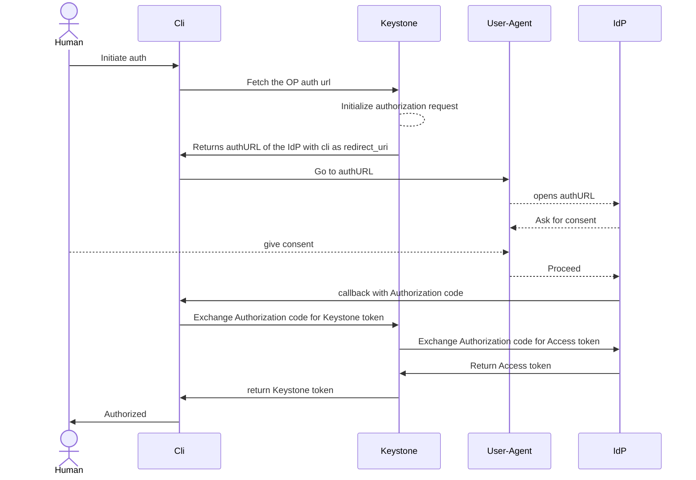

# Authentication using the Authorization Code flow and Keystone serving as RP



## TLDR

The user client (cli) sends authentication request to Keystone specifying the
identity provider, the preferred attribute mapping and optionally the scope (no
credentials in the request). In the response the user client receives the time
limited URL of the IDP that the user must open in the browser. When
authentication in the browser is completed the user is redirected to the
callback that the user also sent in the initial request (most likely on the
localhost). User client is catching this callback containing the OIDC
authorization code. Afterwards this code is being sent to the Keystone together
with the authentication state and the user receives regular scoped or unscoped
Keystone token.

## User domain mapping

Long years of working with multiple CSPs showed that there is no single way how
users are stored in external IdPs. Sometimes it is desired to have a single
"realm" with all users of the cloud differentiated by certain attributes or
group memberships. Or every OpenStack domain is mapped as a dedicated "realm" in
which case users are more isolated from each other. Or every customer is having
a physically different IdP.

A Keystone identity provider can be bound to a single domain by setting the
domain-id attribute on it. This means all users federated from such IDP would be
placed in the specified domain.

A Keystone attribute mapping can be dedicated for a certain domain by setting
the domain-id attribute. In such case all users authenticating using such
attribute mapping would be placed in the specified domain. This makes it
possible for the users to obtain memberhip in other domain and should therefore
be used with extra care and only when absolutely necessary.

The ultimate flexibility of having a single IdP for multiple domains is by
specifying the claim attribute that specifies domain the user should belong to.
This is implemented by using the `domain-id-claim` attribute of the mapping.
Authentication with the claim missing is going to be rejected.

## Using Okta as the Identity provider for a single domain

Okta/Auth0 as an managed Identity provider can be easily integrated as a source
of the users and groups for the customer dedicated domain.
[A dedicated application](https://developer.okta.com/docs/guides/implement-grant-type/authcode/main/#set-up-your-app)
need to be established on Okta (i.e. OpenStack) for the authentication
delegation. There are many configuration options that can be used on the Okta
side and will influence the interaction. It is not possible to describe every
single one precisely, therefore only the basic setting are described here:

- grant type: authorization code
- sign in redirect uris (enable the cli login):
  [`http://localhost:8050/oidc/callback`].

Group memberships are not exposed by default and require
[additional changes](https://developer.okta.com/docs/guides/customize-tokens-groups-claim/main/#add-a-groups-claim-for-a-custom-authorization-server)

On the Keystone side the following must be implemented:

- register an identity provider with the data obtained from Okta app
  configuration:

  ```console
  osc identity4 federation identity-provider create --bound-issuer <OKTA_ISSUER> --oidc-client-id <CLIENT_ID> --oidc-client-secret <CLIENT_SECRET> --oidc-discovery-url <OKTA_DISCOVERY_URL> --default-mapping-name okta --domain-id <DOMAIN_ID> --name okta
  ```

  Default mapping name is created in the next step and is not explicitly
  required. It is used when no mapping was explicitly specified in the
  authentication request. The provider name can be also obfuscated more. The
  authentication depends on the identity provider ID and not the name.

- create authentication mapping

  ```console
  osc identity4 federation mapping create --user-id-claim sub --idp-id <IDP_ID> --user-name-claim preferred_username --name okta --oidc-scopes openid,profile
  ```

Afterwards `osc` can be used by users to authenticate.

clouds.yaml

```yaml
clouds:
  devstack-oidc-okta:
    auth_type: v4federation
    auth:
      auth_url: <KEYSTONE_URL>
      identity_provider: <IDP_ID>
```

```console
$ osc --os-cloud devstack-oidc-okta auth show
A default browser is going to be opened at `https://<CENSORED>.okta.com/oauth2/default/v1/authorize?response_type=code&client_id=<CENSORED>&state=<CENSORED>&code_challenge=<CENSORED>&code_challenge_method=S256&redirect_uri=http%3A%2F%2Flocalhost%3A8050%2Foidc%2Fcallback&scope=openid+profile+openid&nonce=<CENSORED>`. Do you want to continue? [y/n]
```

## Using Keycloak as the Identity provider for a single domain

Keycloak can be used as an Identity provider by the Keystone.

A dedicated client must be created with following settings:

- client authentication (to obtain client_id and client_secret)

- "standard flow" to allow the authorization code flow

- valid_redirect_uris: [`http://localhost:8050/oidc/callback`]

On the Keystone side the following must be implemented:

- register an identity provider with the data obtained from Okta app
  configuration:

  ```console
  osc identity4 federation identity-provider create --bound-issuer <KEYCLOAK_ISSUER> --oidc-client-id <CLIENT_ID> --oidc-client-secret <CLIENT_SECRET> --oidc-discovery-url <KEYCLOAK_DISCOVERY_URL> --default-mapping-name keycloak --domain-id <DOMAIN_ID> --name keycloak
  ```

  Default mapping name is created in the next step and is not explicitly
  required. It is used when no mapping was explicitly specified in the
  authentication request. The provider name can be also obfuscated more. The
  authentication depends on the identity provider ID and not the name.

- create authentication mapping

  ```console
  osc identity4 federation mapping create --user-id-claim sub --idp-id <IDP_ID> --user-name-claim preferred_username --name keycloak --oidc-scopes openid,profile
  ```

## Using Keycloak as the Identity provider as shared IdP

In this scenario Keycloak is used to manage users belonging to different
OpenStack domains. During the login the domain relation is identified using the
additional attribute present in the claims. It must be set to the domain_id of
the domain the user belongs to. There are multiple ways how this attribute can
be set. For the sake of example simplicity domains are modelled as user groups
in Keycloak. Such group gets the attribute with the value of the domain_id.
Users belonging to such group inherit this attribute automatically.
Alternatively every user may be extended with the domain_id attribute
individually.

Keycloak can be used as an Identity provider by the Keystone.

A dedicated client must be created with following settings:

- client authentication (to obtain client_id and client_secret)

- "standard flow" to allow the authorization code flow

- valid_redirect_uris: [`http://localhost:8050/oidc/callback`]

A dedicated (and default) client scope must be created with the user attribute
claim mapper populating "domain_id" scope with the corresponding value.

On the Keystone side the following must be implemented:

- register an identity provider with the data obtained from Okta app
  configuration:

  ```console
  osc identity4 federation identity-provider create --bound-issuer <KEYCLOAK_ISSUER> --oidc-client-id <CLIENT_ID> --oidc-client-secret <CLIENT_SECRET> --oidc-discovery-url <KEYCLOAK_DISCOVERY_URL> --default-mapping-name keycloak --name keycloak
  ```

  Default mapping name is created in the next step and is not explicitly
  required. It is used when no mapping was explicitly specified in the
  authentication request. The provider name can be also obfuscated more. The
  authentication depends on the identity provider ID and not the name.

- create authentication mapping

  ```console
  osc identity4 federation mapping create --user-id-claim sub --idp-id <IDP_ID> --allowed-redirect-uris https://<KEYSTONE_DOMAIN>/v4/federation/oidc/callback --user-name-claim preferred_username --name keycloak --oidc-scopes openid,profile --domain-id-claim <DOMAIN_ID_CLAIM_NAME>
  ```

The clouds.yaml does not need any change for this authentication method.

Alternatively user domain relation may be implemented using dedicated clients,
what would result in having multiple identity providers. A yet another
possibility is to use the dedicated mappings. In this case the domain-id
attribute may be set on the mapping itself, no domain-id-claim would be
respected, but also the authentication would need to explicitly specify the
desired mapping. This option enables user to gain membership in different
domains and may not be desired.
