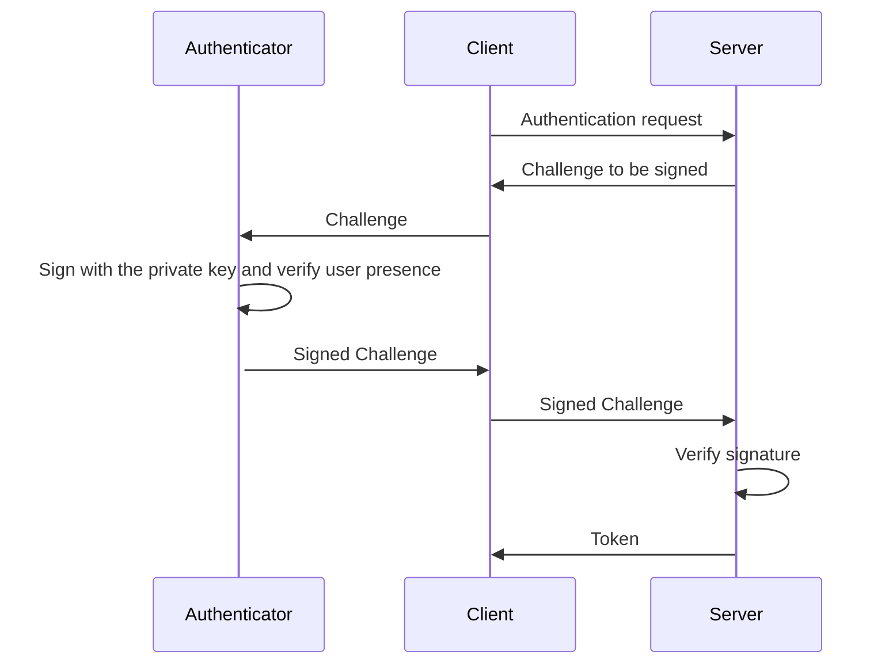

# PassKey (WebAuthN)

A new way of authentication using Security Device (a passkey type) is being
added to allow authenticating the user more securely.

Important thing to be mentioned is that Operating System Passkeys (Apple
keychain passkey, Google passkey, Microsoft ???) require browser to be running.
This makes them unsuitable for the remote access. It is possible to implement
client authentication similar to the OIDC login which also requires browser, but
it is not implemented now. Therefore only authentication with bare security
device (Yubikey or similar) is implemented.

## Authenticate with Security Device



## API changes

Few dedicated API resources are added controlling the necessary aspects:

- /users/{user_id}/passkeys/register_start (initialize registering of the
  security device of the user)

- /users/{user_id}/passkeys/register_finish (complete the security key
  registration)

- /users/{user_id}/passkeys/login_start (initialize login of the security device
  of the user)

- /users/{user_id}/passkeys/login_finish (complete the security key login)

## DB changes

Following DB tables are added:

- webauthn_credential

```rust
{{#include ../../src/db/entity/webauthn_credential.rs:9:17}}
```

- webauthn_state

```rust
{{#include ../../src/db/entity/webauthn_state.rs:9:12}}
```
