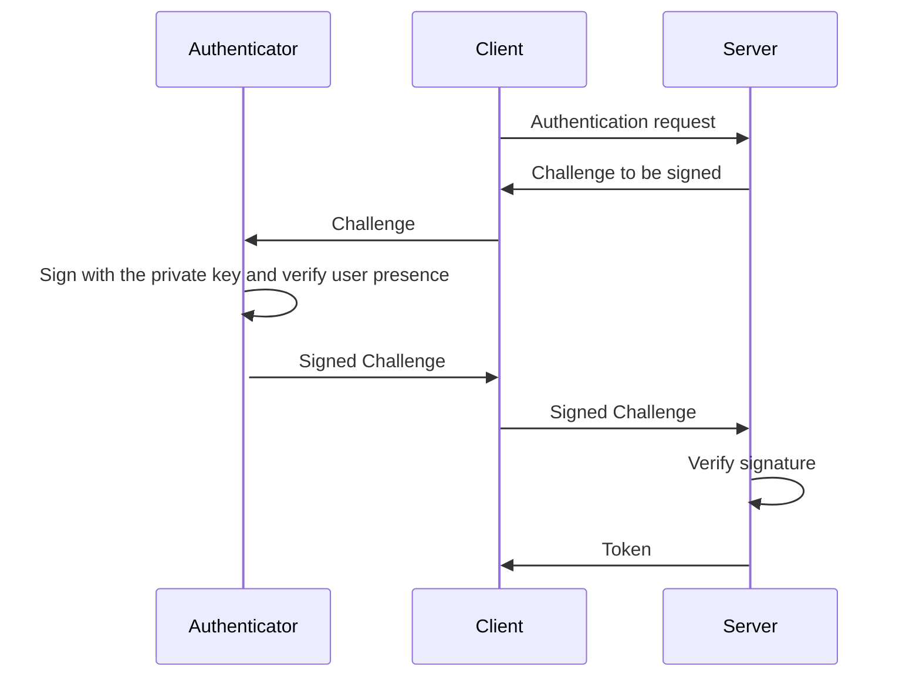

# PassKey (WebAuthN)

A new way of authentication using Security Device (a passkey type) is being
added to allow authenticating the user more securely.

Important thing to be mentioned is that Operating System Passkeys (Apple
keychain passkey, Google passkey, Microsoft ???) require browser to be running.
This makes them unsuitable for the remote access. It is possible to implement
client authentication similar to the OIDC login which also requires browser, but
it is not implemented now. Therefore only authentication with bare security
device (Yubikey or similar) is implemented.

## Authenticate with Security Device


```mermaid

sequenceDiagram

    participant Authenticator
    Client->>Server: Authentication request
    Server->>Client: Challenge to be signed
    Client->>Authenticator: Challenge
    Authenticator->>+Authenticator: Sign with the private key and verify user presence
    Authenticator->>Client: Signed Challenge
    Client->>Server: Signed Challenge
    Server->>Server: Verify signature
    Server->>Client: Token
```

## User enumeration prevention

The `/auth/passkey/start` endpoint must not reveal whether a user exists or
has registered passkeys. When authentication is started for an unknown user
(or a user without passkeys), Keystone responds with a regular challenge
containing deterministic **decoy** credential IDs (stable per user id) instead
of an error or an empty `allow_credentials` list. Completing such a ceremony
fails with the same `401` as an attempt against a real user with a credential
that is not in the allow list.

The decoy credential IDs are derived with an HMAC key configured as
`[webauthn]fake_credential_hmac_key`. The key must stay stable across restarts
and be identical on all nodes of a deployment, otherwise decoys become
distinguishable from real credentials. When unset, a random per-process key is
generated at startup and a warning is logged.

## API changes

Few dedicated API resources are added controlling the necessary aspects:

- `/users/{user_id}/passkeys/register_start` (initialize registering of the
  security device of the user)

- `/users/{user_id}/passkeys/register_finish` (complete the security key
  registration)

- `/users/{user_id}/passkeys/login_start` (initialize login of the security device
  of the user)

- `/users/{user_id}/passkeys/login_finish` (complete the security key login)

## DB changes

Following DB tables are added:

- `webauthn_credential`

```rust
{{#include ../../crates/keystone/src/db/entity/webauthn_credential.rs:9:17}}
```

- `webauthn_state`

````rust
{{#include ../../crates/keystone/src/db/entity/webauthn_state.rs:9:12}}
```
