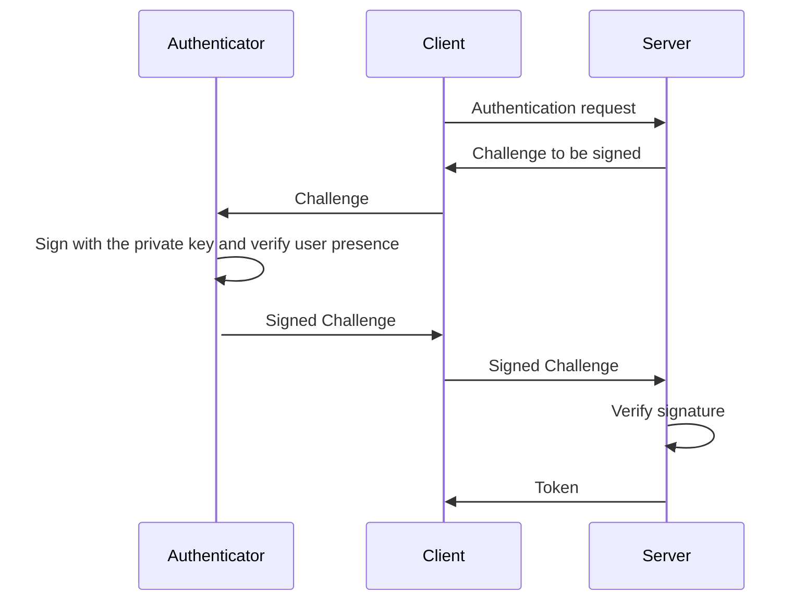

# Passkey Authentication (WebAuthn)

Keystone-NG supports registration of a hardware security device and a two-step
passkey authentication ceremony. Platform passkeys that require an embedded
browser are not currently supported by the client flow described here.

## Registration

Registration uses these v4 endpoints for the target user:

1. `POST /v4/users/{user_id}/passkeys/register_start`
2. `POST /v4/users/{user_id}/passkeys/register_finish`

The first response contains the WebAuthn creation options. Pass those options
to the authenticator and send its signed result to the finish endpoint.

## Authentication

Authentication uses:

1. `POST /v4/auth/passkey/start`
2. `POST /v4/auth/passkey/finish`

The start response contains a challenge. The authenticator verifies user
presence and signs that challenge; the finish request returns a Keystone token
after successful verification.

See the [administrator guide](../../admin/features/passkeys.md) for relying-party
configuration and deployment requirements.
