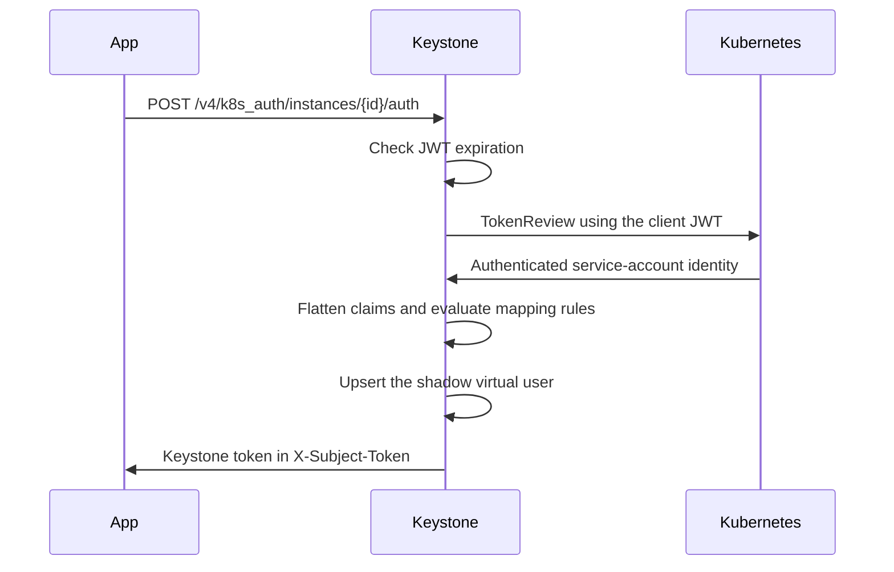

# Kubernetes TokenReview Authentication

Kubernetes workloads can exchange a service-account JWT for a Keystone token.
Keystone validates the JWT with the configured Kubernetes cluster, converts the
returned service-account identity into mapping claims, and applies the first
matching identity-mapping rule.

Ask the domain administrator for the Kubernetes authentication instance ID and
the mapping rule requirements before configuring a workload. The operator must
register the cluster and enable the instance first.

## Authentication request

Send the service-account JWT to the instance-specific endpoint:

```http
POST /v4/k8s_auth/instances/{instance_id}/auth
Content-Type: application/json

{
  "jwt": "<service-account-jwt>",
  "rule_name": "ci-pipeline-admin"
}
```

| Field | Required | Description |
| --- | --- | --- |
| `jwt` | yes | Kubernetes service-account JWT presented to TokenReview. |
| `rule_name` | no | Mapping-rule hint evaluated before normal ordered matching. |

The client JWT is also used to authorize Keystone's TokenReview request to the
Kubernetes API. The service account therefore needs permission to create
`tokenreviews.authentication.k8s.io`, normally through the Kubernetes
`system:auth-delegator` role.

On success, Keystone returns `200 OK`, places the encoded token in the
`X-Subject-Token` response header, and returns the token document in the body.

## Authentication flow



The TokenReview result produces these mapping claims:

| Claim | Value |
| --- | --- |
| `k8s.serviceaccount.name` | Service-account name parsed from the reviewed username. |
| `k8s.serviceaccount.namespace` | Kubernetes namespace parsed from the reviewed username. |
| `k8s.aud` | JWT audience, when present. |

The mapping rule determines the resulting principal, scope, roles, and groups.
If `rule_name` is supplied, Keystone evaluates that rule first. If it does not
match, normal first-match-wins evaluation continues.

The virtual user ID is deterministic for the service-account name, namespace,
cluster, and Keystone deployment. Keystone also records the mapping ruleset
version so a token is rejected if its authorization rules change later.

See [Identity Mapping Rules and API](identity-mapping.md) for Kubernetes claim
examples and rule management. See the
[administrator guide](../../admin/features/kubernetes-auth.md) for cluster
registration, CA trust, and operational requirements.
