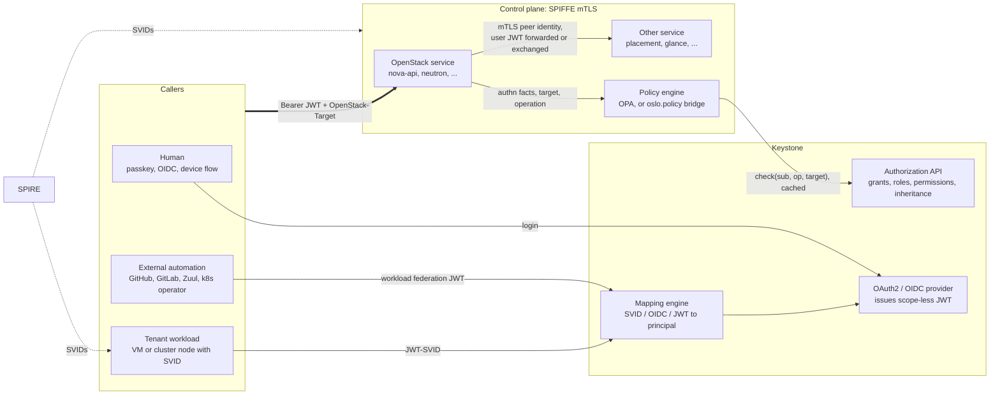
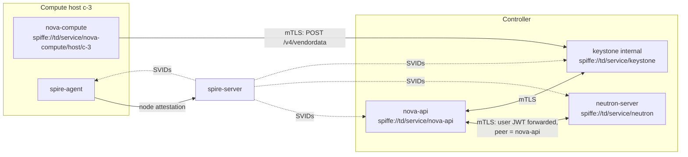
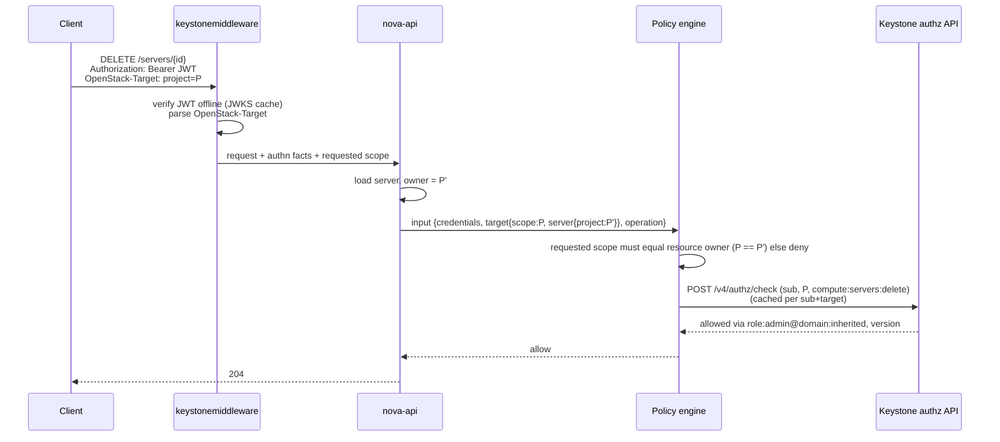
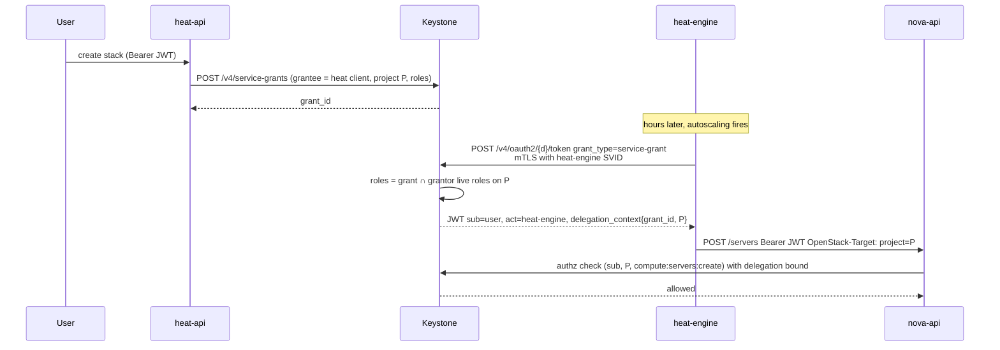
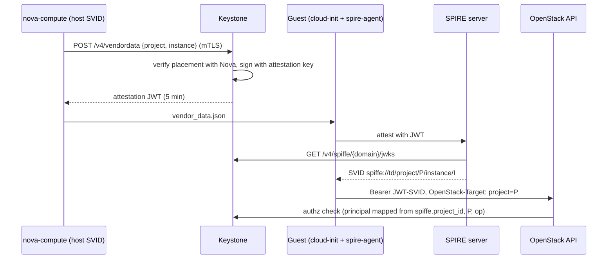

# OpenStack Authentication and Authorization: A Vision

**Status:** Draft for community discussion

**Date:** 2026-09-10

This document proposes a target model for authentication and authorization
across OpenStack. It is derived from the architecture decisions already taken in
the Rust Keystone implementation (the ADRs under `adr/`) and from the SPIRE
integration plan (`doc/plans/spire-integration.md`), and it extends them into
one coherent picture that other OpenStack projects can react to. It is
deliberately written for a wide audience: operators, service maintainers, SDK
authors, and the Technical Committee. It is not an ADR and it does not commit
any project to anything; its purpose is to give the community a concrete
proposal to argue about.

The model is described independently of any implementation. The Rust Keystone is
the reference implementation and the place where the building blocks already
exist, but nothing in the proposal requires it; Python Keystone,
`keystonemiddleware`, `oslo.policy` and every service can adopt the pieces that
concern them.

Each part states its own requirements and limits where it is described, and the
last section lists the questions the community, not this document, has to
answer.

## 1. The vision in one page

OpenStack authentication and authorization today is built around one artifact:
the scoped bearer token. A token proves who the caller is _and_ carries the
project, domain or system the caller may act on _and_ the roles the caller holds
there, frozen at issuance. Every service validates that token against Keystone
(or a cache of Keystone) and applies a local policy file that reads the roles
and the scope out of it.

The proposal separates the three things the token conflates:

| Concern           | Today                                                  | Proposed                                                                                                                                                                                                                                                                                   |
| ----------------- | ------------------------------------------------------ | ------------------------------------------------------------------------------------------------------------------------------------------------------------------------------------------------------------------------------------------------------------------------------------------ |
| **Who** (authn)   | Fernet/JWS token, password, app-cred, trust            | Short-lived signed JWT for the public API (OIDC/OAuth2, passkeys, device flow, workload federation); SPIFFE mTLS identity for everything inside the control plane and for tenant workloads                                                                                                 |
| **Where** (scope) | Baked into the token at issuance                       | Stated per request (a structured `OpenStack-Target` header, or derived from the addressed resource), generalizing the v3 tokenless auth headers to every call. The scope _types_ do not change: project, domain and system scope all survive, they stop being properties of the credential |
| **What** (authz)  | Roles frozen into the token; `oslo.policy` per service | Decided per request by a policy engine that receives the authentication facts, the target scope and the operation, and asks Keystone whether the caller holds the required role or permission on that target                                                                               |

The central move is the third row. Today a service asks "does the role list
inside this token contain `admin`, and does the scope inside this token match
the resource?". Under this proposal it asks Keystone "does this principal hold
the role or permission this operation requires, on this target?". The token
stops being the carrier of the answer and becomes only the proof of who is
asking.

Four further changes follow from this split:

- **The control plane authenticates with mTLS and nothing else.** Every
  OpenStack service holds a SPIFFE identity issued by SPIRE. Service-to-service
  calls, the Keystone back-channel, and the Nova-to-Keystone attestation path
  all authenticate at the TLS layer. Service users, service passwords and
  `X-Service-Token` disappear.
- **Trusts are replaced by service grants and on-behalf-of exchange**
  ([ADR 0036](adr/0036-service-delegation.md)). The acting service is always
  recorded, no secret is ever delegated, and the delegation boundary is a fact
  of the authentication chain rather than of the token's scope.
- **Tenant workloads get platform identity without credentials.** A VM or a
  Kubernetes node boots, attests to SPIRE with a Keystone-signed proof of its
  placement, receives a project-bound SVID, and calls the OpenStack APIs with
  it. No password, application credential or EC2 key is ever written into a
  guest.
- **Humans authenticate with phishing-resistant methods.** WebAuthn passkeys and
  OIDC federation are first-class; the CLI authenticates with WebAuthn directly,
  and the device authorization grant covers headless machines and CI.

The payoff is a model in which a policy rule, an individual operation, or a set
of operations can be bound to a human, a service or a workload identity on any
target without inventing a new role for it, the way AWS STS session policies or
Azure role assignments work. That is what finally makes "system scope", "global
reader", "domain manager" and "service role" expressible without every service
re-implementing the semantics.

## 2. Where OpenStack is today and what hurts

### 2.1 Tokens carry scope

A Keystone token is `(user, scope, roles, expiry)` sealed together.
Consequences:

- A client that touches three projects holds three tokens, or re-authenticates
  on every switch. SDKs, Terraform providers and dashboards all carry code to
  manage this.
- Every service's policy reads `project_id` and `roles` out of the token. The
  policy therefore answers "does this token's scope match the resource" rather
  than "may this principal do this to that resource". The two questions diverge
  exactly in the cases the community has struggled with for a decade:
  cross-project operations, cloud-wide read, and services acting on behalf of
  users.
- Scope is attacker-influenceable through rescope. Two 2026 advisories
  (OSSA-2026-005, OSSA-2026-015; see the
  [security model](contributor/security-model.md)) are instances of a decision
  keyed on token scope instead of on the immutable authentication chain.

### 2.2 Every request is a Keystone round trip

`keystonemiddleware` validates the token on each request, with a cache in front.
Keystone is on the data path of every OpenStack API call and its availability
bounds the availability of the whole cloud. The Rust implementation already
addresses the validation half of this with offline JWT verification
([ADR 0026](adr/0026-oauth2-oidc-provider.md) §6), but as long as roles are
frozen into the token, offline validation also freezes authorization for the
token lifetime.

This proposal does **not** remove Keystone from the data path. It moves the
round trip from token validation to an authorization decision, and it changes
what a cache entry is keyed on: today one entry per token, afterwards one entry
per `(subject, target)` pair. A caller that touches many projects therefore
trades many tokens for many cache entries. What is gained is that the cached
thing is a live decision with an operator-chosen TTL rather than a frozen role
list with the token's lifetime; what is not gained is independence from
Keystone. §8 states the resulting availability posture, and it is a hard
requirement on any deployment adopting the model.

### 2.3 System scope and the Secure RBAC goal

The community goal "Consistent and Secure Default RBAC" introduced three
personas (`reader`, `member`, `admin`), later `manager` and `service`, on three
scopes (`project`, `domain`, `system`). The design placed the scope in the token
and asked every service to decide what a system-scoped token means for each of
its project-owned resources. Services could not answer that uniformly: a
system-scoped token has no project, so creating a server "as the system" had no
owner, listing servers "as the system" needed new query semantics, and existing
operator tooling broke. The goal was re-scoped; system scope is today avoided by
most services and `admin` on a project remains the practical cloud
administrator.

The root cause is not the persona model, and it is not system scope itself. It
is that the scope was a property of the credential, so the credential had to be
re-issued for each target, and a system-scoped credential arrived at a service
with no project in it at all. This proposal keeps system scope — it is the right
way to name cloud-level resources and cloud-wide authority — and removes it from
the credential. An operator holding a system-level grant names a project target
on the calls that need one and the system target on the calls that do not,
without re-authenticating between them.

### 2.4 Global reader and "admin is global"

Two of the oldest open problems in OpenStack authorization are the same problem
seen from both ends:

- **Global reader:** an auditor, a billing collector, or a monitoring system
  needs read access to every project. Today that requires either `admin`, a role
  on every project, or a system-scoped token that most services cannot
  interpret.
- **Admin is global:** `admin` on _any_ project historically meant `admin`
  everywhere, because policies checked `role:admin` and the token scope was not
  compared to the resource. Fixing this per service took years and is still
  incomplete.

Both need the same primitive: a decision that takes the principal, the operation
and the _resource's_ target, and a single authority that knows how a grant on
the system or on a domain projects onto a project. That authority is Keystone;
today it is not consulted at decision time.

### 2.5 Roles are the only unit of grant

The only thing Keystone can grant is a role on a target. To let one workload
call one operation (rotate a secret, signal a Heat wait condition, read one
metric endpoint), an operator must create a role, wire the role into every
service's policy file, and assign it. Nobody does that; instead the workload
gets `member` or `admin`. Application-credential access rules were meant to
address this and have never been enforced at request time.

Every hyperscaler solved this with permissions as the unit of grant and roles as
named permission sets: AWS IAM actions and policies, GCP IAM permissions and
roles, Azure actions and role definitions. OpenStack already has a cloud-wide
operation vocabulary (the `oslo.policy` rule names such as
`os_compute_api:servers:create`); it has never been usable as a grant.

### 2.6 Secrets everywhere

- Every service has a service user with a password in a config file and the
  `admin` (or `service`) role.
- Heat, Magnum, Mistral and others store trusts; Magnum ships a trustee password
  into every cluster VM.
- Tenant automation gets application credentials or EC2 keys baked into images,
  Kubernetes secrets and CI variables, valid for months.
- Users authenticate with passwords in `clouds.yaml`.

Each of these is a long-lived bearer secret whose theft is indistinguishable
from legitimate use.

### 2.7 How the rest of the industry does it

| Platform   | Credential                                      | Where the scope lives                                          | Unit of grant                         | Workload identity                        |
| ---------- | ----------------------------------------------- | -------------------------------------------------------------- | ------------------------------------- | ---------------------------------------- |
| AWS        | SigV4-signed requests with STS short-lived keys | In the request (resource ARN); evaluated per call              | Action on resource (IAM policy)       | Instance profile, IRSA, roles anywhere   |
| GCP        | OAuth2 access token                             | In the request (resource name); hierarchy inheritance          | Permission; roles are permission sets | Service account attached to the workload |
| Azure      | Entra ID JWT, audience-bound                    | In the role _assignment_, not in the token; evaluated per call | Action; role definitions              | Managed identity                         |
| Kubernetes | Projected service-account token, audience-bound | In the request (namespace/resource); `SubjectAccessReview`     | Verb on resource (RBAC rule)          | Service account, SPIFFE via SPIRE        |
| OpenStack  | Fernet token (JWT in keystone-rs, still scoped) | In the token                                                   | Role on project/domain/system         | Application credential in the guest      |

OpenStack is the outlier on every column. The proposal below moves each column
to the industry pattern while keeping the v3 API and Python services working
during the transition.

## 3. Principles

1. **Authentication proves identity, nothing else.** A credential says who the
   caller is and how strongly that was established (`amr`). It does not say what
   the caller may do.
2. **Authorization is decided per request, against the target.** The target is
   the addressed resource's owner, or the scope the caller names for create/list
   operations. It is never taken from the credential.
3. **Security decisions key on the authentication chain, never on scope.** This
   is the overarching rule of the security model (of which invariant I1,
   "delegation facts come from the chain", is the delegation-specific case),
   generalized: delegation boundaries, restrictions and the acting party are
   chain facts; the target is a per-call input.
4. **Keystone is the authority for grants; services are the authority for
   resources.** A service knows which project a server belongs to; Keystone
   knows whether the caller holds `compute:servers:delete` there, including
   through domain or system inheritance. Neither should have to know the other's
   rules.
5. **Credential-less wherever possible.** Identity is bound to the runtime
   (SPIFFE SVID, attested VM, passkey), not to a secret in a file.
6. **Short-lived, sender-constrained, audience-bound.** Whatever bearer
   artifacts remain live for minutes, are bound to the presenting workload where
   the transport allows it, and name the services that may accept them.
7. **Every acting party is recorded.** Delegated calls carry `act`; audit never
   loses who did what on whose behalf.
8. **Compatibility is a design input, not an afterthought.** v3 tokens, Python
   services and existing SDKs keep working through every phase.
9. **Grants are roles and permissions; a relation store is an implementation
   choice.** The model works on the SQL assignment driver alone. Roles,
   inheritance and permission sets answer every problem in §7; an OpenFGA-backed
   driver (ADR 0033) is valuable for deployments that already run a relation
   store and for resource-level grants (§6.5), and it is a per-domain backend
   decision (ADR 0034), never a prerequisite for adopting anything here.

## 4. Target architecture



### 4.1 Identity tracks

| Caller                                  | Authentication                                                                         | What the service sees                                                      |
| --------------------------------------- | -------------------------------------------------------------------------------------- | -------------------------------------------------------------------------- |
| Human at a browser                      | OIDC authorization code + PKCE at Keystone; passkey or federated IdP behind it         | Bearer JWT, `sub` = user, `amr` = `["webauthn"]` etc.                      |
| Human at a CLI                          | Device authorization grant (browser login with passkey/MFA on a headless machine)      | Same JWT                                                                   |
| External CI / operator                  | Workload federation: platform JWT exchanged through the mapping engine (ADR 0008/0020) | Bearer JWT, `sub` = mapped principal                                       |
| Tenant VM / cluster node                | SPIRE-issued project/instance SVID, presented as JWT-SVID `private_key_jwt`            | Bearer JWT, `sub` = ephemeral principal bound to `spiffe.project_id`       |
| Control-plane service acting as itself  | X.509 SVID at the TLS layer of the internal interface                                  | No token at all; peer identity from the TLS session, mapped to a principal |
| Control-plane service acting for a user | The user's JWT forwarded, or an on-behalf-of token with `act` (ADR 0036 §6)            | User JWT plus service SVID at the transport                                |
| Deferred automation (Heat, Magnum)      | Service grant redeemed with the service SVID (ADR 0036 §5)                             | JWT with `sub` = grantor, `act` = service                                  |

### 4.2 Control plane: mTLS, no dedicated authentication

Every control-plane process holds a SPIFFE identity from a local SPIRE agent
(SPIRE plan Phase 1). Keystone's internal interface, and the internal endpoints
of every other service, terminate SPIFFE mTLS and identify the peer from the
SVID URI. A request from `spiffe://td/service/nova-api` to Neutron is
authenticated by the handshake; Neutron's policy input carries the peer as
`service_credentials` and the forwarded user context (if any) as `credentials`.

This removes:

- service **passwords** in configuration files, and the `admin` role assignments
  services hold today;
- `X-Service-Token` and `service_token_roles_required`, which exist only because
  the transport carried no service identity;
- the plaintext back-channel from `keystonemiddleware` to Keystone (SPIRE plan
  Phase 4.1, the middleware SPIFFE mTLS transport change).

It does not remove the service as a subject of authorization. Every service
still corresponds to a principal in Keystone — mapped from its SPIFFE ID through
the mapping engine rather than carrying a password — and still holds a grant,
namely the `service` permission set on the system target (§7.4). "No dedicated
authentication in the control plane" means the transport authenticates the
service; it does not mean the service is unauthorized, and it does not mean the
service inherits the user's authority. mTLS identifies the _service_, never the
user it serves: a user-initiated call still carries the user's JWT, and a policy
that needs the user must read `credentials`, not `service_credentials`. Read the
other way, this would reintroduce the service-user-with-`admin` pattern under a
new name.

Per-host identities (`.../nova-compute/host/{hostname}`) let Keystone bind an
attestation request to the compute host that actually runs the instance (ADR
0032), which a flat service identity cannot do.



### 4.3 Public API: a JWT that says who, and a request that says where

Keystone is an OAuth2/OIDC provider (ADR 0026). The access token it issues for
OpenStack APIs carries:

- `iss`, `sub`, `aud`, `exp` of about fifteen minutes, `jti`, `amr`. The
  audience is narrowed to the service types the client asked for
  (`openstack-apis:{domain_id}:compute`, …) **by default**; the domain-wide
  `openstack-apis:{domain_id}` audience is an explicit opt-out for clients that
  cannot enumerate their callees. This default is what makes the forwarding rule
  of §4.8 meaningful — a rule that says "forward only tokens whose `aud`
  includes the callee" is vacuous if every token is audience-wide;
- `act` when a service acts on behalf of the subject;
- `delegation_context` when the chain is delegated (service grant, application
  credential, on-behalf-of);
- `restrictions` when the holder asked for a narrower token than its full
  authority (a self-imposed ceiling, see §5.4);
- **no** project, domain or system scope, and **no** roles.

The caller names the target on each request. The proposal generalizes the idea
behind the v3 X.509 tokenless authorization headers, which already let a client
say "I am this certificate, acting on this project", into one structured header
sent on every call:

```http
GET /v2.1/servers HTTP/1.1
Authorization: Bearer <JWT>
OpenStack-Target: project="8e3f..."
```

Section 5 specifies the contract. Section 5.3 shows how `keystonemiddleware` can
turn it into the `X-Project-Id` / `X-Roles` context today's services expect, and
why that compatibility mode is a per-service opt-in rather than a free ride: a
client-supplied target is not a Keystone-attested one, and a service that treats
it as attested is exactly the bug class §5.4 and the
[security model](contributor/security-model.md) exist to prevent.

### 4.4 Authorization: the policy engine asks Keystone

Each service evaluates policy per request with an input of three parts:

```json
{
  "credentials": {
    "sub": "...",
    "amr": ["webauthn"],
    "act": null,
    "delegation_context": null,
    "restrictions": null
  },
  "service_credentials": { "spiffe_id": "spiffe://td/service/nova-api" },
  "target": {
    "scope": { "project_id": "8e3f..." },
    "server": { "id": "...", "project_id": "8e3f..." }
  },
  "operation": "compute:servers:delete"
}
```

The policy decides using local rules (ownership, resource state, `amr`
requirements, delegation tripwires) and one remote fact it cannot know itself:
whether `sub` holds the operation, or a role that implies it, on `target.scope`.
It asks Keystone:

```http
POST /v4/authz/check
{
  "subject": { "sub": "...", "act": null, "delegation_context": null, "restrictions": null },
  "target": { "project_id": "8e3f..." },
  "operations": ["compute:servers:delete"]
}
```

```json
{
  "results": {
    "compute:servers:delete": {
      "allowed": true,
      "via": ["role:admin@domain:inherited"]
    }
  },
  "roles": ["admin"],
  "version": "assignments@1731"
}
```

Keystone resolves direct, group, inherited and system-level grants, intersects
with the delegation boundary and with any self-imposed restriction, and returns
a decision plus the classic role list for policies that still key on roles. The
answer is cacheable per `(subject, target)` for the token lifetime; `version`
lets a cache drop early when assignments change.

This is the Kubernetes `SubjectAccessReview` pattern, and the shape
`oslo.policy` already supports through its `http` check type, which gives Python
services a zero-code migration path (§9).



### 4.5 Delegation without secrets

[ADR 0036](adr/0036-service-delegation.md) replaces trusts with two mechanisms
on the OAuth2 token endpoint:

- **Service grants** for deferred authority (Heat stacks, Magnum clusters,
  Mistral workflows): a user-visible, revocable record naming a registered
  service client as grantee; redeemed with the service's SVID; token `sub` is
  the grantor and `act` is the service.
- **On-behalf-of exchange** (RFC 8693) for continuing a user-initiated operation
  past token expiry (Glance import, long migrations): the service exchanges the
  user's token for one that carries `act`, bound to the root token's `jti` so
  revoking the user's token ends the chain.

No impersonation flag, no redelegation, no use counter, no trustee user, no
password in a cluster. Both mechanisms already place every delegation fact in
`delegation_context`, so they survive scope-less tokens unchanged (ADR 0036 §7).



### 4.6 Tenant workload identity

The SPIRE plan gives every VM a platform identity without a secret in the guest:

1. Nova asks Keystone (over mTLS, with its per-host SVID) for a short-lived
   attestation JWT for `(project, instance)`; Keystone verifies placement with
   Nova before signing (ADR 0032).
2. The JWT is delivered through vendor data; the guest's SPIRE agent presents it
   to the SPIRE server, which mints `spiffe://td/project/{p}/instance/{i}`.
3. The workload calls Keystone's token endpoint with the JWT-SVID
   (`private_key_jwt`) or the OpenStack APIs directly with a JWT-SVID mapped by
   a rule on `spiffe.project_id`, and receives whatever the mapping rule grants:
   a role, or, with §6, a specific set of operations on its own project.

The same path serves Magnum cluster nodes, Trove database guests and any tenant
automation that runs on the cloud; Octavia amphorae are a candidate once their
certificate bootstrap is reconsidered (out of scope in ADR 0036). Application
credentials and EC2 keys remain for automation that runs _outside_ the cloud and
cannot attest, and they shrink to a legacy niche.



### 4.7 Human authentication

- **Passkeys** (ADR 0005) are the default strong method. Keystone acts as the
  WebAuthn relying party; the OIDC provider records `amr: ["webauthn"]`, so a
  policy can require phishing-resistant authentication for sensitive operations
  (key rotation, role assignment, grant creation).
- **External IdPs** federate through the mapping engine (ADR 0020), including
  expiring group membership (ADR 0013) and SCIM provisioning (ADR 0024).
- **CLI login** already reaches passkeys: the Rust CLI authenticates with
  WebAuthn directly, and the device authorization grant covers headless machines
  and CI by delegating to a passkey-capable browser login. This is where
  phishing-resistant authentication earns its keep, because OpenStack users
  authenticate at the CLI and in CI far more than at Horizon. With that path in
  place the `clouds.yaml` password is already optional and is documented as
  deprecated.
- **Step-up** is expressed as `amr` requirements in policy rather than as
  separate credentials.

### 4.8 Cross-service calls on behalf of a user

When Nova calls Neutron for a user it either forwards the user's JWT or performs
an on-behalf-of exchange (§4.5). Forwarding is simpler and works with today's
code, but a forwarded token is accepted by whatever its audience allows, so a
compromised service can act as the user everywhere the token is accepted. The
rule is therefore:

> **Forward only a token whose `aud` includes the callee; otherwise exchange.**

With service-type audiences as the default (§4.3), forwarding is naturally
confined to the services the client already intended to call, and the exchange
path covers the rest. Both paths carry the caller's SVID as
`service_credentials`, which is the control-plane identity that replaces
`X-Service-Token`.

## 5. Scope-less tokens and per-request target scope

### 5.1 Request contract

A request to an OpenStack service names its target in one of three ways, in this
order of precedence:

1. **Resource-derived.** For any operation on an existing resource
   (`GET/PUT/PATCH/DELETE .../servers/{id}`), the target is the owner of that
   resource as recorded by the service. This is authoritative. A client-supplied
   scope that disagrees with it is a policy violation and the request fails
   closed (404 or 403 per the service's existing disclosure rules).
2. **Header.** For operations that have no existing resource (create, list,
   actions on collections), the client sends a structured header (RFC 8941
   dictionary syntax) naming the target:

   ```http
   OpenStack-Target: project="8e3f..."
   ```

   Exactly one of `project`, `domain` or `system-scope` must be present, with a
   string value:

   | Member         | Value      | Target                                                                |
   | -------------- | ---------- | --------------------------------------------------------------------- |
   | `project`      | project id | that project                                                          |
   | `domain`       | domain id  | that domain                                                           |
   | `system-scope` | `all`      | the system: cloud-level resources, and cloud-wide reach over projects |

   `system-scope="all"` is deliberately the **same** system scope the v3 API
   already has, spelled the way `keystonemiddleware` already exposes it
   (`OpenStack-System-Scope: all`). This proposal introduces no new scope type:
   a service that understands system scope today understands this header, and a
   service that does not is in exactly the position it is in today. What changes
   is only that the scope arrives per request instead of frozen into the
   credential, so an operator no longer re-authenticates to move between system
   scope and a project.

   Name-based addressing mirrors the tokenless `X-Project-Name` /
   `X-Project-Domain-Name` pair as dictionary members the middleware resolves to
   ids:

   ```http
   OpenStack-Target: project-name="demo", domain-name="Default"
   ```

   The header may also carry the addressed resource, in the same
   `<service-type>:<resource>:<id>` form the operation vocabulary uses (§6.1):

   ```http
   OpenStack-Target: project="8e3f...", resource="compute:server:550e..."
   ```

   For an existing resource the `resource` member never overrides rule 1: it
   lets the middleware and the policy engine pre-check and audit the request
   before the service loads the resource, and it is the hook for resource-level
   grants (§6.5). A `resource` member that disagrees with the URL, or a
   `project` that disagrees with the loaded resource's owner, fails closed.

3. **Default.** If neither is present, `keystonemiddleware` rejects the request
   unless the operator has enabled fallback to the subject's default project (an
   existing Keystone user attribute) for the migration period. Reject is the
   default; fallback is a documented, per-service opt-in, and it is time-boxed
   by a deprecation cycle so that it expires with the migration rather than
   becoming a permanent mode.

Unauthenticated endpoints are outside this contract: version discovery, JWKS,
`.well-known` documents and health checks carry neither a subject nor a target
and are never subject to rule 3's rejection. A service's list of unauthenticated
routes is the same list it maintains today.

Using a structured field rather than a family of `X-*` headers keeps the grammar
extensible (a later `region` or `resource-version` member is additive), gives
every SDK a standard parser, and avoids the `X-Project-Id` family that
`keystonemiddleware` overwrites on the WSGI environment.

**The resource-derived target always wins (invariant).** Rule 1 is not a
preference, it is the invariant that makes the whole design safe. If a service
trusted `OpenStack-Target` for `DELETE /servers/{id}`, a caller with rights on
project A could name A while deleting a server owned by B. Every service that
participates must therefore compare the requested target to the loaded
resource's owner and fail closed on a mismatch, with the same scope-drift
tripwire discipline the [security model](contributor/security-model.md) applies
to delegation (I2/I3). A service that has not implemented this comparison is not
ready to accept per-request targets, which is why §5.3 makes the compatibility
mode an opt-in.

### 5.2 What `keystonemiddleware` does

1. Verifies the JWT offline (signature, `iss`, `aud`, `exp`, `nbf`), or
   validates a legacy Fernet token through the mTLS back-channel.
2. Parses `OpenStack-Target`; resolves names to ids; validates that the named
   project or domain exists and is enabled (cached, versioned). The result is
   the **requested** target, and the middleware labels it as such: it is a
   client assertion, not a Keystone-attested fact.
3. Populates the WSGI environment with the authentication facts and the
   requested target: `X-User-Id`, `X-Requested-Target`, `X-Actor-*` for `act`,
   the delegation context and the restrictions.
4. Leaves the decision to the service's policy, which resolves the target of
   §5.1 (resource owner first) and asks `/v4/authz/check` for the concrete
   operation on the resolved target. This is the model: the policy asks Keystone
   whether the actor holds the required role or permission on the target,
   instead of reading a role list out of the credential.

The middleware never fills `X-Project-Id` / `X-Roles` from the requested target
on its own initiative, because a role list computed for a client-asserted scope,
placed in the variable legacy policy treats as attested, is precisely the
confusion this proposal exists to remove. It fills them only in the
compatibility mode of §5.3, which a service must opt into.

### 5.3 Compatibility

- A v3 scoped token keeps working: the middleware treats its embedded scope as
  the requested scope and rejects a conflicting `OpenStack-Target` header. A
  scoped token's scope _is_ Keystone-attested, so nothing below applies to it.
- A client that never sends the header and holds a JWT gets the default
  behaviour of §5.1 item 3, which an operator can set to "subject's default
  project" to keep unmodified tooling working.
- Keystone continues to issue scoped tokens on request; `audience` narrowing
  (ADR 0036 §7.1) and the `restrictions` claim (§5.4) let a client voluntarily
  pre-bind a token where a deployment wants that.
- **Compatibility mode is a per-service opt-in.** A service can ask the
  middleware to keep populating `X-Project-Id`, `X-Domain-Id`, `X-Roles` and
  `OpenStack-System-Scope` from the requested target plus a role-list lookup, so
  that unmodified `oslo.policy` rules keep evaluating. Enabling it is a
  declaration by that service that it enforces the §5.1 invariant: every
  operation on an existing resource compares the requested target to the
  resource's own owner and fails closed on a mismatch. Until that declaration
  the middleware refuses the mode, and the service sees only the §5.2
  environment.

  The declaration is the whole point of the opt-in. The environment variables
  are byte-identical to today's, but their provenance is not: under a scoped
  token `X-Project-Id` was attested by Keystone, and under a per-request target
  it is chosen by the caller. A rule that reads `project_id` without comparing
  it to the resource — or code that stamps ownership, charges quota, or
  shortcuts on `is_admin` from it — becomes caller-influenceable. (That is the
  defect class of OSSA-2026-015: a decision keyed on caller-influenceable scope
  instead of on an attested fact.) Adopting per-request targets is therefore a
  real, reviewable change in each service, and §9 budgets for it.

  The mode exists so a service can accept per-request targets before it moves
  its policy to the check API, so it is time-boxed on the same footing as the
  §5.1 item 3 fallback: it is a per-service configuration flag that Keystone can
  report as a capability, and Phase 6 switches it off service by service.

- SDKs add one header and drop per-project re-authentication.

### 5.4 Threat model changes

A scope-less token represents the subject's full authority, as an AWS access key
or an Azure token does. The mitigations are the ones those platforms use, and
most already exist in the ADRs. The first three are **gates on shipping
scope-less tokens at all**, not later refinements. (Without them a scope-less
bearer token is a cloud-wide master key, weaker than the scoped Fernet token it
replaces.) §9 splits the migration at exactly this line (Phase 2a / Phase 2b).

- **Sender constraint (gate).** JWTs issued to SVID holders are bound to the
  SPIFFE identity through `act`/`sub` and presented over mTLS; JWTs issued to
  public clients use DPoP (ADR 0026 v1.5) so a stolen token is unusable without
  the client's key. ADR 0036 rules out RFC 8705 because SPIRE rotates
  certificates, which is correct for a thumbprint binding — the workable
  substitute is to bind to the **SPIFFE ID** rather than to the certificate,
  verified at the internal interface where the SVID is the TLS peer, and that
  binding needs specifying before Phase 2b.
- **Audience narrowing (gate).** Per service type by default (§4.3), so a token
  captured at one service cannot be replayed at another (ADR 0036 §7.1).
- **Self-imposed restrictions (gate).** A client may request a token whose
  `restrictions` claim limits it to named targets and operations (the AWS STS
  session-policy shape). Restrictions only ever narrow, are chain facts, and are
  intersected by `/v4/authz/check`. Token restrictions already exist in the Rust
  implementation (`TokenRestriction`, used by the Kubernetes authentication
  method); this generalizes them. They are also the feature
  application-credential access rules promised and never enforced: a CI job or a
  script can hold a token that can do exactly one thing. Scope-less must be the
  default, never the only option; without restrictions the proposal trades one
  problem (too many tokens) for another (every token is a master key).
- **Short lifetime** (fifteen minutes) with refresh-token rotation and family
  breach detection (ADR 0026 §9).
- **Fail-closed scope agreement.** The resource-derived target always wins over
  the header; a mismatch is an error, never a silent widening (§5.1).
- **Audit.** Every decision logs subject, `act`, requested scope, resolved
  target, operation and outcome (ADR 0023), which is what makes anomaly
  detection on a stolen token possible at all.

## 6. Authorization model

### 6.1 Roles stay; permissions are added

Keystone keeps roles, role assignments, implied roles and inheritance. It adds
**permissions**: operation identifiers drawn from the cloud-wide policy
vocabulary that every service already publishes through `oslo.policy`
(`os_compute_api:servers:create`, `get_image`, `create_port`). A role becomes,
in addition to its name, a named set of permissions; the SRBAC personas are
shipped as such sets:

| Persona   | Meaning as a permission set                                                                                           |
| --------- | --------------------------------------------------------------------------------------------------------------------- |
| `reader`  | every `*:list`, `*:show`, `*:get` operation of every service                                                          |
| `member`  | `reader` plus lifecycle operations on tenant-owned resources                                                          |
| `manager` | `member` plus administration of the target short of `admin`: project manager on a project, domain manager on a domain |
| `admin`   | everything on the target                                                                                              |
| `service` | the operations a control-plane service needs when acting as itself                                                    |

A grant is `(principal, role | permission set | permission, target)`. Targets
are `system`, `domain:<id>`, `project:<id>` and, later, individual resources.
Inheritance is what it is today: a grant on a domain or on the system can be
marked inherited and projects onto every project below it.

Which operations belong to `member` rather than `manager` in each service stays
a per-project decision, and it is the same decision the SRBAC goal already
requires; this proposal changes how the answer is stored, not what it is.

#### The operation vocabulary is a prerequisite

Per-operation grants need stable, cloud-wide operation identifiers. The
`oslo.policy` rule names are close but inconsistent across projects
(`os_compute_api:servers:create` versus `create_port` versus `add_image`), so
the deliverable is a registry with a normalized form
(`<service-type>:<resource>:<verb>`) and a per-project alias table. This is the
largest cross-project ask in this document; authoring it is documentation and a
generator rather than code.

Operating it needs more than that. Because `/v4/authz/check` expands roles and
permission sets into operations at decision time (§6.3), Keystone holds a live
catalog that spans every deployed service, including out-of-tree ones, and that
changes on every service upgrade. Three rules make that tractable:

- **The catalog is deployment state with a version.** Services register their
  operations (or an operator imports the generated registry) and the registry
  version participates in the `version` cookie of §6.3, so a caller's decision
  cache drops when the vocabulary moves under it.
- **Unknown operations fail closed.** A check for an operation the catalog does
  not know is denied, never allowed. A service that ships a new operation before
  the registry knows it is therefore broken loudly for that operation only,
  rather than quietly permissive.
- **Persona sets are expressed as patterns, not enumerations.** `reader` is
  "every `*:list`, `*:show`, `*:get`" evaluated against the catalog, not a
  frozen list of operation names, so a new read operation is covered on the day
  it is registered. This is what keeps a service upgrade from silently demoting
  existing readers, and it is why the verb half of the normalized form has to be
  a closed set.

### 6.2 The authorization input contract

The community-facing deliverable is a schema, not a tool. Any policy engine (OPA
is the reference; `oslo.policy` with an `http` check is the bridge) must
receive:

- `credentials`: the authentication facts from the JWT or SVID, exactly as
  projected by `Credentials` in the Rust implementation, without roles;
- `service_credentials`: the mTLS peer, when a service is calling;
- `target.scope`: the resolved target of §5.1;
- `target.<resource>` and `existing.<resource>` per ADR 0002;
- `operation`: the permission identifier;
- `context`: extra resource facts the calling service attaches for a single
  decision — Neutron's `rbac_policy` sharing rows, an image's member list, a
  secret's ACL, a network's address-scope — passed straight through to the
  engine in its native shape (OPA `input`, OpenFGA contextual tuples plus a
  `context` object, Cedar `context`). This is how a service moves a complex,
  service-specific condition into the check call instead of keeping a local
  enforcement path for it. `context` feeds the decision only; it never feeds
  the delegation boundary, the `restrictions` filter or the role set, all of
  which stay bound to the authentication chain (I1/I2) and are not
  caller-supplied.

The contract is the community-level standard; the engine is not. Mandating OPA
in every service would stall adoption, so OPA is the reference engine and
`oslo.policy` with a `keystone` check type is the bridge — a Python service can
adopt the model by changing its policy defaults rather than its code.

Rules that today read `input.credentials.roles` keep working in the
compatibility mode of §5.3, where the middleware pre-fetches the role list for
the requested target; that mode carries the §5.1 obligation with it. Rules that
need finer control, and every rule in a service that has moved off the
compatibility mode, call the check API for the specific operation on the
resolved target.

### 6.3 The Keystone authorization API

`POST /v4/authz/check` (batchable) answers, for a subject and a target, which of
the listed operations are allowed and through which grant. It applies:

1. direct, group-derived and inherited grants on the target;
2. system-level grants marked as applying to every project (this is how a global
   reader is expressed);
3. the delegation boundary from `delegation_context` (I2/I4 of the security
   model): a delegated subject can only be allowed on its delegated project and
   only for the delegated roles or permissions;
4. `restrictions` from the token;
5. implied-role expansion and role-to-permission expansion.

It is served from the same Raft-replicated data as token issuance, is
horizontally scalable, and is designed to be cached by the caller with a
`version` cookie. The OpenFGA assignment driver (ADR 0033) and per-domain
drivers (ADR 0034) mean a deployment can back this API with a Zanzibar-style
relation store for tenants that already run one, with relation sync (ADR 0035)
keeping group membership consistent.

#### This is the new hot path; design it like one

`/v4/authz/check` replaces token validation on the data path, so its
non-functional requirements are not negotiable: batchable, served from local
Raft state without a SQL round trip, cache-friendly through `version`,
rate-limited per calling SVID, and exposed on the internal interface only. Its
latency budget is the one today's `keystonemiddleware` cache miss has. The
per-request cache (ADR 0030) and the assignment caches (ADR 0034 §8) are the
building blocks. A pushed "entitlement snapshot" per subject is explicitly _not_
the answer: it would recreate the frozen-roles problem this proposal exists to
remove.

#### Collection reads and the per-item re-check

The security model requires list endpoints to re-enforce the per-item read
policy against each record's own identifiers (I8), and forbids replacing that
with a permissive collection filter (I8a). A cross-project list under
`system-scope="all"` therefore cannot be one decision: it is a collection-level
decision plus one per-item decision per record. Three things keep that from
being a per-record round trip:

- **Batch checks.** The API takes a list of `(target, operations)` pairs in one
  call, so a page of results is one request, not one per row.
- **Grant-shaped short-circuit.** When the collection-level decision was allowed
  through a system or domain grant that covers every project in the page, the
  per-item check is answered from that same grant rather than re-derived. This
  is a short-circuit in the _evaluation_, not a relaxation of I8: each item is
  still decided against its own owner, and an item owned outside the grant's
  reach still has to be decided on its own and dropped if denied.
- **Page-scoped caching.** Decisions are cached per `(subject, target)`, so a
  page whose rows share few owners costs few distinct decisions.

The consequence is that cross-project listing is more expensive under this model
than a system-scoped token that services interpreted themselves, and deployments
must size the check API for it.

#### Bootstrapping and Keystone's own authorization

Keystone is itself a service with authorized APIs, so the circularity has to be
stated rather than discovered. Keystone evaluates its own policies against its
own assignment data in-process — it does not call `/v4/authz/check` over the
network to authorize a call to itself — and `/v4/authz/check` is itself
authorized by the caller's SVID at the internal interface, not by a recursive
check. The first grant in a new deployment comes from the existing bootstrap
path (`keystone-manage`, operating on the store directly), exactly as today. In
addition, Keystone exposes a local admin interface over a Unix domain socket: it
carries the full API, is reachable only from the host, and authenticates the
caller by SVID, so a high-security perimeter can drive administrative calls
without a bearer token and with the same policy checks the network API applies.

### 6.4 Binding operations to workload identities

With permissions as a unit of grant, a mapping rule (ADR 0020) can bind an
identity to exactly what it needs:

```json
{
  "name": "cluster-autoscaler",
  "matches": {
    "all": [
      {
        "claim": "spiffe.id",
        "match": "prefix",
        "value": "spiffe://td/project/"
      }
    ]
  },
  "binding": {
    "identity_mode": "ephemeral",
    "project_id": "${claims.spiffe.project_id}",
    "permissions": [
      "compute:servers:create",
      "compute:servers:delete",
      "compute:servers:list"
    ]
  }
}
```

No role is created, no policy file is edited in Nova, and the grant is visible
and revocable in Keystone. This is the AWS STS pattern: the identity assumes a
permission set at authentication time, and the resource service asks the
authority per request. Human users get the same through service grants with a
permission list (ADR 0036 §4) or through self-imposed `restrictions`.

### 6.5 Resource-level targets

Once services pass `target.<resource>` with a stable id, a grant can name a
resource (`server:<id>`) rather than a project. This is how sharing a single
image, a single network or a single secret with another principal becomes a
Keystone grant instead of a per-service sharing API. It is a later phase and
depends on services registering their resource types, but the check API shape
does not change.

This is where a relation store earns its keep: resource-level grants are the
shape OpenFGA (ADR 0033) models well, and a deployment that runs one can back
this phase with it. Per principle 9 that stays a backend choice — the same
grants are expressible on the SQL assignment driver, and no phase of this
proposal requires a relation store to be deployed.

Sharing rules that a service computes today from its own tables — Neutron's
`rbac_policy` entries being the largest example — do not have to become Keystone
grants to move under the check API. A service can keep owning that data and pass
it per call as `context` (§6.2): the engine evaluates the sharing condition, the
service keeps no enforcement branch. Turning those rows into first-class
resource-level grants is then an optional later step, taken if and when the
service wants them managed and audited centrally.

### 6.6 Quota and unified limits

Quota is the one place outside policy where services read the token's scope as
an authoritative project id: it decides which project a new resource is charged
to, and which project's limit is enforced. Moving the scope into the request
does not change what quota means, but it changes where the project id may come
from. The rule follows §5.1: quota is charged to the **resolved** target, which
for a create is the requested target after the service has accepted it, and
never to a value read out of the credential. Two consequences deserve stating in
the unified-limits work rather than being left to each service:

- A create under `system-scope="all"` has no project to charge and must be
  rejected; a cloud administrator creating a resource for a tenant names that
  tenant's project as the target (§7.1), and quota is charged there, to the
  tenant — which is also what makes the operation auditable.
- A delegated call is charged to the delegated project, the same project the
  delegation boundary pins the decision to (I2), so a service grant cannot be
  used to charge one tenant's resources to another's quota.

## 7. What this solves

### 7.1 System scope and the SRBAC personas

The personas survive, system scope survives, and the scope moves out of the
credential. An operator who holds `admin` on `system` sends
`OpenStack-Target: project="P"` when creating a server for a tenant, and Nova
asks Keystone whether that subject may `compute:servers:create` on P. Keystone
says yes because the system grant is inherited. The created server has an owner
(P), quota is charged to P (§6.6), and listing works with `project="P"`.

This is the part of the SRBAC design that did not work, and it is worth being
precise about why. The blocker was never "what is a system administrator"; it
was that a system-scoped _token_ arrived at Nova with no project in it, so
"create a server as the system" had no owner. Per-request targets remove that
situation entirely: the same principal, holding the same system grant, names a
project on the calls that need one. Nova does not need new semantics for
system-scoped creates, because there are none — a create always names a project.
Every service gets consistent persona semantics from one authority instead of
implementing them in its own policy file.

### 7.2 Global reader

A `reader` grant on `system`, inherited, allows every `*:list`/`*:show`
operation on every project. An auditor lists servers with
`OpenStack-Target: system-scope="all"`; Nova checks `compute:servers:list` on
the system target, receives allow, and runs its all-projects query — the same
all-projects query it already runs for a system-scoped token today. No token per
project, no `admin`, no new role in any service, and no new scope type: a
service that supports system scope today supports this, and one that does not is
no worse off than it is now. The per-item obligations of I8 apply as in §6.3.

### 7.3 Admin is global

`admin` on project A now yields `allowed: false` for any target other than A,
because the check is always against the resource's own target. A cloud
administrator is an explicit `admin` grant on `system`. There is no
`is_admin_project`, no `admin` special-casing in policy files, and the
distinction between project administrator and cloud administrator is a Keystone
fact rather than a per-service convention.

### 7.4 Service users with `admin`

A control-plane service acting as itself is identified by its SVID, is mapped to
a principal, and holds the `service` permission set on `system`; nothing else,
and in particular no password and no `admin`. When it acts for a user it
forwards the user's JWT or performs an on-behalf-of exchange, and the policy
sees both the user (`credentials`) and the service (`service_credentials`), so
"only `nova-api` may call `create_port` with `device_owner=compute:*`" is a
plain rule.

### 7.5 Trusts

Replaced as described in §4.5. The remaining trust-shaped use cases in Heat,
Magnum, Mistral, Glance, Nova and Cinder each have a documented migration in ADR
0036 §10.

### 7.6 Cross-project operations

Live migration, image sharing, network RBAC, volume transfer and quota
management all involve a caller acting across targets. With per-request targets,
a single token and a single check per touched target express them without
rescope. Services that today keep a `service_token` fallback to bypass scope can
drop it.

### 7.7 Domain manager

`manager` on `domain:D` is a grant like any other; Keystone resolves it for
`OpenStack-Target: domain="D"` and, when inherited, for every project in D. The
domain-manager persona that has taken several cycles to plumb through Keystone
policies is a permission set plus inheritance, and other services get it for
free.

## 8. Revocation, offline validation and the back-channel

Offline JWT validation removes Keystone from the data path but freezes
authorization for the token lifetime (ADR 0026 §11, SPIRE plan "Mode C"). The
SPIRE plan names three `keystonemiddleware` postures: **Mode A** legacy
(plaintext back-channel), **Mode B** SPIFFE mTLS with a per-request back-channel
call (keeps instant revocation), and **Mode C** JWT offline validation (no
back-channel, trades instant revocation for zero round trips). The proposal
changes the trade-off in a useful way:

- **Authentication** is validated offline: signature and expiry.
- **Authorization** is checked against live Keystone data on every cache miss.
  Disabling a user, removing a role, revoking a grant or narrowing a delegation
  takes effect at the next cache expiry, which an operator sets independently of
  the token lifetime (for example sixty seconds for high-sensitivity services,
  the full token lifetime for read-heavy ones).
- The `version` cookie and an optional signed revocation feed
  (`/v4/oauth2/{domain}/revocations`, SPIRE plan "Mode C") let caches drop early
  without a per-request round trip.

Keystone therefore remains a runtime dependency, as it is today, but with a
cache in front that degrades gracefully: on Keystone unavailability, cached
decisions remain valid until their TTL and new decisions fail closed. This is
the same posture `keystonemiddleware` has with its token cache, and the same one
Kubernetes API servers take with webhook authorizers.

That posture is an operational requirement of the same weight as the SPIRE
dependency, and it has to be written down where operators will read it rather
than inferred:

- Deployment guides state the fail-closed behaviour explicitly: when the check
  API is unreachable and no cached decision applies, the request is denied, and
  the cache TTL is the length of the resulting brown-out.
- Cache sizing is a documented number, not a default. The entry count scales
  with distinct `(subject, target)` pairs, not with tokens (§2.2), so a
  multi-project workload sizes differently than today's token cache.
- Multi-region deployments need a region-local read path for the check API —
  Raft learners or read replicas — because a cross-region round trip on every
  cache miss puts a WAN in the middle of every API call.

## 9. Migration and coexistence

Every phase is additive; Python Keystone, Fernet tokens and unmodified services
keep working throughout. Phase 2 is deliberately split: the per-request target
and the check API can land against today's scoped tokens and stand on their own,
while the scope-less token cannot ship until the constraints of §5.4 exist.
Nothing between 2a and 2b leaves a deployment holding unconstrained cloud-wide
bearer tokens.

```mermaid
flowchart LR
    p0["Phase 0<br/>shipped foundation"]
    p1["Phase 1<br/>control-plane identity"]
    p2a["Phase 2a<br/>per-request target"]
    p2b["Phase 2b<br/>scope-less JWT"]
    p3["Phase 3<br/>permissions"]
    p4["Phase 4<br/>delegation"]
    p5["Phase 5<br/>workload identity"]
    p6["Phase 6<br/>policy-engine path"]
    p7["Phase 7<br/>sunset"]
    p0 --> p1 --> p2a
    p2a -->|"gate: restrictions,<br/>audience, sender constraint"| p2b
    p2b --> p3 --> p4 --> p5 --> p6 --> p7
```



- **Phase 0 (shipped):** Rust Keystone beside Python Keystone; Fernet parity;
  OPA policies; `SecurityContext` invariants; mapping engine; OAuth2/OIDC
  provider.
- **Phase 1, control-plane identity:** SPIRE in devstack and deployment tooling;
  per-service and per-host SVIDs; `keystonemiddleware` SPIFFE transport (SPIRE
  plan Mode B).
- **Phase 2a, per-request target:** `OpenStack-Target` header;
  `/v4/authz/check`; middleware exposes the requested target as a client
  assertion; per-service adoption of the resource-owner-wins invariant (§5.1)
  and, where wanted, opt-in to the compatibility mode (§5.3); SDK header
  support. Tokens are still scoped, so this phase adds capability without
  weakening any credential, and each service migrates on its own schedule.
- **Phase 2b, scope-less JWT — gated:** may not start until the `restrictions`
  claim, service-type audience narrowing and sender-constrained presentation
  (DPoP for public clients, SPIFFE-ID binding for SVID holders) are all shipped.
  Then: scope-less access tokens, JWT offline filter (Mode C), and scoped tokens
  demoted to a compatibility option.
- **Phase 3, permissions:** operation vocabulary registry with versioning and
  fail-closed unknown operations (§6.1); role as permission set; mapping
  bindings with permissions; batch check API for collection reads (§6.3).
- **Phase 4, delegation:** service grants and on-behalf-of exchange (ADR 0036);
  Heat, Glance and Magnum pilots; trusts off by default.
- **Phase 5, tenant workload identity:** vendor data attestation; SPIRE node
  attestor; JWT-SVID client authentication; Magnum and Trove guests
  credential-less.
- **Phase 6, policy-engine path:** services that want central authorization move
  from `oslo.policy` `http` checks against `/v4/authz/check` to a full
  policy-engine input; the compatibility mode of §5.3 is switched off for those
  services one at a time; service passwords and service `admin` grants removed
  where no longer used; `X-Service-Token` retired once nothing depends on it.
- **Phase 7, sunset:** Fernet validate-only, then off; `/v3/OS-TRUST` removed;
  application credentials limited to off-cloud automation.

### 9.1 Two ways to consume the check API

Consuming `/v4/authz/check` is a spectrum of how much of the decision a service
hands over. The first mode is a valid place to stop, and it needs no change to
service code at all.

- **Mode 1, role resolution.** For every request the actor and the
  `OpenStack-Target` go to Keystone, which returns the effective roles and
  permissions on that scope; the caller then evaluates its existing
  `oslo.policy` rules locally, exactly as it does today with a scoped token. The
  only change from today is that the role set arrives per request instead of
  baked into the token — and that swap happens **inside `keystonemiddleware`
  and `oslo.policy`, not in the service.** The middleware already knows the
  request's scope, so it fills the target header; the `oslo.policy` `keystone`
  check resolves the role set. A service whose `policy.yaml` only tests
  scope-level facts (`role:member`, `project_id:%(...)s`, `system_scope:all`)
  ships unmodified: upgrade the two shared libraries and it is on Mode 1. This
  is the drop-in state when tokens go scope-less in Phase 2b.
- **Mode 2, full delegation.** The service sends the actor, the operation and
  the resource and receives allow or deny. It enforces nothing itself. This is
  the Phase 6 end state.

**A deployment may stay on Mode 1 indefinitely.** It is not only a transition
rung. The price of stopping there is capability, not correctness: role
resolution answers only scope-level questions, so Mode 1 does not deliver
resource-level decisions — ownership, attributes, relations (§6.5, ADR 0033) —
permission-set personas beyond what the local rules already encode, or central
policy changes that take effect without redeploying a service. Everything each
service enforced before keeps working unchanged.

That is the point of the split. The mandatory work for the ecosystem is to
upgrade `keystonemiddleware` and `oslo.policy`; the mandatory work for a typical
service is zero. Per-service work starts only where a service opts into
something past Mode 1 — passing the resource owner as the target so its own
resource-scoped rules keep matching (§5.1), permissions, resource-level targets,
full delegation — each taken when that service wants the feature it unlocks, on
its own schedule or never.

Four rules hold across every phase, and they are what "additive" means in
practice:

- v3 scoped tokens and `OpenStack-Target` coexist. A scoped token's own scope is
  the requested scope, and a conflicting header is rejected (§5.3).
- Python Keystone keeps validating the tokens Rust Keystone issues (ADR 0026
  Phase 0) until it is retired.
- No Python-owned table changes; new state lives in Raft-backed drivers.
- Every phase has an off switch that restores the previous behaviour for one
  service without redeploying Keystone.

Held to those rules and to the gate on Phase 2b, the phasing delivers a system
strictly stronger than the status quo at every step: it removes long-lived
secrets from the control plane and from guests, makes every delegation visible
and revocable, gives every service the same persona semantics from one
authority, and makes the scope and role decisions behind the last decade of
authorization advisories impossible to key on the wrong input. The gate is the
load-bearing part — scope-less tokens without restrictions, audience narrowing
and sender constraint, or per-request targets without the resource-owner
invariant, would be a regression, which is why Phase 2 is split where it is.

Concrete dependencies on other projects:

| Project                        | Change                                                                                                                                                                                                                                            |
| ------------------------------ | ------------------------------------------------------------------------------------------------------------------------------------------------------------------------------------------------------------------------------------------------- |
| `python-keystonemiddleware`    | SPIFFE transport; JWT offline filter; `OpenStack-Target` parsing; `/v4/authz/check` client; `X-Requested-Target`/`X-Actor-*` env; per-service gate for the §5.3 compatibility mode                                                                |
| `keystoneauth1`                | Device-flow, `v4servicegrant`, `v4onbehalfof` plugins; per-request scope instead of per-session scope                                                                                                                                             |
| `oslo.policy`                  | A first-class `keystone` check type wrapping `/v4/authz/check` (the existing `http` check works as a stopgap); operation registry export                                                                                                          |
| `openstacksdk`, CLI, Terraform | Send `OpenStack-Target`; stop re-authenticating per project                                                                                                                                                                                       |
| Nova, Neutron, Cinder, Glance  | **Enforce resource-owner-wins (§5.1) on every resource operation** before accepting per-request targets; pass resource owner as `target.scope`; charge quota to the resolved target (§6.6); drop `is_admin` shortcuts and service-token fallbacks |
| Heat, Magnum, Mistral, Glance  | Service grants / on-behalf-of instead of trusts (ADR 0036 §10)                                                                                                                                                                                    |
| Nova (compute)                 | `vendor_data_url` to Keystone; per-host SVID (SPIRE plan Phase 1-2)                                                                                                                                                                               |
| Deployment tooling             | SPIRE server and agents; OPA or the `oslo.policy` bridge; internal endpoints on SPIFFE mTLS                                                                                                                                                       |

## 10. What the community still decides

1. **Header grammar details.** `OpenStack-Target` as an RFC 8941 dictionary is
   proposed; open are the exact member names, whether `resource` is mandatory
   for single-resource operations once services support it, and how multi-target
   operations (server migration between projects, image sharing) name a second
   target.
2. **Where does the operation registry live?** In `oslo.policy` as generated
   documentation, in Keystone as a resource services register at startup, or in
   a separate governance-owned document?
3. **Cross-project listing for non-admins.** `system-scope="all"` reuses the
   existing system scope and therefore keys on a system-level grant, exactly as
   today. It leaves untouched the case of a user with roles on many projects who
   wants one listing across them; resolving that to "the set of projects the
   subject can read, with the service filtering" is friendlier to those users
   and considerably more expensive. Is it worth a separate target, or is it a
   client-side concern?
4. **DPoP versus mTLS-bound tokens for public clients.** DPoP is the OAuth
   standard; OpenStack clients have no established key-management story for it
   yet.
5. **Resource-level grants.** Whether and when to let Keystone hold grants on
   individual resources, replacing per-service sharing APIs.
6. **Retirement timeline for application credentials and EC2 keys** once
   off-cloud automation can use workload federation and on-cloud automation has
   SVIDs.

## 11. References

- [ADR 0002 — Open Policy Agent](adr/0002-open-policy-agent.md)
- [ADR 0005 — Passkey authentication](adr/0005-auth-passkey.md)
- [ADR 0008 — Workload federation](adr/0008-federation-workload.md)
- [ADR 0014 — Application credentials](adr/0014-application-credentials.md)
- [ADR 0017 — Security context](adr/0017-security-context.md)
- [ADR 0020 — Mapping engine](adr/0020-mapping-engine.md)
- [ADR 0021 — API-key ingress](adr/0021-api-key-scim.md)
- [ADR 0023 — Auditing](adr/0023-audit.md)
- [ADR 0025 — Dynamic authentication plugins](adr/0025-dynamic-auth-plugins.md)
- [ADR 0026 — OAuth2 / OIDC provider](adr/0026-oauth2-oidc-provider.md)
- [ADR 0030 — Per-request cache](adr/0030-per-request-cache.md)
- [ADR 0032 — Vendor data JWT attestation](adr/0032-vendor-data-jwt.md)
- [ADR 0033 — OpenFGA assignment driver](adr/0033-openfga-assignment-driver.md)
- [ADR 0034 — Per-domain assignment drivers](adr/0034-per-domain-assignment-drivers.md)
- [ADR 0035 — Relation sync provider](adr/0035-relation-sync-provider.md)
- [ADR 0036 — Service delegation](adr/0036-service-delegation.md)
- [Security model](contributor/security-model.md)
- SPIRE integration plan (`doc/plans/spire-integration.md`)
- OpenStack community goal: Consistent and Secure Default RBAC
- Keystone X.509 tokenless authorization (`[tokenless_auth]`)
- RFC 8693 (token exchange), RFC 9449 (DPoP), RFC 8705 (mTLS-bound tokens), RFC
  7523 (JWT client authentication), SPIFFE/SPIRE specifications
