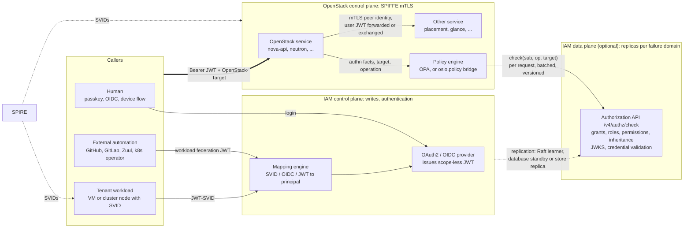
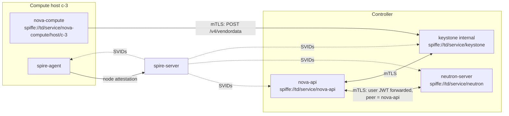
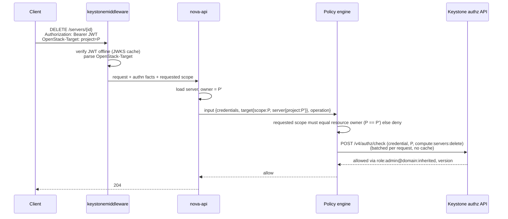
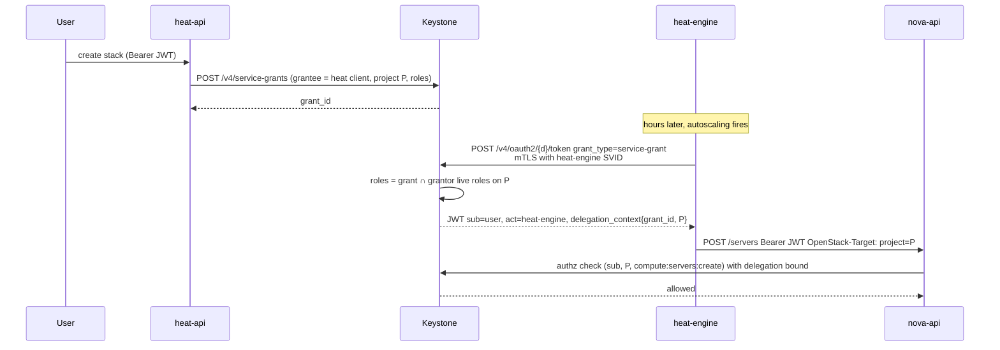
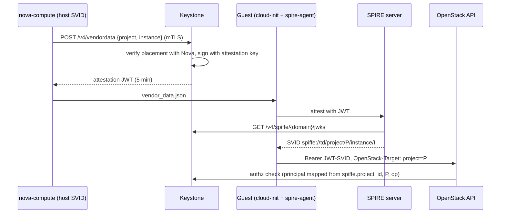
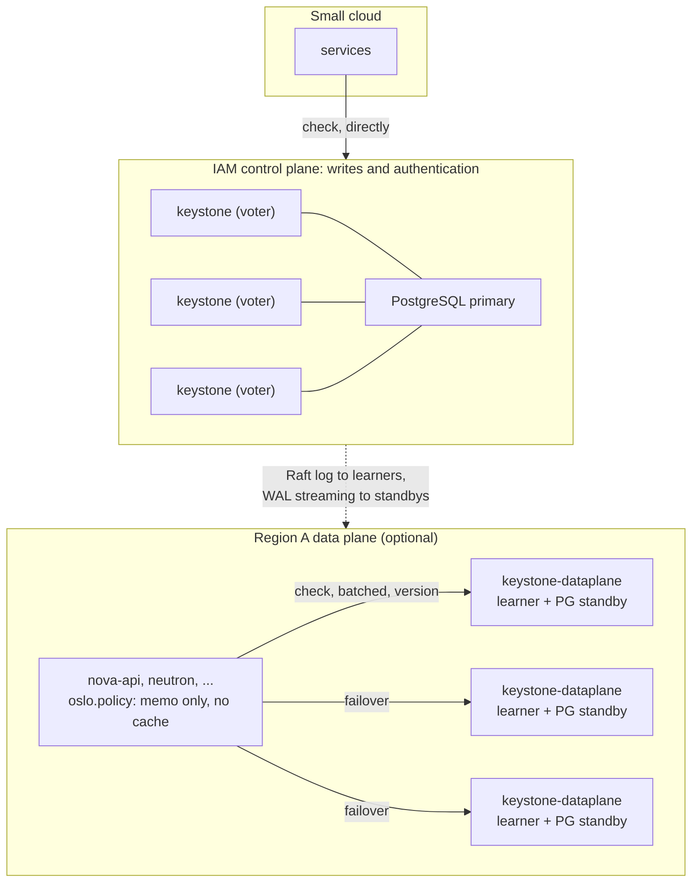

# OpenStack Authentication and Authorization: A Vision

**Status:** Draft for community discussion

**Date:** 2026-09-18

This document proposes a target model for authentication and authorization
across OpenStack. It is derived from the architecture decisions already taken in
the Rust Keystone implementation (the ADRs under `adr/`) and from the SPIRE
integration plan (`doc/plans/spire-integration.md`), and it extends them into
one coherent picture that other OpenStack projects can react to. It is
deliberately written for a wide audience: operators, service maintainers, SDK
authors, and the Technical Committee. It is not an ADR and it does not commit
any project to anything; its purpose is to give the community a concrete
proposal to argue about.

The model is described independently of any implementation. The Rust Keystone is
the reference implementation and the place where the building blocks already
exist, but nothing in the proposal requires it; Python Keystone,
`keystonemiddleware`, `oslo.policy` and every service can adopt the pieces that
concern them.

Each part states its own requirements and limits where it is described, and the
last section lists the questions the community, not this document, has to
answer.

## 1. The vision in one page

OpenStack authentication and authorization today is built around one artifact:
the scoped bearer token. A token proves who the caller is _and_ carries the
project, domain or system the caller may act on _and_ the roles the caller holds
there, frozen at issuance. Every service validates that token against Keystone
(or a cache of Keystone) and applies a local policy file that reads the roles
and the scope out of it.

The proposal separates the three things the token conflates:

| Concern           | Today                                                  | Proposed                                                                                                                                                                                                                                                                                   |
| ----------------- | ------------------------------------------------------ | ------------------------------------------------------------------------------------------------------------------------------------------------------------------------------------------------------------------------------------------------------------------------------------------ |
| **Who** (authn)   | Fernet/JWS token, password, app-cred, trust            | Short-lived signed JWT for the public API (OIDC/OAuth2, passkeys, device flow, workload federation, JWT-SVID for tenant workloads); SPIFFE mTLS identity for everything inside the OpenStack control plane                                                                                 |
| **Where** (scope) | Baked into the token at issuance                       | Stated per request (a structured `OpenStack-Target` header, or derived from the addressed resource), generalizing the v3 tokenless auth headers to every call. The scope _types_ do not change: project, domain and system scope all survive, they stop being properties of the credential |
| **What** (authz)  | Roles frozen into the token; `oslo.policy` per service | Decided per request by a policy engine that receives the authentication facts, the target scope and the operation, and asks Keystone whether the caller holds the required role or permission on that target                                                                               |

The central move is the third row. Today a service asks "does the role list
inside this token contain `admin`, and does the scope inside this token match
the resource?". Under this proposal it asks Keystone "does this principal hold
the role or permission this operation requires, on this target?". The token
stops being the carrier of the answer and becomes only the proof of who is
asking.

Five further changes follow from this split:

- **The OpenStack control plane authenticates with mTLS and nothing else.**
  Every OpenStack service holds a SPIFFE identity issued by SPIRE.
  Service-to-service calls, the Keystone back-channel, and the Nova-to-Keystone
  attestation path all authenticate at the TLS layer. Service users, service
  passwords and `X-Service-Token` disappear.
- **Trusts are replaced by service grants and on-behalf-of exchange**
  ([ADR 0036](adr/0036-service-delegation.md)). The acting service is always
  recorded, no secret is ever delegated, and the delegation boundary is a fact
  of the authentication chain rather than of the token's scope.
- **Tenant workloads get platform identity without credentials.** A VM or a
  Kubernetes node boots, attests to SPIRE with a Keystone-signed proof of its
  placement, receives a project-bound SVID, and calls the OpenStack APIs with
  it. No password, application credential or EC2 key is ever written into a
  guest.
- **Humans authenticate with phishing-resistant methods.** WebAuthn passkeys and
  OIDC federation are first-class; the design intent is for a CLI to
  authenticate with WebAuthn directly, with the device authorization grant
  covering headless machines and CI (§4.7).
- **Keystone's read path can be replicated, and an outage of its write path
  degrades the cloud rather than stopping it.** Authorization decisions and
  credential validation are served from replicas of Keystone's state — an
  optional data plane an operator deploys per failure domain (§4.4, §8) — while
  writes and authentication stay on the **IAM control plane**. Existing
  credentials keep being validated and authorized throughout an outage of it;
  what stops is the issuing of new ones, which the access-token lifetime turns
  into a stated bound (§8.5). A deployment that can live with the availability
  of the control-plane nodes queries them directly and deploys nothing more; the
  API is the same either way.

The payoff is a model in which a policy rule, an individual operation, or a set
of operations can be bound to a human, a service or a workload identity on any
target without inventing a new role for it, the way AWS STS session policies or
Azure role assignments work. That is what finally makes "system scope", "global
reader", "domain manager" and "service role" expressible without every service
re-implementing the semantics.

## 2. Where OpenStack is today and what hurts

### 2.1 Tokens carry scope

A Keystone token is `(user, scope, roles, expiry)` sealed together.
Consequences:

- A client that touches three projects holds three tokens, or re-authenticates
  on every switch. SDKs, Terraform providers and dashboards all carry code to
  manage this.
- Every service's policy reads `project_id` and `roles` out of the token. The
  policy therefore answers "does this token's scope match the resource" rather
  than "may this principal do this to that resource". The two questions diverge
  exactly in the cases the community has struggled with for a decade:
  cross-project operations, cloud-wide read, and services acting on behalf of
  users.
- Scope is attacker-influenceable through rescope. Two 2026 advisories
  (OSSA-2026-005, OSSA-2026-015; see the
  [security model](contributor/security-model.md)) are instances of a decision
  keyed on token scope instead of on the immutable authentication chain.

### 2.2 Every request is a Keystone round trip

`keystonemiddleware` validates the token on each request, with a cache in front.
Keystone is on the data path of every OpenStack API call and its availability
bounds the availability of the whole cloud. Python Keystone is therefore already
the single point of failure of every OpenStack deployment: every authentication
and every token validation goes through it, and the validation cache in front of
it is what makes a short outage survivable. The Rust implementation already
addresses the validation half of this with offline JWT verification
([ADR 0026](adr/0026-oauth2-oidc-provider.md) §6), but as long as roles are
frozen into the token, offline validation also freezes authorization for the
token lifetime.

This proposal does **not** remove the dependency on a running authority. It
makes IAM more resistant than it is today, in three specific ways.
Authentication is verified offline from a signed credential, so no round trip is
needed to establish who is calling. Authorization is decided per request by a
component that can be replicated independently of the nodes that accept writes —
an optional data plane an operator deploys where the availability of the IAM
control plane is not enough (§4.4, §8). And the cost of an outage of it is
stated exactly in §8.5.

The round trip itself moves from token validation to an authorization decision,
and by default no cross-request cache stands in front of it. Python Keystone's
caching layer has produced the most bugs in its design; this proposal replaces
it with a replica of the grant state instead, not a smarter cache (§6.3). A
caller that touches many projects therefore holds one credential and asks one
question per request, batched, against something in its own failure domain.

### 2.3 System scope and the Secure RBAC goal

The community goal "Consistent and Secure Default RBAC" introduced three
personas (`reader`, `member`, `admin`), later `manager` and `service`, on three
scopes (`project`, `domain`, `system`). The design placed the scope in the token
and asked every service to decide what a system-scoped token means for each of
its project-owned resources. Services could not answer that uniformly: a
system-scoped token has no project, so creating a server "as the system" had no
owner, listing servers "as the system" needed new query semantics, and existing
operator tooling broke. The goal was re-scoped; system scope is today avoided by
most services and `admin` on a project remains the practical cloud
administrator.

The root cause is not the persona model, and it is not system scope itself. It
is that the scope was a property of the credential, so the credential had to be
re-issued for each target, and a system-scoped credential arrived at a service
with no project in it at all. This proposal keeps system scope — it is the right
way to name cloud-level resources and cloud-wide authority — and removes it from
the credential. An operator holding a system-level grant names a project target
on the calls that need one and the system target on the calls that do not,
without re-authenticating between them.

### 2.4 Global reader and "admin is global"

Two of the oldest open problems in OpenStack authorization are the same problem
seen from both ends:

- **Global reader:** an auditor, a billing collector, or a monitoring system
  needs read access to every project. Today that requires either `admin`, a role
  on every project, or a system-scoped token that most services cannot
  interpret.
- **Admin is global:** `admin` on _any_ project historically meant `admin`
  everywhere, because policies checked `role:admin` and the token scope was not
  compared to the resource. Fixing this per service took years and is still
  incomplete.

Both need the same primitive: a decision that takes the principal, the operation
and the _resource's_ target, and a single authority that knows how a grant on
the system or on a domain projects onto a project. That authority is Keystone;
today it is not consulted at decision time.

### 2.5 Roles are the only unit of grant

The only thing Keystone can grant is a role on a target. To let one workload
call one operation (rotate a secret, signal a Heat wait condition, read one
metric endpoint), an operator must create a role, wire the role into every
service's policy file, and assign it. Nobody does that; instead the workload
gets `member` or `admin`. Application-credential access rules were meant to
address this: a rule matches `(service, method, path)` and narrows what one
application credential may call. But narrowing is not granting — a credential
created with no access rules inherits its role's full permission set, so an
access rule can only cut down a credential that is already as privileged as its
role allows, never add a permission the role lacks. The rule also lives on the
credential, not on a principal: it cannot be assigned to a human or a workload
identity, held independently of the one credential it was created with, or
inherited by anything else. It is a self-imposed filter over one credential's
own tokens, not a unit of grant.

Every hyperscaler solved this with permissions as the unit of grant and roles as
named permission sets: AWS IAM actions and policies, GCP IAM permissions and
roles, Azure actions and role definitions. OpenStack already has a cloud-wide
operation vocabulary (the `oslo.policy` rule names such as
`os_compute_api:servers:create`); it has never been usable as a grant.

### 2.6 Secrets everywhere

- Every service has a service user with a password in a config file and the
  `admin` (or `service`) role.
- Heat, Magnum, Mistral and others store trusts; Magnum ships a trustee password
  into every cluster VM.
- Tenant automation gets application credentials or EC2 keys baked into images,
  Kubernetes secrets and CI variables, valid for months.
- Users authenticate with passwords in `clouds.yaml`.

Each of these is a long-lived bearer secret whose theft is indistinguishable
from legitimate use.

### 2.7 How the rest of the industry does it

| Platform   | Credential                                      | Where the scope lives                                          | Unit of grant                         | Workload identity                        |
| ---------- | ----------------------------------------------- | -------------------------------------------------------------- | ------------------------------------- | ---------------------------------------- |
| AWS        | SigV4-signed requests with STS short-lived keys | In the request (resource ARN); evaluated per call              | Action on resource (IAM policy)       | Instance profile, IRSA, roles anywhere   |
| GCP        | OAuth2 access token                             | In the request (resource name); hierarchy inheritance          | Permission; roles are permission sets | Service account attached to the workload |
| Azure      | Entra ID JWT, audience-bound                    | In the role _assignment_, not in the token; evaluated per call | Action; role definitions              | Managed identity                         |
| Kubernetes | Projected service-account token, audience-bound | In the request (namespace/resource); `SubjectAccessReview`     | Verb on resource (RBAC rule)          | Service account, SPIFFE via SPIRE        |
| OpenStack  | Fernet token (JWT in keystone-rs, still scoped) | In the token                                                   | Role on project/domain/system         | Application credential in the guest      |

OpenStack is the outlier on every column. The proposal below moves each column
to the industry pattern while keeping the v3 API and Python services working
during the transition.

## 3. Principles

1. **Authentication proves identity, nothing else.** A credential says who the
   caller is and how strongly that was established (`amr`). It does not say what
   the caller may do.
2. **Authorization is decided per request, against the target.** The target is
   the addressed resource's owner, or the scope the caller names for create/list
   operations. It is never taken from the credential.
3. **Security decisions key on the authentication chain, never on scope.** This
   is the overarching rule of the security model (of which invariant I1,
   "delegation facts come from the chain", is the delegation-specific case),
   generalized: delegation boundaries, restrictions and the acting party are
   chain facts; the target is a per-call input.
4. **Keystone is the authority for grants; services are the authority for
   resources.** A service knows which project a server belongs to; Keystone
   knows whether the caller holds `compute:servers:delete` there, including
   through domain or system inheritance. Neither should have to know the other's
   rules.
5. **Credential-less wherever possible.** Identity is bound to the runtime
   (SPIFFE SVID, attested VM, passkey), not to a secret in a file.
6. **Short-lived, sender-constrained, audience-bound.** Whatever bearer
   artifacts remain live for minutes, are bound to the presenting workload where
   the transport allows it, and name the services that may accept them.
7. **Every acting party is recorded.** Delegated calls carry `act`; audit never
   loses who did what on whose behalf.
8. **Compatibility is a design input, not an afterthought.** v3 tokens, Python
   services and existing SDKs keep working through every phase.
9. **Grants are roles and permissions; a relation store is an implementation
   choice.** The model works on the SQL assignment driver alone. Roles,
   inheritance and permission sets answer every problem in §7; an OpenFGA-backed
   driver (ADR 0033) is valuable for deployments that already run a relation
   store and for resource-level grants (§6.5), and it is a per-domain backend
   decision (ADR 0034), never a prerequisite for adopting anything here. The
   choice also decides where the data plane's replica comes from: on the SQL and
   Raft drivers the data plane holds its own copy; on an externally owned store
   it is a client of the store's replication (§6.3, §8.1).
10. **Copies of authorization state are replicas, never caches.** A replica's
    freshness is maintained by the replication protocol, which observes every
    write, and is reported as a version with every answer. A cache's freshness
    depends on the writer remembering to invalidate it, and on a lifetime when
    it does not. Python Keystone's caching bugs were of the second kind, and
    this proposal admits only the first on the request path: a Raft learner, a
    database standby, or a store's own replica. The only memo the architecture
    itself contains is scoped to one request and dies with it; a client-side
    cache is an opt-in a deployment takes on with its constraints, never part of
    the path specified here (§6.3).

## 4. Target architecture



### 4.1 Identity tracks

| Caller                                  | Authentication                                                                         | What the service sees                                                      |
| --------------------------------------- | -------------------------------------------------------------------------------------- | -------------------------------------------------------------------------- |
| Human at a browser                      | OIDC authorization code + PKCE at Keystone; passkey or federated IdP behind it         | Bearer JWT, `sub` = user, `amr` = `["webauthn"]` etc.                      |
| Human at a CLI                          | Device authorization grant (browser login with passkey/MFA on a headless machine)      | Same JWT                                                                   |
| External CI / operator                  | Workload federation: platform JWT exchanged through the mapping engine (ADR 0008/0020) | Bearer JWT, `sub` = mapped principal                                       |
| Tenant VM / cluster node                | SPIRE-issued project/instance SVID, presented as JWT-SVID `private_key_jwt`            | Bearer JWT, `sub` = ephemeral principal bound to `spiffe.project_id`       |
| Control-plane service acting as itself  | X.509 SVID at the TLS layer of the internal interface                                  | No token at all; peer identity from the TLS session, mapped to a principal |
| Control-plane service acting for a user | The user's JWT forwarded, or an on-behalf-of token with `act` (ADR 0036 §6)            | User JWT plus service SVID at the transport                                |
| Deferred automation (Heat, Magnum)      | Service grant redeemed with the service SVID (ADR 0036 §5)                             | JWT with `sub` = grantor, `act` = service                                  |

### 4.2 The OpenStack control plane: mTLS, no dedicated authentication

Every OpenStack control-plane process holds a SPIFFE identity from a local SPIRE
agent (SPIRE plan Phase 1). Keystone's internal interface, and the internal
endpoints of every other service, terminate SPIFFE mTLS and identify the peer
from the SVID URI. A request from `spiffe://td/service/nova-api` to Neutron is
authenticated by the handshake; Neutron's policy input carries the peer as
`service_credentials` and the forwarded user context (if any) as `credentials`.

This removes:

- service **passwords** in configuration files, and the `admin` role assignments
  services hold today;
- `X-Service-Token` and `service_token_roles_required`, which exist only because
  the transport carried no service identity;
- the plaintext back-channel from `keystonemiddleware` to Keystone (SPIRE plan
  Phase 4.1, the middleware SPIFFE mTLS transport change).

It does not remove the service as a subject of authorization. Every service
still corresponds to a principal in Keystone — mapped from its SPIFFE ID through
the mapping engine rather than carrying a password — and still holds a grant,
namely the `service` permission set on the system target (§7.4). "No dedicated
authentication in the control plane" means the transport authenticates the
service; it does not mean the service is unauthorized, and it does not mean the
service inherits the user's authority. mTLS identifies the _service_, never the
user it serves: a user-initiated call still carries the user's JWT, and a policy
that needs the user must read `credentials`, not `service_credentials`. Read the
other way, this would reintroduce the service-user-with-`admin` pattern under a
new name.

Per-host identities (`.../nova-compute/host/{hostname}`) let Keystone bind an
attestation request to the compute host that actually runs the instance (ADR
0032), which a flat service identity cannot do.



### 4.3 Public API: a JWT that says who, and a request that says where

Keystone is an OAuth2/OIDC provider (ADR 0026). The access token it issues for
OpenStack APIs carries:

- `iss`, `sub`, `aud`, `exp` of about fifteen minutes, `jti`, `amr`. ADR 0036
  §7.1 defaults `aud` to the domain-wide `openstack-apis:{domain_id}`, narrowed
  to specific service types (`openstack-apis:{domain_id}:compute`, …) only when
  the client requests it — narrowing is opt-in there so an unnarrowed token
  never breaks a service that doesn't know its own service type. This vision
  proposes flipping that: make per-service-type audience the issuance
  **default**, with the domain-wide audience an explicit opt-out for clients
  that cannot enumerate their callees. That flip is a required amendment to ADR
  0036 §7.1, and it is what makes the §4.8 forwarding rule meaningful: "forward
  only tokens whose `aud` includes the callee" is vacuous if every token stays
  audience-wide;
- `act` when a service acts on behalf of the subject;
- `delegation_context` when the chain is delegated (service grant, application
  credential, on-behalf-of);
- `restrictions` when the holder asked for a narrower token than its full
  authority (a self-imposed ceiling, see §5.4);
- **no** project, domain or system scope, and **no** roles.

The caller names the target on each request. The proposal generalizes the idea
behind the v3 X.509 tokenless authorization headers, which already let a client
say "I am this certificate, acting on this project", into one structured header
sent on every call:

```http
GET /v2.1/servers HTTP/1.1
Authorization: Bearer <JWT>
OpenStack-Target: project="8e3f..."
```

Section 5 specifies the contract. Section 5.3 shows how `keystonemiddleware` can
turn it into the `X-Project-Id` / `X-Roles` context today's services expect, and
why that compatibility mode is a per-service opt-in rather than a free ride: a
client-supplied target is not a Keystone-attested one, and a service that treats
it as attested is exactly the bug class §5.4 and the
[security model](contributor/security-model.md) exist to prevent.

### 4.4 Authorization: the policy engine asks Keystone

Each service evaluates policy per request with an input of three parts:

```json
{
  "credentials": {
    "sub": "...",
    "amr": ["webauthn"],
    "act": null,
    "delegation_context": null,
    "restrictions": null
  },
  "service_credentials": { "spiffe_id": "spiffe://td/service/nova-api" },
  "target": {
    "scope": { "project_id": "8e3f..." },
    "server": { "id": "...", "project_id": "8e3f..." }
  },
  "operation": "compute:servers:delete"
}
```

The policy decides using local rules (ownership, resource state, `amr`
requirements, delegation tripwires) and one remote fact it cannot know itself:
whether `sub` holds the operation, or a role that implies it, on `target.scope`.
It asks Keystone:

```http
POST /v4/authz/check
{
  "subject": { "credential": "<the JWT exactly as presented>" },
  "target": { "project_id": "8e3f..." },
  "operations": ["compute:servers:delete"]
}
```

```json
{
  "results": {
    "compute:servers:delete": {
      "allowed": true,
      "via": ["role:admin@domain:inherited"]
    }
  },
  "roles": ["admin"],
  "version": { "assignment": "raft:184223", "identity": "pg:0/3A2F18C0" },
  "lag_ms": 12
}
```

Keystone resolves direct, group, inherited and system-level grants, intersects
with the delegation boundary and with any self-imposed restriction, and returns
a decision plus the classic role list for policies that still key on roles. The
boundary and the restriction are derived from the credential the request
carries, not from fields the calling service filled in — they are chain facts;
§6.3 sets out why a data plane that takes the caller's word for them would
reproduce the §2.1 defect class.

Every answer carries the `version` of the state it was decided against and how
far that state was behind the write path when the answer was produced. There is
no lifetime in the response and no cache in front of it: an enforcement point
uses the answer for the request that asked and discards it. §6.3 sets out the
freshness contract — the version, the `min_version` a caller may demand, and the
`max_staleness` an operator sets — and why it is the same on every driver that
lets Keystone hold a replica, and different on one that does not.

**There is no cross-request decision cache, and that is the architecture rather
than a posture.** The live call happens on every request, batched per request,
against a replica in the caller's own failure domain (or against the Keystone
nodes themselves, where no data plane is deployed). What that costs is one round
trip per inbound request — the round trip today's deployments already pay to
memcached for a validation-cache hit, against a component whose answer is
microseconds of in-memory work — and a hard dependency on that replica set being
reachable, which §8 turns into a replica-count requirement rather than a grace
window.

This is the Kubernetes `SubjectAccessReview` pattern, and the shape
`oslo.policy` already supports through its `http` check type, which gives Python
services a zero-code migration path (§9).



Where a decision is _evaluated_ and where the grant _facts_ come from are two
independent choices, and this proposal fixes only the second. The policy engine
may run as a sidecar beside each service or as an in-process `oslo.policy`
library; a per-service OPA sidecar calling the check API over SVID mTLS is a
shape an earlier proof of concept exercised (the commented `http.send` stanza in
`policy/identity/user/list.rego`). What the proposal does rule out is on the
other axis: replicating the grant graph itself to every evaluation point (§6.3).

#### The check API is served by the IAM data plane, and the data plane is optional

`/v4/authz/check` carries at least one decision per API call across the whole
cloud, while grant writes and token issuance carry a load orders of magnitude
smaller. Those two have no reason to share a process, a release cadence or a
scaling unit, and above a certain size they must not share a failure domain
either. The check API is therefore served by a component in its own right: the
**IAM data plane**, a second binary built from the same crates as `keystone`
(`keystone-dataplane` in the Rust implementation), every driver of which is
pointed at a replica and whose write handlers are not built in. §8 specifies it,
down to the storage work it needs first (§8.3).

It is optional. The same `/v4/authz/check`, JWKS and validation endpoints are
served by the IAM control plane itself — the Raft voters, over the primary
database — so a smaller cloud, or one whose operators accept that the
availability of the IAM control plane bounds the availability of authorization,
points its services there and deploys nothing further. That is the dependency
such a cloud already has on Python Keystone today, with offline credential
validation on top. The data plane is how an operator buys authorization
availability exceeding the write path's, per failure domain, when that is worth
a replica set and a standby database. Nothing in the API differs between the
two; only `version` and lag in the response tell a caller which it is talking
to.

What the data plane is _not_ matters as much: it never authenticates. Token
issuance, refresh, login, service-grant redemption, on-behalf-of exchange and
attestation are all writes, or need a signing key a replica must not hold
(§8.2), and they stay on the IAM control plane. The data plane decides
authorization from state it already holds and validates presented JWTs against
that same state; §8.5 prices the outage case.

This is the structural lesson from Zanzibar. Google did not add a check API to
its identity service; it built a separately scaled system, because deciding
every request is a different engineering problem from authenticating callers.
The split is also the containment boundary for everything §6.3 makes
driver-dependent — batch expansion, the per-item short-circuit, the version each
driver reports, the limits an externally owned store imposes — so `oslo.policy`
and the services see one uniform contract whatever the assignment driver
underneath is. Without that boundary the per-driver differences leak into every
enforcement point in the cloud.

One data plane does not mean one cluster. The serving layer is federated — a
replica set per region or availability zone, each independently scalable and
independently failable — over a single authoritative write path, so there is
still exactly one place a grant is defined and revoked. Learners do not vote, so
a WAN between the IAM control plane and a regional replica set never touches
commit latency, and fan-out from the leader is bounded by the replica count,
tens rather than thousands — which is why replicas are per failure domain and
not per host. It is not uniform across drivers: a learner or a database standby
follows the SQL and Raft drivers anywhere, while a region serving a domain whose
assignments live in a relation store needs a replica of that store in the region
too, or pays a WAN round trip on every check (§6.3).

A partition then has a stated bound: a cut-off region keeps serving decisions
from local state and stops receiving revocations, and it knows by how much —
past the operator's `max_staleness` it refuses to allow rather than serve an
answer nobody can vouch for (§6.3, §8.1).

Three properties are requirements on the data plane rather than inherited
assumptions:

- It is a second trust boundary over assignment data. The rule that security
  decisions key on the authentication chain and never on scope, the delegation
  invariants (I2/I4), and the requirement that secrets be stripped from policy
  input all hold inside the data plane, and are tested there with the same
  suites the IAM control plane runs.
- It serves from state it holds locally for as long as the write path is
  unreachable, including cold-booting a replacement replica while the write path
  is down — the statically stable posture §8.1 states as a requirement, §8.3
  lists the storage work for, and §8.6 names a test for.
- Keystone's own authorization stays in-process (§6.3). The data plane is how
  other services ask; it is not in the path of Keystone authorizing a call to
  itself, and it must not become a startup dependency of the IAM control plane.

### 4.5 Delegation without secrets

[ADR 0036](adr/0036-service-delegation.md) replaces trusts with two mechanisms
on the OAuth2 token endpoint:

- **Service grants** for deferred authority (Heat stacks, Magnum clusters,
  Mistral workflows): a user-visible, revocable record naming a registered
  service client as grantee; redeemed with the service's SVID; token `sub` is
  the grantor and `act` is the service.
- **On-behalf-of exchange** (RFC 8693) for continuing a user-initiated operation
  past token expiry (Glance import, long migrations): the service exchanges the
  user's token for one that carries `act`, bound to the root token's `jti` so
  revoking the user's token ends the chain.

No impersonation flag, no redelegation, no use counter, no trustee user, no
password in a cluster. Both mechanisms already place every delegation fact in
`delegation_context`, so they survive scope-less tokens unchanged (ADR 0036 §7).



### 4.6 Tenant workload identity

The SPIRE plan gives every VM a platform identity without a secret in the guest:

1. Nova asks Keystone (over mTLS, with its per-host SVID) for a short-lived
   attestation JWT for `(project, instance)`; Keystone verifies placement with
   Nova before signing (ADR 0032).
2. The JWT is delivered through vendor data; the guest's SPIRE agent presents it
   to the SPIRE server, which mints `spiffe://td/project/{p}/instance/{i}`.
3. The workload calls Keystone's token endpoint with the JWT-SVID
   (`private_key_jwt`) or the OpenStack APIs directly with a JWT-SVID mapped by
   a rule on `spiffe.project_id`, and receives whatever the mapping rule grants:
   a role, or, with §6, a specific set of operations on its own project.

The same path serves Magnum cluster nodes, Trove database guests and any tenant
automation that runs on the cloud; Octavia amphorae are a candidate once their
certificate bootstrap is reconsidered (out of scope in ADR 0036). Application
credentials and EC2 keys remain for automation that runs _outside_ the cloud and
cannot attest, and they shrink to a legacy niche.



### 4.7 Human authentication

- **Passkeys** (ADR 0005) are the default strong method. Keystone acts as the
  WebAuthn relying party; the OIDC provider records `amr: ["webauthn"]`, so a
  policy can require phishing-resistant authentication for sensitive operations
  (key rotation, role assignment, grant creation).
- **External IdPs** federate through the mapping engine (ADR 0020), including
  expiring group membership (ADR 0013) and SCIM provisioning (ADR 0024).
- **CLI login** is meant to reach passkeys: a CLI authenticating with WebAuthn
  directly, with the device authorization grant covering headless machines and
  CI by delegating to a passkey-capable browser login, is the target design — no
  such CLI exists in this workspace yet. This is where phishing-resistant
  authentication would earn its keep, because OpenStack users authenticate at
  the CLI and in CI far more than at Horizon. With that path in place the
  `clouds.yaml` password becomes optional; today it is not yet documented as
  deprecated.
- **Step-up** is expressed as `amr` requirements in policy rather than as
  separate credentials.

### 4.8 Cross-service calls on behalf of a user

When Nova calls Neutron for a user it either forwards the user's JWT or performs
an on-behalf-of exchange (§4.5). Forwarding is simpler and works with today's
code, but a forwarded token is accepted by whatever its audience allows, so a
compromised service can act as the user everywhere the token is accepted. The
rule is therefore:

> **Forward only a token whose `aud` includes the callee; otherwise exchange.**

With service-type audiences as the default (§4.3), forwarding is naturally
confined to the services the client already intended to call, and the exchange
path covers the rest. Both paths carry the caller's SVID as
`service_credentials`, which is the control-plane identity that replaces
`X-Service-Token`.

## 5. Scope-less tokens and per-request target scope

### 5.1 Request contract

A request to an OpenStack service names its target in one of three ways, in this
order of precedence:

1. **Resource-derived.** For any operation on an existing resource
   (`GET/PUT/PATCH/DELETE .../servers/{id}`), the target is the owner of that
   resource as recorded by the service. This is authoritative. A client-supplied
   scope that disagrees with it is a policy violation and the request fails
   closed (404 or 403 per the service's existing disclosure rules).
2. **Header.** For operations that have no existing resource (create, list,
   actions on collections), the client sends a structured header (RFC 8941
   dictionary syntax) naming the target:

   ```http
   OpenStack-Target: project="8e3f..."
   ```

   Exactly one target must be named, by id or by name, as `project`, `domain` or
   `system-scope`:

   | Member         | Value      | Target                                                                |
   | -------------- | ---------- | --------------------------------------------------------------------- |
   | `project`      | project id | that project                                                          |
   | `domain`       | domain id  | that domain                                                           |
   | `system-scope` | `all`      | the system: cloud-level resources, and cloud-wide reach over projects |

   `system-scope="all"` is deliberately the **same** system scope the v3 API
   already has, spelled the way `keystonemiddleware` already exposes it
   (`OpenStack-System-Scope: all`). This proposal introduces no new scope type:
   a service that understands system scope today understands this header, and a
   service that does not is in exactly the position it is in today. What changes
   is only that the scope arrives per request instead of frozen into the
   credential, so an operator no longer re-authenticates to move between system
   scope and a project.

   Name-based addressing mirrors the tokenless `X-Project-Name` /
   `X-Project-Domain-Name` pair as dictionary members the middleware resolves to
   ids:

   ```http
   OpenStack-Target: project-name="demo", domain-name="Default"
   ```

   The header may also carry the addressed resource, in the same
   `<service-type>:<resource>:<id>` form the operation vocabulary uses (§6.1):

   ```http
   OpenStack-Target: project="8e3f...", resource="compute:server:550e..."
   ```

   For an existing resource the `resource` member never overrides rule 1: it
   lets the middleware and the policy engine pre-check and audit the request
   before the service loads the resource, and it is the hook for resource-level
   grants (§6.5). A `resource` member that disagrees with the URL, or a
   `project` that disagrees with the loaded resource's owner, fails closed.

3. **Default.** If neither is present, `keystonemiddleware` rejects the request
   unless the operator has enabled fallback to the subject's default project (an
   existing Keystone user attribute) for the migration period. Reject is the
   default; fallback is a documented, per-service opt-in, and it is time-boxed
   by a deprecation cycle so that it expires with the migration rather than
   becoming a permanent mode.

Unauthenticated endpoints are outside this contract: version discovery, JWKS,
`.well-known` documents and health checks carry neither a subject nor a target
and are never subject to rule 3's rejection. A service's list of unauthenticated
routes is the same list it maintains today.

Using a structured field rather than a family of `X-*` headers keeps the grammar
extensible (a later `region` or `resource-version` member is additive), gives
every SDK a standard parser, and avoids the `X-Project-Id` family that
`keystonemiddleware` overwrites on the WSGI environment.

**The resource-derived target always wins (invariant).** Rule 1 is not a
preference, it is the invariant that makes the whole design safe. If a service
trusted `OpenStack-Target` for `DELETE /servers/{id}`, a caller with rights on
project A could name A while deleting a server owned by B. Every service that
participates must therefore compare the requested target to the loaded
resource's owner and fail closed on a mismatch, with the same scope-drift
tripwire discipline the [security model](contributor/security-model.md) applies
to delegation (I2/I3). A service that has not implemented this comparison is not
ready to accept per-request targets, which is why §5.3 makes the compatibility
mode an opt-in.

### 5.2 What `keystonemiddleware` does

1. Verifies the JWT offline (signature, `iss`, `aud`, `exp`, `nbf`), or
   validates a legacy Fernet token through the mTLS back-channel.
2. Parses `OpenStack-Target`; resolves names to ids; validates that the named
   project or domain exists and is enabled (a read against the same replica set
   the check goes to). The result is the **requested** target, and the
   middleware labels it as such: it is a client assertion, not a
   Keystone-attested fact.
3. Populates the WSGI environment with the authentication facts and the
   requested target: `X-User-Id`, `X-Requested-Target`, `X-Actor-*` for `act`,
   the delegation context and the restrictions.
4. Leaves the decision to the service's policy, which resolves the target of
   §5.1 (resource owner first) and asks `/v4/authz/check` for the concrete
   operation on the resolved target. This is the model: the policy asks Keystone
   whether the actor holds the required role or permission on the target,
   instead of reading a role list out of the credential.

The middleware never fills `X-Project-Id` / `X-Roles` from the requested target
on its own initiative, because a role list computed for a client-asserted scope,
placed in the variable legacy policy treats as attested, is precisely the
confusion of §2.1. It fills them only in the §5.3 compatibility mode.

### 5.3 Compatibility

- A v3 scoped token keeps working: the middleware treats its embedded scope as
  the requested scope and rejects a conflicting `OpenStack-Target` header. A
  scoped token's scope _is_ Keystone-attested, so nothing below applies to it.
- A client that never sends the header and holds a JWT gets the default
  behaviour of §5.1 item 3, which an operator can set to "subject's default
  project" to keep unmodified tooling working.
- Keystone continues to issue scoped tokens on request; `audience` narrowing
  (ADR 0036 §7.1) and the `restrictions` claim (§5.4) let a client voluntarily
  pre-bind a token where a deployment wants that.
- **Compatibility mode is a per-service opt-in.** A service can ask the
  middleware to keep populating `X-Project-Id`, `X-Domain-Id`, `X-Roles` and
  `OpenStack-System-Scope` from the requested target plus a role-list lookup, so
  that unmodified `oslo.policy` rules keep evaluating. Enabling it is a
  declaration by that service that it enforces the §5.1 invariant: every
  operation on an existing resource compares the requested target to the
  resource's own owner and fails closed on a mismatch. Until that declaration
  the middleware refuses the mode, and the service sees only the §5.2
  environment.

  The declaration is the whole point of the opt-in. The environment variables
  are byte-identical to today's, but their provenance is not: under a scoped
  token `X-Project-Id` was attested by Keystone, under a per-request target it
  is chosen by the caller. A rule that reads `project_id` without comparing it
  to the resource — or code that stamps ownership, charges quota or shortcuts on
  `is_admin` from it — becomes caller-influenceable, which is the defect class
  of OSSA-2026-015. Adopting per-request targets is therefore a real, reviewable
  change in each service, and §9 budgets for it.

  The mode exists so a service can accept per-request targets before moving its
  policy to the check API, and is time-boxed on the same footing as the §5.1
  item 3 fallback: a per-service configuration flag Keystone can report as a
  capability, switched off service by service in Phase 6.

- SDKs add one header and drop per-project re-authentication.

### 5.4 Threat model changes

A scope-less token represents the subject's full authority, as an AWS access key
or an Azure token does. The mitigations are the ones those platforms use, and
most already exist in the ADRs. The first three are **gates on shipping
scope-less tokens at all**, not later refinements. (Without them a scope-less
bearer token is a cloud-wide master key, weaker than the scoped Fernet token it
replaces.) §9 splits the migration at exactly this line (Phase 2a / Phase 2b).

- **Sender constraint (gate).** JWTs issued to SVID holders are presented over
  mTLS and bound to the SPIFFE identity by verifying the TLS peer, not by the
  `sub` claim (which is the mapped principal, not the SPIFFE ID); JWTs issued to
  public clients use DPoP (ADR 0026 v1.5) so a stolen token is unusable without
  the client's key. ADR 0036 rules out RFC 8705 because SPIRE rotates
  certificates, which is correct for a thumbprint binding — the workable
  substitute is to bind to the **SPIFFE ID** rather than to the certificate,
  verified at the internal interface where the SVID is the TLS peer, and that
  binding needs specifying before Phase 2b.
- **Audience narrowing (gate).** Per service type by default (§4.3), so a token
  captured at one service cannot be replayed at another (ADR 0036 §7.1).
- **Self-imposed restrictions (gate).** A client may request a token whose
  `restrictions` claim limits it to named targets and operations (the AWS STS
  session-policy shape). Restrictions only ever narrow, are chain facts, and are
  intersected by `/v4/authz/check`. Token restrictions already exist in the Rust
  implementation (`TokenRestriction`, designed into ADR 0015's role-mapping
  schema for the Kubernetes authentication method, though the k8s-auth drivers
  don't wire it in yet); this generalizes them. They are also the feature
  application-credential access rules only ever promised for one credential type
  (§2.5): a CI job or a script can hold a token that can do exactly one thing.
  Scope-less must be the default, never the only option; without restrictions
  the proposal trades one problem (too many tokens) for another (every token is
  a master key).
- **Short lifetime** (fifteen minutes) with refresh-token rotation and family
  breach detection (ADR 0026 §9).
- **Fail-closed scope agreement.** The resource-derived target always wins over
  the header; a mismatch is an error, never a silent widening (§5.1).
- **Audit.** Every decision logs subject, `act`, requested scope, resolved
  target, operation, outcome and the state `version` it was decided against (ADR
  0023), which is what makes anomaly detection on a stolen token possible at
  all. Because no decision is answered from a cache, every one reaches the data
  plane (or the Keystone node serving in its place), whose decision log is
  therefore complete; the enforcement point records the same facts for
  correlation with the request it served (§6.3).

## 6. Authorization model

### 6.1 Roles stay; permissions are added

Keystone keeps roles, role assignments, implied roles and inheritance. It adds
**permissions**: operation identifiers drawn from the cloud-wide policy
vocabulary that every service already publishes through `oslo.policy`
(`os_compute_api:servers:create`, `get_image`, `create_port`). A role becomes,
in addition to its name, a named set of permissions; the SRBAC personas are
shipped as such sets:

| Persona   | Meaning as a permission set                                                                                           |
| --------- | --------------------------------------------------------------------------------------------------------------------- |
| `reader`  | every `*:list`, `*:show`, `*:get` operation of every service                                                          |
| `member`  | `reader` plus lifecycle operations on tenant-owned resources                                                          |
| `manager` | `member` plus administration of the target short of `admin`: project manager on a project, domain manager on a domain |
| `admin`   | everything on the target                                                                                              |
| `service` | the operations a control-plane service needs when acting as itself                                                    |

A grant is `(principal, role | permission set | permission, target)`. Targets
are `system`, `domain:<id>`, `project:<id>` and, later, individual resources.
Inheritance is what it is today: a grant on a domain or on the system can be
marked inherited and projects onto every project below it.

Which operations belong to `member` rather than `manager` in each service stays
a per-project decision, and it is the same decision the SRBAC goal already
requires; this proposal changes how the answer is stored, not what it is.

#### The operation vocabulary is a prerequisite

Per-operation grants need stable, cloud-wide operation identifiers. The
`oslo.policy` rule names are close but inconsistent across projects
(`os_compute_api:servers:create` versus `create_port` versus `add_image`), so
the deliverable is a registry with a normalized form
(`<service-type>:<resource>:<verb>`) and a per-project alias table. This is the
largest cross-project ask in this document; authoring it is documentation and a
generator rather than code.

Operating it needs more. Because `/v4/authz/check` expands roles and permission
sets into operations at decision time (§6.3), Keystone holds a live catalog
spanning every deployed service, out-of-tree ones included, that changes on
every service upgrade. Four rules make that tractable:

- **The catalog is deployment state with a version.** Services register their
  operations (or an operator imports the generated registry). A vocabulary
  change is a change to a decision input like any other, so a replica evaluates
  against a stale vocabulary for no longer than its replication lag, and the
  registry version is part of the `version` it reports (§6.3).
- **Unknown operations fail closed.** A check for an operation the catalog does
  not know is denied, never allowed. A service that ships a new operation before
  the registry knows it is therefore broken loudly for that operation only,
  rather than quietly permissive.
- **Persona sets are expressed as patterns, not enumerations.** `reader` is
  "every `*:list`, `*:show`, `*:get`" evaluated against the catalog, not a
  frozen list of operation names, so a new read operation is covered on the day
  it is registered. This is what keeps a service upgrade from silently demoting
  existing readers, and it is why the verb half of the normalized form has to be
  a closed set.
- **Registering an operation is a privileged, audited write.** Because personas
  are patterns over the catalog, a registration is a grant change: an operation
  registered under a read verb is granted to every `reader` in the cloud, global
  readers on the system target included, without any grant being written
  anywhere. The closed verb set constrains the name, not the behaviour, so the
  registry needs what a policy rollout needs — a named owner, an audited write
  path, and review that the verb matches what the operation does. A service that
  registers a mutating or secret-disclosing operation as `*:show` has granted it
  to every auditor in the deployment. §10, question 2 asks where the registry
  lives; who may write to it is the other half of that question.

### 6.2 The authorization input contract

The community-facing deliverable is a schema, not a tool. Any policy engine (OPA
is the reference; `oslo.policy` with an `http` check is the bridge) must
receive:

- `credentials`: the authentication facts from the JWT or SVID, exactly as
  projected by `Credentials` in the Rust implementation, without roles;
- `service_credentials`: the mTLS peer, when a service is calling;
- `target.scope`: the resolved target of §5.1;
- `target.<resource>` and `existing.<resource>` per ADR 0002;
- `operation`: the permission identifier;
- `context`: extra resource facts the calling service attaches for a single
  decision — Neutron's `rbac_policy` sharing rows, an image's member list, a
  secret's ACL, a network's address-scope — passed straight through to the
  engine in its native shape (OPA `input`, OpenFGA contextual tuples plus a
  `context` object, Cedar `context`). This is how a service moves a complex,
  service-specific condition into the check call instead of keeping a local
  enforcement path for it. `context` feeds the decision only; it never feeds the
  delegation boundary, the `restrictions` filter or the role set, all of which
  stay bound to the authentication chain (I1/I2) and are not caller-supplied.

Rules that today read `input.credentials.roles` keep working in the
compatibility mode of §5.3, where the middleware pre-fetches the role list for
the requested target; that mode carries the §5.1 obligation with it. Rules that
need finer control, and every rule in a service that has moved off the
compatibility mode, call the check API for the specific operation on the
resolved target.

### 6.3 The Keystone authorization API

`POST /v4/authz/check` (batchable) answers, for a subject and a target, which of
the listed operations are allowed and through which grant. It applies:

1. direct, group-derived and inherited grants on the target;
2. system-level grants marked as applying to every project (this is how a global
   reader is expressed);
3. the delegation boundary from `delegation_context` (I2/I4 of the security
   model): a delegated subject can only be allowed on its delegated project and
   only for the delegated roles or permissions;
4. `restrictions` from the token;
5. implied-role expansion and role-to-permission expansion.

It is served by the IAM data plane of §4.4 where one is deployed, and by the IAM
control plane itself where one is not; no caller holds a cross-request copy of
the answer. The OpenFGA assignment driver (ADR 0033) and per-domain drivers
(ADR 0034) mean a deployment can back this API with a Zanzibar-style relation
store for tenants that already run one, with relation sync (ADR 0035) keeping
group membership consistent, at the cost of a freshness guarantee the store
defines rather than Keystone, which the rest of this section works through.

#### The chain facts are not the caller's to assert

Items 3 and 4 are chain facts in the sense of I1: properties of how the caller
authenticated, never of what the caller says. The request shape of §4.4 does not
preserve that on its own. An enforcement point parses `act`,
`delegation_context` and `restrictions` out of the presented credential, so a
data plane that applies items 3 and 4 to the fields it was handed is applying
them to data an enforcement point wrote, and a request with `delegation_context`
omitted asks to be decided as though the chain were not delegated. That is the
defect class behind OSSA-2026-005 and OSSA-2026-015, relocated from token scope
into the check request, where it is harder to see because the field names are
the right ones. SVID authentication does not close it: §4.2 is explicit that
mTLS identifies the service and never the user it serves, and a compromised
service that may assert its own account of a user's chain can widen every
delegation passing through it (§4.8).

So the chain must reach the data plane in a form the data plane verifies for
itself, and the proposal takes the direct route: the check request carries the
subject's credential as presented, and the data plane verifies it offline
exactly as the enforcement point did, deriving `sub`, `act`,
`delegation_context` and `restrictions` from the verified claims. Parsed fields
may still be sent for logging and a cheap pre-flight, but they are advisory —
where they disagree with the credential the credential wins, and the
disagreement is an audit event. Forwarding discloses nothing new: the callee
already holds the credential, and the data plane is internal-only.

Two consequences follow.

- **A check whose chain cannot be verified cannot be decided safely.** The data
  plane cannot differentiate an undelegated chain from a delegated one whose
  context was dropped, and the safe reading of that ambiguity denies everything.
  A deployment that cannot forward credentials — a legacy Fernet path, or a
  service in the middle that will not pass one on — therefore runs a declared
  posture on the same footing as §5.3's compatibility mode: set per caller,
  reported as a capability, and understood as a statement that those enforcement
  points are trusted to assert chain facts. It must not be the default, and a
  deployment carrying delegated chains should refuse it outright.
- **A signed chain assertion is the fallback where forwarding is unacceptable.**
  Keystone can mint at issuance an authenticated, opaque blob binding
  `(sub, act, delegation_context, restrictions, jti)` that an enforcement point
  relays without being able to alter it. It costs a claim and a key, and it says
  nothing about whether the credential is still live — so it is a fallback, not
  a preference (§10, question 10).

The request-scoped memo below is keyed by the same argument. Keyed on
`(subject, target)` alone, an answer produced for a subject's full authority
could serve a delegated or restricted call from the same subject on the same
target within one request — the escalation above, arriving one lookup later. The
key is `(subject, chain, target)`, where the chain component digests exactly the
facts items 3 and 4 consume; an undelegated, unrestricted chain digests to a
constant, so the ordinary case still shares entries. The same key is mandatory
for the opt-in client-side cache described later.

One input deliberately stays outside the evaluation. The data plane knows which
service is calling, and uses that for traffic classes and admission control
(below), but it does not fold it into the grant decision. A rule such as "only
`nova-api` may call `create_port` with `device_owner=compute:*`" (§7.4) is local
policy at the callee, where `service_credentials` is already in the input
(§6.2). Making the acting service a dimension of a grant multiplies the grant
space by the service catalog, and belongs with resource-level targets (§6.5) if
it is taken up at all. The data plane answers "may this subject do this here",
never "may this service ask".

#### Answering enough questions discloses the graph

A caller that may ask about any subject, any target and any operation can
reconstruct the grant graph a batch at a time. Refusing to ship the graph in
bulk while serving an unmetered oracle over the same facts would be a
distinction without a difference, so three limits come with the API:

- **A caller asks about a subject presenting to it.** The forwarding rule above
  makes this enforceable rather than advisory: the credential is the caller's
  proof that the subject is in fact presenting. Asking about a subject whose
  credential the caller does not hold is a separate, separately granted
  capability.
- **A caller's target range is bounded where its own reach is.** A core service
  serving arbitrary projects needs no bound; a registered third-party
  integration is registered against the domains or projects it serves, and a
  check outside that set is refused rather than answered — and refused, unlike
  denied, declines to say whether the grant exists.
- **Enumeration is measured.** Distinct-subject rate and denial rate per caller
  class belong in the metrics the data plane ships (ADR 0031): a caller walking
  the graph looks like nothing else on the data plane, many distinct subjects at
  a high deny rate.

That separate capability is the oracle in administrative clothing, and operators
need it: "which of these operations may this user perform on this project" is
what an administrator asks while debugging a permission. Answering it is a
privileged read of the grant graph, audited as one and granted to tooling rather
than to anything on the data path.

#### This is the new hot path; design it like one

`/v4/authz/check` replaces token validation on the data path, so its
non-functional requirements are not negotiable: batchable, answered from state
local to the replica without a per-request round trip to the write path,
versioned on terms the response states explicitly, admission-controlled per
calling SVID, accounted in decisions rather than requests, and exposed on the
internal interface only. Its latency budget is today's `keystonemiddleware`
cache _hit_ budget, not the miss budget, because it is called on every request
(§4.4). The existing assignment-layer caches stay as they are and are not
building blocks: ADR 0034 §8 caches the domain-to-driver binding rather than
resolved assignments, and ADR 0033 §9 declines to cache OpenFGA results at all.
The new work is the in-memory grant index below, which is a replica, not a
cache.

Two shapes are explicitly _not_ the answer. A pushed "entitlement snapshot" per
subject would recreate the §2.1 frozen-roles problem. Replicating the grant
graph to every evaluation point — a bundle each service's policy engine pulls
and evaluates locally — fails for two independent reasons: there is no partition
boundary to bound a bundle to, because Nova, Neutron, Cinder and Glance each
serve arbitrary projects in arbitrary domains from any node; and an OpenStack
grant graph spans mutually distrusting tenants, so "every compute node holds
every tenant's grants" is a disclosure decision, not a caching decision. Both
constrain where grant _facts_ come from and say nothing about where policy is
_evaluated_ — a per-service OPA sidecar asking this API live is unaffected
(§4.4).

#### Freshness: replicas, not caches

A copy of authorization state has to answer one question: how does it know when
it is wrong? There are exactly two answers.

A **cache** is wrong until someone tells it. Its freshness depends on every
write path remembering which entries it affects, and on a lifetime for the cases
nobody remembered. Python Keystone's caching went wrong in precisely this way,
repeatedly: a role list, a project's `enabled` flag, a token's validity or a
catalog cached under whatever key the reader used; a new write path forgetting
the key; region-wide flushes added when targeted invalidation proved incomplete;
process-local caches diverging between workers; the lifetime becoming the real
safety net; and operators disabling caching to make bugs go away. The
refinements do not escape it. A per-subject invalidation counter still has to
compute which subjects a write affects — one user added to a large group bumps
every member's counter, a domain-level inherited grant bumps every subject
beneath it — which is the same fan-out relocated. A cloud-wide generation number
avoids the computation by flushing everything on every write, at the price of a
cache that never warms under churn.

A **replica** is never wrong about what it knows; it can only be behind. The
replication protocol maintains its freshness and by construction observes every
write, and the replica reports how far behind it is as a number: the Raft
applied index against the leader's commit index, a standby's replay position
against the primary's, a relation store's changelog position. No writer has to
remember anything. A new grant and a revoked grant propagate at the same speed,
which the cache schemes could never deliver for propagation. And a caller that
has just written can ask to be answered from a replica that has seen its write,
which no cache can offer.

| Property             | Cache (an `oslo.cache` entry per decision) | Replica (Raft learner, database standby)             |
| -------------------- | ------------------------------------------ | ---------------------------------------------------- |
| How it becomes fresh | Writer invalidates, or a lifetime expires  | Replication applies every write                      |
| Who must remember    | Every write path, forever                  | Nobody; the log is the invalidation                  |
| Staleness bound      | Assumed, from configuration                | Measured, against the write path                     |
| New grant visible    | After the lifetime                         | After the replication lag                            |
| Read-your-writes     | Impossible                                 | `min_version`: wait, forward, or refuse              |
| Write path down      | Serves until the lifetime, then nothing    | Serves the last applied state, up to `max_staleness` |
| Cold start           | Empty; a re-check herd                     | Full state from a snapshot or base backup            |
| Complexity lives in  | Every enforcement point and its library    | One component Keystone owns and tests                |

This proposal admits only replicas on the request path. The enforcement point
holds no cross-request copy of a decision; the data plane holds a replica of the
state and, where useful, an in-memory index derived from that replica and
invalidated by the same replication stream. A client-side cache remains possible
as an explicit opt-in for deployments that accept a stale window, and it is
described last, with the constraints it carries.

#### Where the replica comes from, per driver

The data plane binary is driver-agnostic in the sense that the same code path
handles every store below without a per-driver fork — not in the sense that a
keyspace's driver can differ between the two planes.

| Store                                                                                                                                        | Replica                                                                        | Version reported                                              | Cold boot with the write path down                                               | Driver change                                                                                                                                                           |
| -------------------------------------------------------------------------------------------------------------------------------------------- | ------------------------------------------------------------------------------ | ------------------------------------------------------------- | -------------------------------------------------------------------------------- | ----------------------------------------------------------------------------------------------------------------------------------------------------------------------- |
| Raft keyspaces: mapping, OAuth2 clients and public keys, permissions, operation registry, service grants, and assignments on the Raft driver | Permanent Raft learner: added with `add_learner`, never promoted               | Applied log index, measured against the leader's commit index | Snapshot from a peer replica, or `keystone-manage storage restore` then catch-up | Storage crate: local reads on learners with version reporting (§8.3)                                                                                                    |
| SQL: assignments, roles, hierarchy, identity, catalog, revocation events                                                                     | PostgreSQL hot standby per replica or per failure domain, read-only connection | Replay LSN, measured against the primary                      | `pg_basebackup` from another standby (cascading replication)                     | No new component — `database.connection` points at the standby — but the driver reports the replay position and its lag, and the write path returns a commit LSN (§8.3) |
| OpenFGA                                                                                                                                      | An OpenFGA instance per failure domain over a standby of its database          | The store's changelog position, where exposed                 | The store's own base backup                                                      | Pass the consistency preference through; disable the store's own query cache                                                                                            |
| LDAP identity                                                                                                                                | The directory's own replica                                                    | None — see the freshness contract                             | The directory's                                                                  | None                                                                                                                                                                    |

Two consequences of that table matter more than its rows.

- **The SQL path needs no new component.** A database standby is a replica in
  the sense above, it is operationally familiar, it keeps serving with the
  primary down, and no driver has to know it is reading one to answer a check.
  That is what makes the first data-plane deliverable small — but not free:
  reporting `version` and honouring `min_version` is driver work on the SQL path
  as much as on the Raft one, and §8.3 lists it.
- **New authorization state arrives in Raft.** §9's rule that no Python-owned
  table changes and new state lives in Raft-backed drivers means permissions,
  permission sets, the operation registry and service grants are in the
  replicated log from the start, and a learner holds them for free. Assignments
  themselves are a per-domain choice, and the next subsection compares the two
  Keystone-owned options.

The replica also removes the objection that sinks every elaborate freshness
scheme. No single driver owns all five inputs of a decision (grants, group
membership, hierarchy, implied roles, the operation registry), so no composite
freshness token over them could be minted consistently, and every write path in
four crates would have to remember to bump a counter. A replica mints nothing:
within one Raft log every input the log holds is totally ordered, so a decision
at applied index N is snapshot-consistent across all of them, and within one
database the replay position gives the same guarantee. Only where inputs
straddle two stores — SQL assignments beside Raft permissions, an LDAP group
beside either — is a decision a join across two versions, and the response says
so by reporting both.

#### A Raft assignment driver, compared with SQL

The existing assignment drivers are SQL (`assignment-driver-sql`, over the
Python-compatible tables) and OpenFGA. A third, Raft-backed driver is the
natural companion of the data plane, and worth designing on paper here because
its shape decides what a learner can do with it.

It stores a grant as a relation tuple, the way a Zanzibar store does, indexed
both ways in the replicated key-value store:

```text
assignment:by_target:{target}:{role}:{actor}  -> { inherited, created_at }
assignment:by_actor:{actor}:{target}:{role}   -> (same value)
```

where `target` is `system`, `domain:<id>` or `project:<id>` and `actor` is
`user:<id>` or `group:<id>`. Listing is a prefix scan on the matching index,
pagination is by key, and a direct check is a point read. Effective resolution
walks the same graph the SQL driver walks today — the actor's groups, the
target's ancestors, then implied roles — and the two inputs that walk needs from
other providers, group membership and the project hierarchy, are the crux of the
design:

- **Mirrored tuples.** The driver keeps `group:member` and `project:parent`
  tuples in its own keyspace, written by hooks on the identity and resource
  providers. Where identity and resource are themselves Raft-backed, the mirror
  is part of the same log and the graph is consistent at every index — the
  Zanzibar shape, with userset rewrites expressed as the walk. Where they are
  SQL, the mirror is a second write and needs the outbox and reconciliation
  discipline ADR 0035 already specifies for OpenFGA; the driver is then only as
  fresh as that sync, and the version reports it as a second component.
- **No mirror.** The driver stores only grants, and the walk asks the identity
  and resource providers at decision time, as the SQL driver does. On the data
  plane those providers read their own replicas (a standby for SQL identity), so
  nothing is lost on freshness; what is lost is single-log snapshot consistency
  across the join.

Against the SQL driver, benefits and costs are both concrete:

| Property                                 | SQL assignment driver                                           | Raft assignment driver                                                                                      |
| ---------------------------------------- | --------------------------------------------------------------- | ----------------------------------------------------------------------------------------------------------- |
| Replica for the data plane               | A PostgreSQL standby per replica or per failure domain          | The learner the data plane already is; no second component                                                  |
| Version and read-your-writes             | Replay LSN, per database                                        | Applied index, in total order with every other Raft-held input                                              |
| Invalidation of an in-memory grant index | Logical decoding of the standby's stream, or periodic reconcile | The apply hook: every committed entry is observed in process                                                |
| Encryption at rest                       | The database's                                                  | Keystone's own (ADR 0016-v2), keyed by Keystone                                                             |
| Python Keystone coexistence              | Full: the tables are the same                                   | None: Python Keystone cannot see these grants, so only for domains served by Rust Keystone alone (ADR 0034) |
| Group membership and hierarchy           | Joined at query time from the same database                     | Mirrored tuples, or a cross-provider walk (above)                                                           |
| Listing and pagination                   | SQL cursors                                                     | Prefix scans on two indexes; pagination by key                                                              |
| Storage volume                           | Whatever the database holds                                     | Small: one tuple per grant; millions fit an embedded LSM tree comfortably                                   |
| Operational surface                      | A database and its replication                                  | The Raft cluster the deployment already runs for other state                                                |

The recommendation follows from the coexistence row. While Python Keystone is
still in the picture, assignments stay on the SQL driver and the data plane
reads a standby. A domain that only Rust Keystone serves — a greenfield
deployment, or one moved under ADR 0034 — can adopt the Raft driver and gains a
learner-only data plane and total-order versioning. The two coexist per domain,
which is what ADR 0034 was built for, and the data plane serves both from one
process.

#### The freshness contract

The contract is deliberately small, and the same wherever Keystone holds a
replica:

- **Every response carries `version`.** For a Raft-backed domain the applied log
  index; for a SQL-backed domain the replay position; for a relation store its
  changelog position. A decision whose inputs straddle stores reports each
  component. Enforcement points log it with the decision, which gives the audit
  trail "allowed against grant state N" (§5.4).
- **An input whose store reports no position is named, not hidden.** An LDAP
  directory's replica is the standing example: it contributes no version
  component, `max_staleness` cannot be enforced over it, and the response
  therefore marks the decision as resting on an input with an unbounded
  staleness term. An operator who needs a bound cannot get one from that driver,
  which is half of the capability question §10 asks (question 7).
- **A request may carry `min_version`.** A replica behind it waits, up to a
  bounded time, for its state to reach it; then forwards to a replica that has;
  then refuses — not denies. The IAM control plane returns the commit version of
  every grant write, so a client that has just created a grant can ask for a
  decision that sees it. This is Zanzibar's consistency token, and Raft provides
  it natively.
- **The operator sets `max_staleness`.** A replica whose measured lag exceeds it
  stops answering with allows: it refuses, and the caller's breaker moves to the
  next replica. This is the freshness dial. Unlike a lifetime it is measured
  against the write path rather than assumed, and unlike a lifetime it bounds
  the partition case too.
- **Refused and denied are different answers.** A refusal says the replica
  cannot vouch for an answer; a denial says the grant does not exist. Clients
  treat the first as retryable elsewhere and the second as final, and dashboards
  count them apart.
- **There is no lifetime, no per-result TTL, no mint stamp and no generation
  number.** The response is a fact about state version N. The caller uses it for
  the request that asked and discards it.
- **The data plane's decision log is complete** (§5.4). Every decision reaches a
  replica, so what the cloud decided is what the replicas logged, with the
  version each decision was made against.

What the assignment driver still changes is where the replica comes from and
whether a version exists at all:

| Property           | Keystone holds a replica (SQL, Raft)                 | Externally owned store (OpenFGA, LDAP)                                          |
| ------------------ | ---------------------------------------------------- | ------------------------------------------------------------------------------- |
| Freshness bound    | Measured replication lag, bounded by `max_staleness` | The store's own replication; measurable only where the store exposes a position |
| Read-your-writes   | `min_version`                                        | Only where the store offers a consistency token to pass through                 |
| Static stability   | The replica's own, tested by Keystone (§8.1)         | The store's, established there                                                  |
| Revocation latency | The lag                                              | The lag, plus relation-sync lag for memberships Keystone syncs (ADR 0035)       |
| Operator's dial    | `max_staleness`                                      | The same where a position is available; otherwise none                          |

The columns converge wherever the store can report a position, and that is the
payoff of not building cache invalidation: one operator-visible freshness model
across every driver, instead of a SQL feature beside an external-store
limitation.

#### The in-memory grant index inside the replica

The first data-plane deliverable answers a check by running the same queries the
IAM control plane runs, against the local replica, with the request-scoped memo
below removing repeats within one batch: a few milliseconds per distinct
`(subject, target)`, and enough to ship.

The scaling step is to materialize the grant graph in memory inside each replica
— group membership, the hierarchy closure, implied roles, the role-to-permission
map — so that a check is a lookup. This is the Zanzibar closure index. What
makes it a replica and not a cache is where its invalidation comes from: the
Raft apply hook, or logical decoding of the standby's stream for SQL-backed
domains, both of which observe every write. The index carries the version it was
built to, the memo is still the only memo, and a replica can disable the index
and fall back to queries at any time — so the index is an optimization over the
replica, never a second source of truth.

#### A client-side cache is an opt-in, and it carries its constraints

A deployment may still decide a stale window at the enforcement point is worth a
round trip saved — a Python service at the far end of a WAN, or an integration
that would rather act on a stale-but-correct decision than fail. That is a
client-library option (§9), off by default, and not part of the architecture.
Where it is enabled, everything a cache needs applies and none of it is
optional: the key includes the chain digest (above); allows are held for a short
lifetime and denies may be held longer, because a stale deny is an inconvenience
and a stale allow is a security failure; a decision whose chain carries `act`,
`delegation_context` or `restrictions` is never served stale; the cached
`version` is logged with the decision, so an auditor can tell "allowed on
current data" from "allowed on data N seconds old"; and the lifetime is the
bound, since no early-drop signal exists for a cache the write path cannot see.
A caller that could ask to be served stale could extend its own revocation
window on demand, so the opt-in is a property of the service's deployment
configuration, never of a request.

Two shapes stay refused whatever the freshness mechanism. The pushed
"entitlement snapshot" named above stays refused here too, for the same
frozen-roles reason. So do source-versioned freshness tokens — sealing the
counters of every source a decision consulted into an opaque token, so
revalidation is a comparison rather than a traversal: no single driver owns
all the inputs, the counter bump becomes
a correctness invariant in four write paths with nothing in the type system to
enforce it, it accelerates revocation but not propagation, and the counter table
becomes the hottest row set in the deployment. A replica gives what that scheme
wanted, a version and read-your-writes, without minting anything.

#### Request-scoped deduplication is the only memo

One inbound API call can evaluate policy many times — the collection-level
decision plus one per item, per the re-check requirement below — and those
evaluations frequently ask the same `(subject, chain, target, operation)`
question. An in-memory memo scoped to the request and discarded with it removes
the repeats, and has no freshness problem to solve because it lives and dies
with a single request. It also gives a request one consistent view: a request
asking the same question twice should not get two different answers because an
assignment changed in between, which is why the data plane answers a batch
against one version too.

This is the caller-side counterpart of ADR 0030, which solves the same problem
inside Keystone. Nothing in `oslo.policy` provides it today, so it is part of
the check-type work in §9.

#### Capacity is isolated per caller class, not merely rate-limited

Rate limiting caps what one caller can do to itself. It does nothing about the
problem this API creates at scale: an unrelated integration's traffic degrading
queueing and latency for the core services sharing the same data plane. Nova's
checks are not optional — one that does not complete is a user request that
fails — while a third-party reporting integration's checks are sheddable, and
the two must not compete for the same queue on equal terms.

So the data plane declares **traffic classes** with per-class concurrency limits
and admission control, shedding the lower class first, with separate deployments
as an option on top rather than as the mechanism. The isolation key costs
nothing: the data plane already authenticates every caller by SVID on the
internal interface, so the SPIFFE trust domain or path prefix is available
without inventing an identity concept for it.

Two things about the cost model:

- **Accounting is in decisions, not requests.** The API is deliberately
  batchable, so one request can carry a thousand `(target, operations)` pairs,
  and a per-request limit is bypassed by batching. ADR 0022's rate limiting is
  request-count limiting keyed on IP or username with no notion of per-request
  cost and no concurrency control, so this is new work rather than an existing
  mechanism to configure.
- **The number to size is decisions per second**, not replica count. The
  per-item re-check below amplifies one user action into a page's worth of
  decisions, so a deployment guide that documents only replica placement (§8)
  has documented the smaller half of the capacity question.

Both depend on being able to see the traffic, which makes per-trust-domain
attribution a prerequisite and not a later nicety: decisions per second, replica
lag, refusal rate, denial rate and shed count broken down by caller class belong
in the metrics (ADR 0031) that ship with the data plane. Quotas that cannot be
measured cannot be set.

#### Collection reads and the per-item re-check

The security model requires list endpoints to re-enforce the per-item read
policy against each record's own identifiers (I8), and forbids replacing that
with a permissive collection filter (I8a). A cross-project list under
`system-scope="all"` therefore cannot be one decision: it is a collection-level
decision plus one per-item decision per record. Three things keep that from
being a per-record round trip:

- **Batch checks.** The API takes a list of `(target, operations)` pairs in one
  call, so a page of results is one request, not one per row.
- **Grant-shaped short-circuit.** When the collection-level decision was allowed
  through a system or domain grant that covers every project in the page, the
  per-item check is answered from that same grant rather than re-derived. This
  is a short-circuit in the _evaluation_, not a relaxation of I8: each item is
  still decided against its own owner, and an item owned outside the grant's
  reach still has to be decided on its own and dropped if denied.
- **The request-scoped memo.** Decisions within the batch are memoized per
  `(subject, chain, target)`, so a page whose rows share few owners costs few
  distinct decisions, and the whole batch is answered against one `version`.

The consequence is that cross-project listing is more expensive under this model
than a system-scoped token that services interpreted themselves, and deployments
must size the check API for it.

#### Bootstrapping and Keystone's own authorization

Keystone is itself a service with authorized APIs. It evaluates its own policies
against its own assignment data in-process — it does not call `/v4/authz/check`
over the network to authorize a call to itself — and `/v4/authz/check` is itself
authorized by the caller's SVID at the internal interface, not by a recursive
check. The first grant in a new deployment comes from the existing bootstrap
path (`keystone-manage`, operating on the store directly), exactly as today. In
addition, Keystone exposes a local admin interface over a Unix domain socket: it
carries the full API, is reachable only from the host, and authenticates the
caller by SVID, so a high-security perimeter can drive administrative calls
without a bearer token and with the same policy checks the network API applies.

### 6.4 Binding operations to workload identities

With permissions as a unit of grant, a mapping rule (ADR 0020) can bind an
identity to exactly what it needs. ADR 0020's normative rule shape is
`match.all_of` / `{type, claim, value}` and an `authorizations` list, not the
`matches`/`binding`/`identity_mode` shape the SPIRE integration plan sketches
for ephemeral identities — the two documents currently disagree on the ruleset
schema, which is worth reconciling in one of them. This example follows ADR
0020's shape, extended with a `permissions` authorization type for the
permission-set future of §6.1:

```json
{
  "name": "cluster-autoscaler",
  "match": {
    "all_of": [
      {
        "type": "prefix",
        "claim": "spiffe.id",
        "value": "spiffe://td/project/"
      }
    ]
  },
  "identity": {
    "project_id": "${claims.spiffe.project_id}"
  },
  "authorizations": [
    {
      "type": "permissions",
      "permissions": [
        "compute:servers:create",
        "compute:servers:delete",
        "compute:servers:list"
      ]
    }
  ]
}
```

No role is created, no policy file is edited in Nova, and the grant is visible
and revocable in Keystone. This is the AWS STS pattern, with one difference: the
permission set assumed at authentication time is an upper _bound_ on what the
call may do, not the decision itself. The decision also needs the target, which
this proposal binds per request (§5.1), and the grants the subject holds on that
target, which stay in Keystone. There is deliberately no mint-time document that
answers the question by itself — which is why the check API exists, and why
attaching a small precomputed policy to the credential is not an alternative to
it. Human users get the same through service grants with a role-id ceiling (ADR
0036 §4, `ServiceGrant.role_ids`) — extended to carry permission sets once Phase
3 lands — or through self-imposed `restrictions`.

### 6.5 Resource-level targets

Once services pass `target.<resource>` with a stable id, a grant can name a
resource (`server:<id>`) rather than a project. This is how sharing a single
image, a single network or a single secret with another principal becomes a
Keystone grant instead of a per-service sharing API. It is a later phase and
depends on services registering their resource types, but the check API shape
does not change.

This is where a relation store earns its keep: resource-level grants are the
shape OpenFGA (ADR 0033) models well, and a deployment that runs one can back
this phase with it. Per principle 9 that stays a backend choice — the same
grants are expressible on the SQL assignment driver, and no phase of this
proposal requires a relation store to be deployed.

Sharing rules that a service computes today from its own tables — Neutron's
`rbac_policy` entries being the largest example — do not have to become Keystone
grants to move under the check API. A service can keep owning that data and pass
it per call as `context` (§6.2): the engine evaluates the sharing condition, the
service keeps no enforcement branch. Turning those rows into first-class
resource-level grants is then an optional later step, taken if and when the
service wants them managed and audited centrally.

### 6.6 Quota and unified limits

Quota is the one place outside policy where services read the token's scope as
an authoritative project id: it decides which project a new resource is charged
to, and which project's limit is enforced. Moving the scope into the request
does not change what quota means, but it changes where the project id may come
from. The rule follows §5.1: quota is charged to the **resolved** target, which
for a create is the requested target after the service has accepted it, and
never to a value read out of the credential. Two consequences deserve stating in
the unified-limits work rather than being left to each service:

- A create under `system-scope="all"` has no project to charge and must be
  rejected; a cloud administrator creating a resource for a tenant names that
  tenant's project as the target (§7.1), and quota is charged there, to the
  tenant — which is also what makes the operation auditable.
- A delegated call is charged to the delegated project, the same project the
  delegation boundary pins the decision to (I2), so a service grant cannot be
  used to charge one tenant's resources to another's quota.

## 7. What this solves

### 7.1 System scope and the SRBAC personas

The personas survive, system scope survives, and the scope moves out of the
credential. An operator who holds `admin` on `system` sends
`OpenStack-Target: project="P"` when creating a server for a tenant, and Nova
asks Keystone whether that subject may `compute:servers:create` on P. Keystone
says yes because the system grant is inherited. The created server has an owner
(P), quota is charged to P (§6.6), and listing works with `project="P"`.

Per-request targets remove the §2.3 situation — a system-scoped _token_ arriving
at a service with no project in it — so "create a server as the system" now has
an owner: Nova needs no new semantics for system-scoped creates, because a
create always names a project. Every service gets consistent persona semantics
from one authority instead of implementing them in its own policy file.

### 7.2 Global reader

A `reader` grant on `system`, inherited, allows every `*:list`/`*:show`
operation on every project. An auditor lists servers with
`OpenStack-Target: system-scope="all"`; Nova checks `compute:servers:list` on
the system target, receives allow, and runs its all-projects query — the same
all-projects query it already runs for a system-scoped token today. No token per
project, no `admin`, no new role, no new scope type (§5.1). The per-item
obligations of I8 apply as in §6.3.

### 7.3 Admin is global

`admin` on project A now yields `allowed: false` for any target other than A,
because the check is always against the resource's own target. A cloud
administrator is an explicit `admin` grant on `system`. There is no
`is_admin_project`, no `admin` special-casing in policy files, and the
distinction between project administrator and cloud administrator is a Keystone
fact rather than a per-service convention.

### 7.4 Service users with `admin`

A control-plane service acting as itself is identified by its SVID, is mapped to
a principal, and holds the `service` permission set on `system`; nothing else,
and in particular no password and no `admin`. When it acts for a user it
forwards the user's JWT or performs an on-behalf-of exchange, and the policy
sees both the user (`credentials`) and the service (`service_credentials`), so
"only `nova-api` may call `create_port` with `device_owner=compute:*`" is a
plain rule.

### 7.5 Trusts

Replaced as described in §4.5. The remaining trust-shaped use cases in Heat,
Magnum, Mistral, Glance, Nova and Cinder each have a documented migration in ADR
0036 §10.

### 7.6 Cross-project operations

Live migration, image sharing, network RBAC, volume transfer and quota
management all involve a caller acting across targets. With per-request targets,
a single token and a single check per touched target express them without
rescope. Services that today keep a `service_token` fallback to bypass scope can
drop it.

### 7.7 Domain manager

`manager` on `domain:D` is a grant like any other; Keystone resolves it for
`OpenStack-Target: domain="D"` and, when inherited, for every project in D. The
domain-manager persona that has taken several cycles to plumb through Keystone
policies is a permission set plus inheritance, and other services get it for
free.

## 8. Revocation, availability and the IAM data plane

Offline JWT validation removes Keystone from the data path but freezes
authorization for the token lifetime (ADR 0026 §11, SPIRE plan "Mode C"). The
SPIRE plan names three `keystonemiddleware` postures: **Mode A** legacy
(plaintext back-channel), **Mode B** SPIFFE mTLS with a per-request back-channel
call (keeps instant revocation), and **Mode C** JWT offline validation (no
back-channel, trades instant revocation for zero round trips). The proposal
changes the trade-off:

- **Authentication** is validated offline: signature and expiry.
- **Authorization** is checked on every request against a replica of Keystone's
  state. Disabling a user, removing a role, revoking a grant or narrowing a
  delegation takes effect when the replica applies the write, which is
  replication lag — milliseconds inside a failure domain, seconds across a WAN —
  and never a lifetime an operator configured. The replica reports the lag, and
  past `max_staleness` it refuses rather than allows (§6.3).
- An optional signed revocation feed (`/v4/oauth2/{domain}/revocations`, SPIRE
  plan "Mode C") bounds credential revocation for offline validators without a
  per-request round trip. Where credential validation is served from the data
  plane, the revocation events are part of the replicated state and need no
  separate feed.

Keystone therefore remains a runtime dependency, as §2.2 states: this proposal
makes IAM more resistant in a stated way rather than pretending to remove the
dependency. Which component the request path depends on is the operator's
choice, between the IAM control plane serving everything (§4.4) and a data plane
per failure domain.

In either case a check that cannot reach any serving replica fails closed:
denied, with no grace window, because there is no cached allow to replay.
Availability is bought with replica count and a client that tries them all,
never with a stale window — a simpler posture than `keystonemiddleware`'s token
cache and a stricter one than the Kubernetes webhook authorizer's, and what
makes the audit record complete (§6.3). A deployment wanting stale-if-error for
read-only integrations enables the client-side cache opt-in of §6.3 for those
services and accepts its constraints; it is not the default.

That posture is an operational requirement, so it belongs in deployment guides:
fail-closed behaviour stated explicitly; at least three replicas per failure
domain on separate hosts, each holding its own copy of the state; a replica set
per region, because a cross-region round trip on every check puts a WAN in the
middle of every API call; and capacity stated in decisions per second and
per-caller-class terms (§6.3), with lag and refusal rate as alerting signals
rather than dashboards.

### 8.1 Splitting the IAM control plane from the data plane

The split of §4.4 — an IAM control plane that mutates state and authenticates,
replicas that evaluate — is the industry's answer to this section's problem. On
its own it buys nothing on availability — one replica is the same single point
of failure with a different process name — but it buys independent scaling, an
independent release cadence and a containment boundary. Availability comes from
three further properties, each of which has to be a requirement rather than a
deployment habit.

**Static stability.** Every replica holds a durable local copy of the inputs it
serves and keeps serving from that copy while the write path is unreachable —
for the length of the outage, bounded only by `max_staleness`. The corollary is
the one implementations lose: no startup dependency on the control plane. A
replacement replica must cold-boot and begin serving with the write path down,
because a replica that can only warm its state by calling the component it
exists to survive is coupled to it, whatever the deployment diagram says.

The requirement binds whoever owns the inputs, which is not always the replica.
Where Keystone owns them — the SQL and Raft drivers — the local copy is the
replica's own, and static stability is Keystone's to hold and to test. Where a
domain's assignments live in an externally owned store (ADR 0033), the replica
is a client rather than a holder: it has no copy to cold-boot from, and static
stability becomes a property of that store's own replication (an OpenFGA
instance per failure domain over a standby of its database gives the same
posture). An operator choosing that driver is choosing this alongside the
freshness ceiling of principle 9, and a data plane serving both kinds of domain
is statically stable for part of its traffic and not for the rest — a
deployment-guide fact, not a footnote.

**One failure domain per replica set.** The federated serving layer of §4.4 is
the definition of a supported high-availability topology, not one option among
several: a replica set per region, no cross-domain call on the read path, and a
partitioned region degrades alone, to the bound it declared.

**One lag, operator-visible.** With no lifetime at the enforcement point, the
only staleness term is replication lag, and every replica measures and exports
it. What an operator can promise is that number, and `max_staleness` is what
they promise it will never exceed while an allow is served.

### 8.2 What the data plane is, concretely

In the Rust implementation the data plane is a second binary target in the
`keystone` crate, `keystone-dataplane`, built from the same library. The two
binaries are built in separate invocations, and the data-plane build never names
the write-side router module, so the absence of a write path is a property a
reviewer checks in the build rather than a flag they trust at runtime:

- **Routes.** `/v4/authz/check`; JWKS, `.well-known` and the revocation feed;
  JWT validation against that JWKS; the catalog reads services and SDKs need on
  the request path. No token issuance, no login, no refresh, no attestation, no
  grant or lifecycle writes, no configuration, no SCIM. Legacy Fernet validation
  (`GET /v3/auth/tokens`, Mode B) stays on the IAM control plane deliberately:
  Fernet keys are a symmetric repository, so a replica able to validate a Fernet
  token is a replica able to mint one, and putting that repository in every
  failure domain would undo §8.4 before it starts. The legacy path therefore
  keeps the legacy availability, which is one more reason for a deployment
  adopting the data plane to finish the move to JWT.
- **Drivers.** The same drivers as `keystone`, each pointed at a replica (§6.3
  table). The SQL connection is to a standby, which the database makes
  read-only, and the database user has `SELECT` only, so a misconfiguration
  pointing at the primary still cannot write. Mutating provider methods are not
  compiled in; where a shared path could reach one — a hook, an audit side
  effect — the execution context carries a read-only marker that makes the call
  fail loudly.
- **Storage role.** The replica joins the Raft cluster as a permanent learner
  under a distinct SPIFFE role (`spiffe://<td>/keystone/storage/learner`). The
  leader's gRPC interceptor, which already parses the role segment and gates
  operator RPCs on it, rejects `client_write`, `change_membership` and every
  operator RPC from that role. A learner never promotes itself and cannot be
  promoted by mistake: the role decides, not the membership.
- **Configuration.** A `[dataplane]` section with `max_staleness`, the bounded
  wait for `min_version`, and the peer replicas to seed from; the
  `[distributed_storage]` section gains `role = "learner"`.



### 8.3 What the storage and SQL layers have to gain first

The Raft storage exists, and the data plane leans on it, but five things are
missing between "a learner" and "a replica that serves", and they are the
concrete content of the static-stability requirement:

1. **Local reads on learners, with the version.** Today every read on a
   non-leader node forwards to the leader after a ReadIndex round trip, and
   reads locally only as a fallback when the leader is unreachable. A node in
   the learner role serves reads from its own state machine without ReadIndex
   and returns the applied index with every result. **This needs an amendment to
   ADR 0016-v2 §3, and this document does not make one.** That section puts
   group membership in Tier 2 precisely because a stale membership read can
   allow a member who was just removed, and the argument offered here — that a
   learner is a replica by definition, so reporting its lag and refusing past
   `max_staleness` is more honest than hiding the staleness behind a forward to
   the leader — is an argument for amending it, not a substitute for doing so.
   The tier rule stands as written for voters, where a read is a live
   administrative fact. `local_reads_mode`, which the storage documentation
   already describes, is where the learner behaviour would live.
2. **Lag as a first-class metric.** Leader commit index, learner applied index
   and their difference, exported by both sides (ADR 0031), with the
   `max_staleness` refusal counted separately from denies.
3. **Seeding without the leader.** Snapshot install is leader-driven today, so a
   replacement replica cannot cold-boot during an outage of the write path.
   Either the snapshot transfer is generalized to any peer that holds a newer
   snapshot, over SVID mTLS, or the documented procedure is
   `keystone-manage storage restore` from the latest backup followed by
   catch-up. The second exists and is enough to start; the first is what makes a
   replacement replica routine rather than a runbook.
4. **A learner SPIFFE role**, as above: a small addition to the existing role
   parsing and interceptor.
5. **Version and lag on the SQL path.** the SQL driver still has to report the
   standby's replay position as `version`, export its lag against the primary as
   a metric, and the write path still has to return the commit LSN of a grant
   write so that `min_version` means anything on a SQL-backed domain. Small
   work, but the freshness contract is not met without it.

### 8.4 Keeping secrets away from replicas

A learner applies every log entry, and applying an encrypted entry needs the
data encryption key, so a learner today decrypts everything the log holds:
OAuth2 private signing keys, refresh-token families, API-key hashes and whatever
else a Raft-backed driver stores. More replicas in more places means more copies
of that material — the one place where the data plane widens the attack surface
rather than narrowing it. Two designs close it, adoptable in order.

- **Tier-keyed encryption.** ADR 0016-v2 already binds a sensitivity tier into
  every record's authenticated data and derives purpose-specific sub-keys from
  the master key. The extension is a second key hierarchy for Tier 2 and Tier 3
  payloads: the writer encrypts the payload with a tier key _before_ proposing
  it, under the existing log and state encryption, and only voters hold that
  tier key. A learner applies the entry, stores the inner ciphertext, and
  answers a read of such a key with "not readable in this role". The change is
  confined to the storage crate's encrypt and decrypt paths and to KEK
  provisioning; learners still carry the ciphertext volume, and a tier-key
  rotation becomes a voter-side re-encryption sweep.
- **A second Raft group.** Secret material — sessions and refresh families,
  API-key hashes, credential plaintexts, private signing keys — moves to a group
  the data plane is not a member of, while authorization state stays in the
  group it follows. The storage crate is already generic over keyspaces, so two
  storage instances with separate membership and paths are configuration plus a
  keyspace-to-group routing table. The cost is two clusters to operate and the
  rule that no write may span groups. It is the cleaner boundary, and the one
  that stops learners carrying secret ciphertext at all.

Tier-keyed encryption is enough for replicas inside the control-plane trust
zone; a replica in a remote region, or on a host shared with other services, is
the case for the second group. Which secrets belong in which tier is the storage
ADR's decision, not this document's (§10, question 13).

### 8.5 What an outage of the IAM control plane costs

This is the actual answer to "Keystone must not be a single point of failure".
With a data plane deployed, a total outage of the IAM control plane costs
exactly this:

- no new or changed grants, role definitions or implied-role edits;
- no operation-vocabulary changes (§6.1);
- no authentication of any kind: no login, no token issuance, no refresh, no
  JWT-SVID exchange, no service-grant redemption, no on-behalf-of exchange
  (§4.5, ADR 0036), no attestation for new instances (§4.6);
- no project, domain or user lifecycle operations.

Existing credentials keep validating and keep being authorized throughout, from
the replicas, until they expire — and that last clause is the cost the token
lifetime sets. With fifteen-minute access tokens (§4.3), a client whose token
expires during the outage cannot obtain another until the IAM control plane
returns, and a workload whose refresh rotation fails is in the same position.
The data plane does not change this, by design: authentication includes writes,
and a replica that issued tokens would be a signing oracle in every failure
domain. What an operator can tune is the access-token and refresh-token
lifetimes, which are availability parameters as well — a longer access-token
lifetime buys tolerance of a longer outage at the price §5.4 states. The list
above belongs in the deployment guide beside the replica-count numbers: it is
what an operator is buying. Read against §2.2, where a Keystone outage stops
every request the moment the validation cache expires, it is still the largest
availability change in this proposal.

One further lever is already in the repository and unremarked: per-domain
drivers (ADR 0034) make the write path shardable by domain, so a cloud-wide
control-plane failure domain is a deployment default rather than something this
architecture requires.

### 8.6 How other platforms answer the same problem

Every large platform that decides authorization centrally has converged on the
same two answers:

| Platform            | Where evaluation happens                                                   | Grant propagation                                                | Freshness mechanism                                                                                                  |
| ------------------- | -------------------------------------------------------------------------- | ---------------------------------------------------------------- | -------------------------------------------------------------------------------------------------------------------- |
| AWS IAM             | in-region, per-service data plane over asynchronously replicated policy    | eventually consistent, documented as such                        | replication only; statically stable by design                                                                        |
| GCP (Zanzibar)      | replicated ACL servers per cluster over Spanner                            | snapshot-consistent per request                                  | consistency tokens, plus a materialized closure index fed from a changelog                                           |
| Azure (Entra + ARM) | ARM's authorization provider, regionally, over replicated role assignments | role-assignment changes propagate in minutes, documented as such | replication plus a short assignment cache; directory- and app-role claims in the token are a separate, narrower path |
| Kubernetes          | in-process RBAC over a watch-fed cache, or a webhook authorizer            | watch-fed: seconds; webhook: the cache lifetime                  | the watch, or authorizer cache lifetimes                                                                             |

Nobody keeps grant propagation synchronous, and everybody buys availability by
replicating the evaluator rather than the enforcement point. None answers the
availability problem by handing the enforcement point the grants: where
entitlements do ride in a token, as Entra's directory- and app-role claims do,
they cover a narrow, slow-moving class of authority and carry the frozen-scope
problem §2.1 exists to remove; nothing on the resource path uses that shape.
Kubernetes is the one place the evaluator and the enforcement point coincide,
and its in-process RBAC is therefore the grant-graph replication §6.3 refuses;
the reasons it works there do not transfer, because the graph is small, a
cluster is a scope boundary, and there is one enforcement point rather than one
per service.

Four shapes could reduce the coupling further — two taken up, two refused:

- **Replica sets per failure domain, statically stable, with lag published.**
  The three requirements above: no new protocol, a hardening of §4.4 plus the
  storage work of §8.3.
- **A materialized closure index inside the replica.** Group and hierarchy
  expansion precomputed and incrementally maintained from the replication stream
  (§6.3). A scaling lever rather than an availability one, invisible to
  services, available where Keystone owns the inputs and unnecessary on a store
  that maintains its own. Worth reaching for when fan-out shows up in a profile.
- **A node-local decision agent.** Refused: a per-host daemon holding decisions
  is a cache in the sense of §6.3, and a replica per host puts the whole grant
  graph on every compute node and makes the leader replicate to thousands of
  learners. Replicas are per failure domain, not per host (§10, question 11).
- **Entitlements carried in the token.** Refused, though it has the best
  availability properties on this list — no runtime dependency on anything — for
  the reason §2.1 gives: this proposal knowingly trades the strongest
  availability story available for per-request authorization.

Local evaluation in every enforcement point is not on that list: §6.3 refuses
it, and on an externally owned store it is unavailable at any price (§10,
question 8).

Static stability decays silently when it is not exercised, so it ships with a
test rather than a paragraph. The deployment guide names three game-day
exercises: stop the IAM control plane and verify that the cloud still validates
and still authorizes existing credentials from the replicas, and that lag climbs
on every dashboard; partition one region's replica set and verify that only that
region degrades, and that it refuses at `max_staleness`; and cold-boot a
replacement replica with the IAM control plane still down.

### 8.7 What a central authority costs

None of the above removes the trade this architecture makes. A single authority
for mutually independent trust domains means its outage is everyone's outage at
once, and a bad grant write or policy rollout has cloud-wide and cross-tenant
reach. The mechanisms here shrink the blast radius (per-class capacity, refusal
past `max_staleness`, secrets kept away from replicas) and lengthen how long an
outage is absorbed before it is felt (region-local replicas, static stability,
bulkheaded pools). They do not decouple anything.

This is the bet AWS made with IAM, and it is defensible. IAM's mitigation set is
the one above, regional isolation included, _plus_ accepting and documenting
eventual consistency in grant propagation. The industry answer converges on
replication lag as a normal, documented property rather than a defect. For
OpenStack that is an expectation change as much as an architectural one:
revocation today is nominally immediate, and this proposal trades nominal
immediacy for a lag an operator can measure, read and bound.

Two consequences follow for how the work is delivered. The data plane and the
policy bundle both need staged rollout and canarying, because correctness blast
radius is now as cloud-wide as availability blast radius — and the policy bundle
is already a named trust boundary with a half-closed supply-chain gap
(`doc/src/contributor/security-review.md` §V4: the publish side signs and
verifies its own signature in CI, while the consuming side still pulls a mutable
`:latest` tag with no verification wired into the load path). And the bet
belongs in front of operators at adoption time.

## 9. Migration and coexistence

Every phase is additive; Python Keystone, Fernet tokens and unmodified services
keep working throughout. Phase 2 is deliberately split: the per-request target
and the check API can land against today's scoped tokens and stand on their own,
while the scope-less token cannot ship until the constraints of §5.4 exist.
Nothing between 2a and 2b leaves a deployment holding unconstrained cloud-wide
bearer tokens.

```mermaid
flowchart LR
    p0["Phase 0<br/>shipped foundation"]
    p1["Phase 1<br/>control-plane identity"]
    p2a["Phase 2a<br/>per-request target"]
    p2b["Phase 2b<br/>scope-less JWT"]
    p3["Phase 3<br/>permissions"]
    p4["Phase 4<br/>delegation"]
    p5["Phase 5<br/>workload identity"]
    p6["Phase 6<br/>policy-engine path"]
    p7["Phase 7<br/>sunset"]
    p0 --> p1 --> p2a
    p2a -->|"gate: restrictions,<br/>audience, sender constraint"| p2b
    p2b --> p3 --> p4 --> p5 --> p6 --> p7
```



- **Phase 0 (shipped):** Rust Keystone beside Python Keystone; Fernet parity;
  OPA policies; `SecurityContext` invariants; mapping engine; OAuth2/OIDC
  provider.
- **Phase 1, control-plane identity (shipped):** SPIRE in devstack and
  deployment tooling; per-service and per-host SVIDs; `keystonemiddleware`
  SPIFFE transport (SPIRE plan Mode B).
- **Phase 2a, per-request target.** Five deliverables, none of which touches a
  credential:

  - the `OpenStack-Target` header, and middleware that exposes the requested
    target as a client assertion (§5.2);
  - `/v4/authz/check`, served by the IAM control plane from the first release,
    with `version` on every response (§6.3);
  - optionally the data plane of §4.4 and §8 — the `keystone-dataplane` binary
    over a database standby and a Raft learner — gated on the storage and SQL
    work §8.3 lists;
  - the `oslo.policy` `keystone` check type: request-scoped memo, replica list,
    fail-closed breaker, no cross-request cache (§6.3, §9);
  - per-service adoption of the resource-owner-wins invariant (§5.1), plus
    opt-in to the compatibility mode (§5.3) and SDK header support.

  Tokens are still scoped, so this phase adds capability without weakening any
  credential, and each service migrates on its own schedule. The operation
  vocabulary is Phase 3 and unknown operations fail closed from the start
  (§6.1), so what the check API answers here is role resolution on a target —
  Mode 1 of §9.1 — plus whatever operations a deployment has already registered;
  permission sets do not exist until Phase 3, which is why Mode 2 waits on the
  registry.

- **Phase 2b, scope-less JWT — gated:** may not start until the `restrictions`
  claim, the ADR 0036 §7.1 amendment making service-type audience narrowing the
  issuance default (§4.3), and sender-constrained presentation (DPoP for public
  clients, SPIFFE-ID binding for SVID holders) are all shipped. Then: scope-less
  access tokens, JWT offline filter (Mode C), and scoped tokens demoted to a
  compatibility option.
- **Phase 3, permissions:** operation vocabulary registry with versioning and
  fail-closed unknown operations (§6.1); role as permission set; mapping
  bindings with permissions; batch check API for collection reads (§6.3).
- **Phase 4, delegation:** service grants and on-behalf-of exchange (ADR 0036);
  Heat, Glance and Magnum pilots; trusts off by default.
- **Phase 5, tenant workload identity:** vendor data attestation; SPIRE node
  attestor; JWT-SVID client authentication; Magnum and Trove guests
  credential-less.
- **Phase 6, policy-engine path:** services that want central authorization move
  from `oslo.policy` `http` checks against `/v4/authz/check` to a full
  policy-engine input; the compatibility mode of §5.3 is switched off for those
  services one at a time; service passwords and service `admin` grants removed
  where no longer used; `X-Service-Token` retired once nothing depends on it.
- **Phase 7, sunset:** Fernet validate-only, then off; `/v3/OS-TRUST` removed;
  application credentials limited to off-cloud automation.

### 9.1 Two ways to consume the check API

Consuming `/v4/authz/check` is a spectrum of how much of the decision a service
hands over; the first mode is a valid place to stop, at the cost of the §5.3
declaration and nothing else.

- **Mode 1, role resolution.** The actor and the `OpenStack-Target` go to
  Keystone on every request, which returns the effective roles and permissions
  on that scope; the caller then evaluates its existing `oslo.policy` rules
  locally, exactly as it does today with a scoped token. The role set arrives
  per request instead of baked into the token, and that swap happens **inside
  `keystonemiddleware` and `oslo.policy`, not in the service**: the middleware
  fills the target header, the `oslo.policy` `keystone` check resolves the role
  set. But the middleware only fills `X-Project-Id`/`X-Roles` from a per-request
  target in the compatibility mode of §5.3, and that mode is refused until the
  service declares it enforces the §5.1 resource-owner-wins invariant — an
  unmodified service, by definition, has not made that declaration. So "upgrade
  the two shared libraries" gets a service onto Mode 1 only after it makes the
  one-time compatibility-mode declaration (auditing that its policy checks
  compare the requested target to each resource's own owner); a service whose
  `policy.yaml` tests only scope-level facts (`role:member`,
  `project_id:%(...)s`, `system_scope:all`) typically needs no _code_ change to
  satisfy that, but the declaration itself is a required, reviewable step, not a
  version bump. This is the drop-in state when tokens go scope-less in Phase 2b.
- **Mode 2, full delegation.** The service sends the actor, the operation and
  the resource and receives allow or deny, enforcing nothing itself. The Phase 6
  end state.

Both modes depend on the failure-aware check type above. The mandatory
per-request call is affordable because it goes to a replica in the caller's own
failure domain, batched and answered from memory (§4.4), and "zero work for a
typical service" holds only if the memo, the replica list and the breaker live
in the shared libraries rather than in each service. Both also inherit the
per-driver difference of §6.3, Mode 2 most visibly, because there the answer is
the decision itself rather than a role set the service re-evaluates locally.

**A deployment may stay on Mode 1 indefinitely**; it is not only a transition
rung. The price of stopping there is capability, not correctness: role
resolution answers only scope-level questions, so Mode 1 delivers no
resource-level decisions (§6.5, ADR 0033), no permission-set personas beyond
what the local rules encode, and no central policy change that takes effect
without redeploying a service. Everything each service enforced before keeps
working unchanged.

That is the point of the split. The mandatory work for the ecosystem is to
upgrade `keystonemiddleware` and `oslo.policy`; the mandatory work for a typical
service is zero. Per-service work starts only where a service opts into
something past Mode 1 — passing the resource owner as the target so its own
resource-scoped rules keep matching (§5.1), permissions, resource-level targets,
full delegation — each on the service's own schedule, or never.

Four rules hold across every phase, and they are what "additive" means in
practice:

- v3 scoped tokens and `OpenStack-Target` coexist. A scoped token's own scope is
  the requested scope, and a conflicting header is rejected (§5.3).
- Python Keystone keeps validating the tokens Rust Keystone issues (ADR 0026
  Phase 0) until it is retired.
- No Python-owned table changes; new state lives in Raft-backed drivers.
- Every phase has an off switch that restores the previous behaviour for one
  service without redeploying Keystone.

Held to those rules and to the gate on Phase 2b, the phasing delivers a system
strictly stronger than the status quo at every step: it removes long-lived
secrets from the control plane and from guests, makes every delegation visible
and revocable, gives every service the same persona semantics from one
authority, and makes the scope and role decisions behind the last decade of
authorization advisories impossible to key on the wrong input. The gate is the
load-bearing part — scope-less tokens without restrictions, audience narrowing
and sender constraint, or per-request targets without the resource-owner
invariant, would be a regression, which is why Phase 2 is split where it is.

Concrete dependencies on other projects:

| Project                        | Change                                                                                                                                                                                                                                                                                                                                                                                                                                                                                                                                                                                                                                                                                                                                                                                                                                                                                                                                                                                                                                |
| ------------------------------ | ------------------------------------------------------------------------------------------------------------------------------------------------------------------------------------------------------------------------------------------------------------------------------------------------------------------------------------------------------------------------------------------------------------------------------------------------------------------------------------------------------------------------------------------------------------------------------------------------------------------------------------------------------------------------------------------------------------------------------------------------------------------------------------------------------------------------------------------------------------------------------------------------------------------------------------------------------------------------------------------------------------------------------------- |
| `python-keystonemiddleware`    | SPIFFE transport; JWT offline filter; `OpenStack-Target` parsing; `/v4/authz/check` client; `X-Requested-Target`/`X-Actor-*` env; per-service gate for the §5.3 compatibility mode                                                                                                                                                                                                                                                                                                                                                                                                                                                                                                                                                                                                                                                                                                                                                                                                                                                    |
| `keystoneauth1`                | Device-flow, `v4servicegrant`, `v4onbehalfof` plugins; per-request scope instead of per-session scope                                                                                                                                                                                                                                                                                                                                                                                                                                                                                                                                                                                                                                                                                                                                                                                                                                                                                                                                 |
| `oslo.policy`                  | A first-class **failure-aware** `keystone` check type wrapping `/v4/authz/check`: no cross-request decision cache by default; a request-scoped memo keyed on `(subject, chain, target, operation)` (§6.3); batch checks for the per-item re-check (§6.3); a list of replicas in the local failure domain tried in order, with a fail-closed circuit breaker per replica rather than retry-until-timeout, and a refusal (`max_staleness` exceeded, `min_version` unmet) treated as "try the next replica" rather than as a deny; `version` logged with every decision and `min_version` passed through when a caller sets it; an explicit opt-in client-side cache for deployments that accept a stale window, carrying every constraint §6.3 lists for it. Where a local fallback is offered at all it evaluates the service's existing `policy.yaml` against the last known role set (Mode 1), never a bespoke emergency ruleset. The existing `http` check works as a stopgap but provides none of these. Operation registry export |
| `openstacksdk`, CLI, Terraform | Send `OpenStack-Target`; stop re-authenticating per project                                                                                                                                                                                                                                                                                                                                                                                                                                                                                                                                                                                                                                                                                                                                                                                                                                                                                                                                                                           |
| Nova, Neutron, Cinder, Glance  | **Enforce resource-owner-wins (§5.1) on every resource operation** before accepting per-request targets; pass resource owner as `target.scope`; charge quota to the resolved target (§6.6); drop `is_admin` shortcuts and service-token fallbacks                                                                                                                                                                                                                                                                                                                                                                                                                                                                                                                                                                                                                                                                                                                                                                                     |
| Heat, Magnum, Mistral, Glance  | Service grants / on-behalf-of instead of trusts (ADR 0036 §10)                                                                                                                                                                                                                                                                                                                                                                                                                                                                                                                                                                                                                                                                                                                                                                                                                                                                                                                                                                        |
| Nova (compute)                 | `vendor_data_url` to Keystone; per-host SVID (SPIRE plan Phase 1-2)                                                                                                                                                                                                                                                                                                                                                                                                                                                                                                                                                                                                                                                                                                                                                                                                                                                                                                                                                                   |
| Deployment tooling             | SPIRE server and agents; OPA or the `oslo.policy` bridge; internal endpoints on SPIFFE mTLS; optionally the IAM data plane per failure domain with its database standby and learner state (§8)                                                                                                                                                                                                                                                                                                                                                                                                                                                                                                                                                                                                                                                                                                                                                                                                                                        |

## 10. What the community still decides

1. **Header grammar details.** `OpenStack-Target` as an RFC 8941 dictionary is
   proposed; open are the exact member names, whether `resource` is mandatory
   for single-resource operations once services support it, and how multi-target
   operations (server migration between projects, image sharing) name a second
   target.
2. **Where does the operation registry live, and who may write to it?** In
   `oslo.policy` as generated documentation, in Keystone as a resource services
   register at startup, or in a separate governance-owned document? The second
   half is the sharper one: a registration is a grant change (§6.1), so an open
   self-registration endpoint lets any deployed service widen what every reader
   may do. Whether the write is operator-curated, governance-reviewed, or
   service-supplied with an audit trail is a decision about who holds a
   privilege, not where a file lives.
3. **Cross-project listing for non-admins.** `system-scope="all"` reuses the
   existing system scope and therefore keys on a system-level grant, exactly as
   today. It leaves untouched the case of a user with roles on many projects who
   wants one listing across them; resolving that to "the set of projects the
   subject can read, with the service filtering" is friendlier to those users
   and considerably more expensive. Is it worth a separate target, or is it a
   client-side concern?
4. **DPoP versus mTLS-bound tokens for public clients.** DPoP is the OAuth
   standard; OpenStack clients have no established key-management story for it
   yet.
5. **Resource-level grants.** Whether and when to let Keystone hold grants on
   individual resources, replacing per-service sharing APIs.
6. **Retirement timeline for application credentials and EC2 keys** once
   off-cloud automation can use workload federation and on-cloud automation has
   SVIDs.
7. **Should driver-dependent freshness be an operator-facing capability
   matrix?** Whether each assignment driver declares what it reports as
   `version`, whether it honours `min_version`, and what revocation latency it
   can be held to — a contract operators can hold the project to — or whether
   that stays an implementation note in ADR 0034, is a governance question as
   much as a technical one. Operators pick drivers on it, and an LDAP-backed or
   externally stored input is the row that reports no version at all.
8. **Is anything owed to deployments that want local evaluation?** This proposal
   leaves a live check against a replica as the only shape, rejecting both
   pushed entitlement snapshots and grant-graph replication (§6.3) — and on a
   domain backed by an external store, no other shape is available in any case.
   For a SQL-only deployment willing to accept that every enforcement point
   holds every tenant's grants, local evaluation is technically reachable, so
   the question is whether that is documented as a supported option or named and
   refused. This proposal names and refuses it; a single-tenant deployment may
   reasonably disagree, and should say so here rather than build it quietly.
   What is _not_ open is whether the coupling exists: §8.7 states it as an
   accepted cost.
9. **Should the client-side cache opt-in exist at all, and who administers it?**
   §6.3 admits it for deployments that accept a stale window and §8 keeps it out
   of the architecture. Whether it ships in `oslo.policy`, whether an operator
   sets it per service or a domain administrator may set it for integrations in
   their own domain, and what maximum lifetime a cloud can impose over that
   choice are governance questions with an API surface, and they should be
   answered before anything ships that can serve a stale allow.
10. **Does the check API receive the credential, or a signed chain assertion?**
    §6.3 requires the data plane to verify the chain facts itself and recommends
    the direct route, forwarding the credential as presented: simpler, strictly
    stronger, and disclosing nothing the callee does not already hold. It also
    means every enforcement point hands the user's credential to a second
    component, which some deployments will read as widening its reach even
    though the data plane is internal-only. A Keystone-minted chain assertion
    avoids that and gives up liveness. Which is the default, and whether the
    trusted-asserter posture is offered at all, should be settled before Phase
    2a freezes the request schema.
11. **Is the node-local decision agent part of the target architecture?** §8.6
    answers no; the question is recorded so a deployment measuring a case for
    one argues here.
12. **When does a domain move its assignments to the Raft driver?** §6.3
    compares the two Keystone-owned drivers. Whether a greenfield deployment
    starts on Raft, whether a domain migrates at Python Keystone's retirement or
    earlier under ADR 0034, and whether group membership and hierarchy are
    mirrored into the driver or joined across providers, are decisions for that
    driver's ADR.
13. **Which mechanism keeps secrets away from replicas, and which secrets?** §8
    names tier-keyed encryption and a second Raft group and orders them. The
    tier of each keyspace — which of sessions, API keys, signing keys and
    credentials a learner may hold as ciphertext it cannot open, and which it
    may not hold at all — is the storage ADR's to decide before the first
    replica runs outside the control-plane trust zone.

## 11. References

Most ADRs below are **Accepted** and describe the system as it stands. ADRs
0024, 0030, 0031, 0032, 0034, 0035 and 0036 are still **Proposed**; this vision
describes them in the same present tense as the rest for readability. ADR 0024's
SCIM endpoints and ADR 0032's vendordata endpoint already ship; the rest are not
implemented yet. ADR 0036 carries the most weight here — §4.5 and §7.5 build
directly on it — so its proposed status is the one to track.

- [ADR 0002 — Open Policy Agent](adr/0002-open-policy-agent.md)
- [ADR 0005 — Passkey authentication](adr/0005-auth-passkey.md)
- [ADR 0008 — Workload federation](adr/0008-federation-workload.md)
- [ADR 0013 — Expiring group membership](adr/0013-federation-oidc-expiring-group-membership.md)
- [ADR 0014 — Application credentials](adr/0014-application-credentials.md)
- [ADR 0017 — Security context](adr/0017-security-context.md)
- [ADR 0020 — Mapping engine](adr/0020-mapping-engine.md)
- [ADR 0021 — API-key ingress](adr/0021-api-key-scim.md)
- [ADR 0022 — Rate limiting](adr/0022-rate-limiting.md)
- [ADR 0023 — Auditing](adr/0023-audit.md)
- [ADR 0024 — SCIM v2 provisioning](adr/0024-scim-v2-provisioning.md)
- [ADR 0025 — Dynamic authentication plugins](adr/0025-dynamic-auth-plugins.md)
- [ADR 0026 — OAuth2 / OIDC provider](adr/0026-oauth2-oidc-provider.md)
- [ADR 0030 — Per-request cache](adr/0030-per-request-cache.md)
- [ADR 0031 — Prometheus metrics](adr/0031-prometheus-metrics.md)
- [ADR 0032 — Vendor data JWT attestation](adr/0032-vendor-data-jwt.md)
- [ADR 0033 — OpenFGA assignment driver](adr/0033-openfga-assignment-driver.md)
- [ADR 0034 — Per-domain assignment drivers](adr/0034-per-domain-assignment-drivers.md)
- [ADR 0035 — Relation sync provider](adr/0035-relation-sync-provider.md)
- [ADR 0036 — Service delegation](adr/0036-service-delegation.md)
- [ADR 0037 — Access-rule enforcement](adr/0037-access-rule-enforcement.md)
- [Security model](contributor/security-model.md)
- SPIRE integration plan (`doc/plans/spire-integration.md`)
- Control plane and data plane split, review and proposal
  (`doc/plans/iam-control-data-plane-split.md`)
- OpenStack community goal: Consistent and Secure Default RBAC
- Keystone X.509 tokenless authorization (Python Keystone feature, not present
  in this repo — see the
  [OpenStack Keystone tokenless authentication docs](https://docs.openstack.org/keystone/latest/admin/configure_tokenless_x509.html))
- RFC 8693 (token exchange), RFC 9449 (DPoP), RFC 8705 (mTLS-bound tokens), RFC
  7523 (JWT client authentication), SPIFFE/SPIRE specifications
